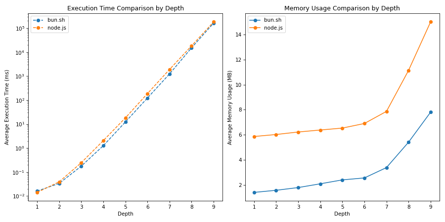

# Master Test Analysis Report

## Environment Reports

-   [test_analysis_report_bun.sh.md](test_analysis_report_bun.sh.md)
-   [test_analysis_report_node.js.md](test_analysis_report_node.js.md)

## Comparison of Environments

| Depth | Fastest Env | % Faster | % Less Memory Used | bun.sh Mean Time (ms) | node.js Mean Time (ms) | bun.sh Mean Memory (MB) | node.js Mean Memory (MB) |
| ----- | ----------- | -------- | ------------------ | --------------------- | ---------------------- | ----------------------- | ------------------------ |
| 1     | node.js     | 11.80%   | 75.99%             | 0.0161                | 0.0142                 | 1.4089                  | 5.8652                   |
| 2     | bun.sh      | 14.03%   | 73.83%             | 0.0337                | 0.0392                 | 1.5775                  | 6.0247                   |
| 3     | bun.sh      | 27.88%   | 71.16%             | 0.1766                | 0.2448                 | 1.7949                  | 6.2239                   |
| 4     | bun.sh      | 38.69%   | 67.19%             | 1.2596                | 2.0537                 | 2.0944                  | 6.3826                   |
| 5     | bun.sh      | 32.46%   | 63.19%             | 12.2534               | 18.1426                | 2.4069                  | 6.5366                   |
| 6     | bun.sh      | 34.48%   | 62.90%             | 122.6465              | 187.1683               | 2.5624                  | 6.9020                   |
| 7     | bun.sh      | 35.11%   | 56.94%             | 1232.1892             | 1899.1045              | 3.3887                  | 7.8682                   |
| 8     | bun.sh      | 16.97%   | 51.42%             | 15204.0159            | 18316.1047             | 5.4116                  | 11.1337                  |
| 9     | bun.sh      | 10.94%   | 47.99%             | 163026.9187           | 183032.4489            | 7.8056                  | 15.0055                  |

### Depth 1

-   Environment: bun.sh

    -   Execution Time: Mean: 0.0161 ms, Max: 1.3009 ms, Min: 0.0011 ms
    -   Memory Usage: Mean: 1.4089 MB, Max: 11.7891 MB, Min: 0.2077 MB

-   Environment: node.js
    -   Execution Time: Mean: 0.0142 ms, Max: 4.8753 ms, Min: 0.0021 ms
    -   Memory Usage: Mean: 5.8652 MB, Max: 22.5322 MB, Min: 3.6697 MB

### Depth 2

-   Environment: bun.sh

    -   Execution Time: Mean: 0.0337 ms, Max: 1.9965 ms, Min: 0.0100 ms
    -   Memory Usage: Mean: 1.5775 MB, Max: 11.7891 MB, Min: 0.2077 MB

-   Environment: node.js
    -   Execution Time: Mean: 0.0392 ms, Max: 6.0300 ms, Min: 0.0174 ms
    -   Memory Usage: Mean: 6.0247 MB, Max: 22.5375 MB, Min: 3.6746 MB

### Depth 3

-   Environment: bun.sh

    -   Execution Time: Mean: 0.1766 ms, Max: 7.3989 ms, Min: 0.0996 ms
    -   Memory Usage: Mean: 1.7949 MB, Max: 11.7891 MB, Min: 0.2077 MB

-   Environment: node.js
    -   Execution Time: Mean: 0.2448 ms, Max: 7.6203 ms, Min: 0.1706 ms
    -   Memory Usage: Mean: 6.2239 MB, Max: 22.5811 MB, Min: 3.7179 MB

### Depth 4

-   Environment: bun.sh

    -   Execution Time: Mean: 1.2596 ms, Max: 7.4257 ms, Min: 0.9936 ms
    -   Memory Usage: Mean: 2.0944 MB, Max: 11.7891 MB, Min: 0.2077 MB

-   Environment: node.js
    -   Execution Time: Mean: 2.0537 ms, Max: 5.1085 ms, Min: 1.7086 ms
    -   Memory Usage: Mean: 6.3826 MB, Max: 20.5360 MB, Min: 3.7166 MB

### Depth 5

-   Environment: bun.sh

    -   Execution Time: Mean: 12.2534 ms, Max: 37.3940 ms, Min: 10.2269 ms
    -   Memory Usage: Mean: 2.4069 MB, Max: 11.7891 MB, Min: 0.2077 MB

-   Environment: node.js
    -   Execution Time: Mean: 18.1426 ms, Max: 36.0605 ms, Min: 17.2098 ms
    -   Memory Usage: Mean: 6.5366 MB, Max: 23.6899 MB, Min: 3.7286 MB

### Depth 6

-   Environment: bun.sh

    -   Execution Time: Mean: 122.6465 ms, Max: 261.2737 ms, Min: 107.7531 ms
    -   Memory Usage: Mean: 2.5624 MB, Max: 11.7910 MB, Min: 1.8468 MB

-   Environment: node.js
    -   Execution Time: Mean: 187.1683 ms, Max: 254.2883 ms, Min: 175.7874 ms
    -   Memory Usage: Mean: 6.9020 MB, Max: 22.4504 MB, Min: 3.6045 MB

### Depth 7

-   Environment: bun.sh

    -   Execution Time: Mean: 1232.1892 ms, Max: 2029.7771 ms, Min: 1099.7665 ms
    -   Memory Usage: Mean: 3.3887 MB, Max: 11.7997 MB, Min: 1.8635 MB

-   Environment: node.js
    -   Execution Time: Mean: 1899.1045 ms, Max: 2035.3865 ms, Min: 1808.4117 ms
    -   Memory Usage: Mean: 7.8682 MB, Max: 21.6263 MB, Min: 3.6685 MB

### Depth 8

-   Environment: bun.sh

    -   Execution Time: Mean: 15204.0159 ms, Max: 20507.9253 ms, Min: 12590.3901 ms
    -   Memory Usage: Mean: 5.4116 MB, Max: 11.8899 MB, Min: 1.9528 MB

-   Environment: node.js
    -   Execution Time: Mean: 18316.1047 ms, Max: 18767.6704 ms, Min: 18162.5968 ms
    -   Memory Usage: Mean: 11.1337 MB, Max: 23.0882 MB, Min: 4.3178 MB

### Depth 9

-   Environment: bun.sh

    -   Execution Time: Mean: 163026.9187 ms, Max: 202189.5296 ms, Min: 127639.2988 ms
    -   Memory Usage: Mean: 7.8056 MB, Max: 12.7907 MB, Min: 2.8332 MB

-   Environment: node.js
    -   Execution Time: Mean: 183032.4489 ms, Max: 184732.0773 ms, Min: 181941.7209 ms
    -   Memory Usage: Mean: 15.0055 MB, Max: 22.5308 MB, Min: 7.8163 MB
