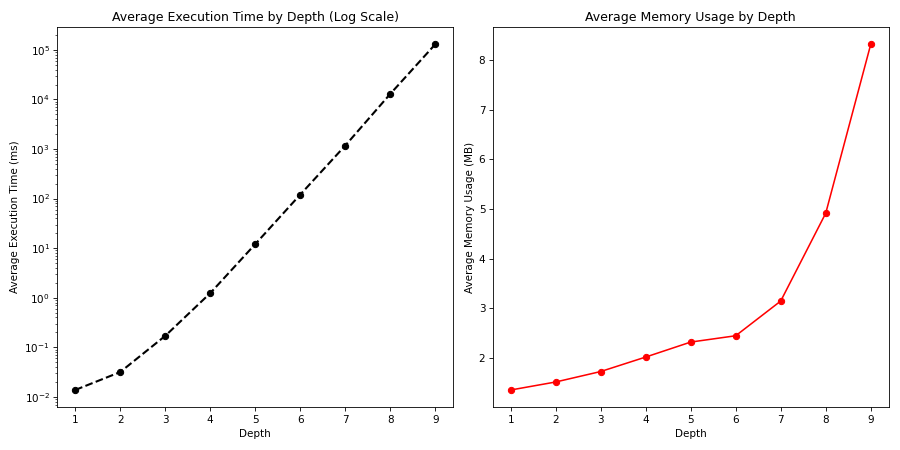

# Test Analysis Report
## Test Parameters
- Number of Tests: 830
- Number of Depths: 9
- Depths: 1, 2, 3, 4, 5, 6, 7, 8, 9

## Test Results

| Depth | Average Time (ms) | Average Memory Usage (MB) |
| --- | --- | --- |
| 1 | 0.0147 | 1.4104 |
| 2 | 0.0337 | 1.5775 |
| 3 | 0.1766 | 1.7949 |
| 4 | 1.2596 | 2.0944 |
| 5 | 12.2534 | 2.4069 |
| 6 | 122.6465 | 2.5624 |
| 7 | 1232.1892 | 3.3887 |
| 8 | 15204.0159 | 5.4116 |
| 9 | 163026.9187 | 7.8056 |

### Depth 1
- Number of Tests: 830
- Execution Time:
  - Mean (Avg): 0.0147 ms
  - Max: 1.3009 ms
  - Min: 0.0011 ms
- Memory Usage:
  - Mean (Avg): 1.4104 MB
  - Max: 11.7891 MB
  - Min: 0.2077 MB

<strong>Test Results</strong>

| Depth | Time (ms) | Memory Usage (MB) |
| --- | --- | --- |
| 1 | 0.7907 | 0.2087 |
| 1 | 0.0044 | 2.8332 |
| 1 | 0.0044 | 3.8281 |
| 1 | 0.0303 | 4.8321 |
| 1 | 0.0060 | 5.8161 |
| 1 | 0.0042 | 6.8079 |
| 1 | 0.0056 | 7.7959 |
| 1 | 0.0056 | 8.7857 |
| 1 | 0.0323 | 9.7653 |
| 1 | 0.0065 | 10.7574 |
| 1 | 0.0028 | 2.2105 |
| 1 | 0.0030 | 2.2222 |
| 1 | 0.0025 | 2.2344 |
| 1 | 0.0026 | 2.2465 |
| 1 | 0.0028 | 2.2578 |
| 1 | 0.0028 | 2.2701 |
| 1 | 0.0025 | 2.2816 |
| 1 | 0.0028 | 2.2941 |
| 1 | 0.0030 | 2.3065 |
| 1 | 0.0026 | 2.3172 |
| 1 | 0.0030 | 2.3289 |
| 1 | 0.0024 | 2.3413 |
| 1 | 0.0022 | 2.3538 |
| 1 | 0.0024 | 2.3660 |
| 1 | 0.0023 | 2.3777 |
| 1 | 0.0024 | 2.3894 |
| 1 | 0.0024 | 2.4015 |
| 1 | 0.0025 | 2.4131 |
| 1 | 0.0028 | 2.4253 |
| 1 | 0.0025 | 2.4369 |
| 1 | 0.0025 | 2.4489 |
| 1 | 0.0027 | 2.4611 |
| 1 | 0.0025 | 2.4725 |
| 1 | 0.0024 | 2.4839 |
| 1 | 0.0032 | 2.4963 |
| 1 | 0.0024 | 2.5078 |
| 1 | 0.0025 | 2.5191 |
| 1 | 0.0025 | 2.5307 |
| 1 | 0.0025 | 2.5430 |
| 1 | 0.0028 | 2.5553 |
| 1 | 0.0024 | 2.5678 |
| 1 | 0.0026 | 2.5793 |
| 1 | 0.0025 | 2.5902 |
| 1 | 0.0025 | 2.6021 |
| 1 | 0.0026 | 2.6137 |
| 1 | 0.0024 | 2.6253 |
| 1 | 0.0025 | 2.6371 |
| 1 | 0.0026 | 2.6493 |
| 1 | 0.0029 | 2.6623 |
| 1 | 0.0025 | 2.6738 |
| 1 | 0.0031 | 2.6860 |
| 1 | 0.0026 | 2.6978 |
| 1 | 0.0034 | 2.7103 |
| 1 | 0.0023 | 2.7221 |
| 1 | 0.0026 | 2.7314 |
| 1 | 0.0025 | 2.7433 |
| 1 | 0.0023 | 2.7554 |
| 1 | 0.0025 | 2.7673 |
| 1 | 0.0025 | 2.7790 |
| 1 | 0.0026 | 2.7903 |
| 1 | 0.0026 | 2.8008 |
| 1 | 0.0025 | 2.8126 |
| 1 | 0.0033 | 2.8247 |
| 1 | 0.0029 | 2.8365 |
| 1 | 0.0034 | 2.8479 |
| 1 | 0.0035 | 2.8587 |
| 1 | 0.0023 | 2.8723 |
| 1 | 0.0030 | 2.8832 |
| 1 | 0.0027 | 2.8950 |
| 1 | 0.0023 | 2.9065 |
| 1 | 0.0023 | 2.9186 |
| 1 | 0.0031 | 2.9291 |
| 1 | 0.0028 | 2.9410 |
| 1 | 0.0025 | 2.9520 |
| 1 | 0.0025 | 2.9635 |
| 1 | 0.0026 | 2.9753 |
| 1 | 0.0025 | 2.9889 |
| 1 | 0.0025 | 3.0004 |
| 1 | 0.0029 | 3.0122 |
| 1 | 0.0026 | 3.0243 |
| 1 | 0.0026 | 3.0357 |
| 1 | 0.0034 | 3.0485 |
| 1 | 0.0028 | 3.0609 |
| 1 | 0.0025 | 3.0738 |
| 1 | 0.0027 | 3.0846 |
| 1 | 0.0026 | 3.0968 |
| 1 | 0.0034 | 3.1091 |
| 1 | 0.0025 | 3.1206 |
| 1 | 0.0023 | 3.1330 |
| 1 | 0.0026 | 3.1438 |
| 1 | 0.0029 | 3.1546 |
| 1 | 0.0084 | 3.1713 |
| 1 | 0.0042 | 3.1841 |
| 1 | 0.0027 | 3.1960 |
| 1 | 0.0030 | 3.2086 |
| 1 | 0.0034 | 3.2203 |
| 1 | 0.0027 | 3.2324 |
| 1 | 0.0027 | 3.2437 |
| 1 | 0.0026 | 3.2559 |
| 1 | 0.0025 | 3.2675 |
| 1 | 0.0024 | 3.2793 |
| 1 | 0.0022 | 3.2918 |
| 1 | 0.0026 | 3.3031 |
| 1 | 0.0025 | 3.3149 |
| 1 | 0.0028 | 3.3256 |
| 1 | 0.0023 | 3.3375 |
| 1 | 0.0026 | 3.3483 |
| 1 | 0.0026 | 3.3594 |
| 1 | 0.0024 | 3.3709 |
| 1 | 0.0028 | 3.3830 |
| 1 | 0.7358 | 0.2077 |
| 1 | 0.2000 | 0.2077 |
| 1 | 0.1769 | 0.2077 |
| 1 | 0.1772 | 0.2077 |
| 1 | 0.1682 | 0.2077 |
| 1 | 0.0979 | 0.2077 |
| 1 | 0.0463 | 0.2077 |
| 1 | 0.0388 | 0.2077 |
| 1 | 0.0382 | 0.2077 |
| 1 | 0.0380 | 0.2077 |
| 1 | 0.0379 | 0.2077 |
| 1 | 0.0381 | 0.2077 |
| 1 | 0.0419 | 0.2077 |
| 1 | 0.0407 | 0.2077 |
| 1 | 0.0378 | 0.2077 |
| 1 | 0.0380 | 0.2077 |
| 1 | 0.0381 | 0.2077 |
| 1 | 0.0378 | 0.2077 |
| 1 | 0.0380 | 0.2077 |
| 1 | 0.0378 | 0.2077 |
| 1 | 0.0381 | 0.2077 |
| 1 | 0.0396 | 0.2077 |
| 1 | 0.0377 | 0.2077 |
| 1 | 0.0380 | 0.2077 |
| 1 | 0.0378 | 0.2077 |
| 1 | 0.0658 | 0.2077 |
| 1 | 0.0724 | 0.2077 |
| 1 | 0.0376 | 0.2077 |
| 1 | 0.0379 | 0.2077 |
| 1 | 0.0379 | 0.2077 |
| 1 | 0.0377 | 0.2077 |
| 1 | 0.0401 | 0.2077 |
| 1 | 0.0404 | 0.2077 |
| 1 | 0.0388 | 0.2077 |
| 1 | 0.0381 | 0.2077 |
| 1 | 0.0381 | 0.2077 |
| 1 | 0.0376 | 0.2077 |
| 1 | 0.0562 | 0.2077 |
| 1 | 0.0538 | 0.2077 |
| 1 | 0.0382 | 0.2077 |
| 1 | 0.0403 | 0.2077 |
| 1 | 0.0396 | 0.2077 |
| 1 | 0.0540 | 0.2077 |
| 1 | 0.0386 | 0.2077 |
| 1 | 0.0377 | 0.2077 |
| 1 | 0.0380 | 0.2077 |
| 1 | 0.0376 | 0.2077 |
| 1 | 0.0379 | 0.2077 |
| 1 | 0.0381 | 0.2077 |
| 1 | 0.0400 | 0.2077 |
| 1 | 0.0381 | 0.2077 |
| 1 | 0.0378 | 0.2077 |
| 1 | 0.0393 | 0.2077 |
| 1 | 0.0380 | 0.2077 |
| 1 | 0.0377 | 0.2077 |
| 1 | 0.0381 | 0.2077 |
| 1 | 0.0377 | 0.2077 |
| 1 | 0.0376 | 0.2077 |
| 1 | 0.0381 | 0.2077 |
| 1 | 0.0377 | 0.2077 |
| 1 | 0.0378 | 0.2077 |
| 1 | 0.0377 | 0.2077 |
| 1 | 0.0378 | 0.2077 |
| 1 | 0.0395 | 0.2077 |
| 1 | 0.0378 | 0.2077 |
| 1 | 0.0377 | 0.2077 |
| 1 | 0.0380 | 0.2077 |
| 1 | 0.0379 | 0.2077 |
| 1 | 0.0699 | 0.2077 |
| 1 | 0.0762 | 0.2077 |
| 1 | 0.0379 | 0.2077 |
| 1 | 0.0377 | 0.2077 |
| 1 | 0.0379 | 0.2077 |
| 1 | 0.0385 | 0.2077 |
| 1 | 0.0398 | 0.2077 |
| 1 | 0.0377 | 0.2077 |
| 1 | 0.0375 | 0.2077 |
| 1 | 0.0378 | 0.2077 |
| 1 | 0.0379 | 0.2077 |
| 1 | 0.0376 | 0.2077 |
| 1 | 0.0379 | 0.2077 |
| 1 | 0.0375 | 0.2077 |
| 1 | 0.0380 | 0.2077 |
| 1 | 0.0378 | 0.2077 |
| 1 | 0.0444 | 0.2077 |
| 1 | 0.0381 | 0.2077 |
| 1 | 0.0379 | 0.2077 |
| 1 | 0.0377 | 0.2077 |
| 1 | 0.0379 | 0.2077 |
| 1 | 0.0380 | 0.2077 |
| 1 | 0.0375 | 0.2077 |
| 1 | 0.0376 | 0.2077 |
| 1 | 0.0395 | 0.2077 |
| 1 | 0.0379 | 0.2077 |
| 1 | 0.0569 | 0.2077 |
| 1 | 0.0587 | 0.2077 |
| 1 | 0.0986 | 0.2077 |
| 1 | 0.1303 | 0.2077 |
| 1 | 0.0922 | 0.2077 |
| 1 | 0.0752 | 0.2077 |
| 1 | 0.0021 | 1.9828 |
| 1 | 0.0035 | 1.9853 |
| 1 | 0.0031 | 1.9874 |
| 1 | 0.0031 | 1.9893 |
| 1 | 0.0025 | 1.9915 |
| 1 | 0.0031 | 1.9944 |
| 1 | 0.0027 | 1.9962 |
| 1 | 0.0026 | 1.9983 |
| 1 | 0.0026 | 2.0002 |
| 1 | 0.0031 | 2.0022 |
| 1 | 0.0030 | 2.0043 |
| 1 | 0.0031 | 2.0079 |
| 1 | 0.0031 | 2.0098 |
| 1 | 0.0032 | 2.0118 |
| 1 | 0.0027 | 2.0136 |
| 1 | 0.0025 | 2.0159 |
| 1 | 0.0026 | 2.0184 |
| 1 | 0.0026 | 2.0218 |
| 1 | 0.0024 | 2.0239 |
| 1 | 0.0027 | 2.0259 |
| 1 | 0.0031 | 2.0281 |
| 1 | 0.0024 | 2.0302 |
| 1 | 0.0024 | 2.0335 |
| 1 | 0.0027 | 2.0353 |
| 1 | 0.0029 | 2.0376 |
| 1 | 0.0026 | 2.0397 |
| 1 | 0.0024 | 2.0418 |
| 1 | 0.0027 | 2.0440 |
| 1 | 0.0023 | 2.0473 |
| 1 | 0.0025 | 2.0494 |
| 1 | 0.0024 | 2.0515 |
| 1 | 0.0025 | 2.0533 |
| 1 | 0.0028 | 2.0556 |
| 1 | 0.0023 | 2.0580 |
| 1 | 0.0023 | 2.0602 |
| 1 | 0.0027 | 2.0620 |
| 1 | 0.0025 | 2.0642 |
| 1 | 0.0024 | 2.0660 |
| 1 | 0.0029 | 2.0681 |
| 1 | 0.0026 | 2.0721 |
| 1 | 0.0026 | 2.0740 |
| 1 | 0.0029 | 2.0762 |
| 1 | 0.0029 | 2.0782 |
| 1 | 0.0029 | 2.0801 |
| 1 | 0.0024 | 2.0824 |
| 1 | 0.0024 | 2.0855 |
| 1 | 0.0027 | 2.0874 |
| 1 | 0.0028 | 2.0894 |
| 1 | 0.0025 | 2.0914 |
| 1 | 0.0024 | 2.0938 |
| 1 | 0.0025 | 2.0961 |
| 1 | 0.0025 | 2.0983 |
| 1 | 0.0025 | 2.1005 |
| 1 | 0.0025 | 2.1026 |
| 1 | 0.0025 | 2.1046 |
| 1 | 0.0024 | 2.1068 |
| 1 | 0.0024 | 2.1103 |
| 1 | 0.0026 | 2.1123 |
| 1 | 0.0028 | 2.1141 |
| 1 | 0.0025 | 2.1163 |
| 1 | 0.0027 | 2.1181 |
| 1 | 0.0028 | 2.1203 |
| 1 | 0.0024 | 2.1230 |
| 1 | 0.0026 | 2.1252 |
| 1 | 0.0024 | 2.1273 |
| 1 | 0.0025 | 2.1293 |
| 1 | 0.0024 | 2.1332 |
| 1 | 0.0022 | 2.1357 |
| 1 | 0.0027 | 2.1378 |
| 1 | 0.0025 | 2.1398 |
| 1 | 0.0023 | 2.1419 |
| 1 | 0.0024 | 2.1452 |
| 1 | 0.0027 | 2.1477 |
| 1 | 0.0025 | 2.1511 |
| 1 | 0.0030 | 2.1532 |
| 1 | 0.0025 | 2.1552 |
| 1 | 0.0024 | 2.1571 |
| 1 | 0.0025 | 2.1591 |
| 1 | 0.0024 | 2.1609 |
| 1 | 0.0024 | 2.1641 |
| 1 | 0.0029 | 2.1663 |
| 1 | 0.0025 | 2.1682 |
| 1 | 0.0025 | 2.1704 |
| 1 | 0.0028 | 2.1724 |
| 1 | 0.0026 | 2.1751 |
| 1 | 0.0028 | 2.1772 |
| 1 | 0.0027 | 2.1791 |
| 1 | 0.0035 | 2.1811 |
| 1 | 0.0028 | 2.1828 |
| 1 | 0.0025 | 2.1849 |
| 1 | 0.0025 | 2.1882 |
| 1 | 0.0041 | 2.1906 |
| 1 | 0.0026 | 2.1926 |
| 1 | 0.0034 | 2.1945 |
| 1 | 0.0034 | 2.1965 |
| 1 | 0.0030 | 2.1986 |
| 1 | 0.0031 | 2.2023 |
| 1 | 0.0034 | 2.2044 |
| 1 | 0.0026 | 2.2066 |
| 1 | 0.0024 | 2.2085 |
| 1 | 0.9782 | 0.2077 |
| 1 | 0.0442 | 0.2077 |
| 1 | 0.0162 | 0.2077 |
| 1 | 0.0121 | 0.2077 |
| 1 | 0.0116 | 0.2077 |
| 1 | 0.0130 | 0.2077 |
| 1 | 0.0049 | 0.2077 |
| 1 | 0.0128 | 0.2077 |
| 1 | 0.0118 | 0.2077 |
| 1 | 0.0118 | 0.2077 |
| 1 | 0.0285 | 0.2077 |
| 1 | 0.0115 | 0.2077 |
| 1 | 0.0043 | 0.2077 |
| 1 | 0.0040 | 0.2077 |
| 1 | 0.0040 | 0.2077 |
| 1 | 0.0040 | 0.2077 |
| 1 | 0.0040 | 0.2077 |
| 1 | 0.0040 | 0.2077 |
| 1 | 0.0040 | 0.2077 |
| 1 | 0.0040 | 0.2077 |
| 1 | 0.0046 | 0.2077 |
| 1 | 0.0043 | 0.2077 |
| 1 | 0.0043 | 0.2077 |
| 1 | 0.0043 | 0.2077 |
| 1 | 0.0043 | 0.2077 |
| 1 | 0.0041 | 0.2077 |
| 1 | 0.0041 | 0.2077 |
| 1 | 0.0041 | 0.2077 |
| 1 | 0.0041 | 0.2077 |
| 1 | 0.0041 | 0.2077 |
| 1 | 0.0040 | 0.2077 |
| 1 | 0.0040 | 0.2077 |
| 1 | 0.0202 | 0.2077 |
| 1 | 0.0040 | 0.2077 |
| 1 | 0.0040 | 0.2077 |
| 1 | 0.0040 | 0.2077 |
| 1 | 0.0040 | 0.2077 |
| 1 | 0.0040 | 0.2077 |
| 1 | 0.0040 | 0.2077 |
| 1 | 0.0061 | 0.2077 |
| 1 | 0.0046 | 0.2077 |
| 1 | 0.0040 | 0.2077 |
| 1 | 0.0060 | 0.2077 |
| 1 | 0.0221 | 0.2077 |
| 1 | 0.0061 | 0.2077 |
| 1 | 0.0060 | 0.2077 |
| 1 | 0.0059 | 0.2077 |
| 1 | 0.0046 | 0.2077 |
| 1 | 0.0510 | 0.2077 |
| 1 | 0.0061 | 0.2077 |
| 1 | 0.0046 | 0.2077 |
| 1 | 0.0043 | 0.2077 |
| 1 | 0.0199 | 0.2077 |
| 1 | 0.0040 | 0.2077 |
| 1 | 0.0040 | 0.2077 |
| 1 | 0.0066 | 0.2077 |
| 1 | 0.0043 | 0.2077 |
| 1 | 0.0043 | 0.2077 |
| 1 | 0.0040 | 0.2077 |
| 1 | 0.0040 | 0.2077 |
| 1 | 0.0040 | 0.2077 |
| 1 | 0.0040 | 0.2077 |
| 1 | 0.0040 | 0.2077 |
| 1 | 0.0058 | 0.2077 |
| 1 | 0.0043 | 0.2077 |
| 1 | 0.0045 | 0.2077 |
| 1 | 0.0040 | 0.2077 |
| 1 | 0.0068 | 0.2077 |
| 1 | 0.0040 | 0.2077 |
| 1 | 0.0040 | 0.2077 |
| 1 | 0.0046 | 0.2077 |
| 1 | 0.0218 | 0.2077 |
| 1 | 0.0061 | 0.2077 |
| 1 | 0.0045 | 0.2077 |
| 1 | 0.0040 | 0.2077 |
| 1 | 0.0045 | 0.2077 |
| 1 | 0.0040 | 0.2077 |
| 1 | 0.0040 | 0.2077 |
| 1 | 0.0040 | 0.2077 |
| 1 | 0.0206 | 0.2077 |
| 1 | 0.0042 | 0.2077 |
| 1 | 0.0056 | 0.2077 |
| 1 | 0.0040 | 0.2077 |
| 1 | 0.0219 | 0.2077 |
| 1 | 0.0045 | 0.2077 |
| 1 | 0.0071 | 0.2077 |
| 1 | 0.0068 | 0.2077 |
| 1 | 0.0072 | 0.2077 |
| 1 | 0.0066 | 0.2077 |
| 1 | 0.0069 | 0.2077 |
| 1 | 0.0066 | 0.2077 |
| 1 | 0.0064 | 0.2077 |
| 1 | 0.0072 | 0.2077 |
| 1 | 0.0045 | 0.2077 |
| 1 | 0.0046 | 0.2077 |
| 1 | 0.0060 | 0.2077 |
| 1 | 0.0045 | 0.2077 |
| 1 | 0.0045 | 0.2077 |
| 1 | 0.0050 | 0.2077 |
| 1 | 0.0073 | 0.2077 |
| 1 | 0.0020 | 0.2077 |
| 1 | 0.0011 | 0.2077 |
| 1 | 0.0032 | 0.2077 |
| 1 | 0.0011 | 0.2077 |
| 1 | 0.0011 | 0.2077 |
| 1 | 0.0012 | 0.2077 |
| 1 | 0.0011 | 0.2077 |
| 1 | 0.0029 | 0.2077 |
| 1 | 0.0011 | 0.2077 |
| 1 | 0.0060 | 0.2077 |
| 1 | 0.0012 | 0.2077 |
| 1 | 0.0013 | 0.2077 |
| 1 | 0.0013 | 0.2077 |
| 1 | 0.0053 | 0.2077 |
| 1 | 0.0011 | 0.2077 |
| 1 | 0.0011 | 0.2077 |
| 1 | 0.0013 | 0.2077 |
| 1 | 0.0013 | 0.2077 |
| 1 | 0.0014 | 0.2077 |
| 1 | 0.0014 | 0.2077 |
| 1 | 0.0012 | 0.2077 |
| 1 | 0.0012 | 0.2077 |
| 1 | 0.0041 | 0.2077 |
| 1 | 0.0034 | 0.2077 |
| 1 | 0.0013 | 0.2077 |
| 1 | 0.0028 | 0.2077 |
| 1 | 0.0015 | 0.2077 |
| 1 | 0.0012 | 0.2077 |
| 1 | 0.0013 | 0.2077 |
| 1 | 0.0011 | 0.2077 |
| 1 | 0.0042 | 0.2077 |
| 1 | 0.0013 | 0.2077 |
| 1 | 0.0184 | 0.2077 |
| 1 | 0.0012 | 0.2077 |
| 1 | 0.0013 | 0.2077 |
| 1 | 0.0012 | 0.2077 |
| 1 | 0.0014 | 0.2077 |
| 1 | 0.0014 | 0.2077 |
| 1 | 0.0038 | 0.2077 |
| 1 | 0.0013 | 0.2077 |
| 1 | 0.0023 | 0.2077 |
| 1 | 0.0016 | 0.2077 |
| 1 | 0.0012 | 0.2077 |
| 1 | 0.0060 | 0.2077 |
| 1 | 0.0013 | 0.2077 |
| 1 | 0.0013 | 0.2077 |
| 1 | 0.0012 | 0.2077 |
| 1 | 0.0013 | 0.2077 |
| 1 | 0.0012 | 0.2077 |
| 1 | 0.0012 | 0.2077 |
| 1 | 0.0012 | 0.2077 |
| 1 | 0.0012 | 0.2077 |
| 1 | 0.0012 | 0.2077 |
| 1 | 0.0035 | 0.2077 |
| 1 | 0.0012 | 0.2077 |
| 1 | 0.0012 | 0.2077 |
| 1 | 0.0012 | 0.2077 |
| 1 | 0.0012 | 0.2077 |
| 1 | 0.0012 | 0.2077 |
| 1 | 0.0012 | 0.2077 |
| 1 | 0.0013 | 0.2077 |
| 1 | 0.0030 | 0.2077 |
| 1 | 0.0012 | 0.2077 |
| 1 | 0.0012 | 0.2077 |
| 1 | 0.0011 | 0.2077 |
| 1 | 0.0012 | 0.2077 |
| 1 | 0.0053 | 0.2077 |
| 1 | 0.0012 | 0.2077 |
| 1 | 0.0015 | 0.2077 |
| 1 | 0.0014 | 1.9083 |
| 1 | 0.0013 | 1.9083 |
| 1 | 0.0013 | 1.9083 |
| 1 | 0.0014 | 1.9083 |
| 1 | 0.0013 | 1.9083 |
| 1 | 0.0012 | 1.9083 |
| 1 | 0.0012 | 1.9083 |
| 1 | 0.0012 | 1.9083 |
| 1 | 0.0013 | 1.9083 |
| 1 | 0.0012 | 1.9083 |
| 1 | 0.0013 | 1.9083 |
| 1 | 0.0012 | 1.9083 |
| 1 | 0.0014 | 1.9083 |
| 1 | 0.0014 | 1.9083 |
| 1 | 0.0012 | 1.9083 |
| 1 | 0.0013 | 1.9083 |
| 1 | 0.0012 | 1.9083 |
| 1 | 0.0013 | 1.9083 |
| 1 | 0.0012 | 1.9083 |
| 1 | 0.0012 | 1.9083 |
| 1 | 0.0012 | 1.9083 |
| 1 | 0.0012 | 1.9083 |
| 1 | 0.0013 | 1.9083 |
| 1 | 0.0012 | 1.9083 |
| 1 | 0.0012 | 1.9083 |
| 1 | 0.0013 | 1.9083 |
| 1 | 0.0013 | 1.9083 |
| 1 | 0.0013 | 1.9083 |
| 1 | 0.0012 | 1.9083 |
| 1 | 0.0013 | 1.9083 |
| 1 | 0.0012 | 1.9083 |
| 1 | 1.3009 | 0.2087 |
| 1 | 0.2994 | 1.8468 |
| 1 | 0.0031 | 1.8489 |
| 1 | 0.0030 | 1.8508 |
| 1 | 0.0035 | 1.8527 |
| 1 | 0.0031 | 1.8547 |
| 1 | 0.0029 | 1.8577 |
| 1 | 0.0027 | 1.8602 |
| 1 | 0.0028 | 1.8624 |
| 1 | 0.0032 | 1.8642 |
| 1 | 0.0029 | 1.8666 |
| 1 | 0.0033 | 1.8686 |
| 1 | 0.0028 | 1.8720 |
| 1 | 0.0031 | 1.8740 |
| 1 | 0.0028 | 1.8760 |
| 1 | 0.0207 | 1.8784 |
| 1 | 0.0028 | 1.8806 |
| 1 | 0.0028 | 1.8835 |
| 1 | 0.0033 | 1.8856 |
| 1 | 0.0031 | 1.8877 |
| 1 | 0.0031 | 1.8900 |
| 1 | 0.0027 | 1.8921 |
| 1 | 0.0027 | 1.8944 |
| 1 | 0.0028 | 1.8977 |
| 1 | 0.0028 | 1.9001 |
| 1 | 0.0029 | 1.9020 |
| 1 | 0.0049 | 1.9077 |
| 1 | 0.0025 | 1.9103 |
| 1 | 0.0029 | 1.9127 |
| 1 | 0.0033 | 1.9149 |
| 1 | 0.0025 | 1.9171 |
| 1 | 0.0027 | 1.9192 |
| 1 | 0.0032 | 1.9213 |
| 1 | 0.0037 | 1.9238 |
| 1 | 0.0026 | 1.9272 |
| 1 | 0.0028 | 1.9295 |
| 1 | 0.0026 | 1.9319 |
| 1 | 0.0028 | 1.9343 |
| 1 | 0.0029 | 1.9364 |
| 1 | 0.0031 | 1.9395 |
| 1 | 0.0028 | 1.9430 |
| 1 | 0.0031 | 1.9456 |
| 1 | 0.0027 | 1.9477 |
| 1 | 0.0028 | 1.9496 |
| 1 | 0.0029 | 1.9520 |
| 1 | 0.0026 | 1.9542 |
| 1 | 0.0027 | 1.9564 |
| 1 | 0.0027 | 1.9587 |
| 1 | 0.0031 | 1.9604 |
| 1 | 0.0028 | 1.9627 |
| 1 | 0.0028 | 1.9651 |
| 1 | 0.0026 | 1.9684 |
| 1 | 0.0033 | 1.9705 |
| 1 | 0.0031 | 1.9725 |
| 1 | 0.0027 | 1.9746 |
| 1 | 0.0030 | 1.9765 |
| 1 | 0.0027 | 1.9788 |
| 1 | 0.0026 | 1.9818 |
| 1 | 0.0028 | 1.9842 |
| 1 | 0.0032 | 1.9866 |
| 1 | 0.0029 | 1.9887 |
| 1 | 0.0027 | 1.9907 |
| 1 | 0.0027 | 1.9937 |
| 1 | 0.0027 | 1.9961 |
| 1 | 0.0030 | 1.9981 |
| 1 | 0.0026 | 2.0004 |
| 1 | 0.0032 | 2.0038 |
| 1 | 0.0068 | 2.0063 |
| 1 | 0.0023 | 2.0095 |
| 1 | 0.0031 | 2.0111 |
| 1 | 0.0024 | 2.0129 |
| 1 | 0.0029 | 2.0163 |
| 1 | 0.0027 | 2.0181 |
| 1 | 0.0026 | 2.0205 |
| 1 | 0.0029 | 2.0240 |
| 1 | 0.0026 | 2.0256 |
| 1 | 0.0031 | 2.0278 |
| 1 | 0.0031 | 2.0298 |
| 1 | 0.0027 | 2.0318 |
| 1 | 0.0025 | 2.0348 |
| 1 | 0.0030 | 2.0365 |
| 1 | 0.0026 | 2.0387 |
| 1 | 0.0026 | 2.0408 |
| 1 | 0.0026 | 2.0430 |
| 1 | 0.0028 | 2.0450 |
| 1 | 0.0026 | 2.0483 |
| 1 | 0.0027 | 2.0502 |
| 1 | 0.0031 | 2.0523 |
| 1 | 0.0222 | 2.0547 |
| 1 | 0.0027 | 2.0569 |
| 1 | 0.0026 | 2.0590 |
| 1 | 0.0026 | 2.0627 |
| 1 | 0.0029 | 2.0646 |
| 1 | 0.0030 | 2.0668 |
| 1 | 0.0029 | 2.0689 |
| 1 | 0.0029 | 2.0712 |
| 1 | 0.0026 | 2.0741 |
| 1 | 0.0028 | 2.0759 |
| 1 | 0.0026 | 2.0784 |
| 1 | 0.0026 | 2.0805 |
| 1 | 0.0069 | 0.2077 |
| 1 | 0.0040 | 0.2077 |
| 1 | 0.0063 | 0.2077 |
| 1 | 0.0045 | 0.2077 |
| 1 | 0.0041 | 0.2077 |
| 1 | 0.0081 | 0.2077 |
| 1 | 0.0042 | 0.2077 |
| 1 | 0.0045 | 0.2077 |
| 1 | 0.0041 | 0.2077 |
| 1 | 0.0088 | 0.2077 |
| 1 | 0.0040 | 0.2077 |
| 1 | 0.0056 | 0.2077 |
| 1 | 0.0040 | 0.2077 |
| 1 | 0.0041 | 0.2077 |
| 1 | 0.0041 | 0.2077 |
| 1 | 0.0040 | 0.2077 |
| 1 | 0.0043 | 0.2077 |
| 1 | 0.0041 | 0.2077 |
| 1 | 0.0040 | 0.2077 |
| 1 | 0.0045 | 0.2077 |
| 1 | 0.0073 | 0.2077 |
| 1 | 0.0049 | 0.2077 |
| 1 | 0.0048 | 0.2077 |
| 1 | 0.0043 | 0.2077 |
| 1 | 0.0047 | 0.2077 |
| 1 | 0.0042 | 0.2077 |
| 1 | 0.0050 | 0.2077 |
| 1 | 0.0060 | 0.2077 |
| 1 | 0.0040 | 0.2077 |
| 1 | 0.0057 | 0.2077 |
| 1 | 0.0039 | 0.2077 |
| 1 | 0.0041 | 0.2077 |
| 1 | 0.0040 | 0.2077 |
| 1 | 0.0039 | 0.2077 |
| 1 | 0.0040 | 0.2077 |
| 1 | 0.0041 | 0.2077 |
| 1 | 0.0040 | 0.2077 |
| 1 | 0.0040 | 0.2077 |
| 1 | 0.0021 | 0.2077 |
| 1 | 0.0011 | 0.2077 |
| 1 | 0.0011 | 0.2077 |
| 1 | 0.3798 | 0.2077 |
| 1 | 0.0029 | 0.2077 |
| 1 | 0.0218 | 0.2077 |
| 1 | 0.0011 | 0.2077 |
| 1 | 0.0011 | 0.2077 |
| 1 | 0.0011 | 0.2077 |
| 1 | 0.0011 | 0.2077 |
| 1 | 0.0012 | 0.2077 |
| 1 | 0.0011 | 0.2077 |
| 1 | 0.0012 | 0.2077 |
| 1 | 0.0011 | 0.2077 |
| 1 | 0.0011 | 0.2077 |
| 1 | 0.0012 | 0.2077 |
| 1 | 0.0011 | 0.2077 |
| 1 | 0.0259 | 0.2077 |
| 1 | 0.0013 | 0.2077 |
| 1 | 0.0012 | 0.2077 |
| 1 | 0.0012 | 0.2077 |
| 1 | 0.0011 | 0.2077 |
| 1 | 0.0012 | 0.2077 |
| 1 | 0.0011 | 0.2077 |
| 1 | 0.0012 | 0.2077 |
| 1 | 0.0011 | 0.2077 |
| 1 | 0.0011 | 0.2077 |
| 1 | 0.0012 | 0.2077 |
| 1 | 0.0012 | 0.2077 |
| 1 | 0.0012 | 0.2077 |
| 1 | 0.0026 | 0.2077 |
| 1 | 0.0012 | 0.2077 |
| 1 | 0.0040 | 0.2077 |
| 1 | 0.0011 | 0.2077 |
| 1 | 0.0022 | 0.2077 |
| 1 | 0.0011 | 0.2077 |
| 1 | 0.0011 | 0.2077 |
| 1 | 0.0027 | 0.2077 |
| 1 | 0.0039 | 0.2077 |
| 1 | 0.0011 | 0.2077 |
| 1 | 0.0011 | 0.2077 |
| 1 | 0.0011 | 0.2077 |
| 1 | 0.0012 | 0.2077 |
| 1 | 0.0012 | 0.2077 |
| 1 | 0.0030 | 0.2077 |
| 1 | 0.0011 | 0.2077 |
| 1 | 0.0011 | 0.2077 |
| 1 | 0.0012 | 0.2077 |
| 1 | 0.0012 | 0.2077 |
| 1 | 0.0011 | 0.2077 |
| 1 | 0.0027 | 0.2077 |
| 1 | 0.0011 | 0.2077 |
| 1 | 0.0011 | 0.2077 |
| 1 | 0.0011 | 0.2077 |
| 1 | 0.0012 | 0.2077 |
| 1 | 0.0011 | 0.2077 |
| 1 | 0.0011 | 0.2077 |
| 1 | 0.0011 | 0.2077 |
| 1 | 0.0012 | 0.2077 |
| 1 | 0.0012 | 0.2077 |
| 1 | 0.0011 | 0.2077 |
| 1 | 0.0012 | 0.2077 |
| 1 | 0.3719 | 0.2077 |
| 1 | 0.0030 | 1.9528 |
| 1 | 0.0031 | 2.0532 |
| 1 | 0.0035 | 2.1547 |
| 1 | 0.0033 | 2.2534 |
| 1 | 0.0033 | 2.3559 |
| 1 | 0.0033 | 2.4556 |
| 1 | 0.0026 | 2.5519 |
| 1 | 0.0034 | 2.6490 |
| 1 | 0.0033 | 2.7503 |
| 1 | 0.0030 | 2.8526 |
| 1 | 0.0028 | 3.8477 |
| 1 | 0.0033 | 4.8400 |
| 1 | 0.0031 | 5.8366 |
| 1 | 0.0028 | 6.8245 |
| 1 | 0.0027 | 7.8079 |
| 1 | 0.0029 | 8.8042 |
| 1 | 0.0031 | 9.8084 |
| 1 | 0.0047 | 10.8000 |
| 1 | 0.0185 | 11.7891 |
| 1 | 0.0017 | 1.9083 |
| 1 | 0.0017 | 1.9083 |
| 1 | 0.0014 | 1.9083 |
| 1 | 0.0020 | 1.9083 |
| 1 | 0.0017 | 1.9083 |
| 1 | 0.0014 | 1.9083 |
| 1 | 0.0028 | 1.9237 |
| 1 | 0.0016 | 1.9237 |
| 1 | 0.0013 | 1.9237 |
| 1 | 0.0013 | 1.9237 |
| 1 | 0.0014 | 1.9237 |
| 1 | 0.0013 | 1.9237 |
| 1 | 0.0013 | 1.9237 |
| 1 | 0.0014 | 1.9237 |
| 1 | 0.0025 | 1.9286 |
| 1 | 0.0015 | 1.9286 |
| 1 | 0.0013 | 1.9286 |
| 1 | 0.0013 | 1.9286 |
| 1 | 0.0015 | 1.9286 |
| 1 | 0.0013 | 1.9286 |
| 1 | 0.0013 | 1.9286 |
| 1 | 0.0013 | 1.9286 |
| 1 | 0.0014 | 1.9286 |
| 1 | 0.0025 | 1.9345 |
| 1 | 0.0013 | 1.9345 |
| 1 | 0.0015 | 1.9345 |
| 1 | 0.0014 | 1.9345 |
| 1 | 0.0013 | 1.9345 |
| 1 | 0.0015 | 1.9345 |
| 1 | 0.0014 | 1.9345 |
| 1 | 0.0013 | 1.9345 |
| 1 | 0.0023 | 1.9398 |
| 1 | 0.0017 | 1.9398 |
| 1 | 0.0014 | 1.9398 |
| 1 | 0.0014 | 1.9398 |
| 1 | 0.0016 | 1.9398 |
| 1 | 0.0019 | 1.9398 |
| 1 | 0.0017 | 1.9398 |
| 1 | 0.0017 | 1.9398 |
| 1 | 0.0017 | 1.9398 |
| 1 | 0.0036 | 1.9461 |
| 1 | 0.0031 | 1.9461 |
| 1 | 0.0021 | 1.9461 |
| 1 | 0.0020 | 1.9461 |
| 1 | 0.0024 | 1.9461 |
| 1 | 0.0027 | 1.9461 |
| 1 | 0.0017 | 1.9461 |
| 1 | 0.0015 | 1.9461 |
| 1 | 0.0027 | 1.9511 |
| 1 | 0.0016 | 1.9511 |
| 1 | 0.0014 | 1.9511 |
| 1 | 0.0013 | 1.9511 |
| 1 | 0.0015 | 1.9511 |
| 1 | 0.0016 | 1.9511 |
| 1 | 0.0016 | 1.9511 |
| 1 | 0.0015 | 1.9511 |
| 1 | 0.0015 | 1.9511 |
| 1 | 0.0023 | 1.9567 |
| 1 | 0.0013 | 1.9567 |
| 1 | 0.0014 | 1.9567 |
| 1 | 0.0014 | 1.9567 |
| 1 | 0.0014 | 1.9567 |
| 1 | 0.0015 | 1.9567 |
| 1 | 0.0014 | 1.9567 |
| 1 | 0.0013 | 1.9567 |
| 1 | 0.0026 | 1.9618 |
| 1 | 0.0016 | 1.9618 |
| 1 | 0.0015 | 1.9618 |
| 1 | 0.0016 | 1.9618 |
| 1 | 0.0016 | 1.9618 |
| 1 | 0.0013 | 1.9618 |
| 1 | 0.0012 | 1.9618 |
| 1 | 0.0013 | 1.9618 |
| 1 | 0.0015 | 1.9618 |
| 1 | 0.0029 | 1.9693 |
| 1 | 0.0016 | 1.9693 |
| 1 | 0.0018 | 1.9693 |
| 1 | 0.0017 | 1.9693 |
| 1 | 0.0021 | 1.9693 |
| 1 | 0.0017 | 1.9693 |
| 1 | 0.0020 | 1.9693 |
| 1 | 0.0017 | 1.9693 |
| 1 | 0.0030 | 1.9735 |
| 1 | 0.0018 | 1.9735 |
| 1 | 0.0018 | 1.9735 |
| 1 | 0.0016 | 1.9735 |
| 1 | 0.0022 | 1.9735 |
| 1 | 0.0016 | 1.9735 |
| 1 | 0.0017 | 1.9735 |
| 1 | 0.0017 | 1.9735 |
| 1 | 0.0017 | 1.9735 |
| 1 | 0.0031 | 1.9787 |
| 1 | 0.0016 | 1.9787 |
| 1 | 0.0020 | 1.9787 |
| 1 | 0.0016 | 1.9787 |
| 1 | 0.0017 | 1.9787 |
| 1 | 0.0017 | 1.9787 |
| 1 | 0.0022 | 1.9787 |
| 1 | 0.0021 | 1.9787 |
| 1 | 0.0033 | 1.9828 |

### Depth 2
- Number of Tests: 730
- Execution Time:
  - Mean (Avg): 0.0337 ms
  - Max: 1.9965 ms
  - Min: 0.0100 ms
- Memory Usage:
  - Mean (Avg): 1.5775 MB
  - Max: 11.7891 MB
  - Min: 0.2077 MB

<strong>Test Results</strong>

| Depth | Time (ms) | Memory Usage (MB) |
| --- | --- | --- |
| 2 | 1.5912 | 0.2087 |
| 2 | 0.0202 | 2.8332 |
| 2 | 0.0195 | 3.8281 |
| 2 | 0.0194 | 4.8321 |
| 2 | 0.0194 | 5.8161 |
| 2 | 0.0193 | 6.8079 |
| 2 | 0.0214 | 7.7959 |
| 2 | 0.0195 | 8.7857 |
| 2 | 0.0194 | 9.7653 |
| 2 | 0.0238 | 10.7574 |
| 2 | 0.0105 | 2.2105 |
| 2 | 0.0124 | 2.2222 |
| 2 | 0.0102 | 2.2344 |
| 2 | 0.0105 | 2.2465 |
| 2 | 0.0117 | 2.2578 |
| 2 | 0.0104 | 2.2701 |
| 2 | 0.0107 | 2.2816 |
| 2 | 0.0105 | 2.2941 |
| 2 | 0.0145 | 2.3065 |
| 2 | 0.0117 | 2.3172 |
| 2 | 0.0118 | 2.3289 |
| 2 | 0.0102 | 2.3413 |
| 2 | 0.0101 | 2.3538 |
| 2 | 0.0106 | 2.3660 |
| 2 | 0.0104 | 2.3777 |
| 2 | 0.0104 | 2.3894 |
| 2 | 0.0101 | 2.4015 |
| 2 | 0.0102 | 2.4131 |
| 2 | 0.0127 | 2.4253 |
| 2 | 0.0105 | 2.4369 |
| 2 | 0.0102 | 2.4489 |
| 2 | 0.0117 | 2.4611 |
| 2 | 0.0101 | 2.4725 |
| 2 | 0.0116 | 2.4839 |
| 2 | 0.0161 | 2.4963 |
| 2 | 0.0102 | 2.5078 |
| 2 | 0.0102 | 2.5191 |
| 2 | 0.0102 | 2.5307 |
| 2 | 0.0102 | 2.5430 |
| 2 | 0.0121 | 2.5553 |
| 2 | 0.0101 | 2.5678 |
| 2 | 0.0102 | 2.5793 |
| 2 | 0.0101 | 2.5902 |
| 2 | 0.0103 | 2.6021 |
| 2 | 0.0101 | 2.6137 |
| 2 | 0.0103 | 2.6253 |
| 2 | 0.0103 | 2.6371 |
| 2 | 0.0102 | 2.6493 |
| 2 | 0.0102 | 2.6623 |
| 2 | 0.0101 | 2.6738 |
| 2 | 0.0109 | 2.6860 |
| 2 | 0.0104 | 2.6978 |
| 2 | 0.0157 | 2.7103 |
| 2 | 0.0101 | 2.7221 |
| 2 | 0.0102 | 2.7314 |
| 2 | 0.0107 | 2.7433 |
| 2 | 0.0105 | 2.7554 |
| 2 | 0.0102 | 2.7673 |
| 2 | 0.0101 | 2.7790 |
| 2 | 0.0104 | 2.7903 |
| 2 | 0.0104 | 2.8008 |
| 2 | 0.0104 | 2.8126 |
| 2 | 0.0135 | 2.8247 |
| 2 | 0.0116 | 2.8365 |
| 2 | 0.0140 | 2.8479 |
| 2 | 0.0102 | 2.8587 |
| 2 | 0.0105 | 2.8723 |
| 2 | 0.0103 | 2.8832 |
| 2 | 0.0112 | 2.8950 |
| 2 | 0.0102 | 2.9065 |
| 2 | 0.0115 | 2.9186 |
| 2 | 0.0107 | 2.9291 |
| 2 | 0.0102 | 2.9410 |
| 2 | 0.0103 | 2.9520 |
| 2 | 0.0108 | 2.9635 |
| 2 | 0.0102 | 2.9753 |
| 2 | 0.0105 | 2.9889 |
| 2 | 0.0102 | 3.0004 |
| 2 | 0.0107 | 3.0122 |
| 2 | 0.0116 | 3.0243 |
| 2 | 0.0104 | 3.0357 |
| 2 | 0.0123 | 3.0485 |
| 2 | 0.0103 | 3.0609 |
| 2 | 0.0101 | 3.0738 |
| 2 | 0.0116 | 3.0846 |
| 2 | 0.0114 | 3.0968 |
| 2 | 0.0154 | 3.1091 |
| 2 | 0.0105 | 3.1206 |
| 2 | 0.0102 | 3.1330 |
| 2 | 0.0104 | 3.1438 |
| 2 | 0.0104 | 3.1546 |
| 2 | 0.0151 | 3.1713 |
| 2 | 0.0631 | 3.1841 |
| 2 | 0.0123 | 3.1960 |
| 2 | 0.0137 | 3.2086 |
| 2 | 0.0153 | 3.2203 |
| 2 | 0.0124 | 3.2324 |
| 2 | 0.0119 | 3.2437 |
| 2 | 0.0103 | 3.2559 |
| 2 | 0.0104 | 3.2675 |
| 2 | 0.0101 | 3.2793 |
| 2 | 0.0101 | 3.2918 |
| 2 | 0.0101 | 3.3031 |
| 2 | 0.0103 | 3.3149 |
| 2 | 0.0102 | 3.3256 |
| 2 | 0.0102 | 3.3375 |
| 2 | 0.0102 | 3.3483 |
| 2 | 0.0114 | 3.3594 |
| 2 | 0.0275 | 3.3709 |
| 2 | 0.0348 | 3.3830 |
| 2 | 0.0121 | 1.9828 |
| 2 | 0.0124 | 1.9853 |
| 2 | 0.0141 | 1.9874 |
| 2 | 0.0116 | 1.9893 |
| 2 | 0.0103 | 1.9915 |
| 2 | 0.0121 | 1.9944 |
| 2 | 0.0106 | 1.9962 |
| 2 | 0.0102 | 1.9983 |
| 2 | 0.0105 | 2.0002 |
| 2 | 0.0119 | 2.0022 |
| 2 | 0.0120 | 2.0043 |
| 2 | 0.0125 | 2.0079 |
| 2 | 0.0121 | 2.0098 |
| 2 | 0.0120 | 2.0118 |
| 2 | 0.0118 | 2.0136 |
| 2 | 0.0112 | 2.0159 |
| 2 | 0.0114 | 2.0184 |
| 2 | 0.0101 | 2.0218 |
| 2 | 0.0107 | 2.0239 |
| 2 | 0.0106 | 2.0259 |
| 2 | 0.0105 | 2.0281 |
| 2 | 0.0102 | 2.0302 |
| 2 | 0.0107 | 2.0335 |
| 2 | 0.0105 | 2.0353 |
| 2 | 0.0120 | 2.0376 |
| 2 | 0.0101 | 2.0397 |
| 2 | 0.0114 | 2.0418 |
| 2 | 0.0118 | 2.0440 |
| 2 | 0.0100 | 2.0473 |
| 2 | 0.0101 | 2.0494 |
| 2 | 0.0105 | 2.0515 |
| 2 | 0.0101 | 2.0533 |
| 2 | 0.0101 | 2.0556 |
| 2 | 0.0110 | 2.0580 |
| 2 | 0.0106 | 2.0602 |
| 2 | 0.0101 | 2.0620 |
| 2 | 0.0102 | 2.0642 |
| 2 | 0.0104 | 2.0660 |
| 2 | 0.0104 | 2.0681 |
| 2 | 0.0101 | 2.0721 |
| 2 | 0.0105 | 2.0740 |
| 2 | 0.0102 | 2.0762 |
| 2 | 0.0104 | 2.0782 |
| 2 | 0.0115 | 2.0801 |
| 2 | 0.0105 | 2.0824 |
| 2 | 0.0117 | 2.0855 |
| 2 | 0.0102 | 2.0874 |
| 2 | 0.0103 | 2.0894 |
| 2 | 0.0115 | 2.0914 |
| 2 | 0.0105 | 2.0938 |
| 2 | 0.0103 | 2.0961 |
| 2 | 0.0103 | 2.0983 |
| 2 | 0.0104 | 2.1005 |
| 2 | 0.0105 | 2.1026 |
| 2 | 0.0104 | 2.1046 |
| 2 | 0.0101 | 2.1068 |
| 2 | 0.0106 | 2.1103 |
| 2 | 0.0105 | 2.1123 |
| 2 | 0.0101 | 2.1141 |
| 2 | 0.0101 | 2.1163 |
| 2 | 0.0117 | 2.1181 |
| 2 | 0.0120 | 2.1203 |
| 2 | 0.0101 | 2.1230 |
| 2 | 0.0104 | 2.1252 |
| 2 | 0.0100 | 2.1273 |
| 2 | 0.0114 | 2.1293 |
| 2 | 0.0117 | 2.1332 |
| 2 | 0.0101 | 2.1357 |
| 2 | 0.0103 | 2.1378 |
| 2 | 0.0100 | 2.1398 |
| 2 | 0.0101 | 2.1419 |
| 2 | 0.0102 | 2.1452 |
| 2 | 0.0117 | 2.1477 |
| 2 | 0.0104 | 2.1511 |
| 2 | 0.0102 | 2.1532 |
| 2 | 0.0101 | 2.1552 |
| 2 | 0.0103 | 2.1571 |
| 2 | 0.0100 | 2.1591 |
| 2 | 0.0100 | 2.1609 |
| 2 | 0.0101 | 2.1641 |
| 2 | 0.0102 | 2.1663 |
| 2 | 0.0101 | 2.1682 |
| 2 | 0.0103 | 2.1704 |
| 2 | 0.0101 | 2.1724 |
| 2 | 0.0101 | 2.1751 |
| 2 | 0.0102 | 2.1772 |
| 2 | 0.0101 | 2.1791 |
| 2 | 0.0103 | 2.1811 |
| 2 | 0.0515 | 2.1828 |
| 2 | 0.0103 | 2.1849 |
| 2 | 0.0101 | 2.1882 |
| 2 | 0.0126 | 2.1906 |
| 2 | 0.0107 | 2.1926 |
| 2 | 0.0155 | 2.1945 |
| 2 | 0.0152 | 2.1965 |
| 2 | 0.0123 | 2.1986 |
| 2 | 0.0123 | 2.2023 |
| 2 | 0.0145 | 2.2044 |
| 2 | 0.0114 | 2.2066 |
| 2 | 0.0106 | 2.2085 |
| 2 | 1.7239 | 0.2077 |
| 2 | 0.1593 | 0.2077 |
| 2 | 0.1233 | 0.2077 |
| 2 | 0.1167 | 0.2077 |
| 2 | 0.1154 | 0.2077 |
| 2 | 0.1680 | 0.2077 |
| 2 | 0.1286 | 0.2077 |
| 2 | 0.1245 | 0.2077 |
| 2 | 0.1147 | 0.2077 |
| 2 | 0.1173 | 0.2077 |
| 2 | 0.1141 | 0.2077 |
| 2 | 0.0936 | 0.2077 |
| 2 | 0.0417 | 0.2077 |
| 2 | 0.0425 | 0.2077 |
| 2 | 0.0413 | 0.2077 |
| 2 | 0.0452 | 0.2077 |
| 2 | 0.0414 | 0.2077 |
| 2 | 0.0425 | 0.2077 |
| 2 | 0.0443 | 0.2077 |
| 2 | 0.4739 | 0.2077 |
| 2 | 0.0955 | 0.2077 |
| 2 | 0.0636 | 0.2077 |
| 2 | 0.0683 | 0.2077 |
| 2 | 0.0446 | 0.2077 |
| 2 | 0.0739 | 0.2077 |
| 2 | 0.0430 | 0.2077 |
| 2 | 0.0441 | 0.2077 |
| 2 | 0.0820 | 0.2077 |
| 2 | 0.0411 | 0.2077 |
| 2 | 0.0409 | 0.2077 |
| 2 | 0.0416 | 0.2077 |
| 2 | 0.0411 | 0.2077 |
| 2 | 0.0580 | 0.2077 |
| 2 | 0.0407 | 0.2077 |
| 2 | 0.0413 | 0.2077 |
| 2 | 0.0411 | 0.2077 |
| 2 | 0.0427 | 0.2077 |
| 2 | 0.0406 | 0.2077 |
| 2 | 0.0390 | 0.2077 |
| 2 | 0.0785 | 0.2077 |
| 2 | 0.0559 | 0.2077 |
| 2 | 0.0388 | 0.2077 |
| 2 | 0.0973 | 0.2077 |
| 2 | 0.0772 | 0.2077 |
| 2 | 0.0399 | 0.2077 |
| 2 | 0.0568 | 0.2077 |
| 2 | 0.0990 | 0.2077 |
| 2 | 0.0622 | 0.2077 |
| 2 | 0.0756 | 0.2077 |
| 2 | 0.0760 | 0.2077 |
| 2 | 0.0617 | 0.2077 |
| 2 | 0.1146 | 0.2077 |
| 2 | 0.0408 | 0.2077 |
| 2 | 0.0409 | 0.2077 |
| 2 | 0.0421 | 0.2077 |
| 2 | 0.0926 | 0.2077 |
| 2 | 0.0848 | 0.2077 |
| 2 | 0.0588 | 0.2077 |
| 2 | 0.0412 | 0.2077 |
| 2 | 0.0412 | 0.2077 |
| 2 | 0.0408 | 0.2077 |
| 2 | 0.0408 | 0.2077 |
| 2 | 0.0405 | 0.2077 |
| 2 | 0.0932 | 0.2077 |
| 2 | 0.0764 | 0.2077 |
| 2 | 0.0772 | 0.2077 |
| 2 | 0.0408 | 0.2077 |
| 2 | 0.0451 | 0.2077 |
| 2 | 0.0422 | 0.2077 |
| 2 | 0.0967 | 0.2077 |
| 2 | 0.0973 | 0.2077 |
| 2 | 0.0817 | 0.2077 |
| 2 | 0.0772 | 0.2077 |
| 2 | 0.0738 | 0.2077 |
| 2 | 0.1042 | 0.2077 |
| 2 | 0.0784 | 0.2077 |
| 2 | 0.0413 | 0.2077 |
| 2 | 0.0409 | 0.2077 |
| 2 | 0.0933 | 0.2077 |
| 2 | 0.0937 | 0.2077 |
| 2 | 0.0594 | 0.2077 |
| 2 | 0.0405 | 0.2077 |
| 2 | 0.1250 | 0.2077 |
| 2 | 0.0515 | 0.2077 |
| 2 | 0.0477 | 0.2077 |
| 2 | 0.0721 | 0.2077 |
| 2 | 0.0701 | 0.2077 |
| 2 | 0.0717 | 0.2077 |
| 2 | 0.0888 | 0.2077 |
| 2 | 0.0845 | 0.2077 |
| 2 | 0.1259 | 0.2077 |
| 2 | 0.0889 | 0.2077 |
| 2 | 0.0694 | 0.2077 |
| 2 | 0.0757 | 0.2077 |
| 2 | 0.0898 | 0.2077 |
| 2 | 0.0904 | 0.2077 |
| 2 | 0.0893 | 0.2077 |
| 2 | 0.0521 | 0.2077 |
| 2 | 0.1342 | 0.2077 |
| 2 | 0.1192 | 0.2077 |
| 2 | 0.0130 | 0.2077 |
| 2 | 0.0120 | 0.2077 |
| 2 | 0.0419 | 0.2077 |
| 2 | 0.0120 | 0.2077 |
| 2 | 0.0155 | 0.2077 |
| 2 | 0.0117 | 0.2077 |
| 2 | 0.0126 | 0.2077 |
| 2 | 0.0118 | 0.2077 |
| 2 | 0.0117 | 0.2077 |
| 2 | 0.0116 | 0.2077 |
| 2 | 0.0117 | 0.2077 |
| 2 | 0.0141 | 0.2077 |
| 2 | 0.0119 | 0.2077 |
| 2 | 0.0122 | 0.2077 |
| 2 | 0.0116 | 0.2077 |
| 2 | 0.0118 | 0.2077 |
| 2 | 0.0129 | 0.2077 |
| 2 | 0.0132 | 0.2077 |
| 2 | 0.0121 | 0.2077 |
| 2 | 0.0116 | 0.2077 |
| 2 | 0.0107 | 0.2077 |
| 2 | 0.0147 | 0.2077 |
| 2 | 0.0120 | 0.2077 |
| 2 | 0.0695 | 0.2077 |
| 2 | 0.0122 | 0.2077 |
| 2 | 0.0100 | 0.2077 |
| 2 | 0.0134 | 0.2077 |
| 2 | 0.0122 | 0.2077 |
| 2 | 0.0120 | 0.2077 |
| 2 | 0.0310 | 0.2077 |
| 2 | 0.0109 | 0.2077 |
| 2 | 0.0129 | 0.2077 |
| 2 | 0.0120 | 0.2077 |
| 2 | 0.0117 | 0.2077 |
| 2 | 0.0119 | 0.2077 |
| 2 | 0.0142 | 0.2077 |
| 2 | 0.0133 | 0.2077 |
| 2 | 0.0130 | 0.2077 |
| 2 | 0.0126 | 0.2077 |
| 2 | 0.0123 | 0.2077 |
| 2 | 0.0154 | 0.2077 |
| 2 | 0.0133 | 0.2077 |
| 2 | 0.0122 | 0.2077 |
| 2 | 0.0106 | 0.2077 |
| 2 | 0.0127 | 0.2077 |
| 2 | 0.0125 | 0.2077 |
| 2 | 0.0132 | 0.2077 |
| 2 | 0.0122 | 0.2077 |
| 2 | 0.0126 | 0.2077 |
| 2 | 0.0124 | 0.2077 |
| 2 | 0.0123 | 0.2077 |
| 2 | 0.0233 | 0.2077 |
| 2 | 0.0123 | 0.2077 |
| 2 | 0.0128 | 0.2077 |
| 2 | 0.0121 | 0.2077 |
| 2 | 0.0120 | 0.2077 |
| 2 | 0.0105 | 0.2077 |
| 2 | 0.0121 | 0.2077 |
| 2 | 0.0134 | 0.2077 |
| 2 | 0.0121 | 0.2077 |
| 2 | 0.0123 | 0.2077 |
| 2 | 0.0105 | 0.2077 |
| 2 | 0.0159 | 0.2077 |
| 2 | 0.0132 | 0.2077 |
| 2 | 0.0120 | 0.2077 |
| 2 | 0.0122 | 0.2077 |
| 2 | 0.0337 | 0.2077 |
| 2 | 0.0124 | 0.2077 |
| 2 | 1.9965 | 1.9083 |
| 2 | 0.0107 | 1.9083 |
| 2 | 0.0109 | 1.9083 |
| 2 | 0.0106 | 1.9083 |
| 2 | 0.0105 | 1.9083 |
| 2 | 0.0106 | 1.9083 |
| 2 | 0.0110 | 1.9083 |
| 2 | 0.0110 | 1.9083 |
| 2 | 0.0748 | 1.9083 |
| 2 | 0.0108 | 1.9083 |
| 2 | 0.0106 | 1.9083 |
| 2 | 0.0107 | 1.9083 |
| 2 | 0.0111 | 1.9083 |
| 2 | 0.0109 | 1.9083 |
| 2 | 0.0108 | 1.9083 |
| 2 | 0.0108 | 1.9083 |
| 2 | 0.0110 | 1.9083 |
| 2 | 0.0110 | 1.9083 |
| 2 | 0.0107 | 1.9083 |
| 2 | 0.0110 | 1.9083 |
| 2 | 0.0106 | 1.9083 |
| 2 | 0.0105 | 1.9083 |
| 2 | 0.0113 | 1.9083 |
| 2 | 0.0105 | 1.9083 |
| 2 | 0.0107 | 1.9083 |
| 2 | 0.0106 | 1.9083 |
| 2 | 0.0108 | 1.9083 |
| 2 | 0.0113 | 1.9083 |
| 2 | 0.0108 | 1.9083 |
| 2 | 0.0107 | 1.9083 |
| 2 | 0.0106 | 1.9083 |
| 2 | 0.0107 | 1.9083 |
| 2 | 1.4374 | 0.2087 |
| 2 | 0.0145 | 1.8468 |
| 2 | 0.0413 | 1.8489 |
| 2 | 0.0120 | 1.8508 |
| 2 | 0.0145 | 1.8527 |
| 2 | 0.0122 | 1.8547 |
| 2 | 0.0117 | 1.8577 |
| 2 | 0.0122 | 1.8602 |
| 2 | 0.0121 | 1.8624 |
| 2 | 0.0133 | 1.8642 |
| 2 | 0.0126 | 1.8666 |
| 2 | 0.0122 | 1.8686 |
| 2 | 0.0122 | 1.8720 |
| 2 | 0.0122 | 1.8740 |
| 2 | 0.0115 | 1.8760 |
| 2 | 0.0328 | 1.8784 |
| 2 | 0.0119 | 1.8806 |
| 2 | 0.0117 | 1.8835 |
| 2 | 0.0144 | 1.8856 |
| 2 | 0.0117 | 1.8877 |
| 2 | 0.0154 | 1.8900 |
| 2 | 0.0116 | 1.8921 |
| 2 | 0.0117 | 1.8944 |
| 2 | 0.0117 | 1.8977 |
| 2 | 0.0117 | 1.9001 |
| 2 | 0.0116 | 1.9020 |
| 2 | 0.0117 | 1.9077 |
| 2 | 0.0116 | 1.9103 |
| 2 | 0.0135 | 1.9127 |
| 2 | 0.0122 | 1.9149 |
| 2 | 0.0121 | 1.9171 |
| 2 | 0.0116 | 1.9192 |
| 2 | 0.0117 | 1.9213 |
| 2 | 0.0165 | 1.9238 |
| 2 | 0.0116 | 1.9272 |
| 2 | 0.0116 | 1.9295 |
| 2 | 0.0115 | 1.9319 |
| 2 | 0.0115 | 1.9343 |
| 2 | 0.0116 | 1.9364 |
| 2 | 0.0117 | 1.9395 |
| 2 | 0.0117 | 1.9430 |
| 2 | 0.0116 | 1.9456 |
| 2 | 0.0116 | 1.9477 |
| 2 | 0.0127 | 1.9496 |
| 2 | 0.0117 | 1.9520 |
| 2 | 0.0368 | 1.9542 |
| 2 | 0.0116 | 1.9564 |
| 2 | 0.0116 | 1.9587 |
| 2 | 0.0116 | 1.9604 |
| 2 | 0.0115 | 1.9627 |
| 2 | 0.0116 | 1.9651 |
| 2 | 0.0116 | 1.9684 |
| 2 | 0.0116 | 1.9705 |
| 2 | 0.0115 | 1.9725 |
| 2 | 0.0121 | 1.9746 |
| 2 | 0.0116 | 1.9765 |
| 2 | 0.0116 | 1.9788 |
| 2 | 0.0115 | 1.9818 |
| 2 | 0.0121 | 1.9842 |
| 2 | 0.0132 | 1.9866 |
| 2 | 0.0115 | 1.9887 |
| 2 | 0.0120 | 1.9907 |
| 2 | 0.0114 | 1.9937 |
| 2 | 0.0116 | 1.9961 |
| 2 | 0.0116 | 1.9981 |
| 2 | 0.0116 | 2.0004 |
| 2 | 0.0138 | 2.0038 |
| 2 | 0.0142 | 2.0063 |
| 2 | 0.0138 | 2.0095 |
| 2 | 0.0127 | 2.0111 |
| 2 | 0.0116 | 2.0129 |
| 2 | 0.0116 | 2.0163 |
| 2 | 0.0116 | 2.0181 |
| 2 | 0.0115 | 2.0205 |
| 2 | 0.0116 | 2.0240 |
| 2 | 0.0115 | 2.0256 |
| 2 | 0.0117 | 2.0278 |
| 2 | 0.0117 | 2.0298 |
| 2 | 0.0116 | 2.0318 |
| 2 | 0.0126 | 2.0348 |
| 2 | 0.0127 | 2.0365 |
| 2 | 0.0127 | 2.0387 |
| 2 | 0.0116 | 2.0408 |
| 2 | 0.0122 | 2.0430 |
| 2 | 0.0116 | 2.0450 |
| 2 | 0.0115 | 2.0483 |
| 2 | 0.0115 | 2.0502 |
| 2 | 0.0117 | 2.0523 |
| 2 | 0.0121 | 2.0547 |
| 2 | 0.0116 | 2.0569 |
| 2 | 0.0127 | 2.0590 |
| 2 | 0.0115 | 2.0627 |
| 2 | 0.0115 | 2.0646 |
| 2 | 0.0119 | 2.0668 |
| 2 | 0.0116 | 2.0689 |
| 2 | 0.0116 | 2.0712 |
| 2 | 0.0116 | 2.0741 |
| 2 | 0.0116 | 2.0759 |
| 2 | 0.0117 | 2.0784 |
| 2 | 0.0115 | 2.0805 |
| 2 | 0.0436 | 0.2077 |
| 2 | 0.0411 | 0.2077 |
| 2 | 0.0595 | 0.2077 |
| 2 | 0.0812 | 0.2077 |
| 2 | 0.0849 | 0.2077 |
| 2 | 0.0634 | 0.2077 |
| 2 | 0.0427 | 0.2077 |
| 2 | 0.0412 | 0.2077 |
| 2 | 0.0465 | 0.2077 |
| 2 | 0.0391 | 0.2077 |
| 2 | 0.0814 | 0.2077 |
| 2 | 0.0410 | 0.2077 |
| 2 | 0.0442 | 0.2077 |
| 2 | 0.0411 | 0.2077 |
| 2 | 0.0833 | 0.2077 |
| 2 | 0.0413 | 0.2077 |
| 2 | 0.0655 | 0.2077 |
| 2 | 0.0477 | 0.2077 |
| 2 | 0.0657 | 0.2077 |
| 2 | 0.0995 | 0.2077 |
| 2 | 0.0726 | 0.2077 |
| 2 | 0.0761 | 0.2077 |
| 2 | 0.0646 | 0.2077 |
| 2 | 0.0636 | 0.2077 |
| 2 | 0.0881 | 0.2077 |
| 2 | 0.0424 | 0.2077 |
| 2 | 0.0804 | 0.2077 |
| 2 | 0.1003 | 0.2077 |
| 2 | 0.0407 | 0.2077 |
| 2 | 0.0390 | 0.2077 |
| 2 | 0.0412 | 0.2077 |
| 2 | 0.0411 | 0.2077 |
| 2 | 0.0439 | 0.2077 |
| 2 | 0.0411 | 0.2077 |
| 2 | 0.0413 | 0.2077 |
| 2 | 0.0668 | 0.2077 |
| 2 | 0.0407 | 0.2077 |
| 2 | 0.0404 | 0.2077 |
| 2 | 0.0117 | 0.2077 |
| 2 | 0.0120 | 0.2077 |
| 2 | 0.0119 | 0.2077 |
| 2 | 0.0325 | 0.2077 |
| 2 | 0.0100 | 0.2077 |
| 2 | 0.0302 | 0.2077 |
| 2 | 0.0118 | 0.2077 |
| 2 | 0.0133 | 0.2077 |
| 2 | 0.0136 | 0.2077 |
| 2 | 0.0121 | 0.2077 |
| 2 | 0.0117 | 0.2077 |
| 2 | 0.0116 | 0.2077 |
| 2 | 0.0116 | 0.2077 |
| 2 | 0.0118 | 0.2077 |
| 2 | 0.0135 | 0.2077 |
| 2 | 0.0116 | 0.2077 |
| 2 | 0.0117 | 0.2077 |
| 2 | 0.0304 | 0.2077 |
| 2 | 0.0143 | 0.2077 |
| 2 | 0.0124 | 0.2077 |
| 2 | 0.0760 | 0.2077 |
| 2 | 0.0116 | 0.2077 |
| 2 | 0.0374 | 0.2077 |
| 2 | 0.0119 | 0.2077 |
| 2 | 0.0108 | 0.2077 |
| 2 | 0.0121 | 0.2077 |
| 2 | 0.0117 | 0.2077 |
| 2 | 0.0119 | 0.2077 |
| 2 | 0.0124 | 0.2077 |
| 2 | 0.0117 | 0.2077 |
| 2 | 0.0561 | 0.2077 |
| 2 | 0.0125 | 0.2077 |
| 2 | 0.0116 | 0.2077 |
| 2 | 0.0124 | 0.2077 |
| 2 | 0.0559 | 0.2077 |
| 2 | 0.0123 | 0.2077 |
| 2 | 0.0115 | 0.2077 |
| 2 | 0.0100 | 0.2077 |
| 2 | 0.0118 | 0.2077 |
| 2 | 0.0115 | 0.2077 |
| 2 | 0.0119 | 0.2077 |
| 2 | 0.0120 | 0.2077 |
| 2 | 0.0123 | 0.2077 |
| 2 | 0.0119 | 0.2077 |
| 2 | 0.0119 | 0.2077 |
| 2 | 0.0116 | 0.2077 |
| 2 | 0.0124 | 0.2077 |
| 2 | 0.0117 | 0.2077 |
| 2 | 0.0123 | 0.2077 |
| 2 | 0.0117 | 0.2077 |
| 2 | 0.0150 | 0.2077 |
| 2 | 0.0119 | 0.2077 |
| 2 | 0.0118 | 0.2077 |
| 2 | 0.0400 | 0.2077 |
| 2 | 0.0115 | 0.2077 |
| 2 | 0.0119 | 0.2077 |
| 2 | 0.0122 | 0.2077 |
| 2 | 0.0120 | 0.2077 |
| 2 | 0.0118 | 0.2077 |
| 2 | 0.0121 | 0.2077 |
| 2 | 0.0120 | 0.2077 |
| 2 | 0.0123 | 0.2077 |
| 2 | 0.5675 | 0.2077 |
| 2 | 0.0116 | 1.9528 |
| 2 | 0.0118 | 2.0532 |
| 2 | 0.0151 | 2.1547 |
| 2 | 0.0132 | 2.2534 |
| 2 | 0.0117 | 2.3559 |
| 2 | 0.0116 | 2.4556 |
| 2 | 0.0116 | 2.5519 |
| 2 | 0.0139 | 2.6490 |
| 2 | 0.0116 | 2.7503 |
| 2 | 0.0117 | 2.8526 |
| 2 | 0.0117 | 3.8477 |
| 2 | 0.0129 | 4.8400 |
| 2 | 0.0419 | 5.8366 |
| 2 | 0.0117 | 6.8245 |
| 2 | 0.0116 | 7.8079 |
| 2 | 0.0118 | 8.8042 |
| 2 | 0.0119 | 9.8084 |
| 2 | 0.0118 | 10.8000 |
| 2 | 0.0146 | 11.7891 |
| 2 | 0.0304 | 1.9083 |
| 2 | 0.0111 | 1.9083 |
| 2 | 0.0105 | 1.9083 |
| 2 | 0.0110 | 1.9083 |
| 2 | 0.0111 | 1.9083 |
| 2 | 0.0127 | 1.9083 |
| 2 | 0.0114 | 1.9237 |
| 2 | 0.0110 | 1.9237 |
| 2 | 0.0111 | 1.9237 |
| 2 | 0.0104 | 1.9237 |
| 2 | 0.0100 | 1.9237 |
| 2 | 0.0100 | 1.9237 |
| 2 | 0.0101 | 1.9237 |
| 2 | 0.0101 | 1.9237 |
| 2 | 0.0127 | 1.9286 |
| 2 | 0.0108 | 1.9286 |
| 2 | 0.0101 | 1.9286 |
| 2 | 0.0100 | 1.9286 |
| 2 | 0.0102 | 1.9286 |
| 2 | 0.0100 | 1.9286 |
| 2 | 0.0102 | 1.9286 |
| 2 | 0.0102 | 1.9286 |
| 2 | 0.0101 | 1.9286 |
| 2 | 0.0101 | 1.9345 |
| 2 | 0.0100 | 1.9345 |
| 2 | 0.0102 | 1.9345 |
| 2 | 0.0101 | 1.9345 |
| 2 | 0.0101 | 1.9345 |
| 2 | 0.0102 | 1.9345 |
| 2 | 0.0101 | 1.9345 |
| 2 | 0.0103 | 1.9345 |
| 2 | 0.0101 | 1.9398 |
| 2 | 0.0101 | 1.9398 |
| 2 | 0.0104 | 1.9398 |
| 2 | 0.0107 | 1.9398 |
| 2 | 0.0118 | 1.9398 |
| 2 | 0.0118 | 1.9398 |
| 2 | 0.0123 | 1.9398 |
| 2 | 0.0121 | 1.9398 |
| 2 | 0.0123 | 1.9398 |
| 2 | 0.0122 | 1.9461 |
| 2 | 0.0121 | 1.9461 |
| 2 | 0.0132 | 1.9461 |
| 2 | 0.0140 | 1.9461 |
| 2 | 0.0139 | 1.9461 |
| 2 | 0.0136 | 1.9461 |
| 2 | 0.0124 | 1.9461 |
| 2 | 0.0121 | 1.9461 |
| 2 | 0.0117 | 1.9511 |
| 2 | 0.0113 | 1.9511 |
| 2 | 0.0110 | 1.9511 |
| 2 | 0.0105 | 1.9511 |
| 2 | 0.0107 | 1.9511 |
| 2 | 0.0119 | 1.9511 |
| 2 | 0.0114 | 1.9511 |
| 2 | 0.0115 | 1.9511 |
| 2 | 0.0106 | 1.9511 |
| 2 | 0.0106 | 1.9567 |
| 2 | 0.0107 | 1.9567 |
| 2 | 0.0111 | 1.9567 |
| 2 | 0.0114 | 1.9567 |
| 2 | 0.0106 | 1.9567 |
| 2 | 0.0101 | 1.9567 |
| 2 | 0.0102 | 1.9567 |
| 2 | 0.0101 | 1.9567 |
| 2 | 0.0118 | 1.9618 |
| 2 | 0.0118 | 1.9618 |
| 2 | 0.0119 | 1.9618 |
| 2 | 0.0124 | 1.9618 |
| 2 | 0.0122 | 1.9618 |
| 2 | 0.0100 | 1.9618 |
| 2 | 0.0101 | 1.9618 |
| 2 | 0.0102 | 1.9618 |
| 2 | 0.0101 | 1.9618 |
| 2 | 0.0118 | 1.9693 |
| 2 | 0.0121 | 1.9693 |
| 2 | 0.0125 | 1.9693 |
| 2 | 0.0128 | 1.9693 |
| 2 | 0.0119 | 1.9693 |
| 2 | 0.0118 | 1.9693 |
| 2 | 0.0122 | 1.9693 |
| 2 | 0.0125 | 1.9693 |
| 2 | 0.0122 | 1.9735 |
| 2 | 0.0122 | 1.9735 |
| 2 | 0.0142 | 1.9735 |
| 2 | 0.0117 | 1.9735 |
| 2 | 0.0119 | 1.9735 |
| 2 | 0.0120 | 1.9735 |
| 2 | 0.0122 | 1.9735 |
| 2 | 0.0119 | 1.9735 |
| 2 | 0.0120 | 1.9735 |
| 2 | 0.0122 | 1.9787 |
| 2 | 0.0118 | 1.9787 |
| 2 | 0.0122 | 1.9787 |
| 2 | 0.0119 | 1.9787 |
| 2 | 0.0117 | 1.9787 |
| 2 | 0.0117 | 1.9787 |
| 2 | 0.0127 | 1.9787 |
| 2 | 0.0117 | 1.9787 |
| 2 | 0.0122 | 1.9828 |

### Depth 3
- Number of Tests: 630
- Execution Time:
  - Mean (Avg): 0.1766 ms
  - Max: 7.3989 ms
  - Min: 0.0996 ms
- Memory Usage:
  - Mean (Avg): 1.7949 MB
  - Max: 11.7891 MB
  - Min: 0.2077 MB

<strong>Test Results</strong>

| Depth | Time (ms) | Memory Usage (MB) |
| --- | --- | --- |
| 3 | 4.1464 | 0.2087 |
| 3 | 0.1938 | 2.8332 |
| 3 | 0.1954 | 3.8281 |
| 3 | 0.2002 | 4.8321 |
| 3 | 0.1956 | 5.8161 |
| 3 | 0.2003 | 6.8079 |
| 3 | 0.1955 | 7.7959 |
| 3 | 0.1969 | 8.7857 |
| 3 | 0.2066 | 9.7653 |
| 3 | 0.2002 | 10.7574 |
| 3 | 0.1044 | 2.2105 |
| 3 | 0.1234 | 2.2222 |
| 3 | 0.1020 | 2.2344 |
| 3 | 0.1027 | 2.2465 |
| 3 | 0.1233 | 2.2578 |
| 3 | 0.1035 | 2.2701 |
| 3 | 0.1032 | 2.2816 |
| 3 | 0.1051 | 2.2941 |
| 3 | 0.1451 | 2.3065 |
| 3 | 0.1093 | 2.3172 |
| 3 | 0.1176 | 2.3289 |
| 3 | 0.1045 | 2.3413 |
| 3 | 0.1034 | 2.3538 |
| 3 | 0.1095 | 2.3660 |
| 3 | 0.1036 | 2.3777 |
| 3 | 0.1054 | 2.3894 |
| 3 | 0.1041 | 2.4015 |
| 3 | 0.1058 | 2.4131 |
| 3 | 0.2232 | 2.4253 |
| 3 | 0.1048 | 2.4369 |
| 3 | 0.1047 | 2.4489 |
| 3 | 0.1586 | 2.4611 |
| 3 | 0.1059 | 2.4725 |
| 3 | 0.1033 | 2.4839 |
| 3 | 0.1503 | 2.4963 |
| 3 | 0.1082 | 2.5078 |
| 3 | 0.1054 | 2.5191 |
| 3 | 0.1055 | 2.5307 |
| 3 | 0.1039 | 2.5430 |
| 3 | 0.1256 | 2.5553 |
| 3 | 0.1077 | 2.5678 |
| 3 | 0.1044 | 2.5793 |
| 3 | 0.1053 | 2.5902 |
| 3 | 0.1047 | 2.6021 |
| 3 | 0.1291 | 2.6137 |
| 3 | 0.1057 | 2.6253 |
| 3 | 0.1032 | 2.6371 |
| 3 | 0.1066 | 2.6493 |
| 3 | 0.1019 | 2.6623 |
| 3 | 0.1036 | 2.6738 |
| 3 | 0.1087 | 2.6860 |
| 3 | 0.1047 | 2.6978 |
| 3 | 0.1459 | 2.7103 |
| 3 | 0.1490 | 2.7221 |
| 3 | 0.1044 | 2.7314 |
| 3 | 0.1037 | 2.7433 |
| 3 | 0.1042 | 2.7554 |
| 3 | 0.1033 | 2.7673 |
| 3 | 0.1036 | 2.7790 |
| 3 | 0.1023 | 2.7903 |
| 3 | 0.1050 | 2.8008 |
| 3 | 0.1044 | 2.8126 |
| 3 | 0.1260 | 2.8247 |
| 3 | 0.2412 | 2.8365 |
| 3 | 0.1467 | 2.8479 |
| 3 | 0.1016 | 2.8587 |
| 3 | 0.1050 | 2.8723 |
| 3 | 0.1054 | 2.8832 |
| 3 | 0.1041 | 2.8950 |
| 3 | 0.1029 | 2.9065 |
| 3 | 0.1045 | 2.9186 |
| 3 | 0.3127 | 2.9291 |
| 3 | 0.1058 | 2.9410 |
| 3 | 0.1064 | 2.9520 |
| 3 | 0.1056 | 2.9635 |
| 3 | 0.1090 | 2.9753 |
| 3 | 0.1046 | 2.9889 |
| 3 | 0.1046 | 3.0004 |
| 3 | 0.1469 | 3.0122 |
| 3 | 0.1151 | 3.0243 |
| 3 | 0.1046 | 3.0357 |
| 3 | 0.1235 | 3.0485 |
| 3 | 0.1056 | 3.0609 |
| 3 | 0.1063 | 3.0738 |
| 3 | 0.1062 | 3.0846 |
| 3 | 0.1043 | 3.0968 |
| 3 | 0.1488 | 3.1091 |
| 3 | 0.1050 | 3.1206 |
| 3 | 0.1041 | 3.1330 |
| 3 | 0.1046 | 3.1438 |
| 3 | 0.1050 | 3.1546 |
| 3 | 0.1531 | 3.1713 |
| 3 | 0.1459 | 3.1841 |
| 3 | 0.1244 | 3.1960 |
| 3 | 0.1419 | 3.2086 |
| 3 | 0.1546 | 3.2203 |
| 3 | 0.1325 | 3.2324 |
| 3 | 0.1245 | 3.2437 |
| 3 | 0.1100 | 3.2559 |
| 3 | 0.1534 | 3.2675 |
| 3 | 0.1647 | 3.2793 |
| 3 | 0.1040 | 3.2918 |
| 3 | 0.1053 | 3.3031 |
| 3 | 0.1035 | 3.3149 |
| 3 | 0.1062 | 3.3256 |
| 3 | 0.1055 | 3.3375 |
| 3 | 0.1551 | 3.3483 |
| 3 | 0.1044 | 3.3594 |
| 3 | 0.1047 | 3.3709 |
| 3 | 0.2087 | 3.3830 |
| 3 | 0.1222 | 1.9828 |
| 3 | 0.1212 | 1.9853 |
| 3 | 0.1241 | 1.9874 |
| 3 | 0.1208 | 1.9893 |
| 3 | 0.1043 | 1.9915 |
| 3 | 0.1255 | 1.9944 |
| 3 | 0.1095 | 1.9962 |
| 3 | 0.1040 | 1.9983 |
| 3 | 0.1011 | 2.0002 |
| 3 | 0.1198 | 2.0022 |
| 3 | 0.1242 | 2.0043 |
| 3 | 0.1208 | 2.0079 |
| 3 | 0.1233 | 2.0098 |
| 3 | 0.1216 | 2.0118 |
| 3 | 0.1214 | 2.0136 |
| 3 | 0.1033 | 2.0159 |
| 3 | 0.1095 | 2.0184 |
| 3 | 0.1006 | 2.0218 |
| 3 | 0.1038 | 2.0239 |
| 3 | 0.1081 | 2.0259 |
| 3 | 0.1494 | 2.0281 |
| 3 | 0.1034 | 2.0302 |
| 3 | 0.1096 | 2.0335 |
| 3 | 0.1038 | 2.0353 |
| 3 | 0.1243 | 2.0376 |
| 3 | 0.1036 | 2.0397 |
| 3 | 0.1033 | 2.0418 |
| 3 | 0.1178 | 2.0440 |
| 3 | 0.1036 | 2.0473 |
| 3 | 0.1030 | 2.0494 |
| 3 | 0.1042 | 2.0515 |
| 3 | 0.1046 | 2.0533 |
| 3 | 0.1027 | 2.0556 |
| 3 | 0.1071 | 2.0580 |
| 3 | 0.1028 | 2.0602 |
| 3 | 0.1043 | 2.0620 |
| 3 | 0.1040 | 2.0642 |
| 3 | 0.1046 | 2.0660 |
| 3 | 0.1014 | 2.0681 |
| 3 | 0.1031 | 2.0721 |
| 3 | 0.1054 | 2.0740 |
| 3 | 0.1032 | 2.0762 |
| 3 | 0.1035 | 2.0782 |
| 3 | 0.1820 | 2.0801 |
| 3 | 0.1085 | 2.0824 |
| 3 | 0.1033 | 2.0855 |
| 3 | 0.1055 | 2.0874 |
| 3 | 0.1041 | 2.0894 |
| 3 | 0.1042 | 2.0914 |
| 3 | 0.1048 | 2.0938 |
| 3 | 0.1016 | 2.0961 |
| 3 | 0.1044 | 2.0983 |
| 3 | 0.1042 | 2.1005 |
| 3 | 0.1032 | 2.1026 |
| 3 | 0.1035 | 2.1046 |
| 3 | 0.1036 | 2.1068 |
| 3 | 0.1027 | 2.1103 |
| 3 | 0.1035 | 2.1123 |
| 3 | 0.1033 | 2.1141 |
| 3 | 0.1013 | 2.1163 |
| 3 | 0.1030 | 2.1181 |
| 3 | 0.1240 | 2.1203 |
| 3 | 0.1039 | 2.1230 |
| 3 | 0.1051 | 2.1252 |
| 3 | 0.1045 | 2.1273 |
| 3 | 0.1038 | 2.1293 |
| 3 | 0.1042 | 2.1332 |
| 3 | 0.1033 | 2.1357 |
| 3 | 0.1045 | 2.1378 |
| 3 | 0.1029 | 2.1398 |
| 3 | 0.1031 | 2.1419 |
| 3 | 0.1035 | 2.1452 |
| 3 | 0.1017 | 2.1477 |
| 3 | 0.1046 | 2.1511 |
| 3 | 0.1052 | 2.1532 |
| 3 | 0.1047 | 2.1552 |
| 3 | 0.1054 | 2.1571 |
| 3 | 0.1044 | 2.1591 |
| 3 | 0.1057 | 2.1609 |
| 3 | 0.1038 | 2.1641 |
| 3 | 0.1042 | 2.1663 |
| 3 | 0.1046 | 2.1682 |
| 3 | 0.1043 | 2.1704 |
| 3 | 0.1047 | 2.1724 |
| 3 | 0.1016 | 2.1751 |
| 3 | 0.1048 | 2.1772 |
| 3 | 0.1048 | 2.1791 |
| 3 | 0.1044 | 2.1811 |
| 3 | 0.1234 | 2.1828 |
| 3 | 0.1051 | 2.1849 |
| 3 | 0.1010 | 2.1882 |
| 3 | 0.1868 | 2.1906 |
| 3 | 0.1045 | 2.1926 |
| 3 | 0.1497 | 2.1945 |
| 3 | 0.1499 | 2.1965 |
| 3 | 0.1253 | 2.1986 |
| 3 | 0.1214 | 2.2023 |
| 3 | 0.1492 | 2.2044 |
| 3 | 0.1154 | 2.2066 |
| 3 | 0.1020 | 2.2085 |
| 3 | 0.1862 | 0.2077 |
| 3 | 0.1145 | 0.2077 |
| 3 | 0.2817 | 0.2077 |
| 3 | 0.1189 | 0.2077 |
| 3 | 0.2394 | 0.2077 |
| 3 | 0.1132 | 0.2077 |
| 3 | 0.1130 | 0.2077 |
| 3 | 0.1145 | 0.2077 |
| 3 | 0.1232 | 0.2077 |
| 3 | 0.2140 | 0.2077 |
| 3 | 0.1143 | 0.2077 |
| 3 | 0.1157 | 0.2077 |
| 3 | 0.1150 | 0.2077 |
| 3 | 0.1141 | 0.2077 |
| 3 | 0.1893 | 0.2077 |
| 3 | 0.1173 | 0.2077 |
| 3 | 0.1730 | 0.2077 |
| 3 | 0.1271 | 0.2077 |
| 3 | 0.1221 | 0.2077 |
| 3 | 0.1173 | 0.2077 |
| 3 | 0.1178 | 0.2077 |
| 3 | 0.1228 | 0.2077 |
| 3 | 0.1185 | 0.2077 |
| 3 | 0.1867 | 0.2077 |
| 3 | 0.1490 | 0.2077 |
| 3 | 0.1169 | 0.2077 |
| 3 | 0.1470 | 0.2077 |
| 3 | 0.1150 | 0.2077 |
| 3 | 0.1188 | 0.2077 |
| 3 | 0.1168 | 0.2077 |
| 3 | 0.4068 | 0.2077 |
| 3 | 0.1167 | 0.2077 |
| 3 | 0.1171 | 0.2077 |
| 3 | 0.1166 | 0.2077 |
| 3 | 0.1205 | 0.2077 |
| 3 | 0.1197 | 0.2077 |
| 3 | 0.1245 | 0.2077 |
| 3 | 0.1240 | 0.2077 |
| 3 | 0.1217 | 0.2077 |
| 3 | 0.1251 | 0.2077 |
| 3 | 0.1373 | 0.2077 |
| 3 | 0.1211 | 0.2077 |
| 3 | 0.1259 | 0.2077 |
| 3 | 0.1261 | 0.2077 |
| 3 | 0.1652 | 0.2077 |
| 3 | 0.1433 | 0.2077 |
| 3 | 0.1726 | 0.2077 |
| 3 | 0.1196 | 0.2077 |
| 3 | 0.1215 | 0.2077 |
| 3 | 0.1195 | 0.2077 |
| 3 | 0.1218 | 0.2077 |
| 3 | 0.1186 | 0.2077 |
| 3 | 0.1184 | 0.2077 |
| 3 | 0.1199 | 0.2077 |
| 3 | 0.1197 | 0.2077 |
| 3 | 0.1203 | 0.2077 |
| 3 | 0.1299 | 0.2077 |
| 3 | 0.1263 | 0.2077 |
| 3 | 0.1185 | 0.2077 |
| 3 | 0.1263 | 0.2077 |
| 3 | 0.1191 | 0.2077 |
| 3 | 0.1193 | 0.2077 |
| 3 | 0.1184 | 0.2077 |
| 3 | 0.1225 | 0.2077 |
| 3 | 0.1177 | 0.2077 |
| 3 | 0.1212 | 0.2077 |
| 3 | 0.2106 | 0.2077 |
| 3 | 0.1893 | 0.2077 |
| 3 | 0.1143 | 1.9083 |
| 3 | 0.1091 | 1.9083 |
| 3 | 0.1084 | 1.9083 |
| 3 | 0.1068 | 1.9083 |
| 3 | 0.1060 | 1.9083 |
| 3 | 0.1091 | 1.9083 |
| 3 | 0.1064 | 1.9083 |
| 3 | 0.1072 | 1.9083 |
| 3 | 0.1301 | 1.9083 |
| 3 | 0.1075 | 1.9083 |
| 3 | 0.1061 | 1.9083 |
| 3 | 0.1064 | 1.9083 |
| 3 | 0.1079 | 1.9083 |
| 3 | 0.1074 | 1.9083 |
| 3 | 0.1071 | 1.9083 |
| 3 | 0.1085 | 1.9083 |
| 3 | 0.1072 | 1.9083 |
| 3 | 0.1071 | 1.9083 |
| 3 | 0.1075 | 1.9083 |
| 3 | 0.1061 | 1.9083 |
| 3 | 0.1067 | 1.9083 |
| 3 | 0.1045 | 1.9083 |
| 3 | 0.1087 | 1.9083 |
| 3 | 0.1060 | 1.9083 |
| 3 | 0.1064 | 1.9083 |
| 3 | 0.1064 | 1.9083 |
| 3 | 0.1076 | 1.9083 |
| 3 | 0.1090 | 1.9083 |
| 3 | 0.1059 | 1.9083 |
| 3 | 0.1081 | 1.9083 |
| 3 | 0.1069 | 1.9083 |
| 3 | 0.1066 | 1.9083 |
| 3 | 7.3989 | 0.2087 |
| 3 | 0.1416 | 1.8468 |
| 3 | 0.1544 | 1.8489 |
| 3 | 0.1215 | 1.8508 |
| 3 | 0.1428 | 1.8527 |
| 3 | 0.1220 | 1.8547 |
| 3 | 0.1172 | 1.8577 |
| 3 | 0.1163 | 1.8602 |
| 3 | 0.1725 | 1.8624 |
| 3 | 0.1411 | 1.8642 |
| 3 | 0.1222 | 1.8666 |
| 3 | 0.1247 | 1.8686 |
| 3 | 0.1229 | 1.8720 |
| 3 | 0.1223 | 1.8740 |
| 3 | 0.1163 | 1.8760 |
| 3 | 0.2264 | 1.8784 |
| 3 | 0.1162 | 1.8806 |
| 3 | 0.1167 | 1.8835 |
| 3 | 0.1409 | 1.8856 |
| 3 | 0.1173 | 1.8877 |
| 3 | 0.1391 | 1.8900 |
| 3 | 0.1177 | 1.8921 |
| 3 | 0.1178 | 1.8944 |
| 3 | 0.2076 | 1.8977 |
| 3 | 0.1166 | 1.9001 |
| 3 | 0.1168 | 1.9020 |
| 3 | 0.1168 | 1.9077 |
| 3 | 0.1166 | 1.9103 |
| 3 | 0.1304 | 1.9127 |
| 3 | 0.1237 | 1.9149 |
| 3 | 0.1193 | 1.9171 |
| 3 | 0.1174 | 1.9192 |
| 3 | 0.1173 | 1.9213 |
| 3 | 0.1676 | 1.9238 |
| 3 | 0.1169 | 1.9272 |
| 3 | 0.1161 | 1.9295 |
| 3 | 0.1174 | 1.9319 |
| 3 | 0.1174 | 1.9343 |
| 3 | 0.1166 | 1.9364 |
| 3 | 0.1171 | 1.9395 |
| 3 | 0.1171 | 1.9430 |
| 3 | 0.2708 | 1.9456 |
| 3 | 0.1176 | 1.9477 |
| 3 | 0.1184 | 1.9496 |
| 3 | 0.1166 | 1.9520 |
| 3 | 0.1307 | 1.9542 |
| 3 | 0.1160 | 1.9564 |
| 3 | 0.1166 | 1.9587 |
| 3 | 0.1151 | 1.9604 |
| 3 | 0.1167 | 1.9627 |
| 3 | 0.1275 | 1.9651 |
| 3 | 0.1175 | 1.9684 |
| 3 | 0.1172 | 1.9705 |
| 3 | 0.1171 | 1.9725 |
| 3 | 0.1170 | 1.9746 |
| 3 | 0.1176 | 1.9765 |
| 3 | 0.1176 | 1.9788 |
| 3 | 0.1170 | 1.9818 |
| 3 | 0.1173 | 1.9842 |
| 3 | 0.1583 | 1.9866 |
| 3 | 0.1171 | 1.9887 |
| 3 | 0.1515 | 1.9907 |
| 3 | 0.1144 | 1.9937 |
| 3 | 0.1171 | 1.9961 |
| 3 | 0.1196 | 1.9981 |
| 3 | 0.1168 | 2.0004 |
| 3 | 0.1392 | 2.0038 |
| 3 | 0.1409 | 2.0063 |
| 3 | 0.1171 | 2.0095 |
| 3 | 0.1161 | 2.0111 |
| 3 | 0.1384 | 2.0129 |
| 3 | 0.1163 | 2.0163 |
| 3 | 0.1177 | 2.0181 |
| 3 | 0.1165 | 2.0205 |
| 3 | 0.1167 | 2.0240 |
| 3 | 0.1164 | 2.0256 |
| 3 | 0.1162 | 2.0278 |
| 3 | 0.1161 | 2.0298 |
| 3 | 0.1166 | 2.0318 |
| 3 | 0.1159 | 2.0348 |
| 3 | 0.1563 | 2.0365 |
| 3 | 0.1163 | 2.0387 |
| 3 | 0.1164 | 2.0408 |
| 3 | 0.1231 | 2.0430 |
| 3 | 0.1172 | 2.0450 |
| 3 | 0.1168 | 2.0483 |
| 3 | 0.1764 | 2.0502 |
| 3 | 0.1173 | 2.0523 |
| 3 | 0.1227 | 2.0547 |
| 3 | 0.1163 | 2.0569 |
| 3 | 0.1174 | 2.0590 |
| 3 | 0.1160 | 2.0627 |
| 3 | 0.1160 | 2.0646 |
| 3 | 0.1186 | 2.0668 |
| 3 | 0.1172 | 2.0689 |
| 3 | 0.1163 | 2.0712 |
| 3 | 0.1595 | 2.0741 |
| 3 | 0.1225 | 2.0759 |
| 3 | 0.1178 | 2.0784 |
| 3 | 0.1181 | 2.0805 |
| 3 | 0.8470 | 0.2077 |
| 3 | 0.6083 | 0.2077 |
| 3 | 0.7933 | 0.2077 |
| 3 | 0.4999 | 0.2077 |
| 3 | 0.9173 | 0.2077 |
| 3 | 0.5896 | 0.2077 |
| 3 | 0.7184 | 0.2077 |
| 3 | 0.8409 | 0.2077 |
| 3 | 0.6616 | 0.2077 |
| 3 | 0.5133 | 0.2077 |
| 3 | 0.4556 | 0.2077 |
| 3 | 0.6138 | 0.2077 |
| 3 | 0.5868 | 0.2077 |
| 3 | 0.6163 | 0.2077 |
| 3 | 0.5564 | 0.2077 |
| 3 | 0.8488 | 0.2077 |
| 3 | 1.0190 | 0.2077 |
| 3 | 0.4500 | 0.2077 |
| 3 | 1.1621 | 0.2077 |
| 3 | 1.3866 | 0.2077 |
| 3 | 0.8938 | 0.2077 |
| 3 | 0.7322 | 0.2077 |
| 3 | 0.6304 | 0.2077 |
| 3 | 0.7391 | 0.2077 |
| 3 | 0.7098 | 0.2077 |
| 3 | 0.6486 | 0.2077 |
| 3 | 0.7689 | 0.2077 |
| 3 | 0.5224 | 0.2077 |
| 3 | 0.4067 | 0.2077 |
| 3 | 0.4086 | 0.2077 |
| 3 | 0.5785 | 0.2077 |
| 3 | 0.4424 | 0.2077 |
| 3 | 0.4077 | 0.2077 |
| 3 | 0.4784 | 0.2077 |
| 3 | 0.5008 | 0.2077 |
| 3 | 0.4454 | 0.2077 |
| 3 | 0.4208 | 0.2077 |
| 3 | 0.4345 | 0.2077 |
| 3 | 0.1473 | 0.2077 |
| 3 | 0.1566 | 0.2077 |
| 3 | 0.1145 | 0.2077 |
| 3 | 0.2392 | 0.2077 |
| 3 | 0.1542 | 0.2077 |
| 3 | 0.2173 | 0.2077 |
| 3 | 0.1985 | 0.2077 |
| 3 | 0.1153 | 0.2077 |
| 3 | 0.1977 | 0.2077 |
| 3 | 0.1150 | 0.2077 |
| 3 | 0.1198 | 0.2077 |
| 3 | 0.1141 | 0.2077 |
| 3 | 0.1141 | 0.2077 |
| 3 | 0.1189 | 0.2077 |
| 3 | 0.1179 | 0.2077 |
| 3 | 0.1151 | 0.2077 |
| 3 | 0.2083 | 0.2077 |
| 3 | 0.2854 | 0.2077 |
| 3 | 0.1793 | 0.2077 |
| 3 | 0.2019 | 0.2077 |
| 3 | 0.1759 | 0.2077 |
| 3 | 0.1214 | 0.2077 |
| 3 | 0.1232 | 0.2077 |
| 3 | 0.1176 | 0.2077 |
| 3 | 0.1170 | 0.2077 |
| 3 | 0.1585 | 0.2077 |
| 3 | 0.1828 | 0.2077 |
| 3 | 0.1769 | 0.2077 |
| 3 | 0.2930 | 0.2077 |
| 3 | 0.1175 | 0.2077 |
| 3 | 0.1333 | 0.2077 |
| 3 | 0.1198 | 0.2077 |
| 3 | 0.1856 | 0.2077 |
| 3 | 0.1586 | 0.2077 |
| 3 | 0.1777 | 0.2077 |
| 3 | 0.1181 | 0.2077 |
| 3 | 0.1175 | 0.2077 |
| 3 | 0.1299 | 0.2077 |
| 3 | 0.1136 | 0.2077 |
| 3 | 0.1168 | 0.2077 |
| 3 | 0.1171 | 0.2077 |
| 3 | 0.1193 | 0.2077 |
| 3 | 0.1608 | 0.2077 |
| 3 | 0.1138 | 0.2077 |
| 3 | 0.1130 | 0.2077 |
| 3 | 0.1157 | 0.2077 |
| 3 | 0.1152 | 0.2077 |
| 3 | 0.1174 | 0.2077 |
| 3 | 0.1376 | 0.2077 |
| 3 | 0.1692 | 0.2077 |
| 3 | 0.1164 | 0.2077 |
| 3 | 0.1436 | 0.2077 |
| 3 | 0.1277 | 0.2077 |
| 3 | 0.1941 | 0.2077 |
| 3 | 0.1175 | 0.2077 |
| 3 | 0.1221 | 0.2077 |
| 3 | 0.1567 | 0.2077 |
| 3 | 0.1148 | 0.2077 |
| 3 | 0.1193 | 0.2077 |
| 3 | 0.1203 | 0.2077 |
| 3 | 0.1202 | 0.2077 |
| 3 | 0.1187 | 0.2077 |
| 3 | 1.5767 | 0.2077 |
| 3 | 0.1150 | 1.9528 |
| 3 | 0.1168 | 2.0532 |
| 3 | 0.1466 | 2.1547 |
| 3 | 0.1166 | 2.2534 |
| 3 | 0.1172 | 2.3559 |
| 3 | 0.1169 | 2.4556 |
| 3 | 0.1183 | 2.5519 |
| 3 | 0.1417 | 2.6490 |
| 3 | 0.1186 | 2.7503 |
| 3 | 0.1628 | 2.8526 |
| 3 | 0.1179 | 3.8477 |
| 3 | 0.1195 | 4.8400 |
| 3 | 0.2494 | 5.8366 |
| 3 | 0.1199 | 6.8245 |
| 3 | 0.1186 | 7.8079 |
| 3 | 0.1200 | 8.8042 |
| 3 | 0.1197 | 9.8084 |
| 3 | 0.1243 | 10.8000 |
| 3 | 0.1257 | 11.7891 |
| 3 | 0.1526 | 1.9083 |
| 3 | 0.1072 | 1.9083 |
| 3 | 0.1915 | 1.9083 |
| 3 | 0.1101 | 1.9083 |
| 3 | 0.1078 | 1.9083 |
| 3 | 0.1208 | 1.9083 |
| 3 | 0.1064 | 1.9237 |
| 3 | 0.1064 | 1.9237 |
| 3 | 0.1057 | 1.9237 |
| 3 | 0.1013 | 1.9237 |
| 3 | 0.1010 | 1.9237 |
| 3 | 0.0999 | 1.9237 |
| 3 | 0.1008 | 1.9237 |
| 3 | 0.1028 | 1.9237 |
| 3 | 0.1201 | 1.9286 |
| 3 | 0.1028 | 1.9286 |
| 3 | 0.0996 | 1.9286 |
| 3 | 0.1020 | 1.9286 |
| 3 | 0.0998 | 1.9286 |
| 3 | 0.1008 | 1.9286 |
| 3 | 0.1004 | 1.9286 |
| 3 | 0.1002 | 1.9286 |
| 3 | 0.1008 | 1.9286 |
| 3 | 0.1027 | 1.9345 |
| 3 | 0.1008 | 1.9345 |
| 3 | 0.1031 | 1.9345 |
| 3 | 0.1031 | 1.9345 |
| 3 | 0.1011 | 1.9345 |
| 3 | 0.1008 | 1.9345 |
| 3 | 0.1029 | 1.9345 |
| 3 | 0.1012 | 1.9345 |
| 3 | 0.1035 | 1.9398 |
| 3 | 0.1003 | 1.9398 |
| 3 | 0.1036 | 1.9398 |
| 3 | 0.1007 | 1.9398 |
| 3 | 0.1071 | 1.9398 |
| 3 | 0.1214 | 1.9398 |
| 3 | 0.1219 | 1.9398 |
| 3 | 0.1636 | 1.9398 |
| 3 | 0.1235 | 1.9398 |
| 3 | 0.1263 | 1.9461 |
| 3 | 0.1237 | 1.9461 |
| 3 | 0.1270 | 1.9461 |
| 3 | 0.1398 | 1.9461 |
| 3 | 0.1395 | 1.9461 |
| 3 | 0.1357 | 1.9461 |
| 3 | 0.1230 | 1.9461 |
| 3 | 0.1199 | 1.9461 |
| 3 | 0.1200 | 1.9511 |
| 3 | 0.1073 | 1.9511 |
| 3 | 0.1048 | 1.9511 |
| 3 | 0.1808 | 1.9511 |
| 3 | 0.1056 | 1.9511 |
| 3 | 0.1172 | 1.9511 |
| 3 | 0.1137 | 1.9511 |
| 3 | 0.1144 | 1.9511 |
| 3 | 0.1073 | 1.9511 |
| 3 | 0.1083 | 1.9567 |
| 3 | 0.1070 | 1.9567 |
| 3 | 0.1050 | 1.9567 |
| 3 | 0.1086 | 1.9567 |
| 3 | 0.1077 | 1.9567 |
| 3 | 0.1000 | 1.9567 |
| 3 | 0.1014 | 1.9567 |
| 3 | 0.1011 | 1.9567 |
| 3 | 0.1207 | 1.9618 |
| 3 | 0.1175 | 1.9618 |
| 3 | 0.1177 | 1.9618 |
| 3 | 0.1190 | 1.9618 |
| 3 | 0.1189 | 1.9618 |
| 3 | 0.1006 | 1.9618 |
| 3 | 0.1017 | 1.9618 |
| 3 | 0.1015 | 1.9618 |
| 3 | 0.1019 | 1.9618 |
| 3 | 0.1237 | 1.9693 |
| 3 | 0.1192 | 1.9693 |
| 3 | 0.1189 | 1.9693 |
| 3 | 0.1167 | 1.9693 |
| 3 | 0.1194 | 1.9693 |
| 3 | 0.1209 | 1.9693 |
| 3 | 0.1243 | 1.9693 |
| 3 | 0.1242 | 1.9693 |
| 3 | 0.1185 | 1.9735 |
| 3 | 0.1377 | 1.9735 |
| 3 | 0.1229 | 1.9735 |
| 3 | 0.1221 | 1.9735 |
| 3 | 0.1193 | 1.9735 |
| 3 | 0.1188 | 1.9735 |
| 3 | 0.1233 | 1.9735 |
| 3 | 0.1211 | 1.9735 |
| 3 | 0.1201 | 1.9735 |
| 3 | 0.1196 | 1.9787 |
| 3 | 0.1176 | 1.9787 |
| 3 | 0.1200 | 1.9787 |
| 3 | 0.1179 | 1.9787 |
| 3 | 0.1174 | 1.9787 |
| 3 | 0.1214 | 1.9787 |
| 3 | 0.1191 | 1.9787 |
| 3 | 0.1204 | 1.9787 |
| 3 | 0.1176 | 1.9828 |

### Depth 4
- Number of Tests: 530
- Execution Time:
  - Mean (Avg): 1.2596 ms
  - Max: 7.4257 ms
  - Min: 0.9936 ms
- Memory Usage:
  - Mean (Avg): 2.0944 MB
  - Max: 11.7891 MB
  - Min: 0.2077 MB

<strong>Test Results</strong>

| Depth | Time (ms) | Memory Usage (MB) |
| --- | --- | --- |
| 4 | 7.4257 | 0.2087 |
| 4 | 1.9147 | 2.8332 |
| 4 | 1.9204 | 3.8281 |
| 4 | 2.0022 | 4.8321 |
| 4 | 1.9292 | 5.8161 |
| 4 | 1.9344 | 6.8079 |
| 4 | 1.9354 | 7.7959 |
| 4 | 1.9486 | 8.7857 |
| 4 | 1.9238 | 9.7653 |
| 4 | 2.0475 | 10.7574 |
| 4 | 1.0200 | 2.2105 |
| 4 | 1.2301 | 2.2222 |
| 4 | 1.2608 | 2.2344 |
| 4 | 1.0851 | 2.2465 |
| 4 | 1.1824 | 2.2578 |
| 4 | 1.3103 | 2.2701 |
| 4 | 1.0076 | 2.2816 |
| 4 | 1.1277 | 2.2941 |
| 4 | 1.3969 | 2.3065 |
| 4 | 1.0553 | 2.3172 |
| 4 | 1.2299 | 2.3289 |
| 4 | 1.3104 | 2.3413 |
| 4 | 1.0268 | 2.3538 |
| 4 | 1.0836 | 2.3660 |
| 4 | 1.0025 | 2.3777 |
| 4 | 1.0051 | 2.3894 |
| 4 | 1.1006 | 2.4015 |
| 4 | 1.0153 | 2.4131 |
| 4 | 1.7023 | 2.4253 |
| 4 | 1.0260 | 2.4369 |
| 4 | 1.0002 | 2.4489 |
| 4 | 1.1479 | 2.4611 |
| 4 | 1.0685 | 2.4725 |
| 4 | 1.0066 | 2.4839 |
| 4 | 1.4735 | 2.4963 |
| 4 | 1.0307 | 2.5078 |
| 4 | 1.0252 | 2.5191 |
| 4 | 1.0184 | 2.5307 |
| 4 | 0.9998 | 2.5430 |
| 4 | 1.2184 | 2.5553 |
| 4 | 1.0796 | 2.5678 |
| 4 | 1.0014 | 2.5793 |
| 4 | 1.0743 | 2.5902 |
| 4 | 1.0479 | 2.6021 |
| 4 | 1.1797 | 2.6137 |
| 4 | 1.0306 | 2.6253 |
| 4 | 1.0217 | 2.6371 |
| 4 | 0.9998 | 2.6493 |
| 4 | 1.0266 | 2.6623 |
| 4 | 1.1829 | 2.6738 |
| 4 | 1.0953 | 2.6860 |
| 4 | 1.0723 | 2.6978 |
| 4 | 1.4777 | 2.7103 |
| 4 | 2.0078 | 2.7221 |
| 4 | 1.0325 | 2.7314 |
| 4 | 1.0315 | 2.7433 |
| 4 | 1.1240 | 2.7554 |
| 4 | 1.0044 | 2.7673 |
| 4 | 1.0310 | 2.7790 |
| 4 | 1.0262 | 2.7903 |
| 4 | 1.0031 | 2.8008 |
| 4 | 1.0767 | 2.8126 |
| 4 | 1.2120 | 2.8247 |
| 4 | 1.6518 | 2.8365 |
| 4 | 1.4331 | 2.8479 |
| 4 | 1.0065 | 2.8587 |
| 4 | 1.0038 | 2.8723 |
| 4 | 1.1607 | 2.8832 |
| 4 | 1.0034 | 2.8950 |
| 4 | 1.2414 | 2.9065 |
| 4 | 1.0122 | 2.9186 |
| 4 | 1.4945 | 2.9291 |
| 4 | 1.0188 | 2.9410 |
| 4 | 1.0234 | 2.9520 |
| 4 | 1.2525 | 2.9635 |
| 4 | 1.1596 | 2.9753 |
| 4 | 1.0062 | 2.9889 |
| 4 | 1.0050 | 3.0004 |
| 4 | 1.2654 | 3.0122 |
| 4 | 1.1131 | 3.0243 |
| 4 | 1.0833 | 3.0357 |
| 4 | 1.2076 | 3.0485 |
| 4 | 1.1951 | 3.0609 |
| 4 | 1.4533 | 3.0738 |
| 4 | 1.0569 | 3.0846 |
| 4 | 1.0038 | 3.0968 |
| 4 | 1.4638 | 3.1091 |
| 4 | 1.0628 | 3.1206 |
| 4 | 1.0483 | 3.1330 |
| 4 | 1.0167 | 3.1438 |
| 4 | 1.5341 | 3.1546 |
| 4 | 1.4932 | 3.1713 |
| 4 | 1.7835 | 3.1841 |
| 4 | 1.2893 | 3.1960 |
| 4 | 1.3597 | 3.2086 |
| 4 | 1.7903 | 3.2203 |
| 4 | 1.2300 | 3.2324 |
| 4 | 1.2782 | 3.2437 |
| 4 | 1.1465 | 3.2559 |
| 4 | 1.0309 | 3.2675 |
| 4 | 1.0343 | 3.2793 |
| 4 | 1.0045 | 3.2918 |
| 4 | 1.0325 | 3.3031 |
| 4 | 1.0354 | 3.3149 |
| 4 | 1.0071 | 3.3256 |
| 4 | 1.2146 | 3.3375 |
| 4 | 1.3505 | 3.3483 |
| 4 | 1.0218 | 3.3594 |
| 4 | 1.3899 | 3.3709 |
| 4 | 1.5128 | 3.3830 |
| 4 | 1.1854 | 1.9828 |
| 4 | 1.2355 | 1.9853 |
| 4 | 1.2882 | 1.9874 |
| 4 | 1.2720 | 1.9893 |
| 4 | 0.9981 | 1.9915 |
| 4 | 1.1951 | 1.9944 |
| 4 | 1.0725 | 1.9962 |
| 4 | 1.1752 | 1.9983 |
| 4 | 1.1090 | 2.0002 |
| 4 | 1.2035 | 2.0022 |
| 4 | 1.2330 | 2.0043 |
| 4 | 1.1662 | 2.0079 |
| 4 | 1.2121 | 2.0098 |
| 4 | 1.2205 | 2.0118 |
| 4 | 1.1890 | 2.0136 |
| 4 | 1.1031 | 2.0159 |
| 4 | 1.5684 | 2.0201 |
| 4 | 0.9942 | 2.0218 |
| 4 | 1.1720 | 2.0239 |
| 4 | 1.0444 | 2.0259 |
| 4 | 1.0433 | 2.0281 |
| 4 | 1.3456 | 2.0302 |
| 4 | 1.1951 | 2.0335 |
| 4 | 1.1999 | 2.0353 |
| 4 | 1.2419 | 2.0376 |
| 4 | 1.0506 | 2.0397 |
| 4 | 0.9946 | 2.0418 |
| 4 | 1.2031 | 2.0440 |
| 4 | 1.0192 | 2.0473 |
| 4 | 1.0199 | 2.0494 |
| 4 | 1.4066 | 2.0515 |
| 4 | 1.6556 | 2.0533 |
| 4 | 1.1809 | 2.0556 |
| 4 | 1.1271 | 2.0580 |
| 4 | 0.9950 | 2.0602 |
| 4 | 1.2622 | 2.0620 |
| 4 | 1.1181 | 2.0642 |
| 4 | 0.9954 | 2.0660 |
| 4 | 0.9950 | 2.0681 |
| 4 | 1.0161 | 2.0721 |
| 4 | 1.0754 | 2.0740 |
| 4 | 0.9948 | 2.0762 |
| 4 | 0.9952 | 2.0782 |
| 4 | 1.1913 | 2.0801 |
| 4 | 1.1129 | 2.0824 |
| 4 | 0.9986 | 2.0855 |
| 4 | 0.9962 | 2.0874 |
| 4 | 1.0229 | 2.0894 |
| 4 | 1.0108 | 2.0914 |
| 4 | 1.0226 | 2.0938 |
| 4 | 1.1064 | 2.0961 |
| 4 | 0.9986 | 2.0983 |
| 4 | 0.9983 | 2.1005 |
| 4 | 0.9952 | 2.1026 |
| 4 | 1.2359 | 2.1046 |
| 4 | 1.0773 | 2.1068 |
| 4 | 1.3206 | 2.1103 |
| 4 | 1.0249 | 2.1123 |
| 4 | 1.0244 | 2.1141 |
| 4 | 1.0022 | 2.1163 |
| 4 | 1.0242 | 2.1181 |
| 4 | 1.2340 | 2.1203 |
| 4 | 1.0619 | 2.1230 |
| 4 | 1.0224 | 2.1252 |
| 4 | 1.0104 | 2.1273 |
| 4 | 1.1050 | 2.1293 |
| 4 | 1.3532 | 2.1332 |
| 4 | 1.0017 | 2.1357 |
| 4 | 1.3028 | 2.1378 |
| 4 | 1.0049 | 2.1398 |
| 4 | 1.0307 | 2.1419 |
| 4 | 1.0156 | 2.1452 |
| 4 | 1.0055 | 2.1477 |
| 4 | 1.0245 | 2.1511 |
| 4 | 1.0169 | 2.1532 |
| 4 | 1.0160 | 2.1552 |
| 4 | 1.0682 | 2.1571 |
| 4 | 1.0015 | 2.1591 |
| 4 | 1.0084 | 2.1609 |
| 4 | 1.9182 | 2.1641 |
| 4 | 1.0318 | 2.1663 |
| 4 | 1.0917 | 2.1682 |
| 4 | 1.0211 | 2.1704 |
| 4 | 1.0108 | 2.1724 |
| 4 | 1.0014 | 2.1751 |
| 4 | 1.0251 | 2.1772 |
| 4 | 1.0615 | 2.1791 |
| 4 | 1.1020 | 2.1811 |
| 4 | 1.2027 | 2.1828 |
| 4 | 1.0191 | 2.1849 |
| 4 | 1.0685 | 2.1882 |
| 4 | 1.6494 | 2.1906 |
| 4 | 1.0006 | 2.1926 |
| 4 | 1.4301 | 2.1945 |
| 4 | 1.4311 | 2.1965 |
| 4 | 1.2266 | 2.1986 |
| 4 | 1.2329 | 2.2023 |
| 4 | 1.4332 | 2.2044 |
| 4 | 1.1726 | 2.2066 |
| 4 | 1.0749 | 2.2085 |
| 4 | 1.2469 | 0.2077 |
| 4 | 1.2548 | 0.2077 |
| 4 | 1.2497 | 0.2077 |
| 4 | 1.8057 | 0.2077 |
| 4 | 1.8643 | 0.2077 |
| 4 | 1.1465 | 0.2077 |
| 4 | 1.3791 | 0.2077 |
| 4 | 1.2732 | 0.2077 |
| 4 | 1.3436 | 0.2077 |
| 4 | 1.1769 | 0.2077 |
| 4 | 1.1992 | 0.2077 |
| 4 | 1.6118 | 0.2077 |
| 4 | 1.3589 | 0.2077 |
| 4 | 1.1710 | 0.2077 |
| 4 | 1.1980 | 0.2077 |
| 4 | 1.4073 | 0.2077 |
| 4 | 1.2210 | 0.2077 |
| 4 | 2.1212 | 0.2077 |
| 4 | 1.4902 | 0.2077 |
| 4 | 1.3133 | 0.2077 |
| 4 | 1.1666 | 0.2077 |
| 4 | 1.3642 | 0.2077 |
| 4 | 1.6042 | 0.2077 |
| 4 | 1.6763 | 0.2077 |
| 4 | 1.2169 | 0.2077 |
| 4 | 1.5038 | 0.2077 |
| 4 | 1.3942 | 0.2077 |
| 4 | 1.5842 | 0.2077 |
| 4 | 1.4200 | 0.2077 |
| 4 | 1.7511 | 0.2077 |
| 4 | 1.2829 | 0.2077 |
| 4 | 1.4889 | 0.2077 |
| 4 | 1.5056 | 0.2077 |
| 4 | 2.0078 | 0.2077 |
| 4 | 1.2018 | 0.2077 |
| 4 | 1.7908 | 0.2077 |
| 4 | 1.3383 | 0.2077 |
| 4 | 1.3053 | 0.2077 |
| 4 | 1.3456 | 0.2077 |
| 4 | 1.6422 | 0.2077 |
| 4 | 2.1393 | 0.2077 |
| 4 | 1.2100 | 0.2077 |
| 4 | 1.3649 | 0.2077 |
| 4 | 1.3169 | 0.2077 |
| 4 | 1.3894 | 0.2077 |
| 4 | 1.2299 | 0.2077 |
| 4 | 1.5575 | 0.2077 |
| 4 | 1.1964 | 0.2077 |
| 4 | 1.2022 | 0.2077 |
| 4 | 1.1976 | 0.2077 |
| 4 | 1.2677 | 0.2077 |
| 4 | 1.2112 | 0.2077 |
| 4 | 1.2478 | 0.2077 |
| 4 | 1.2110 | 0.2077 |
| 4 | 1.1942 | 0.2077 |
| 4 | 1.2034 | 0.2077 |
| 4 | 1.1903 | 0.2077 |
| 4 | 1.2482 | 0.2077 |
| 4 | 1.2025 | 0.2077 |
| 4 | 1.5809 | 0.2077 |
| 4 | 1.2038 | 0.2077 |
| 4 | 1.1931 | 0.2077 |
| 4 | 1.3303 | 0.2077 |
| 4 | 1.2556 | 0.2077 |
| 4 | 1.2295 | 0.2077 |
| 4 | 3.2145 | 0.2077 |
| 4 | 1.2885 | 0.2077 |
| 4 | 2.4225 | 0.2077 |
| 4 | 1.1765 | 1.9083 |
| 4 | 1.0785 | 1.9083 |
| 4 | 1.8287 | 1.9083 |
| 4 | 1.0778 | 1.9083 |
| 4 | 1.4059 | 1.9083 |
| 4 | 1.0566 | 1.9083 |
| 4 | 1.0827 | 1.9083 |
| 4 | 1.0845 | 1.9083 |
| 4 | 1.0606 | 1.9083 |
| 4 | 1.1837 | 1.9083 |
| 4 | 1.1059 | 1.9083 |
| 4 | 1.0580 | 1.9083 |
| 4 | 1.0639 | 1.9083 |
| 4 | 1.0864 | 1.9083 |
| 4 | 1.0856 | 1.9083 |
| 4 | 1.0823 | 1.9083 |
| 4 | 1.1659 | 1.9083 |
| 4 | 1.2283 | 1.9083 |
| 4 | 1.0566 | 1.9083 |
| 4 | 1.0622 | 1.9083 |
| 4 | 1.0580 | 1.9083 |
| 4 | 1.2814 | 1.9083 |
| 4 | 1.1764 | 1.9083 |
| 4 | 1.0580 | 1.9083 |
| 4 | 1.0554 | 1.9083 |
| 4 | 1.0916 | 1.9083 |
| 4 | 1.0849 | 1.9083 |
| 4 | 1.1319 | 1.9083 |
| 4 | 1.1234 | 1.9083 |
| 4 | 1.0828 | 1.9083 |
| 4 | 1.0658 | 1.9083 |
| 4 | 1.0627 | 1.9083 |
| 4 | 5.7560 | 0.2087 |
| 4 | 1.3915 | 1.8468 |
| 4 | 1.2449 | 1.8489 |
| 4 | 1.3939 | 1.8508 |
| 4 | 1.4262 | 1.8527 |
| 4 | 1.2518 | 1.8547 |
| 4 | 1.1495 | 1.8577 |
| 4 | 1.2449 | 1.8602 |
| 4 | 1.2475 | 1.8624 |
| 4 | 1.3741 | 1.8642 |
| 4 | 1.2819 | 1.8666 |
| 4 | 2.0042 | 1.8704 |
| 4 | 1.2061 | 1.8720 |
| 4 | 1.2056 | 1.8740 |
| 4 | 1.1477 | 1.8760 |
| 4 | 1.1496 | 1.8784 |
| 4 | 1.1497 | 1.8806 |
| 4 | 1.2450 | 1.8835 |
| 4 | 1.3788 | 1.8856 |
| 4 | 1.2187 | 1.8877 |
| 4 | 1.3716 | 1.8900 |
| 4 | 1.2692 | 1.8921 |
| 4 | 1.1528 | 1.8944 |
| 4 | 1.4050 | 1.8977 |
| 4 | 1.1495 | 1.9001 |
| 4 | 1.1505 | 1.9020 |
| 4 | 1.1500 | 1.9077 |
| 4 | 1.1484 | 1.9103 |
| 4 | 1.3388 | 1.9127 |
| 4 | 1.3764 | 1.9149 |
| 4 | 1.1483 | 1.9171 |
| 4 | 1.1486 | 1.9192 |
| 4 | 1.1501 | 1.9213 |
| 4 | 1.6480 | 1.9238 |
| 4 | 1.1511 | 1.9272 |
| 4 | 1.8038 | 1.9295 |
| 4 | 1.1944 | 1.9319 |
| 4 | 1.4780 | 1.9343 |
| 4 | 1.2121 | 1.9364 |
| 4 | 1.6577 | 1.9395 |
| 4 | 1.2392 | 1.9430 |
| 4 | 2.2323 | 1.9456 |
| 4 | 1.2994 | 1.9477 |
| 4 | 1.1491 | 1.9496 |
| 4 | 1.3903 | 1.9520 |
| 4 | 1.1498 | 1.9542 |
| 4 | 1.1491 | 1.9564 |
| 4 | 1.1540 | 1.9587 |
| 4 | 1.1484 | 1.9604 |
| 4 | 1.1498 | 1.9627 |
| 4 | 1.2900 | 1.9651 |
| 4 | 1.3145 | 1.9684 |
| 4 | 1.1480 | 1.9705 |
| 4 | 1.2978 | 1.9725 |
| 4 | 1.1476 | 1.9746 |
| 4 | 1.1496 | 1.9765 |
| 4 | 1.1526 | 1.9788 |
| 4 | 1.1479 | 1.9818 |
| 4 | 1.3473 | 1.9842 |
| 4 | 1.3678 | 1.9866 |
| 4 | 1.5527 | 1.9887 |
| 4 | 1.2552 | 1.9907 |
| 4 | 1.1223 | 1.9937 |
| 4 | 1.2633 | 1.9961 |
| 4 | 1.1991 | 1.9981 |
| 4 | 1.1941 | 2.0004 |
| 4 | 1.3655 | 2.0038 |
| 4 | 1.3801 | 2.0063 |
| 4 | 1.5276 | 2.0095 |
| 4 | 1.1485 | 2.0111 |
| 4 | 1.1486 | 2.0129 |
| 4 | 1.3079 | 2.0163 |
| 4 | 1.1498 | 2.0181 |
| 4 | 1.2043 | 2.0205 |
| 4 | 1.2330 | 2.0240 |
| 4 | 1.5188 | 2.0256 |
| 4 | 1.1494 | 2.0278 |
| 4 | 1.1498 | 2.0298 |
| 4 | 1.3483 | 2.0318 |
| 4 | 1.1899 | 2.0348 |
| 4 | 1.1505 | 2.0365 |
| 4 | 1.2245 | 2.0387 |
| 4 | 1.1917 | 2.0408 |
| 4 | 1.2096 | 2.0430 |
| 4 | 1.1561 | 2.0450 |
| 4 | 1.2378 | 2.0483 |
| 4 | 1.1996 | 2.0502 |
| 4 | 1.8211 | 2.0523 |
| 4 | 1.2609 | 2.0547 |
| 4 | 1.1554 | 2.0569 |
| 4 | 1.2735 | 2.0590 |
| 4 | 1.2884 | 2.0627 |
| 4 | 1.7277 | 2.0646 |
| 4 | 1.4101 | 2.0668 |
| 4 | 1.2405 | 2.0689 |
| 4 | 1.1522 | 2.0712 |
| 4 | 1.1513 | 2.0741 |
| 4 | 1.1535 | 2.0759 |
| 4 | 1.1571 | 2.0784 |
| 4 | 1.2005 | 2.0805 |
| 4 | 5.8622 | 0.2077 |
| 4 | 1.1497 | 1.9528 |
| 4 | 1.1523 | 2.0532 |
| 4 | 1.4476 | 2.1547 |
| 4 | 1.1565 | 2.2534 |
| 4 | 1.1539 | 2.3559 |
| 4 | 1.1544 | 2.4556 |
| 4 | 1.1509 | 2.5519 |
| 4 | 1.3721 | 2.6490 |
| 4 | 1.5190 | 2.7503 |
| 4 | 1.2180 | 2.8526 |
| 4 | 1.9042 | 3.8477 |
| 4 | 1.1790 | 4.8400 |
| 4 | 1.4342 | 5.8366 |
| 4 | 1.1679 | 6.8245 |
| 4 | 1.6621 | 7.8079 |
| 4 | 1.1729 | 8.8042 |
| 4 | 1.2163 | 9.8084 |
| 4 | 1.2085 | 10.8000 |
| 4 | 1.2210 | 11.7891 |
| 4 | 1.0570 | 1.9083 |
| 4 | 1.1296 | 1.9083 |
| 4 | 1.0489 | 1.9083 |
| 4 | 1.2859 | 1.9083 |
| 4 | 1.0701 | 1.9083 |
| 4 | 1.2827 | 1.9083 |
| 4 | 1.1233 | 1.9237 |
| 4 | 1.1052 | 1.9237 |
| 4 | 1.0461 | 1.9237 |
| 4 | 0.9985 | 1.9237 |
| 4 | 1.0212 | 1.9237 |
| 4 | 1.1857 | 1.9237 |
| 4 | 0.9936 | 1.9237 |
| 4 | 1.1651 | 1.9237 |
| 4 | 1.1563 | 1.9286 |
| 4 | 0.9954 | 1.9286 |
| 4 | 1.1226 | 1.9286 |
| 4 | 1.0208 | 1.9286 |
| 4 | 1.1029 | 1.9286 |
| 4 | 0.9965 | 1.9286 |
| 4 | 1.1510 | 1.9286 |
| 4 | 1.0718 | 1.9286 |
| 4 | 1.1280 | 1.9286 |
| 4 | 1.0092 | 1.9345 |
| 4 | 1.0501 | 1.9345 |
| 4 | 1.0095 | 1.9345 |
| 4 | 1.0915 | 1.9345 |
| 4 | 1.2517 | 1.9345 |
| 4 | 0.9962 | 1.9345 |
| 4 | 0.9956 | 1.9345 |
| 4 | 1.1303 | 1.9345 |
| 4 | 1.1447 | 1.9398 |
| 4 | 1.0218 | 1.9398 |
| 4 | 1.2610 | 1.9398 |
| 4 | 1.0430 | 1.9398 |
| 4 | 1.3852 | 1.9398 |
| 4 | 1.2669 | 1.9398 |
| 4 | 1.2065 | 1.9398 |
| 4 | 1.2851 | 1.9398 |
| 4 | 1.2304 | 1.9398 |
| 4 | 1.2202 | 1.9461 |
| 4 | 1.2481 | 1.9461 |
| 4 | 1.3097 | 1.9461 |
| 4 | 1.5165 | 1.9461 |
| 4 | 1.4877 | 1.9461 |
| 4 | 1.3932 | 1.9461 |
| 4 | 1.2005 | 1.9461 |
| 4 | 1.1588 | 1.9461 |
| 4 | 1.1606 | 1.9511 |
| 4 | 1.2229 | 1.9511 |
| 4 | 1.0552 | 1.9511 |
| 4 | 1.0503 | 1.9511 |
| 4 | 1.0494 | 1.9511 |
| 4 | 1.1657 | 1.9511 |
| 4 | 1.4098 | 1.9511 |
| 4 | 1.1431 | 1.9511 |
| 4 | 1.0485 | 1.9511 |
| 4 | 1.0713 | 1.9567 |
| 4 | 1.2521 | 1.9567 |
| 4 | 1.0494 | 1.9567 |
| 4 | 1.0519 | 1.9567 |
| 4 | 1.0508 | 1.9567 |
| 4 | 1.1666 | 1.9567 |
| 4 | 1.0459 | 1.9567 |
| 4 | 1.0675 | 1.9567 |
| 4 | 1.1838 | 1.9618 |
| 4 | 1.2186 | 1.9618 |
| 4 | 1.1624 | 1.9618 |
| 4 | 1.1601 | 1.9618 |
| 4 | 1.1871 | 1.9618 |
| 4 | 1.0595 | 1.9618 |
| 4 | 1.3840 | 1.9618 |
| 4 | 0.9971 | 1.9618 |
| 4 | 1.1286 | 1.9618 |
| 4 | 1.1722 | 1.9693 |
| 4 | 1.1619 | 1.9693 |
| 4 | 1.1822 | 1.9693 |
| 4 | 1.2260 | 1.9693 |
| 4 | 1.1936 | 1.9693 |
| 4 | 1.1815 | 1.9693 |
| 4 | 1.1920 | 1.9693 |
| 4 | 1.2032 | 1.9693 |
| 4 | 1.2018 | 1.9735 |
| 4 | 1.2498 | 1.9735 |
| 4 | 1.2033 | 1.9735 |
| 4 | 1.2017 | 1.9735 |
| 4 | 1.1598 | 1.9735 |
| 4 | 1.1774 | 1.9735 |
| 4 | 1.1601 | 1.9735 |
| 4 | 1.1904 | 1.9735 |
| 4 | 1.2289 | 1.9735 |
| 4 | 1.1615 | 1.9787 |
| 4 | 1.2514 | 1.9787 |
| 4 | 1.1589 | 1.9787 |
| 4 | 1.1724 | 1.9787 |
| 4 | 1.1738 | 1.9787 |
| 4 | 1.1811 | 1.9787 |
| 4 | 1.2271 | 1.9787 |
| 4 | 1.1785 | 1.9787 |
| 4 | 1.1952 | 1.9828 |

### Depth 5
- Number of Tests: 430
- Execution Time:
  - Mean (Avg): 12.2534 ms
  - Max: 37.3940 ms
  - Min: 10.2269 ms
- Memory Usage:
  - Mean (Avg): 2.4069 MB
  - Max: 11.7891 MB
  - Min: 0.2077 MB

<strong>Test Results</strong>

| Depth | Time (ms) | Memory Usage (MB) |
| --- | --- | --- |
| 5 | 37.1135 | 0.2087 |
| 5 | 19.1297 | 2.8332 |
| 5 | 19.2859 | 3.8281 |
| 5 | 19.6103 | 4.8321 |
| 5 | 19.3999 | 5.8161 |
| 5 | 19.4048 | 6.8079 |
| 5 | 19.3865 | 7.7959 |
| 5 | 19.6562 | 8.7857 |
| 5 | 19.4694 | 9.7653 |
| 5 | 20.7477 | 10.7574 |
| 5 | 11.8770 | 2.2105 |
| 5 | 12.3682 | 2.2222 |
| 5 | 10.3818 | 2.2344 |
| 5 | 10.7005 | 2.2465 |
| 5 | 12.2286 | 2.2596 |
| 5 | 10.9677 | 2.2701 |
| 5 | 10.9969 | 2.2816 |
| 5 | 10.7773 | 2.2941 |
| 5 | 13.9850 | 2.3065 |
| 5 | 10.8565 | 2.3172 |
| 5 | 12.2494 | 2.3289 |
| 5 | 10.8693 | 2.3413 |
| 5 | 11.2968 | 2.3538 |
| 5 | 11.2835 | 2.3675 |
| 5 | 10.8352 | 2.3777 |
| 5 | 10.2323 | 2.3894 |
| 5 | 12.8710 | 2.4015 |
| 5 | 12.1324 | 2.4152 |
| 5 | 13.8300 | 2.4253 |
| 5 | 10.6798 | 2.4369 |
| 5 | 10.8095 | 2.4489 |
| 5 | 12.2107 | 2.4611 |
| 5 | 11.3423 | 2.4725 |
| 5 | 10.7522 | 2.4839 |
| 5 | 14.6214 | 2.4963 |
| 5 | 10.5889 | 2.5078 |
| 5 | 11.3660 | 2.5206 |
| 5 | 11.2417 | 2.5307 |
| 5 | 11.3635 | 2.5430 |
| 5 | 12.2413 | 2.5553 |
| 5 | 10.9247 | 2.5678 |
| 5 | 11.0442 | 2.5793 |
| 5 | 10.4764 | 2.5902 |
| 5 | 10.7068 | 2.6021 |
| 5 | 11.3129 | 2.6137 |
| 5 | 10.7960 | 2.6253 |
| 5 | 10.8837 | 2.6371 |
| 5 | 10.8446 | 2.6493 |
| 5 | 12.1284 | 2.6623 |
| 5 | 11.3338 | 2.6754 |
| 5 | 10.7925 | 2.6860 |
| 5 | 10.8844 | 2.6978 |
| 5 | 14.6968 | 2.7103 |
| 5 | 11.9340 | 2.7221 |
| 5 | 10.8013 | 2.7314 |
| 5 | 10.9699 | 2.7433 |
| 5 | 10.6430 | 2.7554 |
| 5 | 11.6433 | 2.7673 |
| 5 | 11.5560 | 2.7790 |
| 5 | 11.5571 | 2.7903 |
| 5 | 11.0522 | 2.8008 |
| 5 | 10.3813 | 2.8126 |
| 5 | 12.9114 | 2.8264 |
| 5 | 12.0896 | 2.8365 |
| 5 | 13.4865 | 2.8479 |
| 5 | 11.1381 | 2.8587 |
| 5 | 11.1453 | 2.8723 |
| 5 | 11.4707 | 2.8832 |
| 5 | 10.7396 | 2.8950 |
| 5 | 12.1897 | 2.9065 |
| 5 | 11.1099 | 2.9186 |
| 5 | 11.9564 | 2.9310 |
| 5 | 10.6557 | 2.9410 |
| 5 | 11.0483 | 2.9520 |
| 5 | 11.0695 | 2.9635 |
| 5 | 11.9945 | 2.9785 |
| 5 | 10.8532 | 2.9889 |
| 5 | 10.6119 | 3.0004 |
| 5 | 10.3934 | 3.0122 |
| 5 | 10.9112 | 3.0243 |
| 5 | 10.8114 | 3.0357 |
| 5 | 11.1661 | 3.0485 |
| 5 | 11.6481 | 3.0609 |
| 5 | 12.2362 | 3.0738 |
| 5 | 11.6730 | 3.0862 |
| 5 | 10.7630 | 3.0968 |
| 5 | 14.5142 | 3.1091 |
| 5 | 11.2291 | 3.1206 |
| 5 | 10.6388 | 3.1330 |
| 5 | 10.8820 | 3.1438 |
| 5 | 11.6149 | 3.1546 |
| 5 | 14.3031 | 3.1713 |
| 5 | 15.7164 | 3.1841 |
| 5 | 12.4348 | 3.1960 |
| 5 | 13.0147 | 3.2086 |
| 5 | 17.9129 | 3.2203 |
| 5 | 11.9701 | 3.2324 |
| 5 | 13.0850 | 3.2452 |
| 5 | 10.9015 | 3.2559 |
| 5 | 10.7319 | 3.2675 |
| 5 | 11.2465 | 3.2793 |
| 5 | 11.6884 | 3.2918 |
| 5 | 11.5777 | 3.3031 |
| 5 | 10.9538 | 3.3149 |
| 5 | 11.0000 | 3.3256 |
| 5 | 10.8428 | 3.3375 |
| 5 | 11.5700 | 3.3496 |
| 5 | 10.7372 | 3.3594 |
| 5 | 11.7455 | 3.3709 |
| 5 | 10.8884 | 3.3830 |
| 5 | 12.4382 | 1.9828 |
| 5 | 12.2735 | 1.9853 |
| 5 | 14.4763 | 1.9874 |
| 5 | 12.1337 | 1.9893 |
| 5 | 11.1787 | 1.9915 |
| 5 | 12.2257 | 1.9944 |
| 5 | 10.9881 | 1.9962 |
| 5 | 10.5448 | 1.9983 |
| 5 | 11.5158 | 2.0002 |
| 5 | 12.0672 | 2.0022 |
| 5 | 12.8530 | 2.0061 |
| 5 | 11.9586 | 2.0079 |
| 5 | 12.0593 | 2.0098 |
| 5 | 12.1686 | 2.0118 |
| 5 | 12.3644 | 2.0136 |
| 5 | 11.3980 | 2.0159 |
| 5 | 10.9509 | 2.0201 |
| 5 | 10.7138 | 2.0218 |
| 5 | 11.0212 | 2.0239 |
| 5 | 11.7338 | 2.0259 |
| 5 | 11.3874 | 2.0281 |
| 5 | 12.5048 | 2.0302 |
| 5 | 11.3301 | 2.0335 |
| 5 | 10.9888 | 2.0353 |
| 5 | 12.1670 | 2.0376 |
| 5 | 10.7225 | 2.0397 |
| 5 | 10.5126 | 2.0418 |
| 5 | 12.4987 | 2.0457 |
| 5 | 10.9558 | 2.0473 |
| 5 | 10.8610 | 2.0494 |
| 5 | 10.3006 | 2.0515 |
| 5 | 11.1331 | 2.0533 |
| 5 | 11.7870 | 2.0556 |
| 5 | 13.2706 | 2.0580 |
| 5 | 10.7365 | 2.0602 |
| 5 | 11.6898 | 2.0620 |
| 5 | 10.4955 | 2.0642 |
| 5 | 10.7272 | 2.0660 |
| 5 | 11.4018 | 2.0705 |
| 5 | 10.2269 | 2.0721 |
| 5 | 10.9978 | 2.0740 |
| 5 | 10.5839 | 2.0762 |
| 5 | 11.5982 | 2.0782 |
| 5 | 11.1919 | 2.0801 |
| 5 | 11.6149 | 2.0842 |
| 5 | 10.5578 | 2.0855 |
| 5 | 11.4823 | 2.0874 |
| 5 | 11.3866 | 2.0894 |
| 5 | 11.1672 | 2.0914 |
| 5 | 11.0788 | 2.0938 |
| 5 | 10.9301 | 2.0961 |
| 5 | 11.3936 | 2.0983 |
| 5 | 13.1181 | 2.1005 |
| 5 | 10.6592 | 2.1026 |
| 5 | 10.7265 | 2.1046 |
| 5 | 11.7575 | 2.1088 |
| 5 | 11.9234 | 2.1103 |
| 5 | 10.4625 | 2.1123 |
| 5 | 10.6703 | 2.1141 |
| 5 | 11.0318 | 2.1163 |
| 5 | 10.9260 | 2.1181 |
| 5 | 12.4366 | 2.1219 |
| 5 | 10.9612 | 2.1230 |
| 5 | 11.0454 | 2.1252 |
| 5 | 11.2962 | 2.1273 |
| 5 | 10.9538 | 2.1293 |
| 5 | 10.3703 | 2.1332 |
| 5 | 11.0198 | 2.1357 |
| 5 | 10.9435 | 2.1378 |
| 5 | 10.7598 | 2.1398 |
| 5 | 10.9206 | 2.1419 |
| 5 | 11.7064 | 2.1452 |
| 5 | 11.6137 | 2.1497 |
| 5 | 11.4089 | 2.1511 |
| 5 | 11.0476 | 2.1532 |
| 5 | 10.3425 | 2.1552 |
| 5 | 10.8060 | 2.1571 |
| 5 | 10.5906 | 2.1591 |
| 5 | 11.9177 | 2.1627 |
| 5 | 10.7132 | 2.1641 |
| 5 | 11.8904 | 2.1663 |
| 5 | 10.4222 | 2.1682 |
| 5 | 10.7541 | 2.1704 |
| 5 | 10.7540 | 2.1724 |
| 5 | 10.6041 | 2.1751 |
| 5 | 12.5110 | 2.1772 |
| 5 | 11.4081 | 2.1791 |
| 5 | 11.5501 | 2.1811 |
| 5 | 12.2405 | 2.1828 |
| 5 | 11.5462 | 2.1867 |
| 5 | 10.9107 | 2.1882 |
| 5 | 12.9027 | 2.1906 |
| 5 | 10.8708 | 2.1926 |
| 5 | 14.7750 | 2.1945 |
| 5 | 14.6283 | 2.1965 |
| 5 | 13.0128 | 2.2008 |
| 5 | 12.5486 | 2.2023 |
| 5 | 14.6688 | 2.2044 |
| 5 | 10.8424 | 2.2066 |
| 5 | 10.6797 | 2.2085 |
| 5 | 37.3940 | 0.2087 |
| 5 | 12.7402 | 1.8468 |
| 5 | 12.6965 | 1.8489 |
| 5 | 14.2864 | 1.8508 |
| 5 | 14.0559 | 1.8527 |
| 5 | 13.2020 | 1.8567 |
| 5 | 12.6301 | 1.8577 |
| 5 | 12.5467 | 1.8602 |
| 5 | 15.4067 | 1.8624 |
| 5 | 13.5941 | 1.8642 |
| 5 | 12.8437 | 1.8666 |
| 5 | 12.3084 | 1.8704 |
| 5 | 12.9646 | 1.8720 |
| 5 | 12.2263 | 1.8740 |
| 5 | 12.5252 | 1.8760 |
| 5 | 12.5622 | 1.8784 |
| 5 | 11.8585 | 1.8806 |
| 5 | 12.6202 | 1.8835 |
| 5 | 13.7388 | 1.8856 |
| 5 | 11.9929 | 1.8877 |
| 5 | 13.7905 | 1.8900 |
| 5 | 12.3442 | 1.8921 |
| 5 | 12.7019 | 1.8966 |
| 5 | 12.2712 | 1.8977 |
| 5 | 12.5529 | 1.9001 |
| 5 | 12.6469 | 1.9020 |
| 5 | 12.5577 | 1.9077 |
| 5 | 13.3597 | 1.9103 |
| 5 | 13.6343 | 1.9127 |
| 5 | 12.3814 | 1.9149 |
| 5 | 11.8114 | 1.9171 |
| 5 | 15.4036 | 1.9192 |
| 5 | 12.6932 | 1.9213 |
| 5 | 16.1421 | 1.9257 |
| 5 | 12.3700 | 1.9272 |
| 5 | 12.4181 | 1.9295 |
| 5 | 12.2029 | 1.9319 |
| 5 | 12.3008 | 1.9343 |
| 5 | 12.7678 | 1.9364 |
| 5 | 12.2748 | 1.9415 |
| 5 | 12.2172 | 1.9430 |
| 5 | 12.2798 | 1.9456 |
| 5 | 12.6496 | 1.9477 |
| 5 | 12.5881 | 1.9496 |
| 5 | 11.7943 | 1.9520 |
| 5 | 13.1690 | 1.9542 |
| 5 | 11.9642 | 1.9564 |
| 5 | 11.9012 | 1.9587 |
| 5 | 12.0718 | 1.9604 |
| 5 | 12.2204 | 1.9627 |
| 5 | 13.3935 | 1.9671 |
| 5 | 12.8099 | 1.9684 |
| 5 | 12.7484 | 1.9705 |
| 5 | 12.1955 | 1.9725 |
| 5 | 12.3049 | 1.9746 |
| 5 | 12.2212 | 1.9765 |
| 5 | 12.8314 | 1.9808 |
| 5 | 12.7290 | 1.9818 |
| 5 | 11.9606 | 1.9842 |
| 5 | 13.5812 | 1.9866 |
| 5 | 12.0080 | 1.9887 |
| 5 | 12.1181 | 1.9907 |
| 5 | 12.5190 | 1.9937 |
| 5 | 11.9942 | 1.9961 |
| 5 | 12.0654 | 1.9981 |
| 5 | 12.5000 | 2.0004 |
| 5 | 13.7620 | 2.0038 |
| 5 | 14.2708 | 2.0081 |
| 5 | 11.9314 | 2.0095 |
| 5 | 11.6744 | 2.0111 |
| 5 | 13.0641 | 2.0129 |
| 5 | 12.1645 | 2.0163 |
| 5 | 12.7219 | 2.0181 |
| 5 | 13.0627 | 2.0227 |
| 5 | 12.3529 | 2.0240 |
| 5 | 12.3639 | 2.0256 |
| 5 | 12.3139 | 2.0278 |
| 5 | 12.3294 | 2.0298 |
| 5 | 12.9418 | 2.0318 |
| 5 | 11.9978 | 2.0348 |
| 5 | 12.0497 | 2.0365 |
| 5 | 12.4663 | 2.0387 |
| 5 | 12.2910 | 2.0408 |
| 5 | 12.6568 | 2.0430 |
| 5 | 13.4567 | 2.0469 |
| 5 | 12.2044 | 2.0483 |
| 5 | 12.0851 | 2.0502 |
| 5 | 13.1049 | 2.0523 |
| 5 | 12.2677 | 2.0547 |
| 5 | 11.9463 | 2.0569 |
| 5 | 12.6909 | 2.0611 |
| 5 | 12.5818 | 2.0627 |
| 5 | 12.4176 | 2.0646 |
| 5 | 12.7177 | 2.0668 |
| 5 | 12.7212 | 2.0689 |
| 5 | 12.4169 | 2.0712 |
| 5 | 12.5564 | 2.0741 |
| 5 | 12.4797 | 2.0759 |
| 5 | 12.3012 | 2.0784 |
| 5 | 12.7854 | 2.0805 |
| 5 | 24.8111 | 0.2077 |
| 5 | 12.4549 | 1.9528 |
| 5 | 11.9728 | 2.0532 |
| 5 | 15.3068 | 2.1547 |
| 5 | 13.6775 | 2.2553 |
| 5 | 13.3780 | 2.3559 |
| 5 | 13.1941 | 2.4556 |
| 5 | 13.8287 | 2.5519 |
| 5 | 13.8288 | 2.6490 |
| 5 | 12.5388 | 2.7503 |
| 5 | 13.5197 | 2.8526 |
| 5 | 11.7506 | 3.8477 |
| 5 | 12.6526 | 4.8400 |
| 5 | 12.4501 | 5.8366 |
| 5 | 12.4151 | 6.8245 |
| 5 | 12.6140 | 7.8079 |
| 5 | 12.6851 | 8.8042 |
| 5 | 13.0897 | 9.8084 |
| 5 | 13.5381 | 10.8016 |
| 5 | 14.0155 | 11.7891 |
| 5 | 11.2613 | 1.9083 |
| 5 | 11.6339 | 1.9083 |
| 5 | 12.1944 | 1.9083 |
| 5 | 11.5406 | 1.9083 |
| 5 | 11.7464 | 1.9083 |
| 5 | 12.1407 | 1.9237 |
| 5 | 10.9857 | 1.9237 |
| 5 | 10.7749 | 1.9237 |
| 5 | 11.4291 | 1.9237 |
| 5 | 11.0638 | 1.9237 |
| 5 | 11.1243 | 1.9237 |
| 5 | 10.5396 | 1.9237 |
| 5 | 11.3548 | 1.9237 |
| 5 | 11.8640 | 1.9286 |
| 5 | 11.7977 | 1.9286 |
| 5 | 10.3591 | 1.9286 |
| 5 | 10.8304 | 1.9286 |
| 5 | 10.5425 | 1.9286 |
| 5 | 10.5337 | 1.9286 |
| 5 | 10.5144 | 1.9286 |
| 5 | 10.9162 | 1.9286 |
| 5 | 10.7385 | 1.9286 |
| 5 | 12.2847 | 1.9345 |
| 5 | 10.8326 | 1.9345 |
| 5 | 11.8429 | 1.9345 |
| 5 | 11.4446 | 1.9345 |
| 5 | 11.1719 | 1.9345 |
| 5 | 10.7090 | 1.9345 |
| 5 | 10.7022 | 1.9345 |
| 5 | 10.5375 | 1.9345 |
| 5 | 11.2446 | 1.9398 |
| 5 | 11.1277 | 1.9398 |
| 5 | 12.3705 | 1.9398 |
| 5 | 12.6079 | 1.9398 |
| 5 | 14.5567 | 1.9398 |
| 5 | 12.1791 | 1.9398 |
| 5 | 12.3411 | 1.9398 |
| 5 | 12.4109 | 1.9398 |
| 5 | 12.3668 | 1.9398 |
| 5 | 13.0376 | 1.9461 |
| 5 | 12.2989 | 1.9461 |
| 5 | 12.7190 | 1.9461 |
| 5 | 14.5024 | 1.9461 |
| 5 | 14.7000 | 1.9461 |
| 5 | 14.2394 | 1.9461 |
| 5 | 13.4235 | 1.9461 |
| 5 | 12.0488 | 1.9461 |
| 5 | 12.1650 | 1.9511 |
| 5 | 11.7905 | 1.9511 |
| 5 | 10.8332 | 1.9511 |
| 5 | 11.0146 | 1.9511 |
| 5 | 11.6277 | 1.9511 |
| 5 | 11.3842 | 1.9511 |
| 5 | 11.7320 | 1.9511 |
| 5 | 11.7943 | 1.9511 |
| 5 | 11.1500 | 1.9511 |
| 5 | 11.8632 | 1.9567 |
| 5 | 10.8557 | 1.9567 |
| 5 | 10.8597 | 1.9567 |
| 5 | 11.4380 | 1.9567 |
| 5 | 11.4176 | 1.9567 |
| 5 | 11.1859 | 1.9567 |
| 5 | 11.1678 | 1.9567 |
| 5 | 11.9798 | 1.9567 |
| 5 | 11.9323 | 1.9618 |
| 5 | 11.8463 | 1.9618 |
| 5 | 11.7889 | 1.9618 |
| 5 | 11.7195 | 1.9618 |
| 5 | 11.7743 | 1.9618 |
| 5 | 11.3649 | 1.9618 |
| 5 | 11.0965 | 1.9618 |
| 5 | 10.9395 | 1.9618 |
| 5 | 11.3182 | 1.9618 |
| 5 | 13.8952 | 1.9693 |
| 5 | 11.9904 | 1.9693 |
| 5 | 12.0578 | 1.9693 |
| 5 | 11.8955 | 1.9693 |
| 5 | 11.8492 | 1.9693 |
| 5 | 11.9832 | 1.9693 |
| 5 | 12.5619 | 1.9693 |
| 5 | 12.4237 | 1.9693 |
| 5 | 12.7238 | 1.9735 |
| 5 | 12.2607 | 1.9735 |
| 5 | 12.2878 | 1.9735 |
| 5 | 12.1664 | 1.9735 |
| 5 | 11.9743 | 1.9735 |
| 5 | 11.9399 | 1.9735 |
| 5 | 12.0615 | 1.9735 |
| 5 | 12.2174 | 1.9735 |
| 5 | 11.9421 | 1.9735 |
| 5 | 12.6008 | 1.9787 |
| 5 | 11.8874 | 1.9787 |
| 5 | 11.9491 | 1.9787 |
| 5 | 11.8968 | 1.9787 |
| 5 | 11.9333 | 1.9787 |
| 5 | 11.8120 | 1.9787 |
| 5 | 11.9131 | 1.9787 |
| 5 | 11.9337 | 1.9787 |
| 5 | 12.4513 | 1.9828 |
| 5 | 12.0007 | 1.9828 |

### Depth 6
- Number of Tests: 330
- Execution Time:
  - Mean (Avg): 122.6465 ms
  - Max: 261.2737 ms
  - Min: 107.7531 ms
- Memory Usage:
  - Mean (Avg): 2.5624 MB
  - Max: 11.7910 MB
  - Min: 1.8468 MB

<strong>Test Results</strong>

| Depth | Time (ms) | Memory Usage (MB) |
| --- | --- | --- |
| 6 | 261.2737 | 1.8539 |
| 6 | 193.1636 | 2.8355 |
| 6 | 194.0295 | 3.8298 |
| 6 | 197.0330 | 4.8341 |
| 6 | 195.7536 | 5.8185 |
| 6 | 194.6744 | 6.8101 |
| 6 | 200.1223 | 7.7978 |
| 6 | 198.6352 | 8.7879 |
| 6 | 200.0451 | 9.7673 |
| 6 | 198.3257 | 10.7604 |
| 6 | 117.7977 | 2.2133 |
| 6 | 125.7642 | 2.2244 |
| 6 | 116.3782 | 2.2366 |
| 6 | 109.5500 | 2.2481 |
| 6 | 120.0633 | 2.2608 |
| 6 | 109.1724 | 2.2721 |
| 6 | 109.2553 | 2.2838 |
| 6 | 111.7430 | 2.2956 |
| 6 | 146.2141 | 2.3083 |
| 6 | 109.8997 | 2.3194 |
| 6 | 117.9836 | 2.3310 |
| 6 | 109.3942 | 2.3436 |
| 6 | 111.4012 | 2.3559 |
| 6 | 109.5129 | 2.3690 |
| 6 | 111.2755 | 2.3799 |
| 6 | 112.1268 | 2.3916 |
| 6 | 125.0038 | 2.4032 |
| 6 | 119.4905 | 2.4166 |
| 6 | 116.2136 | 2.4276 |
| 6 | 118.6640 | 2.4391 |
| 6 | 107.7531 | 2.4507 |
| 6 | 114.5916 | 2.4629 |
| 6 | 114.4009 | 2.4759 |
| 6 | 112.3323 | 2.4860 |
| 6 | 148.7143 | 2.4978 |
| 6 | 110.2607 | 2.5096 |
| 6 | 111.6098 | 2.5222 |
| 6 | 113.6813 | 2.5326 |
| 6 | 110.8603 | 2.5449 |
| 6 | 115.4259 | 2.5574 |
| 6 | 116.4399 | 2.5700 |
| 6 | 110.7313 | 2.5815 |
| 6 | 111.7910 | 2.5922 |
| 6 | 119.8739 | 2.6038 |
| 6 | 110.6597 | 2.6158 |
| 6 | 114.7119 | 2.6282 |
| 6 | 111.9010 | 2.6393 |
| 6 | 109.3554 | 2.6513 |
| 6 | 114.0558 | 2.6647 |
| 6 | 111.6894 | 2.6765 |
| 6 | 113.4924 | 2.6881 |
| 6 | 108.1814 | 2.6999 |
| 6 | 143.5807 | 2.7121 |
| 6 | 113.1995 | 2.7238 |
| 6 | 108.9794 | 2.7335 |
| 6 | 114.5900 | 2.7451 |
| 6 | 109.5445 | 2.7576 |
| 6 | 111.6409 | 2.7692 |
| 6 | 109.6142 | 2.7816 |
| 6 | 111.9312 | 2.7920 |
| 6 | 110.1427 | 2.8029 |
| 6 | 111.3253 | 2.8143 |
| 6 | 114.3811 | 2.8278 |
| 6 | 116.0554 | 2.8387 |
| 6 | 144.3760 | 2.8496 |
| 6 | 110.0275 | 2.8607 |
| 6 | 109.7806 | 2.8736 |
| 6 | 111.0674 | 2.8854 |
| 6 | 110.1082 | 2.8969 |
| 6 | 109.9522 | 2.9084 |
| 6 | 109.3590 | 2.9202 |
| 6 | 111.4524 | 2.9323 |
| 6 | 109.8673 | 2.9426 |
| 6 | 110.7698 | 2.9540 |
| 6 | 110.5740 | 2.9655 |
| 6 | 112.6984 | 2.9798 |
| 6 | 108.6699 | 2.9911 |
| 6 | 109.5262 | 3.0023 |
| 6 | 110.7276 | 3.0139 |
| 6 | 111.5974 | 3.0259 |
| 6 | 110.3634 | 3.0393 |
| 6 | 110.2320 | 3.0507 |
| 6 | 111.6936 | 3.0628 |
| 6 | 112.1779 | 3.0754 |
| 6 | 108.4509 | 3.0877 |
| 6 | 111.3173 | 3.0989 |
| 6 | 144.5484 | 3.1108 |
| 6 | 114.8996 | 3.1226 |
| 6 | 110.4549 | 3.1348 |
| 6 | 110.4024 | 3.1456 |
| 6 | 111.7837 | 3.1626 |
| 6 | 134.9942 | 3.1734 |
| 6 | 168.1446 | 3.1861 |
| 6 | 126.4117 | 3.1989 |
| 6 | 131.2244 | 3.2106 |
| 6 | 178.7467 | 3.2223 |
| 6 | 121.0309 | 3.2340 |
| 6 | 119.9642 | 3.2468 |
| 6 | 110.7016 | 3.2579 |
| 6 | 112.1496 | 3.2695 |
| 6 | 110.1429 | 3.2810 |
| 6 | 114.4622 | 3.2938 |
| 6 | 108.3762 | 3.3049 |
| 6 | 111.1428 | 3.3165 |
| 6 | 109.4579 | 3.3276 |
| 6 | 117.7543 | 3.3395 |
| 6 | 110.3341 | 3.3511 |
| 6 | 108.8851 | 3.3616 |
| 6 | 120.4115 | 3.3731 |
| 6 | 109.3571 | 3.3849 |
| 6 | 125.4980 | 1.9853 |
| 6 | 122.1272 | 1.9874 |
| 6 | 126.9831 | 1.9893 |
| 6 | 117.5240 | 1.9915 |
| 6 | 121.5959 | 1.9944 |
| 6 | 119.5816 | 1.9962 |
| 6 | 113.2438 | 1.9983 |
| 6 | 109.6782 | 2.0002 |
| 6 | 116.1285 | 2.0022 |
| 6 | 121.7626 | 2.0043 |
| 6 | 121.2399 | 2.0079 |
| 6 | 120.7853 | 2.0098 |
| 6 | 137.6520 | 2.0118 |
| 6 | 121.7901 | 2.0136 |
| 6 | 119.9037 | 2.0159 |
| 6 | 114.8369 | 2.0184 |
| 6 | 109.2878 | 2.0218 |
| 6 | 112.3563 | 2.0239 |
| 6 | 120.1532 | 2.0259 |
| 6 | 113.3803 | 2.0281 |
| 6 | 111.9697 | 2.0302 |
| 6 | 119.6882 | 2.0335 |
| 6 | 110.2414 | 2.0353 |
| 6 | 115.6936 | 2.0376 |
| 6 | 114.9589 | 2.0397 |
| 6 | 108.8972 | 2.0418 |
| 6 | 113.5372 | 2.0440 |
| 6 | 113.5619 | 2.0473 |
| 6 | 111.3890 | 2.0494 |
| 6 | 112.1241 | 2.0515 |
| 6 | 110.2839 | 2.0533 |
| 6 | 109.4431 | 2.0556 |
| 6 | 115.2018 | 2.0580 |
| 6 | 114.4219 | 2.0602 |
| 6 | 112.5446 | 2.0620 |
| 6 | 109.5298 | 2.0642 |
| 6 | 110.9539 | 2.0660 |
| 6 | 109.2084 | 2.0681 |
| 6 | 112.0156 | 2.0721 |
| 6 | 115.3116 | 2.0740 |
| 6 | 110.8355 | 2.0762 |
| 6 | 109.1528 | 2.0782 |
| 6 | 117.8083 | 2.0801 |
| 6 | 112.4312 | 2.0824 |
| 6 | 111.0471 | 2.0855 |
| 6 | 110.4372 | 2.0874 |
| 6 | 108.9197 | 2.0894 |
| 6 | 115.4830 | 2.0914 |
| 6 | 108.5536 | 2.0938 |
| 6 | 110.3487 | 2.0961 |
| 6 | 108.9534 | 2.0983 |
| 6 | 109.9988 | 2.1005 |
| 6 | 114.0859 | 2.1026 |
| 6 | 110.7134 | 2.1046 |
| 6 | 112.1125 | 2.1068 |
| 6 | 110.7392 | 2.1103 |
| 6 | 110.3695 | 2.1123 |
| 6 | 113.7948 | 2.1141 |
| 6 | 108.3559 | 2.1163 |
| 6 | 110.5593 | 2.1181 |
| 6 | 113.6300 | 2.1203 |
| 6 | 115.3670 | 2.1230 |
| 6 | 109.3755 | 2.1252 |
| 6 | 112.9888 | 2.1273 |
| 6 | 111.8310 | 2.1293 |
| 6 | 109.7222 | 2.1332 |
| 6 | 109.6464 | 2.1357 |
| 6 | 110.7024 | 2.1378 |
| 6 | 111.3799 | 2.1398 |
| 6 | 108.9688 | 2.1419 |
| 6 | 107.8738 | 2.1452 |
| 6 | 112.2683 | 2.1477 |
| 6 | 111.2721 | 2.1511 |
| 6 | 110.0412 | 2.1532 |
| 6 | 108.5354 | 2.1552 |
| 6 | 113.0550 | 2.1571 |
| 6 | 111.1803 | 2.1591 |
| 6 | 113.3993 | 2.1609 |
| 6 | 108.9293 | 2.1641 |
| 6 | 114.3854 | 2.1663 |
| 6 | 113.6187 | 2.1682 |
| 6 | 110.6703 | 2.1704 |
| 6 | 108.7401 | 2.1724 |
| 6 | 112.6179 | 2.1751 |
| 6 | 110.5216 | 2.1772 |
| 6 | 109.0832 | 2.1791 |
| 6 | 112.8571 | 2.1811 |
| 6 | 128.1229 | 2.1828 |
| 6 | 112.5249 | 2.1849 |
| 6 | 108.9252 | 2.1882 |
| 6 | 109.1871 | 2.1906 |
| 6 | 179.0346 | 2.1926 |
| 6 | 116.1175 | 2.1945 |
| 6 | 145.4364 | 2.1965 |
| 6 | 143.2234 | 2.1986 |
| 6 | 123.3481 | 2.2023 |
| 6 | 142.5325 | 2.2044 |
| 6 | 122.1754 | 2.2066 |
| 6 | 111.9311 | 2.2085 |
| 6 | 109.6554 | 2.2105 |
| 6 | 153.8552 | 1.8468 |
| 6 | 127.2772 | 1.8489 |
| 6 | 129.2177 | 1.8508 |
| 6 | 137.4605 | 1.8527 |
| 6 | 134.8392 | 1.8547 |
| 6 | 125.0594 | 1.8577 |
| 6 | 128.8853 | 1.8602 |
| 6 | 129.2902 | 1.8624 |
| 6 | 133.7503 | 1.8642 |
| 6 | 136.0464 | 1.8666 |
| 6 | 130.2365 | 1.8686 |
| 6 | 132.4429 | 1.8720 |
| 6 | 128.3668 | 1.8740 |
| 6 | 125.4296 | 1.8760 |
| 6 | 124.6881 | 1.8784 |
| 6 | 123.9438 | 1.8806 |
| 6 | 129.7646 | 1.8835 |
| 6 | 125.3597 | 1.8856 |
| 6 | 126.6138 | 1.8877 |
| 6 | 126.9246 | 1.8900 |
| 6 | 129.3333 | 1.8921 |
| 6 | 122.9070 | 1.8944 |
| 6 | 123.1101 | 1.8977 |
| 6 | 123.7010 | 1.9001 |
| 6 | 123.3026 | 1.9020 |
| 6 | 123.3350 | 1.9077 |
| 6 | 126.7324 | 1.9103 |
| 6 | 134.5681 | 1.9127 |
| 6 | 126.9599 | 1.9149 |
| 6 | 123.8597 | 1.9171 |
| 6 | 124.3147 | 1.9192 |
| 6 | 135.7041 | 1.9213 |
| 6 | 146.8701 | 1.9238 |
| 6 | 127.7479 | 1.9272 |
| 6 | 124.1597 | 1.9295 |
| 6 | 128.1366 | 1.9319 |
| 6 | 123.8924 | 1.9343 |
| 6 | 125.3875 | 1.9364 |
| 6 | 128.2375 | 1.9395 |
| 6 | 128.4660 | 1.9430 |
| 6 | 126.6042 | 1.9456 |
| 6 | 125.2798 | 1.9477 |
| 6 | 124.7670 | 1.9496 |
| 6 | 125.1942 | 1.9520 |
| 6 | 125.3678 | 1.9542 |
| 6 | 125.2371 | 1.9564 |
| 6 | 124.9918 | 1.9587 |
| 6 | 121.7792 | 1.9604 |
| 6 | 122.8266 | 1.9627 |
| 6 | 123.9302 | 1.9651 |
| 6 | 123.5299 | 1.9684 |
| 6 | 124.8993 | 1.9705 |
| 6 | 124.5801 | 1.9725 |
| 6 | 125.5358 | 1.9746 |
| 6 | 123.5418 | 1.9765 |
| 6 | 123.6225 | 1.9788 |
| 6 | 123.0519 | 1.9818 |
| 6 | 122.6677 | 1.9842 |
| 6 | 131.2979 | 1.9866 |
| 6 | 126.8007 | 1.9887 |
| 6 | 124.1745 | 1.9907 |
| 6 | 123.0403 | 1.9937 |
| 6 | 124.6109 | 1.9961 |
| 6 | 123.0580 | 1.9981 |
| 6 | 123.5123 | 2.0004 |
| 6 | 126.1533 | 2.0038 |
| 6 | 130.8178 | 2.0063 |
| 6 | 125.5142 | 2.0095 |
| 6 | 123.1070 | 2.0111 |
| 6 | 124.2447 | 2.0129 |
| 6 | 124.8672 | 2.0163 |
| 6 | 128.8044 | 2.0181 |
| 6 | 125.6578 | 2.0205 |
| 6 | 134.4767 | 2.0240 |
| 6 | 124.9038 | 2.0256 |
| 6 | 124.6282 | 2.0278 |
| 6 | 122.9141 | 2.0298 |
| 6 | 125.4108 | 2.0318 |
| 6 | 125.4253 | 2.0348 |
| 6 | 123.7573 | 2.0365 |
| 6 | 128.6620 | 2.0387 |
| 6 | 123.4110 | 2.0408 |
| 6 | 134.8847 | 2.0430 |
| 6 | 124.7691 | 2.0450 |
| 6 | 124.9141 | 2.0483 |
| 6 | 124.9318 | 2.0502 |
| 6 | 139.1907 | 2.0523 |
| 6 | 148.4497 | 2.0547 |
| 6 | 122.4163 | 2.0569 |
| 6 | 123.4516 | 2.0590 |
| 6 | 123.4937 | 2.0627 |
| 6 | 124.2643 | 2.0646 |
| 6 | 126.2069 | 2.0668 |
| 6 | 123.3056 | 2.0689 |
| 6 | 126.4050 | 2.0712 |
| 6 | 128.2183 | 2.0741 |
| 6 | 123.0366 | 2.0759 |
| 6 | 123.0653 | 2.0784 |
| 6 | 128.2442 | 2.0805 |
| 6 | 125.0378 | 2.0823 |
| 6 | 171.6817 | 1.8553 |
| 6 | 122.6272 | 1.9551 |
| 6 | 121.9650 | 2.0551 |
| 6 | 146.5047 | 2.1568 |
| 6 | 123.2889 | 2.2571 |
| 6 | 132.1157 | 2.3579 |
| 6 | 125.3368 | 2.4575 |
| 6 | 130.3001 | 2.5539 |
| 6 | 131.8431 | 2.6513 |
| 6 | 124.8925 | 2.7522 |
| 6 | 136.3630 | 2.8554 |
| 6 | 123.6983 | 3.8495 |
| 6 | 125.9899 | 4.8419 |
| 6 | 134.6326 | 5.8387 |
| 6 | 123.5879 | 6.8263 |
| 6 | 129.9781 | 7.8103 |
| 6 | 124.5985 | 8.8062 |
| 6 | 126.9329 | 9.8104 |
| 6 | 126.2907 | 10.8035 |
| 6 | 135.4936 | 11.7910 |

### Depth 7
- Number of Tests: 130
- Execution Time:
  - Mean (Avg): 1232.1892 ms
  - Max: 2029.7771 ms
  - Min: 1099.7665 ms
- Memory Usage:
  - Mean (Avg): 3.3887 MB
  - Max: 11.7997 MB
  - Min: 1.8635 MB

<strong>Test Results</strong>

| Depth | Time (ms) | Memory Usage (MB) |
| --- | --- | --- |
| 7 | 1948.1085 | 1.8635 |
| 7 | 2029.7771 | 2.8449 |
| 7 | 1940.6357 | 3.8385 |
| 7 | 1987.3104 | 4.8446 |
| 7 | 1950.4889 | 5.8290 |
| 7 | 2004.5107 | 6.8201 |
| 7 | 1967.4853 | 7.8081 |
| 7 | 1968.5706 | 8.7976 |
| 7 | 1971.6060 | 9.7761 |
| 7 | 1974.7816 | 10.7687 |
| 7 | 1209.9125 | 2.2222 |
| 7 | 1201.0566 | 2.2344 |
| 7 | 1122.3985 | 2.2465 |
| 7 | 1113.6594 | 2.2578 |
| 7 | 1108.3322 | 2.2701 |
| 7 | 1108.1652 | 2.2816 |
| 7 | 1112.3493 | 2.2941 |
| 7 | 1127.3343 | 2.3065 |
| 7 | 1233.3110 | 2.3172 |
| 7 | 1133.7718 | 2.3289 |
| 7 | 1117.4908 | 2.3413 |
| 7 | 1104.1560 | 2.3538 |
| 7 | 1112.5875 | 2.3660 |
| 7 | 1114.7362 | 2.3777 |
| 7 | 1100.7195 | 2.3894 |
| 7 | 1133.7245 | 2.4015 |
| 7 | 1205.8432 | 2.4131 |
| 7 | 1131.5538 | 2.4253 |
| 7 | 1156.9958 | 2.4369 |
| 7 | 1132.4086 | 2.4489 |
| 7 | 1126.8914 | 2.4611 |
| 7 | 1130.5692 | 2.4725 |
| 7 | 1128.2704 | 2.4839 |
| 7 | 1307.6865 | 2.4963 |
| 7 | 1170.6551 | 2.5078 |
| 7 | 1120.8619 | 2.5191 |
| 7 | 1110.8885 | 2.5307 |
| 7 | 1118.1820 | 2.5430 |
| 7 | 1126.2930 | 2.5553 |
| 7 | 1144.1632 | 2.5678 |
| 7 | 1120.2413 | 2.5793 |
| 7 | 1116.0940 | 2.5902 |
| 7 | 1315.3843 | 2.6021 |
| 7 | 1142.6370 | 2.6137 |
| 7 | 1112.9373 | 2.6253 |
| 7 | 1113.9747 | 2.6371 |
| 7 | 1111.8238 | 2.6493 |
| 7 | 1126.3996 | 2.6623 |
| 7 | 1120.7616 | 2.6738 |
| 7 | 1128.2928 | 2.6860 |
| 7 | 1103.7595 | 2.6978 |
| 7 | 1300.8523 | 2.7103 |
| 7 | 1125.9469 | 2.7221 |
| 7 | 1106.8637 | 2.7314 |
| 7 | 1107.0930 | 2.7433 |
| 7 | 1117.7976 | 2.7554 |
| 7 | 1115.9759 | 2.7673 |
| 7 | 1107.2365 | 2.7790 |
| 7 | 1147.8925 | 2.7903 |
| 7 | 1135.5057 | 2.8008 |
| 7 | 1106.6747 | 2.8126 |
| 7 | 1122.1501 | 2.8247 |
| 7 | 1124.9680 | 2.8365 |
| 7 | 1185.7120 | 2.8479 |
| 7 | 1121.3045 | 2.8587 |
| 7 | 1127.3132 | 2.8723 |
| 7 | 1129.2489 | 2.8832 |
| 7 | 1119.1682 | 2.8950 |
| 7 | 1105.0747 | 2.9065 |
| 7 | 1104.9291 | 2.9186 |
| 7 | 1130.8947 | 2.9291 |
| 7 | 1126.3446 | 2.9410 |
| 7 | 1106.7330 | 2.9520 |
| 7 | 1108.6768 | 2.9635 |
| 7 | 1112.9049 | 2.9753 |
| 7 | 1115.2246 | 2.9889 |
| 7 | 1099.7665 | 3.0004 |
| 7 | 1168.2233 | 3.0122 |
| 7 | 1115.7700 | 3.0243 |
| 7 | 1186.2681 | 3.0357 |
| 7 | 1127.6509 | 3.0485 |
| 7 | 1143.2550 | 3.0609 |
| 7 | 1160.9203 | 3.0738 |
| 7 | 1113.4997 | 3.0846 |
| 7 | 1104.6564 | 3.0968 |
| 7 | 1160.0688 | 3.1091 |
| 7 | 1214.8164 | 3.1206 |
| 7 | 1106.5292 | 3.1330 |
| 7 | 1105.4661 | 3.1438 |
| 7 | 1137.9216 | 3.1546 |
| 7 | 1149.4873 | 3.1713 |
| 7 | 1334.5624 | 3.1841 |
| 7 | 1248.7572 | 3.1960 |
| 7 | 1298.6074 | 3.2086 |
| 7 | 1328.7687 | 3.2203 |
| 7 | 1412.4048 | 3.2324 |
| 7 | 1234.0709 | 3.2437 |
| 7 | 1154.7302 | 3.2559 |
| 7 | 1149.5086 | 3.2675 |
| 7 | 1109.6800 | 3.2793 |
| 7 | 1114.9569 | 3.2918 |
| 7 | 1144.2796 | 3.3031 |
| 7 | 1109.2573 | 3.3149 |
| 7 | 1126.0434 | 3.3256 |
| 7 | 1111.1810 | 3.3375 |
| 7 | 1328.5187 | 3.3483 |
| 7 | 1135.5393 | 3.3594 |
| 7 | 1102.6936 | 3.3709 |
| 7 | 1108.1654 | 3.3830 |
| 7 | 1133.0787 | 3.3949 |
| 7 | 1426.1512 | 1.8653 |
| 7 | 1281.5262 | 1.9650 |
| 7 | 1257.6264 | 2.0658 |
| 7 | 1357.1193 | 2.1665 |
| 7 | 1252.2306 | 2.2659 |
| 7 | 1245.9228 | 2.3679 |
| 7 | 1267.0983 | 2.4676 |
| 7 | 1239.9207 | 2.5621 |
| 7 | 1275.7917 | 2.6602 |
| 7 | 1267.4008 | 2.7624 |
| 7 | 1364.2386 | 2.8647 |
| 7 | 1265.5163 | 3.8592 |
| 7 | 1257.7977 | 4.8534 |
| 7 | 1287.5640 | 5.8486 |
| 7 | 1264.3297 | 6.8360 |
| 7 | 1263.8848 | 7.8201 |
| 7 | 1272.7128 | 8.8165 |
| 7 | 1272.3130 | 9.8199 |
| 7 | 1269.1370 | 10.8122 |
| 7 | 1284.1729 | 11.7997 |

### Depth 8
- Number of Tests: 30
- Execution Time:
  - Mean (Avg): 15204.0159 ms
  - Max: 20507.9253 ms
  - Min: 12590.3901 ms
- Memory Usage:
  - Mean (Avg): 5.4116 MB
  - Max: 11.8899 MB
  - Min: 1.9528 MB

<strong>Test Results</strong>

| Depth | Time (ms) | Memory Usage (MB) |
| --- | --- | --- |
| 8 | 19119.6958 | 1.9539 |
| 8 | 19424.7579 | 2.9365 |
| 8 | 19386.9771 | 3.9303 |
| 8 | 19805.9660 | 4.9299 |
| 8 | 19912.2637 | 5.9225 |
| 8 | 19968.0107 | 6.9083 |
| 8 | 19863.6173 | 7.8958 |
| 8 | 20406.6365 | 8.8843 |
| 8 | 19700.3222 | 9.8659 |
| 8 | 20507.9253 | 10.8595 |
| 8 | 12834.6263 | 1.9528 |
| 8 | 12941.8222 | 2.0532 |
| 8 | 12712.9531 | 2.1547 |
| 8 | 12590.3901 | 2.2534 |
| 8 | 12914.4391 | 2.3559 |
| 8 | 12958.2329 | 2.4556 |
| 8 | 12982.6414 | 2.5519 |
| 8 | 12976.4737 | 2.6490 |
| 8 | 12992.7355 | 2.7503 |
| 8 | 12608.2462 | 2.8526 |
| 8 | 12943.9984 | 2.9546 |
| 8 | 13188.5693 | 3.9488 |
| 8 | 12641.3705 | 4.9454 |
| 8 | 13036.0703 | 5.9385 |
| 8 | 12744.2475 | 6.9242 |
| 8 | 13202.7573 | 7.9108 |
| 8 | 12902.5181 | 8.9094 |
| 8 | 13116.3160 | 9.9085 |
| 8 | 12737.9660 | 10.9016 |
| 8 | 12997.9296 | 11.8899 |

### Depth 9
- Number of Tests: 20
- Execution Time:
  - Mean (Avg): 163026.9187 ms
  - Max: 202189.5296 ms
  - Min: 127639.2988 ms
- Memory Usage:
  - Mean (Avg): 7.8056 MB
  - Max: 12.7907 MB
  - Min: 2.8332 MB

<strong>Test Results</strong>

| Depth | Time (ms) | Memory Usage (MB) |
| --- | --- | --- |
| 9 | 194142.7654 | 2.8332 |
| 9 | 195450.4072 | 3.8281 |
| 9 | 185511.9311 | 4.8321 |
| 9 | 195219.1396 | 5.8161 |
| 9 | 198117.4548 | 6.8079 |
| 9 | 198187.9411 | 7.7959 |
| 9 | 197511.6674 | 8.7857 |
| 9 | 199726.6734 | 9.7653 |
| 9 | 199814.1234 | 10.7574 |
| 9 | 202189.5296 | 11.7415 |
| 9 | 127639.2988 | 3.8477 |
| 9 | 128637.5556 | 4.8400 |
| 9 | 128510.2128 | 5.8366 |
| 9 | 129699.4691 | 6.8245 |
| 9 | 129003.1797 | 7.8079 |
| 9 | 129674.1836 | 8.8042 |
| 9 | 129461.4929 | 9.8084 |
| 9 | 129792.4721 | 10.8000 |
| 9 | 132444.8602 | 11.7891 |
| 9 | 129804.0164 | 12.7907 |

