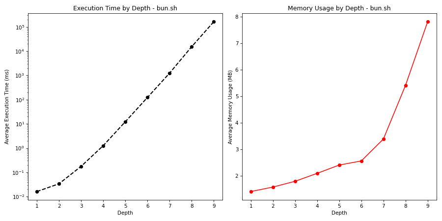

# Test Analysis Report for bun.sh

## Test Results Summary

| Depth | Average Time (ms) | Average Memory Usage (MB) |
| --- | --- | --- |
| 1 | 0.0161 | 1.4089 |
| 2 | 0.0337 | 1.5775 |
| 3 | 0.1766 | 1.7949 |
| 4 | 1.2596 | 2.0944 |
| 5 | 12.2534 | 2.4069 |
| 6 | 122.6465 | 2.5624 |
| 7 | 1232.1892 | 3.3887 |
| 8 | 15204.0159 | 5.4116 |
| 9 | 163026.9187 | 7.8056 |

## Detailed Results

### Depth 1
- Execution Time: Mean: 0.0161 ms
- Memory Usage: Mean: 1.4089 MB

### Depth 2
- Execution Time: Mean: 0.0337 ms
- Memory Usage: Mean: 1.5775 MB

### Depth 3
- Execution Time: Mean: 0.1766 ms
- Memory Usage: Mean: 1.7949 MB

### Depth 4
- Execution Time: Mean: 1.2596 ms
- Memory Usage: Mean: 2.0944 MB

### Depth 5
- Execution Time: Mean: 12.2534 ms
- Memory Usage: Mean: 2.4069 MB

### Depth 6
- Execution Time: Mean: 122.6465 ms
- Memory Usage: Mean: 2.5624 MB

### Depth 7
- Execution Time: Mean: 1232.1892 ms
- Memory Usage: Mean: 3.3887 MB

### Depth 8
- Execution Time: Mean: 15204.0159 ms
- Memory Usage: Mean: 5.4116 MB

### Depth 9
- Execution Time: Mean: 163026.9187 ms
- Memory Usage: Mean: 7.8056 MB

