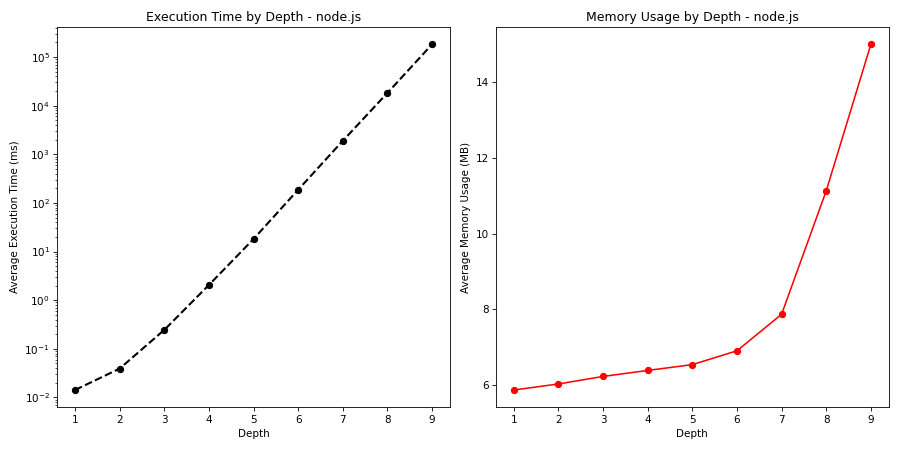

# Test Analysis Report for node.js

## Test Results Summary

### Depth 1
- Execution Time:
    - Mean: 0.0142 ms
    - Max: 4.8753 ms
    - Min: 0.0021 ms
- Memory Usage:
    - Mean: 5.8652 MB
    - Max: 22.5322 MB
    - Min: 3.6697 MB

Detailed Test Results

| Test | Execution Time (ms) | Memory Usage (MB) |
| --- | --- | --- |
| Test at Depth 1 | 0.0052 | 3.9186 |
| Test at Depth 1 | 0.0042 | 3.9687 |
| Test at Depth 1 | 0.0042 | 4.0189 |
| Test at Depth 1 | 0.0042 | 4.0691 |
| Test at Depth 1 | 0.0042 | 4.1193 |
| Test at Depth 1 | 0.0042 | 4.1694 |
| Test at Depth 1 | 0.0042 | 4.2196 |
| Test at Depth 1 | 0.0045 | 4.2698 |
| Test at Depth 1 | 0.0042 | 4.3200 |
| Test at Depth 1 | 0.0042 | 4.3702 |
| Test at Depth 1 | 0.0042 | 4.4204 |
| Test at Depth 1 | 0.0046 | 4.4706 |
| Test at Depth 1 | 0.0042 | 4.5208 |
| Test at Depth 1 | 0.0043 | 4.5710 |
| Test at Depth 1 | 0.0042 | 4.6212 |
| Test at Depth 1 | 0.0045 | 3.7416 |
| Test at Depth 1 | 0.0042 | 3.7919 |
| Test at Depth 1 | 0.0042 | 3.8421 |
| Test at Depth 1 | 0.0042 | 3.8923 |
| Test at Depth 1 | 0.0043 | 3.9432 |
| Test at Depth 1 | 0.0045 | 3.9934 |
| Test at Depth 1 | 0.0042 | 4.0451 |
| Test at Depth 1 | 0.0043 | 4.0953 |
| Test at Depth 1 | 0.0043 | 4.1454 |
| Test at Depth 1 | 0.0042 | 4.1956 |
| Test at Depth 1 | 0.0042 | 4.2457 |
| Test at Depth 1 | 0.0042 | 4.2959 |
| Test at Depth 1 | 0.0042 | 4.3461 |
| Test at Depth 1 | 0.0042 | 4.3962 |
| Test at Depth 1 | 0.0042 | 4.4464 |
| Test at Depth 1 | 0.0043 | 4.4966 |
| Test at Depth 1 | 0.0043 | 4.5467 |
| Test at Depth 1 | 0.0042 | 4.5969 |
| Test at Depth 1 | 0.0042 | 4.6470 |
| Test at Depth 1 | 0.0042 | 4.6972 |
| Test at Depth 1 | 0.0044 | 3.7898 |
| Test at Depth 1 | 0.0042 | 3.8400 |
| Test at Depth 1 | 0.0042 | 3.8901 |
| Test at Depth 1 | 0.0042 | 3.9403 |
| Test at Depth 1 | 0.0042 | 3.9905 |
| Test at Depth 1 | 0.0042 | 4.0406 |
| Test at Depth 1 | 0.0042 | 4.0908 |
| Test at Depth 1 | 0.0042 | 4.1409 |
| Test at Depth 1 | 0.0073 | 4.1941 |
| Test at Depth 1 | 0.0044 | 4.2443 |
| Test at Depth 1 | 0.0043 | 4.2944 |
| Test at Depth 1 | 0.0043 | 4.3446 |
| Test at Depth 1 | 0.0042 | 4.3948 |
| Test at Depth 1 | 0.0042 | 4.4449 |
| Test at Depth 1 | 0.0043 | 4.4951 |
| Test at Depth 1 | 0.0042 | 4.5453 |
| Test at Depth 1 | 0.0043 | 4.5954 |
| Test at Depth 1 | 0.0043 | 4.6456 |
| Test at Depth 1 | 0.0043 | 4.6958 |
| Test at Depth 1 | 0.0046 | 3.7863 |
| Test at Depth 1 | 0.0043 | 3.8364 |
| Test at Depth 1 | 0.0043 | 3.8866 |
| Test at Depth 1 | 0.0043 | 3.9368 |
| Test at Depth 1 | 0.0042 | 3.9869 |
| Test at Depth 1 | 0.0043 | 4.0371 |
| Test at Depth 1 | 0.0042 | 4.0873 |
| Test at Depth 1 | 0.0043 | 4.1374 |
| Test at Depth 1 | 0.0044 | 4.1876 |
| Test at Depth 1 | 0.0044 | 4.2378 |
| Test at Depth 1 | 0.0043 | 4.2880 |
| Test at Depth 1 | 0.0048 | 4.3381 |
| Test at Depth 1 | 0.0042 | 4.3883 |
| Test at Depth 1 | 0.0457 | 4.4384 |
| Test at Depth 1 | 0.0043 | 4.4886 |
| Test at Depth 1 | 0.0043 | 4.5388 |
| Test at Depth 1 | 0.0043 | 4.5889 |
| Test at Depth 1 | 0.0042 | 4.6391 |
| Test at Depth 1 | 0.0043 | 4.6893 |
| Test at Depth 1 | 0.0048 | 3.7788 |
| Test at Depth 1 | 0.0042 | 3.8290 |
| Test at Depth 1 | 0.0042 | 3.8791 |
| Test at Depth 1 | 0.0047 | 3.9293 |
| Test at Depth 1 | 0.0042 | 3.9794 |
| Test at Depth 1 | 0.0042 | 4.0296 |
| Test at Depth 1 | 0.0044 | 4.0798 |
| Test at Depth 1 | 0.0043 | 4.1299 |
| Test at Depth 1 | 0.0042 | 4.1801 |
| Test at Depth 1 | 0.0043 | 4.2303 |
| Test at Depth 1 | 0.0042 | 4.2804 |
| Test at Depth 1 | 0.0042 | 4.3306 |
| Test at Depth 1 | 0.0042 | 4.3867 |
| Test at Depth 1 | 0.0042 | 4.4368 |
| Test at Depth 1 | 0.0042 | 4.4870 |
| Test at Depth 1 | 0.0043 | 4.5372 |
| Test at Depth 1 | 0.0043 | 4.5874 |
| Test at Depth 1 | 0.0042 | 4.6375 |
| Test at Depth 1 | 0.0042 | 4.6877 |
| Test at Depth 1 | 0.0042 | 4.7378 |
| Test at Depth 1 | 0.0042 | 3.8307 |
| Test at Depth 1 | 0.0042 | 3.8809 |
| Test at Depth 1 | 0.0042 | 3.9310 |
| Test at Depth 1 | 0.0042 | 3.9812 |
| Test at Depth 1 | 0.0042 | 4.0314 |
| Test at Depth 1 | 0.0049 | 4.0815 |
| Test at Depth 1 | 0.0042 | 4.1317 |
| Test at Depth 1 | 0.2611 | 3.9680 |
| Test at Depth 1 | 0.0048 | 11.9387 |
| Test at Depth 1 | 0.0029 | 8.9166 |
| Test at Depth 1 | 0.0029 | 11.3535 |
| Test at Depth 1 | 0.0030 | 13.7922 |
| Test at Depth 1 | 0.0029 | 16.2178 |
| Test at Depth 1 | 0.0029 | 18.6567 |
| Test at Depth 1 | 0.0035 | 21.1057 |
| Test at Depth 1 | 0.0032 | 7.8180 |
| Test at Depth 1 | 0.0031 | 10.2576 |
| Test at Depth 1 | 0.0029 | 12.7270 |
| Test at Depth 1 | 0.0034 | 15.1935 |
| Test at Depth 1 | 0.0030 | 17.6255 |
| Test at Depth 1 | 0.0033 | 20.0620 |
| Test at Depth 1 | 0.0026 | 22.5322 |
| Test at Depth 1 | 0.0027 | 9.2310 |
| Test at Depth 1 | 0.0027 | 11.6688 |
| Test at Depth 1 | 0.0032 | 14.1027 |
| Test at Depth 1 | 0.0037 | 16.5380 |
| Test at Depth 1 | 0.0029 | 18.9760 |
| Test at Depth 1 | 0.0051 | 4.3144 |
| Test at Depth 1 | 0.0046 | 3.8344 |
| Test at Depth 1 | 0.0048 | 4.3097 |
| Test at Depth 1 | 0.0050 | 3.8394 |
| Test at Depth 1 | 0.0048 | 4.3147 |
| Test at Depth 1 | 0.0046 | 3.8102 |
| Test at Depth 1 | 0.0046 | 4.2854 |
| Test at Depth 1 | 0.0043 | 4.7607 |
| Test at Depth 1 | 0.0043 | 4.2569 |
| Test at Depth 1 | 0.0043 | 4.7321 |
| Test at Depth 1 | 0.0042 | 4.2281 |
| Test at Depth 1 | 0.0044 | 4.7034 |
| Test at Depth 1 | 0.0044 | 4.1993 |
| Test at Depth 1 | 0.0043 | 4.6747 |
| Test at Depth 1 | 0.0046 | 4.1709 |
| Test at Depth 1 | 0.0043 | 4.6461 |
| Test at Depth 1 | 0.0044 | 4.1422 |
| Test at Depth 1 | 0.0042 | 4.6174 |
| Test at Depth 1 | 0.0046 | 4.1133 |
| Test at Depth 1 | 0.0044 | 4.5893 |
| Test at Depth 1 | 0.0044 | 4.0859 |
| Test at Depth 1 | 0.0043 | 4.5627 |
| Test at Depth 1 | 0.0044 | 4.0599 |
| Test at Depth 1 | 0.0044 | 4.5351 |
| Test at Depth 1 | 0.0044 | 4.0322 |
| Test at Depth 1 | 0.0043 | 4.5075 |
| Test at Depth 1 | 0.0043 | 4.9827 |
| Test at Depth 1 | 0.0072 | 5.4580 |
| Test at Depth 1 | 0.0043 | 3.9719 |
| Test at Depth 1 | 0.0042 | 4.4471 |
| Test at Depth 1 | 0.0043 | 4.9224 |
| Test at Depth 1 | 0.0043 | 5.3976 |
| Test at Depth 1 | 0.0046 | 3.9124 |
| Test at Depth 1 | 0.0043 | 4.3877 |
| Test at Depth 1 | 0.0043 | 4.8629 |
| Test at Depth 1 | 0.0043 | 5.3381 |
| Test at Depth 1 | 0.0044 | 3.8530 |
| Test at Depth 1 | 0.0045 | 4.3282 |
| Test at Depth 1 | 0.0043 | 4.8034 |
| Test at Depth 1 | 0.0043 | 5.2787 |
| Test at Depth 1 | 0.0042 | 5.7539 |
| Test at Depth 1 | 0.0042 | 4.2691 |
| Test at Depth 1 | 0.0043 | 4.7443 |
| Test at Depth 1 | 0.0043 | 5.2225 |
| Test at Depth 1 | 0.0042 | 5.6978 |
| Test at Depth 1 | 0.0044 | 4.2166 |
| Test at Depth 1 | 0.0043 | 4.6918 |
| Test at Depth 1 | 0.0043 | 5.1670 |
| Test at Depth 1 | 0.0043 | 5.6423 |
| Test at Depth 1 | 0.0044 | 4.1605 |
| Test at Depth 1 | 0.0042 | 4.6357 |
| Test at Depth 1 | 0.0043 | 5.1110 |
| Test at Depth 1 | 0.0043 | 5.5862 |
| Test at Depth 1 | 0.0043 | 4.1015 |
| Test at Depth 1 | 0.0043 | 4.5767 |
| Test at Depth 1 | 0.0043 | 5.0519 |
| Test at Depth 1 | 0.0043 | 5.5272 |
| Test at Depth 1 | 0.0043 | 4.0420 |
| Test at Depth 1 | 0.0043 | 4.5173 |
| Test at Depth 1 | 0.0043 | 4.9925 |
| Test at Depth 1 | 0.0043 | 5.4677 |
| Test at Depth 1 | 0.0043 | 3.9825 |
| Test at Depth 1 | 0.0043 | 4.4577 |
| Test at Depth 1 | 0.0043 | 4.9330 |
| Test at Depth 1 | 0.0043 | 5.4082 |
| Test at Depth 1 | 0.0044 | 3.9230 |
| Test at Depth 1 | 0.0043 | 4.3983 |
| Test at Depth 1 | 0.0043 | 4.8735 |
| Test at Depth 1 | 0.0043 | 5.3487 |
| Test at Depth 1 | 0.0043 | 3.8636 |
| Test at Depth 1 | 0.0043 | 4.3388 |
| Test at Depth 1 | 0.0043 | 4.8140 |
| Test at Depth 1 | 0.0045 | 5.2893 |
| Test at Depth 1 | 0.0043 | 5.7645 |
| Test at Depth 1 | 0.0043 | 4.2797 |
| Test at Depth 1 | 0.0042 | 4.7549 |
| Test at Depth 1 | 0.0043 | 5.2302 |
| Test at Depth 1 | 0.0043 | 5.7054 |
| Test at Depth 1 | 0.0043 | 4.2212 |
| Test at Depth 1 | 0.0043 | 4.6964 |
| Test at Depth 1 | 0.0043 | 5.1716 |
| Test at Depth 1 | 0.0043 | 5.6469 |
| Test at Depth 1 | 0.0043 | 4.1622 |
| Test at Depth 1 | 0.0043 | 4.6374 |
| Test at Depth 1 | 0.0043 | 5.1126 |
| Test at Depth 1 | 0.0043 | 5.5938 |
| Test at Depth 1 | 0.0043 | 4.1146 |
| Test at Depth 1 | 0.0042 | 4.5898 |
| Test at Depth 1 | 0.0045 | 5.0650 |
| Test at Depth 1 | 0.0043 | 5.5403 |
| Test at Depth 1 | 0.0044 | 4.0614 |
| Test at Depth 1 | 0.0043 | 4.5367 |
| Test at Depth 1 | 0.0043 | 5.0119 |
| Test at Depth 1 | 0.0045 | 5.4871 |
| Test at Depth 1 | 0.0046 | 4.0020 |
| Test at Depth 1 | 0.0043 | 4.4772 |
| Test at Depth 1 | 0.0043 | 4.9524 |
| Test at Depth 1 | 0.0043 | 5.4277 |
| Test at Depth 1 | 0.0043 | 3.9425 |
| Test at Depth 1 | 0.0081 | 4.4177 |
| Test at Depth 1 | 0.2673 | 3.9680 |
| Test at Depth 1 | 0.0029 | 7.4195 |
| Test at Depth 1 | 0.0023 | 4.3957 |
| Test at Depth 1 | 0.0026 | 3.6697 |
| Test at Depth 1 | 0.0023 | 4.9093 |
| Test at Depth 1 | 0.0023 | 4.1799 |
| Test at Depth 1 | 0.0023 | 5.4190 |
| Test at Depth 1 | 0.0024 | 4.6933 |
| Test at Depth 1 | 0.0024 | 3.9636 |
| Test at Depth 1 | 0.0023 | 5.2079 |
| Test at Depth 1 | 0.0023 | 4.4803 |
| Test at Depth 1 | 0.0025 | 3.6881 |
| Test at Depth 1 | 0.0023 | 6.7954 |
| Test at Depth 1 | 0.0024 | 5.9688 |
| Test at Depth 1 | 0.0023 | 5.1428 |
| Test at Depth 1 | 0.0023 | 4.3154 |
| Test at Depth 1 | 0.0024 | 7.4507 |
| Test at Depth 1 | 0.0024 | 6.6252 |
| Test at Depth 1 | 0.0024 | 5.7975 |
| Test at Depth 1 | 0.0024 | 5.0008 |
| Test at Depth 1 | 0.0024 | 4.1755 |
| Test at Depth 1 | 0.0024 | 7.2819 |
| Test at Depth 1 | 0.0024 | 6.4574 |
| Test at Depth 1 | 0.0024 | 5.6338 |
| Test at Depth 1 | 0.0023 | 4.8073 |
| Test at Depth 1 | 0.0025 | 3.9829 |
| Test at Depth 1 | 0.0025 | 7.0902 |
| Test at Depth 1 | 0.0023 | 6.2646 |
| Test at Depth 1 | 0.0023 | 5.4373 |
| Test at Depth 1 | 0.0023 | 4.6122 |
| Test at Depth 1 | 0.0023 | 3.7865 |
| Test at Depth 1 | 0.0023 | 6.8895 |
| Test at Depth 1 | 0.0024 | 6.0639 |
| Test at Depth 1 | 0.0023 | 5.2373 |
| Test at Depth 1 | 0.0023 | 4.4112 |
| Test at Depth 1 | 0.0023 | 7.5180 |
| Test at Depth 1 | 0.0023 | 6.6916 |
| Test at Depth 1 | 0.0023 | 5.8651 |
| Test at Depth 1 | 0.0023 | 5.0373 |
| Test at Depth 1 | 0.0024 | 4.2105 |
| Test at Depth 1 | 0.0023 | 7.3449 |
| Test at Depth 1 | 0.0023 | 6.5167 |
| Test at Depth 1 | 0.0023 | 5.6885 |
| Test at Depth 1 | 0.0023 | 4.8623 |
| Test at Depth 1 | 0.0023 | 4.0397 |
| Test at Depth 1 | 0.0022 | 7.1504 |
| Test at Depth 1 | 0.0023 | 6.2737 |
| Test at Depth 1 | 0.0023 | 5.3945 |
| Test at Depth 1 | 0.0024 | 4.5149 |
| Test at Depth 1 | 0.0023 | 11.5015 |
| Test at Depth 1 | 0.0024 | 10.6227 |
| Test at Depth 1 | 0.0023 | 9.7431 |
| Test at Depth 1 | 0.0023 | 8.9090 |
| Test at Depth 1 | 0.0024 | 8.0315 |
| Test at Depth 1 | 0.0025 | 7.1514 |
| Test at Depth 1 | 0.0023 | 6.2713 |
| Test at Depth 1 | 0.0037 | 5.4218 |
| Test at Depth 1 | 0.0024 | 4.5443 |
| Test at Depth 1 | 0.0022 | 11.5283 |
| Test at Depth 1 | 0.0023 | 10.6483 |
| Test at Depth 1 | 0.0024 | 9.7704 |
| Test at Depth 1 | 0.0023 | 8.8923 |
| Test at Depth 1 | 0.0022 | 8.0131 |
| Test at Depth 1 | 0.0024 | 7.1347 |
| Test at Depth 1 | 0.0025 | 6.2556 |
| Test at Depth 1 | 0.0024 | 5.4052 |
| Test at Depth 1 | 0.0023 | 4.5273 |
| Test at Depth 1 | 0.0022 | 11.5125 |
| Test at Depth 1 | 0.0024 | 10.6321 |
| Test at Depth 1 | 0.0023 | 9.7525 |
| Test at Depth 1 | 0.0024 | 8.8745 |
| Test at Depth 1 | 0.0022 | 7.9987 |
| Test at Depth 1 | 0.0022 | 7.1199 |
| Test at Depth 1 | 0.0024 | 6.2411 |
| Test at Depth 1 | 0.0023 | 5.3624 |
| Test at Depth 1 | 0.0024 | 4.4837 |
| Test at Depth 1 | 0.0023 | 11.4686 |
| Test at Depth 1 | 0.0022 | 10.5894 |
| Test at Depth 1 | 0.0023 | 9.7119 |
| Test at Depth 1 | 0.0023 | 8.8335 |
| Test at Depth 1 | 0.0023 | 7.9548 |
| Test at Depth 1 | 0.0024 | 7.0764 |
| Test at Depth 1 | 0.0023 | 6.1972 |
| Test at Depth 1 | 0.0023 | 5.3189 |
| Test at Depth 1 | 0.0024 | 4.4409 |
| Test at Depth 1 | 0.0023 | 11.4259 |
| Test at Depth 1 | 0.0022 | 10.5539 |
| Test at Depth 1 | 0.0025 | 9.6874 |
| Test at Depth 1 | 0.0023 | 8.8082 |
| Test at Depth 1 | 0.0023 | 7.9302 |
| Test at Depth 1 | 0.0023 | 7.0527 |
| Test at Depth 1 | 0.0026 | 6.1710 |
| Test at Depth 1 | 0.0024 | 5.2926 |
| Test at Depth 1 | 0.0033 | 4.4138 |
| Test at Depth 1 | 0.0023 | 11.3992 |
| Test at Depth 1 | 0.0024 | 10.5199 |
| Test at Depth 1 | 0.0039 | 9.6428 |
| Test at Depth 1 | 0.0023 | 8.7644 |
| Test at Depth 1 | 0.0023 | 7.8865 |
| Test at Depth 1 | 0.0041 | 7.0073 |
| Test at Depth 1 | 0.0031 | 6.1586 |
| Test at Depth 1 | 0.0047 | 4.2623 |
| Test at Depth 1 | 0.0630 | 4.2710 |
| Test at Depth 1 | 0.0294 | 4.2797 |
| Test at Depth 1 | 0.0301 | 4.2884 |
| Test at Depth 1 | 0.0325 | 3.7159 |
| Test at Depth 1 | 0.0326 | 3.7246 |
| Test at Depth 1 | 0.0303 | 3.7333 |
| Test at Depth 1 | 0.0293 | 3.7421 |
| Test at Depth 1 | 0.0301 | 3.7508 |
| Test at Depth 1 | 0.0293 | 3.7595 |
| Test at Depth 1 | 0.0305 | 3.7683 |
| Test at Depth 1 | 0.0300 | 3.7770 |
| Test at Depth 1 | 0.0294 | 3.7858 |
| Test at Depth 1 | 0.0051 | 3.7931 |
| Test at Depth 1 | 0.0045 | 3.8000 |
| Test at Depth 1 | 0.0045 | 3.8070 |
| Test at Depth 1 | 0.0071 | 3.8141 |
| Test at Depth 1 | 0.0044 | 3.8210 |
| Test at Depth 1 | 0.0044 | 3.8279 |
| Test at Depth 1 | 0.0049 | 3.8362 |
| Test at Depth 1 | 0.0042 | 3.8428 |
| Test at Depth 1 | 0.0042 | 3.8509 |
| Test at Depth 1 | 0.0068 | 3.8574 |
| Test at Depth 1 | 0.0042 | 3.8640 |
| Test at Depth 1 | 0.0042 | 3.8706 |
| Test at Depth 1 | 0.0042 | 3.8772 |
| Test at Depth 1 | 0.0042 | 3.8837 |
| Test at Depth 1 | 0.0089 | 3.8903 |
| Test at Depth 1 | 0.0042 | 3.8969 |
| Test at Depth 1 | 0.0042 | 3.9034 |
| Test at Depth 1 | 0.0042 | 3.9100 |
| Test at Depth 1 | 0.0042 | 3.9166 |
| Test at Depth 1 | 0.0042 | 3.9231 |
| Test at Depth 1 | 0.0042 | 3.9297 |
| Test at Depth 1 | 0.0042 | 3.9363 |
| Test at Depth 1 | 0.0067 | 3.9428 |
| Test at Depth 1 | 0.0042 | 3.9494 |
| Test at Depth 1 | 0.0042 | 3.9560 |
| Test at Depth 1 | 0.0066 | 3.9625 |
| Test at Depth 1 | 0.0041 | 3.9691 |
| Test at Depth 1 | 0.0042 | 3.9757 |
| Test at Depth 1 | 0.0067 | 3.9823 |
| Test at Depth 1 | 0.0042 | 3.9888 |
| Test at Depth 1 | 0.0042 | 3.9984 |
| Test at Depth 1 | 0.0042 | 4.0050 |
| Test at Depth 1 | 0.0041 | 4.0115 |
| Test at Depth 1 | 0.0042 | 4.0181 |
| Test at Depth 1 | 0.0042 | 4.0247 |
| Test at Depth 1 | 0.0041 | 4.0312 |
| Test at Depth 1 | 0.0042 | 4.0378 |
| Test at Depth 1 | 0.0041 | 4.0444 |
| Test at Depth 1 | 0.0042 | 4.0510 |
| Test at Depth 1 | 0.0042 | 4.0575 |
| Test at Depth 1 | 0.0064 | 4.0641 |
| Test at Depth 1 | 0.0042 | 4.0707 |
| Test at Depth 1 | 0.0042 | 4.0772 |
| Test at Depth 1 | 0.0042 | 4.0838 |
| Test at Depth 1 | 0.0042 | 4.0904 |
| Test at Depth 1 | 0.0042 | 4.0969 |
| Test at Depth 1 | 0.0041 | 4.1035 |
| Test at Depth 1 | 0.0042 | 4.1101 |
| Test at Depth 1 | 0.0042 | 4.1166 |
| Test at Depth 1 | 0.0042 | 4.1232 |
| Test at Depth 1 | 0.0042 | 4.1298 |
| Test at Depth 1 | 0.0042 | 4.1364 |
| Test at Depth 1 | 0.0041 | 4.1429 |
| Test at Depth 1 | 0.0042 | 4.1495 |
| Test at Depth 1 | 0.0042 | 4.1561 |
| Test at Depth 1 | 0.0042 | 4.1626 |
| Test at Depth 1 | 0.0066 | 4.1692 |
| Test at Depth 1 | 0.0041 | 4.1758 |
| Test at Depth 1 | 0.0042 | 4.1823 |
| Test at Depth 1 | 0.0067 | 4.1889 |
| Test at Depth 1 | 0.0042 | 4.1955 |
| Test at Depth 1 | 0.0042 | 4.2020 |
| Test at Depth 1 | 0.0067 | 4.2086 |
| Test at Depth 1 | 0.0042 | 4.2152 |
| Test at Depth 1 | 0.0042 | 4.2217 |
| Test at Depth 1 | 0.0042 | 4.2283 |
| Test at Depth 1 | 0.0042 | 4.2349 |
| Test at Depth 1 | 0.0042 | 4.2415 |
| Test at Depth 1 | 0.0042 | 4.2480 |
| Test at Depth 1 | 0.0042 | 4.2546 |
| Test at Depth 1 | 0.0042 | 4.2612 |
| Test at Depth 1 | 0.0042 | 4.2677 |
| Test at Depth 1 | 0.0043 | 4.2802 |
| Test at Depth 1 | 0.0066 | 4.2868 |
| Test at Depth 1 | 0.0042 | 4.2934 |
| Test at Depth 1 | 0.0043 | 3.7601 |
| Test at Depth 1 | 0.0042 | 3.7667 |
| Test at Depth 1 | 0.0042 | 3.7733 |
| Test at Depth 1 | 0.0042 | 3.7798 |
| Test at Depth 1 | 0.0045 | 3.7864 |
| Test at Depth 1 | 0.0041 | 3.7930 |
| Test at Depth 1 | 0.0042 | 3.7995 |
| Test at Depth 1 | 0.0042 | 3.8061 |
| Test at Depth 1 | 0.0042 | 3.8127 |
| Test at Depth 1 | 0.0042 | 3.8193 |
| Test at Depth 1 | 0.0042 | 3.8258 |
| Test at Depth 1 | 0.0042 | 3.8324 |
| Test at Depth 1 | 0.0025 | 4.0235 |
| Test at Depth 1 | 0.0024 | 5.9292 |
| Test at Depth 1 | 0.0025 | 5.8691 |
| Test at Depth 1 | 0.0024 | 5.8076 |
| Test at Depth 1 | 0.0025 | 5.7460 |
| Test at Depth 1 | 0.0027 | 5.6852 |
| Test at Depth 1 | 0.0024 | 5.6221 |
| Test at Depth 1 | 0.0045 | 5.5613 |
| Test at Depth 1 | 0.0027 | 5.5000 |
| Test at Depth 1 | 0.0026 | 5.4388 |
| Test at Depth 1 | 0.0024 | 5.3768 |
| Test at Depth 1 | 0.0025 | 5.3162 |
| Test at Depth 1 | 0.0024 | 5.2546 |
| Test at Depth 1 | 0.0024 | 5.1925 |
| Test at Depth 1 | 0.0026 | 5.1314 |
| Test at Depth 1 | 0.0024 | 5.0689 |
| Test at Depth 1 | 0.0026 | 5.0073 |
| Test at Depth 1 | 0.0026 | 4.9461 |
| Test at Depth 1 | 0.0024 | 4.8844 |
| Test at Depth 1 | 0.0024 | 4.8236 |
| Test at Depth 1 | 0.0023 | 4.7624 |
| Test at Depth 1 | 0.0029 | 4.7029 |
| Test at Depth 1 | 0.0024 | 4.6443 |
| Test at Depth 1 | 0.0024 | 4.5833 |
| Test at Depth 1 | 0.0025 | 4.5229 |
| Test at Depth 1 | 0.0025 | 4.4610 |
| Test at Depth 1 | 0.0024 | 4.3994 |
| Test at Depth 1 | 0.0025 | 4.3375 |
| Test at Depth 1 | 0.0024 | 4.2743 |
| Test at Depth 1 | 0.0024 | 4.2129 |
| Test at Depth 1 | 0.0024 | 4.1504 |
| Test at Depth 1 | 0.0028 | 6.0540 |
| Test at Depth 1 | 0.0025 | 5.9922 |
| Test at Depth 1 | 0.0025 | 5.9299 |
| Test at Depth 1 | 0.0024 | 5.8691 |
| Test at Depth 1 | 0.0026 | 5.8074 |
| Test at Depth 1 | 0.0024 | 5.7460 |
| Test at Depth 1 | 0.0027 | 5.6848 |
| Test at Depth 1 | 0.0024 | 5.6227 |
| Test at Depth 1 | 0.0024 | 5.5602 |
| Test at Depth 1 | 0.0026 | 5.4981 |
| Test at Depth 1 | 0.0024 | 5.4359 |
| Test at Depth 1 | 0.0023 | 5.3743 |
| Test at Depth 1 | 0.0024 | 5.3164 |
| Test at Depth 1 | 0.0024 | 5.2616 |
| Test at Depth 1 | 0.0025 | 5.1982 |
| Test at Depth 1 | 0.0024 | 5.1366 |
| Test at Depth 1 | 0.0025 | 5.0753 |
| Test at Depth 1 | 0.0026 | 5.0137 |
| Test at Depth 1 | 0.0024 | 4.9526 |
| Test at Depth 1 | 0.0025 | 4.8909 |
| Test at Depth 1 | 0.0025 | 4.8292 |
| Test at Depth 1 | 0.0025 | 4.7682 |
| Test at Depth 1 | 0.0026 | 6.6717 |
| Test at Depth 1 | 0.0024 | 6.5982 |
| Test at Depth 1 | 0.0024 | 6.5252 |
| Test at Depth 1 | 0.0025 | 6.4531 |
| Test at Depth 1 | 0.0024 | 6.3797 |
| Test at Depth 1 | 0.0025 | 6.3080 |
| Test at Depth 1 | 0.0024 | 6.2354 |
| Test at Depth 1 | 0.0024 | 6.1636 |
| Test at Depth 1 | 0.0024 | 6.0911 |
| Test at Depth 1 | 0.0025 | 6.0185 |
| Test at Depth 1 | 0.0025 | 5.9456 |
| Test at Depth 1 | 0.0024 | 5.8742 |
| Test at Depth 1 | 0.0024 | 5.8021 |
| Test at Depth 1 | 0.0025 | 5.7300 |
| Test at Depth 1 | 0.0023 | 5.6578 |
| Test at Depth 1 | 0.0024 | 5.5857 |
| Test at Depth 1 | 0.0024 | 5.5135 |
| Test at Depth 1 | 0.0025 | 5.4414 |
| Test at Depth 1 | 0.0023 | 5.3697 |
| Test at Depth 1 | 0.0025 | 5.2971 |
| Test at Depth 1 | 0.0024 | 5.2254 |
| Test at Depth 1 | 0.0024 | 5.1532 |
| Test at Depth 1 | 0.0025 | 5.0811 |
| Test at Depth 1 | 0.0026 | 5.0094 |
| Test at Depth 1 | 0.0025 | 4.9372 |
| Test at Depth 1 | 0.0026 | 4.8651 |
| Test at Depth 1 | 0.0024 | 4.7921 |
| Test at Depth 1 | 0.0025 | 4.7199 |
| Test at Depth 1 | 0.0024 | 4.6478 |
| Test at Depth 1 | 0.0029 | 4.5769 |
| Test at Depth 1 | 0.0024 | 4.5048 |
| Test at Depth 1 | 0.0025 | 4.4326 |
| Test at Depth 1 | 0.0024 | 4.3664 |
| Test at Depth 1 | 0.0023 | 4.3086 |
| Test at Depth 1 | 0.0024 | 8.1656 |
| Test at Depth 1 | 0.0023 | 8.0917 |
| Test at Depth 1 | 0.0024 | 8.0182 |
| Test at Depth 1 | 0.0023 | 7.9440 |
| Test at Depth 1 | 0.0023 | 7.8693 |
| Test at Depth 1 | 0.0023 | 7.7941 |
| Test at Depth 1 | 0.0022 | 7.7198 |
| Test at Depth 1 | 0.0023 | 7.6468 |
| Test at Depth 1 | 0.0025 | 7.5727 |
| Test at Depth 1 | 0.0023 | 7.4976 |
| Test at Depth 1 | 0.0024 | 7.4230 |
| Test at Depth 1 | 0.0023 | 7.3491 |
| Test at Depth 1 | 0.0023 | 7.2748 |
| Test at Depth 1 | 0.0063 | 4.0997 |
| Test at Depth 1 | 0.2555 | 3.9684 |
| Test at Depth 1 | 0.2018 | 3.9723 |
| Test at Depth 1 | 4.8753 | 3.9740 |
| Test at Depth 1 | 0.0770 | 3.9757 |
| Test at Depth 1 | 0.0785 | 3.9775 |
| Test at Depth 1 | 0.0738 | 3.9792 |
| Test at Depth 1 | 0.0733 | 3.9810 |
| Test at Depth 1 | 0.1344 | 3.9829 |
| Test at Depth 1 | 0.0717 | 3.9848 |
| Test at Depth 1 | 0.0793 | 3.9864 |
| Test at Depth 1 | 0.0732 | 3.9883 |
| Test at Depth 1 | 0.0782 | 3.9901 |
| Test at Depth 1 | 0.0745 | 3.9921 |
| Test at Depth 1 | 0.0761 | 3.9939 |
| Test at Depth 1 | 0.0728 | 3.9956 |
| Test at Depth 1 | 0.0768 | 3.9977 |
| Test at Depth 1 | 0.0708 | 3.9995 |
| Test at Depth 1 | 0.0729 | 4.0011 |
| Test at Depth 1 | 0.0717 | 4.0033 |
| Test at Depth 1 | 0.0784 | 4.0058 |
| Test at Depth 1 | 0.0736 | 4.0074 |
| Test at Depth 1 | 0.0712 | 4.0106 |
| Test at Depth 1 | 0.0727 | 4.0123 |
| Test at Depth 1 | 0.0750 | 4.0140 |
| Test at Depth 1 | 0.0743 | 4.0156 |
| Test at Depth 1 | 0.0773 | 4.0173 |
| Test at Depth 1 | 0.0729 | 4.0190 |
| Test at Depth 1 | 0.0744 | 4.0206 |
| Test at Depth 1 | 0.0725 | 4.0223 |
| Test at Depth 1 | 0.0725 | 4.0239 |
| Test at Depth 1 | 0.0752 | 4.0256 |
| Test at Depth 1 | 0.0725 | 4.0273 |
| Test at Depth 1 | 0.0768 | 4.0289 |
| Test at Depth 1 | 0.0725 | 4.0306 |
| Test at Depth 1 | 0.0719 | 4.0323 |
| Test at Depth 1 | 0.0727 | 4.0339 |
| Test at Depth 1 | 0.0706 | 4.0356 |
| Test at Depth 1 | 0.0765 | 4.0372 |
| Test at Depth 1 | 0.0703 | 4.0389 |
| Test at Depth 1 | 0.0769 | 4.0406 |
| Test at Depth 1 | 0.0730 | 4.0422 |
| Test at Depth 1 | 0.0720 | 4.0439 |
| Test at Depth 1 | 0.0726 | 4.0456 |
| Test at Depth 1 | 0.0738 | 4.0521 |
| Test at Depth 1 | 0.0727 | 4.0538 |
| Test at Depth 1 | 0.0735 | 4.0555 |
| Test at Depth 1 | 0.0726 | 4.0572 |
| Test at Depth 1 | 0.0728 | 4.0589 |
| Test at Depth 1 | 0.0717 | 4.0606 |
| Test at Depth 1 | 0.0718 | 4.0623 |
| Test at Depth 1 | 0.0760 | 4.0640 |
| Test at Depth 1 | 0.0707 | 4.0657 |
| Test at Depth 1 | 0.0727 | 4.0674 |
| Test at Depth 1 | 0.0715 | 4.0690 |
| Test at Depth 1 | 0.0718 | 4.0707 |
| Test at Depth 1 | 0.0723 | 4.0724 |
| Test at Depth 1 | 0.0710 | 4.0741 |
| Test at Depth 1 | 0.0754 | 4.0758 |
| Test at Depth 1 | 0.0709 | 4.0775 |
| Test at Depth 1 | 0.0730 | 4.0792 |
| Test at Depth 1 | 0.0760 | 4.0809 |
| Test at Depth 1 | 0.0716 | 4.0826 |
| Test at Depth 1 | 0.0714 | 4.0843 |
| Test at Depth 1 | 0.0715 | 4.0860 |
| Test at Depth 1 | 0.0747 | 4.0877 |
| Test at Depth 1 | 0.0725 | 4.0894 |
| Test at Depth 1 | 0.0739 | 4.0911 |
| Test at Depth 1 | 0.0722 | 4.0928 |
| Test at Depth 1 | 0.0722 | 4.0945 |
| Test at Depth 1 | 0.0717 | 4.0961 |
| Test at Depth 1 | 0.0729 | 4.0978 |
| Test at Depth 1 | 0.0742 | 4.0995 |
| Test at Depth 1 | 0.0726 | 4.1012 |
| Test at Depth 1 | 0.0737 | 4.1029 |
| Test at Depth 1 | 0.0724 | 4.1046 |
| Test at Depth 1 | 0.0721 | 4.1063 |
| Test at Depth 1 | 0.0717 | 4.1080 |
| Test at Depth 1 | 0.0724 | 4.1097 |
| Test at Depth 1 | 0.0708 | 4.1114 |
| Test at Depth 1 | 0.0721 | 4.1131 |
| Test at Depth 1 | 0.0744 | 4.1148 |
| Test at Depth 1 | 0.0718 | 4.1165 |
| Test at Depth 1 | 0.0722 | 4.1182 |
| Test at Depth 1 | 0.0719 | 4.1199 |
| Test at Depth 1 | 0.0722 | 4.1216 |
| Test at Depth 1 | 0.0724 | 4.1292 |
| Test at Depth 1 | 0.0705 | 4.1309 |
| Test at Depth 1 | 0.0728 | 4.1326 |
| Test at Depth 1 | 0.0755 | 4.1342 |
| Test at Depth 1 | 0.0721 | 4.1359 |
| Test at Depth 1 | 0.0723 | 4.1376 |
| Test at Depth 1 | 0.0705 | 4.1393 |
| Test at Depth 1 | 0.0721 | 4.1410 |
| Test at Depth 1 | 0.0701 | 4.1427 |
| Test at Depth 1 | 0.0727 | 4.1444 |
| Test at Depth 1 | 0.0742 | 4.1461 |
| Test at Depth 1 | 0.0711 | 4.1478 |
| Test at Depth 1 | 0.0718 | 4.1495 |
| Test at Depth 1 | 0.0718 | 4.1512 |
| Test at Depth 1 | 0.0718 | 4.1529 |
| Test at Depth 1 | 0.0051 | 5.0369 |
| Test at Depth 1 | 0.0483 | 4.8635 |
| Test at Depth 1 | 0.0027 | 5.0864 |
| Test at Depth 1 | 0.0022 | 3.9084 |
| Test at Depth 1 | 0.0022 | 4.6955 |
| Test at Depth 1 | 0.0026 | 5.4827 |
| Test at Depth 1 | 0.0026 | 4.3041 |
| Test at Depth 1 | 0.0026 | 5.0913 |
| Test at Depth 1 | 0.0025 | 3.9133 |
| Test at Depth 1 | 0.0029 | 4.7008 |
| Test at Depth 1 | 0.0026 | 5.4880 |
| Test at Depth 1 | 0.0027 | 4.3099 |
| Test at Depth 1 | 0.0027 | 5.0966 |
| Test at Depth 1 | 0.0025 | 3.9182 |
| Test at Depth 1 | 0.0026 | 4.7054 |
| Test at Depth 1 | 0.0023 | 5.4929 |
| Test at Depth 1 | 0.0024 | 4.3145 |
| Test at Depth 1 | 0.0024 | 5.1024 |
| Test at Depth 1 | 0.0023 | 3.9240 |
| Test at Depth 1 | 0.0023 | 4.7119 |
| Test at Depth 1 | 0.0024 | 5.5011 |
| Test at Depth 1 | 0.0023 | 4.3242 |
| Test at Depth 1 | 0.0022 | 5.1142 |
| Test at Depth 1 | 0.0025 | 3.9353 |
| Test at Depth 1 | 0.0024 | 4.7225 |
| Test at Depth 1 | 0.0023 | 5.5100 |
| Test at Depth 1 | 0.0023 | 4.3315 |
| Test at Depth 1 | 0.0023 | 5.1186 |
| Test at Depth 1 | 0.0023 | 3.9401 |
| Test at Depth 1 | 0.0023 | 4.7272 |
| Test at Depth 1 | 0.0022 | 5.5144 |
| Test at Depth 1 | 0.0022 | 4.3363 |
| Test at Depth 1 | 0.0024 | 5.1234 |
| Test at Depth 1 | 0.0027 | 3.9449 |
| Test at Depth 1 | 0.0026 | 4.7320 |
| Test at Depth 1 | 0.0026 | 5.5196 |
| Test at Depth 1 | 0.0026 | 4.3406 |
| Test at Depth 1 | 0.0027 | 5.1277 |
| Test at Depth 1 | 0.0028 | 3.9493 |
| Test at Depth 1 | 0.0030 | 4.7364 |
| Test at Depth 1 | 0.0026 | 5.5235 |
| Test at Depth 1 | 0.0033 | 4.3457 |
| Test at Depth 1 | 0.0027 | 5.1329 |
| Test at Depth 1 | 0.0026 | 3.9574 |
| Test at Depth 1 | 0.0025 | 4.7505 |
| Test at Depth 1 | 0.0024 | 5.5376 |
| Test at Depth 1 | 0.0026 | 4.3591 |
| Test at Depth 1 | 0.0028 | 5.1462 |
| Test at Depth 1 | 0.0026 | 3.9677 |
| Test at Depth 1 | 0.0026 | 4.7548 |
| Test at Depth 1 | 0.0029 | 5.5420 |
| Test at Depth 1 | 0.0027 | 4.3635 |
| Test at Depth 1 | 0.0028 | 5.1509 |
| Test at Depth 1 | 0.0026 | 3.9720 |
| Test at Depth 1 | 0.0026 | 4.7592 |
| Test at Depth 1 | 0.0026 | 5.5463 |
| Test at Depth 1 | 0.0026 | 4.3681 |
| Test at Depth 1 | 0.0025 | 5.1557 |
| Test at Depth 1 | 0.0026 | 3.9772 |
| Test at Depth 1 | 0.0025 | 4.7643 |
| Test at Depth 1 | 0.0026 | 5.5515 |
| Test at Depth 1 | 0.0027 | 4.3737 |
| Test at Depth 1 | 0.0027 | 5.1609 |
| Test at Depth 1 | 0.0025 | 3.9820 |
| Test at Depth 1 | 0.0025 | 4.7691 |
| Test at Depth 1 | 0.0026 | 5.5562 |
| Test at Depth 1 | 0.0036 | 4.3776 |
| Test at Depth 1 | 0.0024 | 5.1647 |
| Test at Depth 1 | 0.0026 | 3.9863 |
| Test at Depth 1 | 0.0027 | 4.7734 |
| Test at Depth 1 | 0.0025 | 5.5606 |
| Test at Depth 1 | 0.0026 | 4.3824 |
| Test at Depth 1 | 0.0024 | 5.1695 |
| Test at Depth 1 | 0.0025 | 3.9910 |
| Test at Depth 1 | 0.0024 | 4.7782 |
| Test at Depth 1 | 0.0025 | 5.5657 |
| Test at Depth 1 | 0.0024 | 4.3871 |
| Test at Depth 1 | 0.0026 | 5.1742 |
| Test at Depth 1 | 0.0026 | 3.9958 |
| Test at Depth 1 | 0.0026 | 4.7833 |
| Test at Depth 1 | 0.0024 | 5.5705 |
| Test at Depth 1 | 0.0025 | 4.3923 |
| Test at Depth 1 | 0.0025 | 5.1794 |
| Test at Depth 1 | 0.0023 | 4.0013 |
| Test at Depth 1 | 0.0022 | 4.7892 |
| Test at Depth 1 | 0.0023 | 5.5827 |
| Test at Depth 1 | 0.0022 | 4.4168 |
| Test at Depth 1 | 0.0047 | 5.2044 |
| Test at Depth 1 | 0.0023 | 4.0259 |
| Test at Depth 1 | 0.0025 | 4.8134 |
| Test at Depth 1 | 0.0023 | 5.6010 |
| Test at Depth 1 | 0.0022 | 4.4232 |
| Test at Depth 1 | 0.0022 | 5.2108 |
| Test at Depth 1 | 0.0023 | 4.0323 |
| Test at Depth 1 | 0.0021 | 4.8199 |
| Test at Depth 1 | 0.0024 | 5.6074 |
| Test at Depth 1 | 0.0022 | 4.4297 |
| Test at Depth 1 | 0.0022 | 5.2173 |
| Test at Depth 1 | 0.0022 | 4.0392 |
| Test at Depth 1 | 0.0022 | 4.8268 |
| Test at Depth 1 | 0.2589 | 3.9683 |
| Test at Depth 1 | 0.2543 | 3.9680 |
| Test at Depth 1 | 0.0031 | 4.1591 |
| Test at Depth 1 | 0.0029 | 4.1152 |
| Test at Depth 1 | 0.0029 | 4.0708 |
| Test at Depth 1 | 0.0030 | 4.0249 |
| Test at Depth 1 | 0.0028 | 3.9636 |
| Test at Depth 1 | 0.0030 | 3.9018 |
| Test at Depth 1 | 0.0027 | 3.8410 |
| Test at Depth 1 | 0.0029 | 3.7798 |
| Test at Depth 1 | 0.0030 | 5.6842 |
| Test at Depth 1 | 0.0029 | 5.6221 |
| Test at Depth 1 | 0.0030 | 5.5624 |
| Test at Depth 1 | 0.0027 | 5.5015 |
| Test at Depth 1 | 0.0027 | 5.4405 |
| Test at Depth 1 | 0.0026 | 5.3792 |
| Test at Depth 1 | 0.0026 | 5.3187 |
| Test at Depth 1 | 0.0027 | 5.2579 |
| Test at Depth 1 | 0.0026 | 5.1970 |
| Test at Depth 1 | 0.0025 | 5.1356 |
| Test at Depth 1 | 0.0035 | 5.0746 |
| Test at Depth 1 | 0.0026 | 5.0159 |
| Test at Depth 1 | 0.0030 | 4.9561 |
| Test at Depth 1 | 0.0026 | 4.8965 |
| Test at Depth 1 | 0.0027 | 4.8346 |
| Test at Depth 1 | 0.0027 | 4.7734 |
| Test at Depth 1 | 0.0026 | 4.7108 |
| Test at Depth 1 | 0.0026 | 4.6488 |
| Test at Depth 1 | 0.0027 | 4.5882 |
| Test at Depth 1 | 0.0026 | 4.5254 |
| Test at Depth 1 | 0.0032 | 4.4625 |
| Test at Depth 1 | 0.0027 | 4.4006 |
| Test at Depth 1 | 0.0027 | 4.3398 |
| Test at Depth 1 | 0.0026 | 4.2772 |
| Test at Depth 1 | 0.0026 | 4.2156 |
| Test at Depth 1 | 0.0026 | 4.1535 |
| Test at Depth 1 | 0.0027 | 4.0920 |
| Test at Depth 1 | 0.0027 | 4.0300 |
| Test at Depth 1 | 0.0028 | 3.9682 |
| Test at Depth 1 | 0.0026 | 3.9067 |
| Test at Depth 1 | 0.0026 | 3.8431 |
| Test at Depth 1 | 0.0026 | 5.7462 |
| Test at Depth 1 | 0.0025 | 5.6851 |
| Test at Depth 1 | 0.0025 | 5.6236 |
| Test at Depth 1 | 0.0026 | 5.5633 |
| Test at Depth 1 | 0.0026 | 5.5079 |
| Test at Depth 1 | 0.0027 | 5.4465 |
| Test at Depth 1 | 0.0027 | 5.3845 |
| Test at Depth 1 | 0.0026 | 5.3227 |
| Test at Depth 1 | 0.0026 | 5.2620 |
| Test at Depth 1 | 0.0027 | 5.2003 |
| Test at Depth 1 | 0.0026 | 5.1381 |
| Test at Depth 1 | 0.0027 | 5.0761 |
| Test at Depth 1 | 0.0028 | 5.0144 |
| Test at Depth 1 | 0.0024 | 4.9528 |
| Test at Depth 1 | 0.0028 | 4.8907 |
| Test at Depth 1 | 0.0026 | 4.8273 |
| Test at Depth 1 | 0.0026 | 4.7658 |
| Test at Depth 1 | 0.0026 | 4.7051 |
| Test at Depth 1 | 0.0027 | 4.6428 |
| Test at Depth 1 | 0.0026 | 4.5816 |
| Test at Depth 1 | 0.0025 | 4.5197 |
| Test at Depth 1 | 0.0026 | 4.4577 |
| Test at Depth 1 | 0.0026 | 4.3955 |
| Test at Depth 1 | 0.0027 | 4.3334 |
| Test at Depth 1 | 0.0026 | 4.2710 |
| Test at Depth 1 | 0.0028 | 4.2091 |
| Test at Depth 1 | 0.0026 | 4.1471 |
| Test at Depth 1 | 0.0026 | 4.0861 |
| Test at Depth 1 | 0.0026 | 4.0233 |
| Test at Depth 1 | 0.0030 | 3.9919 |
| Test at Depth 1 | 0.0030 | 5.8955 |
| Test at Depth 1 | 0.0026 | 5.8347 |
| Test at Depth 1 | 0.0026 | 5.7731 |
| Test at Depth 1 | 0.0026 | 5.7112 |
| Test at Depth 1 | 0.0026 | 5.6503 |
| Test at Depth 1 | 0.0027 | 5.5886 |
| Test at Depth 1 | 0.0027 | 5.5276 |
| Test at Depth 1 | 0.0027 | 5.4663 |
| Test at Depth 1 | 0.0028 | 5.4052 |
| Test at Depth 1 | 0.0026 | 5.3423 |
| Test at Depth 1 | 0.0027 | 5.2802 |
| Test at Depth 1 | 0.0027 | 5.2190 |
| Test at Depth 1 | 0.0038 | 5.1574 |
| Test at Depth 1 | 0.0027 | 5.0868 |
| Test at Depth 1 | 0.0027 | 5.0143 |
| Test at Depth 1 | 0.0026 | 4.9477 |
| Test at Depth 1 | 0.0027 | 4.8879 |
| Test at Depth 1 | 0.0031 | 4.8166 |
| Test at Depth 1 | 0.0026 | 4.7449 |
| Test at Depth 1 | 0.0030 | 4.6723 |
| Test at Depth 1 | 0.0028 | 4.6002 |
| Test at Depth 1 | 0.0026 | 4.5281 |
| Test at Depth 1 | 0.0026 | 4.4556 |
| Test at Depth 1 | 0.0028 | 4.3838 |
| Test at Depth 1 | 0.0027 | 4.3117 |
| Test at Depth 1 | 0.0026 | 4.2404 |
| Test at Depth 1 | 0.0028 | 4.1684 |
| Test at Depth 1 | 0.0027 | 4.0958 |
| Test at Depth 1 | 0.0027 | 7.9557 |
| Test at Depth 1 | 0.0026 | 7.8837 |
| Test at Depth 1 | 0.0026 | 7.8115 |
| Test at Depth 1 | 0.0026 | 7.7390 |
| Test at Depth 1 | 0.0027 | 7.6677 |
| Test at Depth 1 | 0.0027 | 7.5956 |
| Test at Depth 1 | 0.0027 | 7.5239 |
| Test at Depth 1 | 0.0027 | 7.4510 |
| Test at Depth 1 | 0.0027 | 7.3797 |
| Test at Depth 1 | 0.0027 | 7.3073 |
| Test at Depth 1 | 0.0026 | 7.2352 |
| Test at Depth 1 | 0.0027 | 7.1632 |
| Test at Depth 1 | 0.0028 | 7.0911 |
| Test at Depth 1 | 0.0027 | 7.0190 |
| Test at Depth 1 | 0.0028 | 6.9465 |
| Test at Depth 1 | 0.0027 | 6.8740 |
| Test at Depth 1 | 0.0027 | 6.8023 |
| Test at Depth 1 | 0.0028 | 6.7293 |
| Test at Depth 1 | 0.0026 | 6.6568 |
| Test at Depth 1 | 0.0028 | 6.5838 |
| Test at Depth 1 | 0.0027 | 6.5109 |
| Test at Depth 1 | 0.0031 | 6.4383 |
| Test at Depth 1 | 0.0027 | 6.3658 |
| Test at Depth 1 | 0.0028 | 6.2932 |
| Test at Depth 1 | 0.0027 | 6.2203 |
| Test at Depth 1 | 0.0031 | 6.1477 |
| Test at Depth 1 | 0.0026 | 6.0756 |
| Test at Depth 1 | 0.0028 | 6.0031 |
| Test at Depth 1 | 0.0025 | 5.9305 |
| Test at Depth 1 | 0.0027 | 5.8885 |
| Test at Depth 1 | 0.0028 | 5.8159 |
| Test at Depth 1 | 0.0027 | 5.7434 |
| Test at Depth 1 | 0.0027 | 5.6704 |
| Test at Depth 1 | 0.0026 | 5.5974 |
| Test at Depth 1 | 0.0027 | 5.5253 |
| Test at Depth 1 | 0.0027 | 5.4532 |
| Test at Depth 1 | 0.0025 | 5.3806 |
| Test at Depth 1 | 0.0027 | 5.3081 |
| Test at Depth 1 | 0.0027 | 5.2360 |
| Test at Depth 1 | 0.0027 | 5.1639 |
| Test at Depth 1 | 0.0028 | 5.0913 |
| Test at Depth 1 | 0.0026 | 5.0196 |
| Test at Depth 1 | 0.0027 | 4.9488 |
| Test at Depth 1 | 0.0028 | 4.8762 |
| Test at Depth 1 | 0.0027 | 4.8045 |
| Test at Depth 1 | 0.0026 | 4.7328 |
| Test at Depth 1 | 0.0028 | 4.6599 |
| Test at Depth 1 | 0.0027 | 4.5877 |
| Test at Depth 1 | 0.0027 | 4.5156 |
| Test at Depth 1 | 0.0027 | 4.4435 |
| Test at Depth 1 | 0.0028 | 4.3722 |
| Test at Depth 1 | 0.0027 | 4.3001 |
| Test at Depth 1 | 0.0027 | 4.2280 |
| Test at Depth 1 | 0.0029 | 4.1554 |
| Test at Depth 1 | 0.0027 | 8.0150 |
| Test at Depth 1 | 0.0026 | 7.9432 |
| Test at Depth 1 | 0.0026 | 7.8720 |
| Test at Depth 1 | 0.0028 | 7.8007 |
| Test at Depth 1 | 0.0027 | 7.7282 |
| Test at Depth 1 | 0.0027 | 7.6556 |
| Test at Depth 1 | 0.0027 | 7.5827 |
| Test at Depth 1 | 0.0031 | 7.5110 |
| Test at Depth 1 | 0.0028 | 7.4386 |
| Test at Depth 1 | 0.0032 | 7.3670 |
| Test at Depth 1 | 0.0028 | 7.2953 |
| Test at Depth 1 | 0.0027 | 7.2229 |
| Test at Depth 1 | 0.0027 | 7.1504 |
| Test at Depth 1 | 0.0027 | 7.0783 |
| Test at Depth 1 | 0.0027 | 7.0053 |
| Test at Depth 1 | 0.0027 | 6.9336 |
| Test at Depth 1 | 0.0025 | 6.8611 |
| Test at Depth 1 | 0.0026 | 6.7890 |
| Test at Depth 1 | 0.0027 | 6.7168 |
| Test at Depth 1 | 0.0026 | 6.6595 |
| Test at Depth 1 | 0.0027 | 6.6395 |
| Test at Depth 1 | 0.0027 | 6.5673 |
| Test at Depth 1 | 0.0026 | 6.4948 |
| Test at Depth 1 | 0.0027 | 6.4227 |
| Test at Depth 1 | 0.0026 | 6.3498 |
| Test at Depth 1 | 0.0028 | 6.2776 |
| Test at Depth 1 | 0.0029 | 6.2050 |
| Test at Depth 1 | 0.0027 | 6.1325 |
| Test at Depth 1 | 0.0026 | 6.0608 |
| Test at Depth 1 | 0.0027 | 5.9887 |
| Test at Depth 1 | 0.0027 | 5.9161 |
| Test at Depth 1 | 0.0026 | 5.8440 |
| Test at Depth 1 | 0.0029 | 5.7715 |
| Test at Depth 1 | 0.0027 | 5.6998 |
| Test at Depth 1 | 0.0026 | 5.6272 |
| Test at Depth 1 | 0.0027 | 5.5547 |
| Test at Depth 1 | 0.0027 | 5.4821 |
| Test at Depth 1 | 0.0026 | 5.4109 |
| Test at Depth 1 | 0.0026 | 5.3383 |
| Test at Depth 1 | 0.0029 | 5.2662 |
| Test at Depth 1 | 0.0027 | 5.1937 |
| Test at Depth 1 | 0.0026 | 5.1216 |
| Test at Depth 1 | 0.0026 | 5.0494 |
| Test at Depth 1 | 0.0027 | 4.9777 |
| Test at Depth 1 | 0.0026 | 4.9060 |
| Test at Depth 1 | 0.0025 | 4.8343 |
| Test at Depth 1 | 0.0026 | 4.7622 |
| Test at Depth 1 | 0.0028 | 4.6909 |
| Test at Depth 1 | 0.0027 | 4.6192 |
| Test at Depth 1 | 0.0027 | 4.5475 |
| Test at Depth 1 | 0.0030 | 4.4762 |
| Test at Depth 1 | 0.0026 | 4.4042 |
| Test at Depth 1 | 0.0027 | 4.3316 |
| Test at Depth 1 | 0.0029 | 8.1915 |
| Test at Depth 1 | 0.0027 | 8.1194 |
| Test at Depth 1 | 0.0029 | 8.0472 |
| Test at Depth 1 | 0.0026 | 7.9748 |
| Test at Depth 1 | 0.0030 | 7.9035 |
| Test at Depth 1 | 0.0028 | 7.8314 |
| Test at Depth 1 | 0.0027 | 7.7596 |
| Test at Depth 1 | 0.0027 | 7.6867 |
| Test at Depth 1 | 0.0027 | 7.6155 |
| Test at Depth 1 | 0.0026 | 7.5430 |
| Test at Depth 1 | 0.0028 | 7.4710 |
| Test at Depth 1 | 0.0029 | 7.3990 |
| Test at Depth 1 | 0.0026 | 7.3269 |
| Test at Depth 1 | 0.0027 | 7.2548 |
| Test at Depth 1 | 0.0026 | 7.1823 |
| Test at Depth 1 | 0.0026 | 7.1098 |
| Test at Depth 1 | 0.0026 | 7.0381 |
| Test at Depth 1 | 0.0028 | 6.9651 |
| Test at Depth 1 | 0.0028 | 6.8926 |
| Test at Depth 1 | 0.0028 | 6.8196 |
| Test at Depth 1 | 0.0027 | 6.7466 |
| Test at Depth 1 | 0.0028 | 6.6741 |
| Test at Depth 1 | 0.0027 | 6.6015 |
| Test at Depth 1 | 0.0026 | 6.5290 |
| Test at Depth 1 | 0.0026 | 6.4561 |
| Test at Depth 1 | 0.0027 | 6.3835 |
| Test at Depth 1 | 0.0027 | 6.3113 |
| Test at Depth 1 | 0.0026 | 6.2388 |
| Test at Depth 1 | 0.0029 | 6.1663 |
| Test at Depth 1 | 0.0027 | 6.0933 |
| Test at Depth 1 | 0.0026 | 6.0207 |
| Test at Depth 1 | 0.0024 | 5.9490 |
| Test at Depth 1 | 0.0025 | 5.8764 |
| Test at Depth 1 | 0.0024 | 5.8038 |
| Test at Depth 1 | 0.0025 | 5.7317 |
| Test at Depth 1 | 0.0024 | 5.6583 |
| Test at Depth 1 | 0.0026 | 5.5871 |
| Test at Depth 1 | 0.0024 | 5.5149 |
| Test at Depth 1 | 0.0024 | 5.4432 |
| Test at Depth 1 | 0.0025 | 5.3711 |
| Test at Depth 1 | 0.0024 | 5.2982 |
| Test at Depth 1 | 0.0026 | 5.2256 |
| Test at Depth 1 | 0.0025 | 5.1535 |
| Test at Depth 1 | 0.0024 | 5.0809 |
| Test at Depth 1 | 0.0024 | 5.0084 |
| Test at Depth 1 | 0.0024 | 4.9375 |
| Test at Depth 1 | 0.0024 | 4.8654 |
| Test at Depth 1 | 0.0024 | 4.7937 |
| Test at Depth 1 | 0.0025 | 4.7257 |
| Test at Depth 1 | 0.0023 | 4.6514 |
| Test at Depth 1 | 0.0023 | 4.5772 |
| Test at Depth 1 | 0.0027 | 4.5029 |
| Test at Depth 1 | 0.0024 | 4.4283 |
| Test at Depth 1 | 0.0026 | 8.2852 |
| Test at Depth 1 | 0.0023 | 8.2106 |
| Test at Depth 1 | 0.0023 | 8.1375 |
| Test at Depth 1 | 0.0022 | 8.0641 |
| Test at Depth 1 | 0.0027 | 7.9911 |
| Test at Depth 1 | 0.0023 | 7.9164 |
| Test at Depth 1 | 0.0023 | 7.8418 |
| Test at Depth 1 | 0.0024 | 7.7679 |
| Test at Depth 1 | 0.0024 | 7.6946 |
| Test at Depth 1 | 0.0022 | 7.6212 |
| Test at Depth 1 | 0.0023 | 7.5466 |
| Test at Depth 1 | 0.0023 | 7.4720 |
| Test at Depth 1 | 0.0023 | 7.3969 |
| Test at Depth 1 | 0.0024 | 7.3231 |
| Test at Depth 1 | 0.0022 | 7.2489 |
| Test at Depth 1 | 0.0023 | 7.1742 |
| Test at Depth 1 | 0.0023 | 7.0995 |
| Test at Depth 1 | 0.0023 | 7.0253 |
| Test at Depth 1 | 0.0023 | 6.9514 |
| Test at Depth 1 | 0.0024 | 6.8771 |
| Test at Depth 1 | 0.0023 | 6.8029 |
| Test at Depth 1 | 0.0022 | 6.7282 |
| Test at Depth 1 | 0.0023 | 6.6531 |
| Test at Depth 1 | 0.0023 | 6.5780 |
| Test at Depth 1 | 0.0024 | 6.5037 |
| Test at Depth 1 | 0.0023 | 6.4294 |
| Test at Depth 1 | 0.0023 | 6.3548 |
| Test at Depth 1 | 0.0023 | 6.2809 |
| Test at Depth 1 | 0.0023 | 6.2067 |
| Test at Depth 1 | 0.0023 | 6.1319 |
| Test at Depth 1 | 0.0024 | 6.0572 |
| Test at Depth 1 | 0.0023 | 5.9834 |
| Test at Depth 1 | 0.0024 | 5.9096 |
| Test at Depth 1 | 0.0023 | 5.8353 |
| Test at Depth 1 | 0.0023 | 5.7602 |
| Test at Depth 1 | 0.0023 | 5.6855 |
| Test at Depth 1 | 0.0024 | 5.6117 |
| Test at Depth 1 | 0.0022 | 5.5374 |
| Test at Depth 1 | 0.0023 | 5.4627 |
| Test at Depth 1 | 0.0023 | 5.3876 |
| Test at Depth 1 | 0.0023 | 5.3142 |
| Test at Depth 1 | 0.0023 | 5.2399 |
| Test at Depth 1 | 0.0023 | 5.1657 |
| Test at Depth 1 | 0.0023 | 5.0910 |
| Test at Depth 1 | 0.0023 | 5.0163 |
| Test at Depth 1 | 0.0023 | 4.9425 |
| Test at Depth 1 | 0.0023 | 4.8686 |
| Test at Depth 1 | 0.0023 | 4.7944 |
| Test at Depth 1 | 0.0023 | 4.7209 |
| Test at Depth 1 | 0.0023 | 4.6462 |
| Test at Depth 1 | 0.0023 | 4.5716 |
| Test at Depth 1 | 0.0022 | 4.4973 |
| Test at Depth 1 | 0.0022 | 8.3543 |
| Test at Depth 1 | 0.0023 | 8.2800 |
| Test at Depth 1 | 0.0024 | 8.2053 |
| Test at Depth 1 | 0.0023 | 8.1311 |
| Test at Depth 1 | 0.0025 | 8.0568 |
| Test at Depth 1 | 0.0023 | 7.9821 |
| Test at Depth 1 | 0.0024 | 7.9074 |
| Test at Depth 1 | 0.0022 | 7.8332 |
| Test at Depth 1 | 0.0022 | 7.7594 |
| Test at Depth 1 | 0.0023 | 7.6861 |
| Test at Depth 1 | 0.0023 | 7.6119 |
| Test at Depth 1 | 0.0023 | 7.5368 |
| Test at Depth 1 | 0.0023 | 7.4931 |
| Test at Depth 1 | 0.0023 | 7.4189 |
| Test at Depth 1 | 0.0023 | 7.3438 |
| Test at Depth 1 | 0.0023 | 7.2683 |
| Test at Depth 1 | 0.0023 | 7.1940 |
| Test at Depth 1 | 0.0024 | 7.1194 |
| Test at Depth 1 | 0.0023 | 7.0442 |
| Test at Depth 1 | 0.0023 | 6.9695 |
| Test at Depth 1 | 0.0023 | 6.8957 |
| Test at Depth 1 | 0.0023 | 6.8214 |
| Test at Depth 1 | 0.0023 | 6.7472 |
| Test at Depth 1 | 0.0022 | 6.6729 |
| Test at Depth 1 | 0.0023 | 6.5982 |
| Test at Depth 1 | 0.0022 | 6.5243 |
| Test at Depth 1 | 0.0023 | 6.4501 |
| Test at Depth 1 | 0.0023 | 6.3759 |
| Test at Depth 1 | 0.0023 | 6.3016 |
| Test at Depth 1 | 0.0023 | 6.2273 |
| Test at Depth 1 | 0.0023 | 6.1535 |
| Test at Depth 1 | 0.0023 | 6.0796 |
| Test at Depth 1 | 0.0023 | 6.0058 |
| Test at Depth 1 | 0.0023 | 5.9311 |
| Test at Depth 1 | 0.0023 | 5.8865 |
| Test at Depth 1 | 0.0024 | 5.8122 |
| Test at Depth 1 | 0.0023 | 5.7388 |
| Test at Depth 1 | 0.0023 | 5.6646 |
| Test at Depth 1 | 0.0023 | 5.5895 |
| Test at Depth 1 | 0.0023 | 5.5118 |
| Test at Depth 1 | 0.0022 | 5.4320 |
| Test at Depth 1 | 0.0023 | 5.3822 |
| Test at Depth 1 | 0.0022 | 5.3016 |
| Test at Depth 1 | 0.0023 | 5.2214 |
| Test at Depth 1 | 0.0023 | 5.1416 |
| Test at Depth 1 | 0.0025 | 5.0622 |
| Test at Depth 1 | 0.0024 | 4.9832 |
| Test at Depth 1 | 0.0025 | 4.9034 |
| Test at Depth 1 | 0.0023 | 4.8227 |
| Test at Depth 1 | 0.0023 | 4.7421 |
| Test at Depth 1 | 0.0023 | 4.6614 |
| Test at Depth 1 | 0.0023 | 12.4457 |
| Test at Depth 1 | 0.0024 | 12.3664 |
| Test at Depth 1 | 0.0022 | 12.2866 |
| Test at Depth 1 | 0.0023 | 12.2067 |
| Test at Depth 1 | 0.0032 | 12.1273 |
| Test at Depth 1 | 0.0023 | 12.0463 |
| Test at Depth 1 | 0.0025 | 11.9660 |
| Test at Depth 1 | 0.0024 | 11.8871 |
| Test at Depth 1 | 0.0024 | 11.8076 |
| Test at Depth 1 | 0.0023 | 11.7283 |
| Test at Depth 1 | 0.0023 | 11.6488 |
| Test at Depth 1 | 0.0023 | 11.5691 |
| Test at Depth 1 | 0.0023 | 11.4893 |
| Test at Depth 1 | 0.0023 | 11.4095 |
| Test at Depth 1 | 0.0023 | 11.3296 |
| Test at Depth 1 | 0.0023 | 11.2503 |
| Test at Depth 1 | 0.0022 | 11.1713 |
| Test at Depth 1 | 0.0023 | 11.0911 |
| Test at Depth 1 | 0.0022 | 11.0108 |
| Test at Depth 1 | 0.0024 | 10.9310 |
| Test at Depth 1 | 0.0023 | 10.8512 |
| Test at Depth 1 | 0.0023 | 10.7709 |
| Test at Depth 1 | 0.0023 | 10.6919 |
| Test at Depth 1 | 0.0026 | 10.6134 |
| Test at Depth 1 | 0.0024 | 10.5331 |
| Test at Depth 1 | 0.0024 | 10.4537 |
| Test at Depth 1 | 0.0023 | 10.3734 |
| Test at Depth 1 | 0.0022 | 10.2940 |
| Test at Depth 1 | 0.0024 | 10.2142 |
| Test at Depth 1 | 0.0025 | 10.1343 |
| Test at Depth 1 | 0.0023 | 10.0561 |
| Test at Depth 1 | 0.0024 | 9.9763 |
| Test at Depth 1 | 0.0023 | 9.8956 |
| Test at Depth 1 | 0.0024 | 9.8161 |
| Test at Depth 1 | 0.0022 | 9.7363 |
| Test at Depth 1 | 0.0023 | 9.6569 |
| Test at Depth 1 | 0.0024 | 9.5770 |
| Test at Depth 1 | 0.0023 | 9.4980 |
| Test at Depth 1 | 0.0023 | 9.4186 |
| Test at Depth 1 | 0.0023 | 9.3388 |
| Test at Depth 1 | 0.0023 | 9.2589 |
| Test at Depth 1 | 0.0023 | 9.1795 |
| Test at Depth 1 | 0.0023 | 9.0996 |
| Test at Depth 1 | 0.0024 | 9.0210 |
| Test at Depth 1 | 0.0023 | 8.9412 |
| Test at Depth 1 | 0.0023 | 8.8609 |
| Test at Depth 1 | 0.0022 | 8.7819 |
| Test at Depth 1 | 0.0022 | 8.7025 |
| Test at Depth 1 | 0.0023 | 8.6231 |
| Test at Depth 1 | 0.0023 | 8.5436 |
| Test at Depth 1 | 0.0023 | 8.4646 |
| Test at Depth 1 | 0.0023 | 8.3847 |
| Test at Depth 1 | 0.0022 | 8.3358 |
| Test at Depth 1 | 0.0023 | 8.2568 |
| Test at Depth 1 | 0.0023 | 8.2075 |
| Test at Depth 1 | 0.0023 | 8.1281 |
| Test at Depth 1 | 0.0023 | 8.0487 |
| Test at Depth 1 | 0.0023 | 7.9688 |
| Test at Depth 1 | 0.0025 | 7.8890 |
| Test at Depth 1 | 0.0023 | 7.8396 |
| Test at Depth 1 | 0.0023 | 7.7603 |
| Test at Depth 1 | 0.0022 | 7.6809 |
| Test at Depth 1 | 0.0024 | 7.6011 |
| Test at Depth 1 | 0.0023 | 7.5206 |
| Test at Depth 1 | 0.0025 | 7.4404 |
| Test at Depth 1 | 0.0028 | 7.3911 |
| Test at Depth 1 | 0.0023 | 7.3105 |
| Test at Depth 1 | 0.0025 | 7.2604 |
| Test at Depth 1 | 0.0023 | 7.1809 |
| Test at Depth 1 | 0.0023 | 7.1007 |
| Test at Depth 1 | 0.0023 | 7.0209 |
| Test at Depth 1 | 0.0023 | 6.9407 |
| Test at Depth 1 | 0.0023 | 6.8597 |
| Test at Depth 1 | 0.0026 | 6.7790 |
| Test at Depth 1 | 0.0023 | 6.6983 |
| Test at Depth 1 | 0.0023 | 6.6181 |
| Test at Depth 1 | 0.0023 | 6.5383 |
| Test at Depth 1 | 0.0023 | 6.4585 |
| Test at Depth 1 | 0.0023 | 6.3786 |
| Test at Depth 1 | 0.0024 | 6.2984 |
| Test at Depth 1 | 0.0023 | 6.2177 |
| Test at Depth 1 | 0.0027 | 6.1375 |
| Test at Depth 1 | 0.0023 | 6.0573 |
| Test at Depth 1 | 0.0022 | 5.9778 |
| Test at Depth 1 | 0.0023 | 5.8980 |
| Test at Depth 1 | 0.0023 | 5.8182 |
| Test at Depth 1 | 0.0024 | 5.7380 |
| Test at Depth 1 | 0.0024 | 5.6578 |
| Test at Depth 1 | 0.0023 | 5.5771 |
| Test at Depth 1 | 0.0023 | 5.4969 |
| Test at Depth 1 | 0.0023 | 5.4167 |
| Test at Depth 1 | 0.0022 | 5.3373 |
| Test at Depth 1 | 0.0023 | 5.2575 |
| Test at Depth 1 | 0.0023 | 5.1776 |
| Test at Depth 1 | 0.0023 | 5.0978 |
| Test at Depth 1 | 0.0024 | 5.0176 |
| Test at Depth 1 | 0.0023 | 4.9369 |
| Test at Depth 1 | 0.0023 | 4.8571 |
| Test at Depth 1 | 0.0023 | 12.6410 |
| Test at Depth 1 | 0.0023 | 12.5620 |
| Test at Depth 1 | 0.0023 | 12.4831 |
| Test at Depth 1 | 0.0024 | 12.4037 |
| Test at Depth 1 | 0.0023 | 12.3239 |
| Test at Depth 1 | 0.0022 | 12.2440 |
| Test at Depth 1 | 0.0023 | 12.1638 |
| Test at Depth 1 | 0.0024 | 12.0849 |
| Test at Depth 1 | 0.0023 | 12.0055 |
| Test at Depth 1 | 0.0023 | 11.9252 |
| Test at Depth 1 | 0.0024 | 11.8458 |
| Test at Depth 1 | 0.0023 | 11.7652 |
| Test at Depth 1 | 0.0024 | 11.6858 |
| Test at Depth 1 | 0.0023 | 11.6056 |
| Test at Depth 1 | 0.0022 | 11.5262 |
| Test at Depth 1 | 0.0024 | 11.4468 |
| Test at Depth 1 | 0.0024 | 11.3674 |
| Test at Depth 1 | 0.0022 | 11.2872 |
| Test at Depth 1 | 0.0022 | 11.2065 |
| Test at Depth 1 | 0.0023 | 11.1267 |
| Test at Depth 1 | 0.0022 | 11.0473 |
| Test at Depth 1 | 0.0023 | 10.9671 |
| Test at Depth 1 | 0.0023 | 10.8876 |
| Test at Depth 1 | 0.0024 | 10.8078 |
| Test at Depth 1 | 0.0022 | 10.7283 |
| Test at Depth 1 | 0.0023 | 10.6481 |
| Test at Depth 1 | 0.0023 | 10.5683 |
| Test at Depth 1 | 0.0023 | 10.4884 |
| Test at Depth 1 | 0.0023 | 10.4090 |
| Test at Depth 1 | 0.0024 | 10.3287 |
| Test at Depth 1 | 0.0023 | 10.2501 |
| Test at Depth 1 | 0.0025 | 10.1703 |
| Test at Depth 1 | 0.0022 | 10.0896 |
| Test at Depth 1 | 0.0024 | 10.0101 |
| Test at Depth 1 | 0.0023 | 9.9303 |
| Test at Depth 1 | 0.0024 | 9.8509 |
| Test at Depth 1 | 0.0022 | 9.7710 |
| Test at Depth 1 | 0.0024 | 9.6920 |
| Test at Depth 1 | 0.0023 | 9.6126 |
| Test at Depth 1 | 0.0024 | 9.5328 |
| Test at Depth 1 | 0.0023 | 9.4529 |
| Test at Depth 1 | 0.2624 | 3.9680 |
| Test at Depth 1 | 0.0032 | 6.7377 |
| Test at Depth 1 | 0.0028 | 6.2238 |
| Test at Depth 1 | 0.0028 | 5.7115 |
| Test at Depth 1 | 0.0028 | 5.2004 |
| Test at Depth 1 | 0.0028 | 8.4289 |
| Test at Depth 1 | 0.0029 | 7.3999 |
| Test at Depth 1 | 0.0029 | 6.3741 |
| Test at Depth 1 | 0.0032 | 5.3503 |
| Test at Depth 1 | 0.0029 | 4.3193 |
| Test at Depth 1 | 0.0026 | 11.1523 |
| Test at Depth 1 | 0.0029 | 10.1219 |
| Test at Depth 1 | 0.0027 | 9.0911 |
| Test at Depth 1 | 0.0029 | 8.0680 |
| Test at Depth 1 | 0.0027 | 7.0391 |
| Test at Depth 1 | 0.0026 | 6.0083 |
| Test at Depth 1 | 0.0028 | 4.9765 |
| Test at Depth 1 | 0.0026 | 11.8111 |
| Test at Depth 1 | 0.0026 | 10.7826 |
| Test at Depth 1 | 0.0028 | 17.4154 |

### Depth 2
- Execution Time:
    - Mean: 0.0392 ms
    - Max: 6.0300 ms
    - Min: 0.0174 ms
- Memory Usage:
    - Mean: 6.0247 MB
    - Max: 22.5375 MB
    - Min: 3.6746 MB

Detailed Test Results

| Test | Execution Time (ms) | Memory Usage (MB) |
| --- | --- | --- |
| Test at Depth 2 | 0.0396 | 3.9238 |
| Test at Depth 2 | 0.0393 | 3.9740 |
| Test at Depth 2 | 0.0394 | 4.0241 |
| Test at Depth 2 | 0.0394 | 4.0743 |
| Test at Depth 2 | 0.0393 | 4.1245 |
| Test at Depth 2 | 0.0393 | 4.1747 |
| Test at Depth 2 | 0.0396 | 4.2248 |
| Test at Depth 2 | 0.0396 | 4.2751 |
| Test at Depth 2 | 0.0393 | 4.3252 |
| Test at Depth 2 | 0.0393 | 4.3754 |
| Test at Depth 2 | 0.0400 | 4.4257 |
| Test at Depth 2 | 0.0397 | 4.4758 |
| Test at Depth 2 | 0.0393 | 4.5260 |
| Test at Depth 2 | 0.0394 | 4.5763 |
| Test at Depth 2 | 0.0394 | 4.6264 |
| Test at Depth 2 | 0.0394 | 3.7469 |
| Test at Depth 2 | 0.0394 | 3.7972 |
| Test at Depth 2 | 0.0394 | 3.8473 |
| Test at Depth 2 | 0.0394 | 3.8975 |
| Test at Depth 2 | 0.0395 | 3.9484 |
| Test at Depth 2 | 0.0394 | 3.9986 |
| Test at Depth 2 | 0.0394 | 4.0503 |
| Test at Depth 2 | 0.0394 | 4.1005 |
| Test at Depth 2 | 0.0393 | 4.1506 |
| Test at Depth 2 | 0.0393 | 4.2008 |
| Test at Depth 2 | 0.0393 | 4.2510 |
| Test at Depth 2 | 0.0393 | 4.3011 |
| Test at Depth 2 | 0.0393 | 4.3513 |
| Test at Depth 2 | 0.0394 | 4.4015 |
| Test at Depth 2 | 0.0393 | 4.4516 |
| Test at Depth 2 | 0.0394 | 4.5018 |
| Test at Depth 2 | 0.0393 | 4.5519 |
| Test at Depth 2 | 0.0393 | 4.6021 |
| Test at Depth 2 | 0.0397 | 4.6523 |
| Test at Depth 2 | 0.0393 | 4.7024 |
| Test at Depth 2 | 0.0394 | 3.7950 |
| Test at Depth 2 | 0.0393 | 3.8452 |
| Test at Depth 2 | 0.0394 | 3.8954 |
| Test at Depth 2 | 0.0394 | 3.9455 |
| Test at Depth 2 | 0.0393 | 3.9957 |
| Test at Depth 2 | 0.0394 | 4.0458 |
| Test at Depth 2 | 0.0393 | 4.0960 |
| Test at Depth 2 | 0.0394 | 4.1462 |
| Test at Depth 2 | 0.0402 | 4.1993 |
| Test at Depth 2 | 0.0395 | 4.2495 |
| Test at Depth 2 | 0.0394 | 4.2997 |
| Test at Depth 2 | 0.0392 | 4.3498 |
| Test at Depth 2 | 0.0394 | 4.4000 |
| Test at Depth 2 | 0.0393 | 4.4502 |
| Test at Depth 2 | 0.0394 | 4.5003 |
| Test at Depth 2 | 0.0393 | 4.5505 |
| Test at Depth 2 | 0.0393 | 4.6007 |
| Test at Depth 2 | 0.0396 | 4.6508 |
| Test at Depth 2 | 0.0393 | 4.7010 |
| Test at Depth 2 | 0.0394 | 3.7915 |
| Test at Depth 2 | 0.0393 | 3.8417 |
| Test at Depth 2 | 0.0393 | 3.8918 |
| Test at Depth 2 | 0.0393 | 3.9420 |
| Test at Depth 2 | 0.0393 | 3.9921 |
| Test at Depth 2 | 0.0394 | 4.0423 |
| Test at Depth 2 | 0.0393 | 4.0925 |
| Test at Depth 2 | 0.0394 | 4.1427 |
| Test at Depth 2 | 0.0398 | 4.1928 |
| Test at Depth 2 | 0.0444 | 4.2430 |
| Test at Depth 2 | 0.0400 | 4.2932 |
| Test at Depth 2 | 0.0395 | 4.3433 |
| Test at Depth 2 | 0.0393 | 4.3935 |
| Test at Depth 2 | 0.0399 | 4.4437 |
| Test at Depth 2 | 0.0394 | 4.4938 |
| Test at Depth 2 | 0.0393 | 4.5440 |
| Test at Depth 2 | 0.0393 | 4.5942 |
| Test at Depth 2 | 0.0394 | 4.6443 |
| Test at Depth 2 | 0.0393 | 4.6945 |
| Test at Depth 2 | 0.0396 | 3.7840 |
| Test at Depth 2 | 0.0393 | 3.8342 |
| Test at Depth 2 | 0.0395 | 3.8843 |
| Test at Depth 2 | 0.0403 | 3.9345 |
| Test at Depth 2 | 0.0393 | 3.9847 |
| Test at Depth 2 | 0.0396 | 4.0348 |
| Test at Depth 2 | 0.0395 | 4.0850 |
| Test at Depth 2 | 0.0393 | 4.1352 |
| Test at Depth 2 | 0.0393 | 4.1853 |
| Test at Depth 2 | 0.0394 | 4.2355 |
| Test at Depth 2 | 0.0395 | 4.2857 |
| Test at Depth 2 | 0.0394 | 4.3358 |
| Test at Depth 2 | 0.0393 | 4.3919 |
| Test at Depth 2 | 0.0393 | 4.4421 |
| Test at Depth 2 | 0.0393 | 4.4922 |
| Test at Depth 2 | 0.0395 | 4.5424 |
| Test at Depth 2 | 0.0393 | 4.5926 |
| Test at Depth 2 | 0.0394 | 4.6427 |
| Test at Depth 2 | 0.0393 | 4.6929 |
| Test at Depth 2 | 0.2962 | 3.7858 |
| Test at Depth 2 | 0.0396 | 3.8359 |
| Test at Depth 2 | 0.0396 | 3.8861 |
| Test at Depth 2 | 0.0397 | 3.9363 |
| Test at Depth 2 | 0.0395 | 3.9864 |
| Test at Depth 2 | 0.0393 | 4.0366 |
| Test at Depth 2 | 0.0394 | 4.0868 |
| Test at Depth 2 | 0.0394 | 4.1369 |
| Test at Depth 2 | 1.3655 | 3.9773 |
| Test at Depth 2 | 0.0182 | 11.9439 |
| Test at Depth 2 | 0.0179 | 8.9219 |
| Test at Depth 2 | 0.0180 | 11.3587 |
| Test at Depth 2 | 0.0181 | 13.7975 |
| Test at Depth 2 | 0.0180 | 16.2230 |
| Test at Depth 2 | 0.0180 | 18.6620 |
| Test at Depth 2 | 0.0180 | 21.1110 |
| Test at Depth 2 | 0.0186 | 7.8233 |
| Test at Depth 2 | 0.0180 | 10.2628 |
| Test at Depth 2 | 0.0202 | 12.7323 |
| Test at Depth 2 | 0.0177 | 15.1987 |
| Test at Depth 2 | 0.0180 | 17.6307 |
| Test at Depth 2 | 0.0179 | 20.0672 |
| Test at Depth 2 | 0.0180 | 22.5375 |
| Test at Depth 2 | 0.0179 | 9.2363 |
| Test at Depth 2 | 0.0182 | 11.6741 |
| Test at Depth 2 | 0.0179 | 14.1079 |
| Test at Depth 2 | 0.0178 | 16.5432 |
| Test at Depth 2 | 0.0178 | 18.9813 |
| Test at Depth 2 | 0.0399 | 4.3196 |
| Test at Depth 2 | 0.0392 | 3.8396 |
| Test at Depth 2 | 0.0394 | 4.3149 |
| Test at Depth 2 | 0.0394 | 3.8446 |
| Test at Depth 2 | 0.0393 | 4.3199 |
| Test at Depth 2 | 0.0393 | 3.8154 |
| Test at Depth 2 | 0.0392 | 4.2906 |
| Test at Depth 2 | 0.0393 | 4.7659 |
| Test at Depth 2 | 0.0392 | 4.2621 |
| Test at Depth 2 | 0.0392 | 4.7373 |
| Test at Depth 2 | 0.0392 | 4.2334 |
| Test at Depth 2 | 0.0392 | 4.7086 |
| Test at Depth 2 | 0.0394 | 4.2046 |
| Test at Depth 2 | 0.0394 | 4.6799 |
| Test at Depth 2 | 0.0393 | 4.1761 |
| Test at Depth 2 | 0.0392 | 4.6514 |
| Test at Depth 2 | 0.0393 | 4.1474 |
| Test at Depth 2 | 0.0392 | 4.6227 |
| Test at Depth 2 | 0.0394 | 4.1185 |
| Test at Depth 2 | 0.0393 | 4.5945 |
| Test at Depth 2 | 0.0392 | 4.0911 |
| Test at Depth 2 | 0.0392 | 4.5679 |
| Test at Depth 2 | 0.0392 | 4.0651 |
| Test at Depth 2 | 0.0398 | 4.5404 |
| Test at Depth 2 | 0.0393 | 4.0375 |
| Test at Depth 2 | 0.0393 | 4.5127 |
| Test at Depth 2 | 0.0423 | 4.9880 |
| Test at Depth 2 | 0.0427 | 5.4632 |
| Test at Depth 2 | 0.0393 | 3.9771 |
| Test at Depth 2 | 0.0393 | 4.4524 |
| Test at Depth 2 | 0.0421 | 4.9276 |
| Test at Depth 2 | 0.0422 | 5.4028 |
| Test at Depth 2 | 0.0393 | 3.9177 |
| Test at Depth 2 | 0.0393 | 4.3929 |
| Test at Depth 2 | 0.0393 | 4.8681 |
| Test at Depth 2 | 0.0393 | 5.3434 |
| Test at Depth 2 | 0.0392 | 3.8582 |
| Test at Depth 2 | 0.0393 | 4.3334 |
| Test at Depth 2 | 0.0398 | 4.8087 |
| Test at Depth 2 | 0.0393 | 5.2839 |
| Test at Depth 2 | 0.0393 | 5.7591 |
| Test at Depth 2 | 0.0393 | 4.2743 |
| Test at Depth 2 | 0.0392 | 4.7495 |
| Test at Depth 2 | 0.0393 | 5.2278 |
| Test at Depth 2 | 0.0393 | 5.7030 |
| Test at Depth 2 | 0.0393 | 4.2218 |
| Test at Depth 2 | 0.0393 | 4.6970 |
| Test at Depth 2 | 0.0392 | 5.1723 |
| Test at Depth 2 | 0.0393 | 5.6475 |
| Test at Depth 2 | 0.0392 | 4.1657 |
| Test at Depth 2 | 0.0392 | 4.6410 |
| Test at Depth 2 | 0.0392 | 5.1162 |
| Test at Depth 2 | 0.0392 | 5.5914 |
| Test at Depth 2 | 0.0393 | 4.1067 |
| Test at Depth 2 | 0.0393 | 4.5819 |
| Test at Depth 2 | 0.0392 | 5.0572 |
| Test at Depth 2 | 0.0393 | 5.5324 |
| Test at Depth 2 | 0.0393 | 4.0472 |
| Test at Depth 2 | 0.0393 | 4.5225 |
| Test at Depth 2 | 0.0392 | 4.9977 |
| Test at Depth 2 | 0.0392 | 5.4730 |
| Test at Depth 2 | 0.0394 | 3.9877 |
| Test at Depth 2 | 0.0393 | 4.4630 |
| Test at Depth 2 | 0.0392 | 4.9382 |
| Test at Depth 2 | 0.0393 | 5.4134 |
| Test at Depth 2 | 0.0393 | 3.9283 |
| Test at Depth 2 | 0.0392 | 4.4035 |
| Test at Depth 2 | 0.0393 | 4.8787 |
| Test at Depth 2 | 0.0393 | 5.3540 |
| Test at Depth 2 | 0.0392 | 3.8688 |
| Test at Depth 2 | 0.0393 | 4.3440 |
| Test at Depth 2 | 0.0401 | 4.8193 |
| Test at Depth 2 | 0.0396 | 5.2945 |
| Test at Depth 2 | 0.0393 | 5.7698 |
| Test at Depth 2 | 0.0395 | 4.2849 |
| Test at Depth 2 | 0.0394 | 4.7601 |
| Test at Depth 2 | 0.0394 | 5.2354 |
| Test at Depth 2 | 0.0393 | 5.7106 |
| Test at Depth 2 | 0.0394 | 4.2264 |
| Test at Depth 2 | 0.0392 | 4.7016 |
| Test at Depth 2 | 0.0392 | 5.1769 |
| Test at Depth 2 | 0.0393 | 5.6521 |
| Test at Depth 2 | 0.0392 | 4.1674 |
| Test at Depth 2 | 0.0393 | 4.6426 |
| Test at Depth 2 | 0.0393 | 5.1179 |
| Test at Depth 2 | 0.0393 | 5.5990 |
| Test at Depth 2 | 0.0397 | 4.1198 |
| Test at Depth 2 | 0.0392 | 4.5950 |
| Test at Depth 2 | 0.0393 | 5.0703 |
| Test at Depth 2 | 0.0393 | 5.5455 |
| Test at Depth 2 | 0.0394 | 4.0666 |
| Test at Depth 2 | 0.0393 | 4.5419 |
| Test at Depth 2 | 0.0393 | 5.0171 |
| Test at Depth 2 | 0.0394 | 5.4924 |
| Test at Depth 2 | 0.0393 | 4.0072 |
| Test at Depth 2 | 0.0393 | 4.4824 |
| Test at Depth 2 | 0.0394 | 4.9577 |
| Test at Depth 2 | 0.0393 | 5.4329 |
| Test at Depth 2 | 0.0392 | 3.9477 |
| Test at Depth 2 | 0.0393 | 4.4229 |
| Test at Depth 2 | 6.0300 | 3.9773 |
| Test at Depth 2 | 0.0233 | 7.4245 |
| Test at Depth 2 | 0.0183 | 4.4007 |
| Test at Depth 2 | 0.0187 | 3.6746 |
| Test at Depth 2 | 0.0184 | 4.9143 |
| Test at Depth 2 | 0.0186 | 4.1848 |
| Test at Depth 2 | 0.0184 | 5.4240 |
| Test at Depth 2 | 0.0187 | 4.6982 |
| Test at Depth 2 | 0.0179 | 3.9685 |
| Test at Depth 2 | 0.0185 | 5.2128 |
| Test at Depth 2 | 0.0186 | 4.4852 |
| Test at Depth 2 | 0.0188 | 3.6931 |
| Test at Depth 2 | 0.0184 | 6.8003 |
| Test at Depth 2 | 0.0185 | 5.9738 |
| Test at Depth 2 | 0.0188 | 5.1477 |
| Test at Depth 2 | 0.0186 | 4.3204 |
| Test at Depth 2 | 0.0186 | 7.4557 |
| Test at Depth 2 | 0.0188 | 6.6301 |
| Test at Depth 2 | 0.0229 | 5.8024 |
| Test at Depth 2 | 0.0185 | 5.0057 |
| Test at Depth 2 | 0.0188 | 4.1805 |
| Test at Depth 2 | 0.0179 | 7.2869 |
| Test at Depth 2 | 0.0185 | 6.4623 |
| Test at Depth 2 | 0.0187 | 5.6388 |
| Test at Depth 2 | 0.0184 | 4.8123 |
| Test at Depth 2 | 0.0185 | 3.9879 |
| Test at Depth 2 | 0.0186 | 7.0951 |
| Test at Depth 2 | 0.0184 | 6.2696 |
| Test at Depth 2 | 0.0186 | 5.4422 |
| Test at Depth 2 | 0.0178 | 4.6171 |
| Test at Depth 2 | 0.0186 | 3.7914 |
| Test at Depth 2 | 0.0186 | 6.8944 |
| Test at Depth 2 | 0.0188 | 6.0688 |
| Test at Depth 2 | 0.0184 | 5.2423 |
| Test at Depth 2 | 0.0184 | 4.4162 |
| Test at Depth 2 | 0.0187 | 7.5229 |
| Test at Depth 2 | 0.0186 | 6.6965 |
| Test at Depth 2 | 0.0186 | 5.8700 |
| Test at Depth 2 | 0.0188 | 5.0423 |
| Test at Depth 2 | 0.0186 | 4.2154 |
| Test at Depth 2 | 0.0186 | 7.3498 |
| Test at Depth 2 | 0.0187 | 6.5216 |
| Test at Depth 2 | 0.0184 | 5.6934 |
| Test at Depth 2 | 0.0186 | 4.8672 |
| Test at Depth 2 | 0.0186 | 4.0446 |
| Test at Depth 2 | 0.0184 | 7.1553 |
| Test at Depth 2 | 0.0184 | 6.2787 |
| Test at Depth 2 | 0.0185 | 5.3995 |
| Test at Depth 2 | 0.0224 | 4.5199 |
| Test at Depth 2 | 0.0179 | 11.5064 |
| Test at Depth 2 | 0.0185 | 10.6277 |
| Test at Depth 2 | 0.0187 | 9.7480 |
| Test at Depth 2 | 0.0186 | 8.9139 |
| Test at Depth 2 | 0.0188 | 8.0364 |
| Test at Depth 2 | 0.0185 | 7.1563 |
| Test at Depth 2 | 0.0183 | 6.2763 |
| Test at Depth 2 | 0.0186 | 5.4267 |
| Test at Depth 2 | 0.0187 | 4.5492 |
| Test at Depth 2 | 0.0184 | 11.5332 |
| Test at Depth 2 | 0.0185 | 10.6532 |
| Test at Depth 2 | 0.0186 | 9.7753 |
| Test at Depth 2 | 0.0184 | 8.8973 |
| Test at Depth 2 | 0.0184 | 8.0181 |
| Test at Depth 2 | 0.0184 | 7.1397 |
| Test at Depth 2 | 0.0186 | 6.2605 |
| Test at Depth 2 | 0.0184 | 5.4101 |
| Test at Depth 2 | 0.0184 | 4.5322 |
| Test at Depth 2 | 0.0186 | 11.5175 |
| Test at Depth 2 | 0.0187 | 10.6371 |
| Test at Depth 2 | 0.0185 | 9.7574 |
| Test at Depth 2 | 0.0186 | 8.8794 |
| Test at Depth 2 | 0.0185 | 8.0037 |
| Test at Depth 2 | 0.0180 | 7.1248 |
| Test at Depth 2 | 0.0178 | 6.2461 |
| Test at Depth 2 | 0.0188 | 5.3674 |
| Test at Depth 2 | 0.0185 | 4.4886 |
| Test at Depth 2 | 0.0186 | 11.4735 |
| Test at Depth 2 | 0.0184 | 10.5943 |
| Test at Depth 2 | 0.0185 | 9.7168 |
| Test at Depth 2 | 0.0184 | 8.8385 |
| Test at Depth 2 | 0.0185 | 7.9597 |
| Test at Depth 2 | 0.0187 | 7.0813 |
| Test at Depth 2 | 0.0179 | 6.2022 |
| Test at Depth 2 | 0.0188 | 5.3238 |
| Test at Depth 2 | 0.0178 | 4.4458 |
| Test at Depth 2 | 0.0187 | 11.4308 |
| Test at Depth 2 | 0.0183 | 10.5588 |
| Test at Depth 2 | 0.0184 | 9.6924 |
| Test at Depth 2 | 0.0195 | 8.8132 |
| Test at Depth 2 | 0.0184 | 7.9351 |
| Test at Depth 2 | 0.0187 | 7.0576 |
| Test at Depth 2 | 0.0188 | 6.1759 |
| Test at Depth 2 | 0.0184 | 5.2975 |
| Test at Depth 2 | 0.0188 | 4.4188 |
| Test at Depth 2 | 0.0184 | 11.4041 |
| Test at Depth 2 | 0.0187 | 10.5248 |
| Test at Depth 2 | 0.0330 | 9.6478 |
| Test at Depth 2 | 0.0188 | 8.7693 |
| Test at Depth 2 | 0.0184 | 7.8914 |
| Test at Depth 2 | 0.0337 | 7.0122 |
| Test at Depth 2 | 0.0186 | 6.1635 |
| Test at Depth 2 | 1.2441 | 4.2695 |
| Test at Depth 2 | 0.2900 | 4.2782 |
| Test at Depth 2 | 0.2878 | 4.2869 |
| Test at Depth 2 | 1.9604 | 3.7143 |
| Test at Depth 2 | 0.2921 | 3.7231 |
| Test at Depth 2 | 0.2849 | 3.7318 |
| Test at Depth 2 | 0.2948 | 3.7405 |
| Test at Depth 2 | 0.2940 | 3.7493 |
| Test at Depth 2 | 0.2852 | 3.7580 |
| Test at Depth 2 | 0.2923 | 3.7667 |
| Test at Depth 2 | 0.2892 | 3.7755 |
| Test at Depth 2 | 0.2880 | 3.7842 |
| Test at Depth 2 | 0.1287 | 3.7915 |
| Test at Depth 2 | 0.0351 | 3.7985 |
| Test at Depth 2 | 0.0336 | 3.8055 |
| Test at Depth 2 | 0.0347 | 3.8124 |
| Test at Depth 2 | 0.0346 | 3.8195 |
| Test at Depth 2 | 0.0344 | 3.8264 |
| Test at Depth 2 | 0.0346 | 3.8333 |
| Test at Depth 2 | 0.0450 | 3.8414 |
| Test at Depth 2 | 0.0418 | 3.8480 |
| Test at Depth 2 | 0.0417 | 3.8561 |
| Test at Depth 2 | 0.0419 | 3.8627 |
| Test at Depth 2 | 0.0416 | 3.8692 |
| Test at Depth 2 | 0.0418 | 3.8758 |
| Test at Depth 2 | 0.0418 | 3.8824 |
| Test at Depth 2 | 0.0417 | 3.8889 |
| Test at Depth 2 | 0.0469 | 3.8955 |
| Test at Depth 2 | 0.0420 | 3.9021 |
| Test at Depth 2 | 0.0419 | 3.9087 |
| Test at Depth 2 | 0.0419 | 3.9152 |
| Test at Depth 2 | 0.0420 | 3.9218 |
| Test at Depth 2 | 0.0430 | 3.9284 |
| Test at Depth 2 | 0.0419 | 3.9349 |
| Test at Depth 2 | 0.0420 | 3.9415 |
| Test at Depth 2 | 0.0421 | 3.9481 |
| Test at Depth 2 | 0.0439 | 3.9546 |
| Test at Depth 2 | 0.0417 | 3.9612 |
| Test at Depth 2 | 0.0417 | 3.9678 |
| Test at Depth 2 | 0.0440 | 3.9743 |
| Test at Depth 2 | 0.0422 | 3.9809 |
| Test at Depth 2 | 0.0420 | 3.9875 |
| Test at Depth 2 | 0.0438 | 3.9940 |
| Test at Depth 2 | 0.0419 | 4.0036 |
| Test at Depth 2 | 0.0418 | 4.0102 |
| Test at Depth 2 | 0.0418 | 4.0167 |
| Test at Depth 2 | 0.0418 | 4.0233 |
| Test at Depth 2 | 0.0420 | 4.0299 |
| Test at Depth 2 | 0.0439 | 4.0365 |
| Test at Depth 2 | 0.0418 | 4.0430 |
| Test at Depth 2 | 0.0449 | 4.0496 |
| Test at Depth 2 | 0.0444 | 4.0562 |
| Test at Depth 2 | 0.0420 | 4.0628 |
| Test at Depth 2 | 0.0418 | 4.0693 |
| Test at Depth 2 | 0.0415 | 4.0759 |
| Test at Depth 2 | 0.0419 | 4.0825 |
| Test at Depth 2 | 0.0419 | 4.0890 |
| Test at Depth 2 | 0.0419 | 4.0956 |
| Test at Depth 2 | 0.0417 | 4.1022 |
| Test at Depth 2 | 0.0417 | 4.1087 |
| Test at Depth 2 | 0.0564 | 4.1153 |
| Test at Depth 2 | 0.0419 | 4.1219 |
| Test at Depth 2 | 0.0418 | 4.1284 |
| Test at Depth 2 | 0.0418 | 4.1350 |
| Test at Depth 2 | 0.0419 | 4.1416 |
| Test at Depth 2 | 0.0417 | 4.1481 |
| Test at Depth 2 | 0.0429 | 4.1547 |
| Test at Depth 2 | 0.0437 | 4.1613 |
| Test at Depth 2 | 0.0414 | 4.1679 |
| Test at Depth 2 | 0.0430 | 4.1744 |
| Test at Depth 2 | 0.0438 | 4.1810 |
| Test at Depth 2 | 0.0418 | 4.1876 |
| Test at Depth 2 | 0.0420 | 4.1941 |
| Test at Depth 2 | 0.0439 | 4.2007 |
| Test at Depth 2 | 0.0414 | 4.2073 |
| Test at Depth 2 | 0.0418 | 4.2138 |
| Test at Depth 2 | 0.0440 | 4.2204 |
| Test at Depth 2 | 0.0416 | 4.2270 |
| Test at Depth 2 | 0.0420 | 4.2335 |
| Test at Depth 2 | 0.0432 | 4.2401 |
| Test at Depth 2 | 0.0422 | 4.2467 |
| Test at Depth 2 | 0.0717 | 4.2533 |
| Test at Depth 2 | 0.0428 | 4.2598 |
| Test at Depth 2 | 0.0415 | 4.2664 |
| Test at Depth 2 | 0.0417 | 4.2730 |
| Test at Depth 2 | 0.0415 | 4.2854 |
| Test at Depth 2 | 0.0417 | 4.2920 |
| Test at Depth 2 | 0.0406 | 3.7588 |
| Test at Depth 2 | 0.0393 | 3.7654 |
| Test at Depth 2 | 0.0395 | 3.7719 |
| Test at Depth 2 | 0.0393 | 3.7785 |
| Test at Depth 2 | 0.0393 | 3.7851 |
| Test at Depth 2 | 0.0392 | 3.7916 |
| Test at Depth 2 | 0.0392 | 3.7982 |
| Test at Depth 2 | 0.0395 | 3.8048 |
| Test at Depth 2 | 0.0393 | 3.8113 |
| Test at Depth 2 | 0.0392 | 3.8179 |
| Test at Depth 2 | 0.0392 | 3.8245 |
| Test at Depth 2 | 0.0392 | 3.8310 |
| Test at Depth 2 | 0.0411 | 3.8376 |
| Test at Depth 2 | 0.0180 | 4.0288 |
| Test at Depth 2 | 0.0178 | 5.9345 |
| Test at Depth 2 | 0.0176 | 5.8744 |
| Test at Depth 2 | 0.0182 | 5.8129 |
| Test at Depth 2 | 0.0189 | 5.7514 |
| Test at Depth 2 | 0.0176 | 5.6905 |
| Test at Depth 2 | 0.0176 | 5.6274 |
| Test at Depth 2 | 0.0276 | 5.5666 |
| Test at Depth 2 | 0.0179 | 5.5053 |
| Test at Depth 2 | 0.0178 | 5.4441 |
| Test at Depth 2 | 0.0177 | 5.3821 |
| Test at Depth 2 | 0.0176 | 5.3215 |
| Test at Depth 2 | 0.0178 | 5.2599 |
| Test at Depth 2 | 0.0176 | 5.1978 |
| Test at Depth 2 | 0.0180 | 5.1367 |
| Test at Depth 2 | 0.0184 | 5.0742 |
| Test at Depth 2 | 0.0176 | 5.0126 |
| Test at Depth 2 | 0.0177 | 4.9514 |
| Test at Depth 2 | 0.0176 | 4.8897 |
| Test at Depth 2 | 0.0178 | 4.8289 |
| Test at Depth 2 | 0.0179 | 4.7677 |
| Test at Depth 2 | 0.0177 | 4.7082 |
| Test at Depth 2 | 0.0177 | 4.6496 |
| Test at Depth 2 | 0.0179 | 4.5886 |
| Test at Depth 2 | 0.0179 | 4.5282 |
| Test at Depth 2 | 0.0176 | 4.4663 |
| Test at Depth 2 | 0.0177 | 4.4047 |
| Test at Depth 2 | 0.0176 | 4.3428 |
| Test at Depth 2 | 0.0176 | 4.2796 |
| Test at Depth 2 | 0.0178 | 4.2182 |
| Test at Depth 2 | 0.0177 | 4.1557 |
| Test at Depth 2 | 0.0177 | 6.0593 |
| Test at Depth 2 | 0.0180 | 5.9975 |
| Test at Depth 2 | 0.0200 | 5.9352 |
| Test at Depth 2 | 0.0177 | 5.8744 |
| Test at Depth 2 | 0.0177 | 5.8127 |
| Test at Depth 2 | 0.0178 | 5.7514 |
| Test at Depth 2 | 0.0177 | 5.6901 |
| Test at Depth 2 | 0.0176 | 5.6280 |
| Test at Depth 2 | 0.0178 | 5.5655 |
| Test at Depth 2 | 0.0180 | 5.5034 |
| Test at Depth 2 | 0.0178 | 5.4412 |
| Test at Depth 2 | 0.0176 | 5.3796 |
| Test at Depth 2 | 0.0177 | 5.3217 |
| Test at Depth 2 | 0.0177 | 5.2669 |
| Test at Depth 2 | 0.0177 | 5.2036 |
| Test at Depth 2 | 0.0176 | 5.1419 |
| Test at Depth 2 | 0.0178 | 5.0807 |
| Test at Depth 2 | 0.0229 | 5.0190 |
| Test at Depth 2 | 0.0176 | 4.9579 |
| Test at Depth 2 | 0.0177 | 4.8962 |
| Test at Depth 2 | 0.0178 | 4.8345 |
| Test at Depth 2 | 0.0178 | 4.7735 |
| Test at Depth 2 | 0.0237 | 6.6770 |
| Test at Depth 2 | 0.0177 | 6.6035 |
| Test at Depth 2 | 0.0177 | 6.5305 |
| Test at Depth 2 | 0.0177 | 6.4584 |
| Test at Depth 2 | 0.0176 | 6.3850 |
| Test at Depth 2 | 0.0175 | 6.3133 |
| Test at Depth 2 | 0.0177 | 6.2407 |
| Test at Depth 2 | 0.0179 | 6.1689 |
| Test at Depth 2 | 0.0179 | 6.0964 |
| Test at Depth 2 | 0.0179 | 6.0238 |
| Test at Depth 2 | 0.0176 | 5.9509 |
| Test at Depth 2 | 0.0177 | 5.8795 |
| Test at Depth 2 | 0.0174 | 5.8074 |
| Test at Depth 2 | 0.0177 | 5.7353 |
| Test at Depth 2 | 0.0181 | 5.6631 |
| Test at Depth 2 | 0.0176 | 5.5910 |
| Test at Depth 2 | 0.0181 | 5.5188 |
| Test at Depth 2 | 0.0177 | 5.4467 |
| Test at Depth 2 | 0.0175 | 5.3750 |
| Test at Depth 2 | 0.0177 | 5.3024 |
| Test at Depth 2 | 0.0181 | 5.2307 |
| Test at Depth 2 | 0.0178 | 5.1585 |
| Test at Depth 2 | 0.0177 | 5.0864 |
| Test at Depth 2 | 0.0174 | 5.0147 |
| Test at Depth 2 | 0.0181 | 4.9425 |
| Test at Depth 2 | 0.0178 | 4.8704 |
| Test at Depth 2 | 0.0177 | 4.7974 |
| Test at Depth 2 | 0.0177 | 4.7252 |
| Test at Depth 2 | 0.0176 | 4.6531 |
| Test at Depth 2 | 0.0176 | 4.5822 |
| Test at Depth 2 | 0.0179 | 4.5101 |
| Test at Depth 2 | 0.0177 | 4.4379 |
| Test at Depth 2 | 0.0182 | 4.3717 |
| Test at Depth 2 | 0.0185 | 4.3136 |
| Test at Depth 2 | 0.0185 | 8.1705 |
| Test at Depth 2 | 0.0184 | 8.0966 |
| Test at Depth 2 | 0.0184 | 8.0232 |
| Test at Depth 2 | 0.0186 | 7.9489 |
| Test at Depth 2 | 0.0185 | 7.8742 |
| Test at Depth 2 | 0.0186 | 7.7991 |
| Test at Depth 2 | 0.0184 | 7.7248 |
| Test at Depth 2 | 0.0183 | 7.6518 |
| Test at Depth 2 | 0.0185 | 7.5776 |
| Test at Depth 2 | 0.0189 | 7.5025 |
| Test at Depth 2 | 0.0179 | 7.4279 |
| Test at Depth 2 | 0.0185 | 7.3541 |
| Test at Depth 2 | 0.0184 | 7.2798 |
| Test at Depth 2 | 0.0504 | 4.1049 |
| Test at Depth 2 | 0.0415 | 5.0421 |
| Test at Depth 2 | 0.0244 | 4.8690 |
| Test at Depth 2 | 0.0178 | 5.0917 |
| Test at Depth 2 | 0.0182 | 3.9136 |
| Test at Depth 2 | 0.0178 | 4.7008 |
| Test at Depth 2 | 0.0179 | 5.4880 |
| Test at Depth 2 | 0.0179 | 4.3094 |
| Test at Depth 2 | 0.0179 | 5.0966 |
| Test at Depth 2 | 0.0178 | 3.9185 |
| Test at Depth 2 | 0.0180 | 4.7060 |
| Test at Depth 2 | 0.0183 | 5.4933 |
| Test at Depth 2 | 0.0185 | 4.3152 |
| Test at Depth 2 | 0.0178 | 5.1019 |
| Test at Depth 2 | 0.0181 | 3.9235 |
| Test at Depth 2 | 0.0178 | 4.7106 |
| Test at Depth 2 | 0.0176 | 5.4982 |
| Test at Depth 2 | 0.0180 | 4.3198 |
| Test at Depth 2 | 0.0183 | 5.1077 |
| Test at Depth 2 | 0.0178 | 3.9293 |
| Test at Depth 2 | 0.0179 | 4.7172 |
| Test at Depth 2 | 0.0181 | 5.5064 |
| Test at Depth 2 | 0.0177 | 4.3294 |
| Test at Depth 2 | 0.0180 | 5.1195 |
| Test at Depth 2 | 0.0178 | 3.9406 |
| Test at Depth 2 | 0.0179 | 4.7277 |
| Test at Depth 2 | 0.0182 | 5.5153 |
| Test at Depth 2 | 0.0180 | 4.3368 |
| Test at Depth 2 | 0.0179 | 5.1238 |
| Test at Depth 2 | 0.0179 | 3.9454 |
| Test at Depth 2 | 0.0179 | 4.7325 |
| Test at Depth 2 | 0.0179 | 5.5197 |
| Test at Depth 2 | 0.0181 | 4.3415 |
| Test at Depth 2 | 0.0179 | 5.1286 |
| Test at Depth 2 | 0.0179 | 3.9502 |
| Test at Depth 2 | 0.0179 | 4.7373 |
| Test at Depth 2 | 0.0177 | 5.5248 |
| Test at Depth 2 | 0.0178 | 4.3459 |
| Test at Depth 2 | 0.0178 | 5.1330 |
| Test at Depth 2 | 0.0179 | 3.9546 |
| Test at Depth 2 | 0.0178 | 4.7416 |
| Test at Depth 2 | 0.0177 | 5.5288 |
| Test at Depth 2 | 0.0180 | 4.3510 |
| Test at Depth 2 | 0.0178 | 5.1382 |
| Test at Depth 2 | 0.0180 | 3.9627 |
| Test at Depth 2 | 0.0178 | 4.7557 |
| Test at Depth 2 | 0.0179 | 5.5429 |
| Test at Depth 2 | 0.0177 | 4.3643 |
| Test at Depth 2 | 0.0180 | 5.1515 |
| Test at Depth 2 | 0.0178 | 3.9730 |
| Test at Depth 2 | 0.0177 | 4.7601 |
| Test at Depth 2 | 0.0182 | 5.5472 |
| Test at Depth 2 | 0.0181 | 4.3687 |
| Test at Depth 2 | 0.0182 | 5.1562 |
| Test at Depth 2 | 0.0178 | 3.9773 |
| Test at Depth 2 | 0.0181 | 4.7644 |
| Test at Depth 2 | 0.0180 | 5.5516 |
| Test at Depth 2 | 0.0180 | 4.3734 |
| Test at Depth 2 | 0.0177 | 5.1609 |
| Test at Depth 2 | 0.0179 | 3.9825 |
| Test at Depth 2 | 0.0179 | 4.7696 |
| Test at Depth 2 | 0.0181 | 5.5567 |
| Test at Depth 2 | 0.0188 | 4.3790 |
| Test at Depth 2 | 0.0178 | 5.1661 |
| Test at Depth 2 | 0.0179 | 3.9873 |
| Test at Depth 2 | 0.0179 | 4.7744 |
| Test at Depth 2 | 0.0206 | 5.5615 |
| Test at Depth 2 | 0.0178 | 4.3829 |
| Test at Depth 2 | 0.0181 | 5.1700 |
| Test at Depth 2 | 0.0179 | 3.9916 |
| Test at Depth 2 | 0.0179 | 4.7787 |
| Test at Depth 2 | 0.0195 | 5.5658 |
| Test at Depth 2 | 0.0178 | 4.3877 |
| Test at Depth 2 | 0.0178 | 5.1748 |
| Test at Depth 2 | 0.0181 | 3.9963 |
| Test at Depth 2 | 0.0178 | 4.7834 |
| Test at Depth 2 | 0.0178 | 5.5710 |
| Test at Depth 2 | 0.0185 | 4.3924 |
| Test at Depth 2 | 0.0180 | 5.1795 |
| Test at Depth 2 | 0.0176 | 4.0011 |
| Test at Depth 2 | 0.0178 | 4.7885 |
| Test at Depth 2 | 0.0178 | 5.5757 |
| Test at Depth 2 | 0.0179 | 4.3976 |
| Test at Depth 2 | 0.0177 | 5.1847 |
| Test at Depth 2 | 0.0178 | 4.0066 |
| Test at Depth 2 | 0.0177 | 4.7945 |
| Test at Depth 2 | 0.0195 | 5.5880 |
| Test at Depth 2 | 0.0179 | 4.4221 |
| Test at Depth 2 | 0.0176 | 5.2097 |
| Test at Depth 2 | 0.0238 | 4.0312 |
| Test at Depth 2 | 0.0178 | 4.8187 |
| Test at Depth 2 | 0.0177 | 5.6063 |
| Test at Depth 2 | 0.0178 | 4.4285 |
| Test at Depth 2 | 0.0179 | 5.2161 |
| Test at Depth 2 | 0.0175 | 4.0377 |
| Test at Depth 2 | 0.0175 | 4.8252 |
| Test at Depth 2 | 0.0182 | 5.6127 |
| Test at Depth 2 | 0.0177 | 4.4350 |
| Test at Depth 2 | 0.0180 | 5.2226 |
| Test at Depth 2 | 0.0175 | 4.0445 |
| Test at Depth 2 | 0.0176 | 4.8321 |
| Test at Depth 2 | 1.2747 | 3.9776 |
| Test at Depth 2 | 1.2233 | 3.9773 |
| Test at Depth 2 | 0.0184 | 4.1643 |
| Test at Depth 2 | 0.0182 | 4.1204 |
| Test at Depth 2 | 0.0178 | 4.0761 |
| Test at Depth 2 | 0.0180 | 4.0302 |
| Test at Depth 2 | 0.0179 | 3.9689 |
| Test at Depth 2 | 0.0179 | 3.9071 |
| Test at Depth 2 | 0.0179 | 3.8463 |
| Test at Depth 2 | 0.0181 | 3.7850 |
| Test at Depth 2 | 0.1699 | 3.7243 |
| Test at Depth 2 | 0.0180 | 5.6274 |
| Test at Depth 2 | 0.0179 | 5.5676 |
| Test at Depth 2 | 0.0177 | 5.5068 |
| Test at Depth 2 | 0.0178 | 5.4458 |
| Test at Depth 2 | 0.0179 | 5.3845 |
| Test at Depth 2 | 0.0178 | 5.3239 |
| Test at Depth 2 | 0.0176 | 5.2632 |
| Test at Depth 2 | 0.0179 | 5.2023 |
| Test at Depth 2 | 0.0177 | 5.1408 |
| Test at Depth 2 | 0.0177 | 5.0799 |
| Test at Depth 2 | 0.0179 | 5.0211 |
| Test at Depth 2 | 0.0177 | 4.9614 |
| Test at Depth 2 | 0.0177 | 4.9018 |
| Test at Depth 2 | 0.0181 | 4.8398 |
| Test at Depth 2 | 0.0176 | 4.7787 |
| Test at Depth 2 | 0.0179 | 4.7161 |
| Test at Depth 2 | 0.0178 | 4.6541 |
| Test at Depth 2 | 0.0178 | 4.5934 |
| Test at Depth 2 | 0.0178 | 4.5307 |
| Test at Depth 2 | 0.0181 | 4.4678 |
| Test at Depth 2 | 0.0177 | 4.4059 |
| Test at Depth 2 | 0.0179 | 4.3451 |
| Test at Depth 2 | 0.0179 | 4.2824 |
| Test at Depth 2 | 0.0177 | 4.2208 |
| Test at Depth 2 | 0.0179 | 4.1588 |
| Test at Depth 2 | 0.0178 | 4.0973 |
| Test at Depth 2 | 0.0178 | 4.0353 |
| Test at Depth 2 | 0.0180 | 3.9735 |
| Test at Depth 2 | 0.0180 | 3.9120 |
| Test at Depth 2 | 0.0178 | 3.8483 |
| Test at Depth 2 | 0.0180 | 5.7514 |
| Test at Depth 2 | 0.0178 | 5.6904 |
| Test at Depth 2 | 0.0177 | 5.6288 |
| Test at Depth 2 | 0.0177 | 5.5686 |
| Test at Depth 2 | 0.0178 | 5.5132 |
| Test at Depth 2 | 0.0178 | 5.4518 |
| Test at Depth 2 | 0.0179 | 5.3897 |
| Test at Depth 2 | 0.0178 | 5.3280 |
| Test at Depth 2 | 0.0178 | 5.2673 |
| Test at Depth 2 | 0.0177 | 5.2056 |
| Test at Depth 2 | 0.0179 | 5.1434 |
| Test at Depth 2 | 0.0178 | 5.0813 |
| Test at Depth 2 | 0.0178 | 5.0196 |
| Test at Depth 2 | 0.0179 | 4.9581 |
| Test at Depth 2 | 0.0177 | 4.8960 |
| Test at Depth 2 | 0.0178 | 4.8326 |
| Test at Depth 2 | 0.0178 | 4.7711 |
| Test at Depth 2 | 0.0181 | 4.7104 |
| Test at Depth 2 | 0.0186 | 4.6481 |
| Test at Depth 2 | 0.0180 | 4.5868 |
| Test at Depth 2 | 0.0180 | 4.5249 |
| Test at Depth 2 | 0.0182 | 4.4629 |
| Test at Depth 2 | 0.0178 | 4.4007 |
| Test at Depth 2 | 0.0179 | 4.3387 |
| Test at Depth 2 | 0.0183 | 4.2763 |
| Test at Depth 2 | 0.0179 | 4.2143 |
| Test at Depth 2 | 0.0178 | 4.1524 |
| Test at Depth 2 | 0.0177 | 4.0914 |
| Test at Depth 2 | 0.0177 | 4.0286 |
| Test at Depth 2 | 0.0177 | 3.9972 |
| Test at Depth 2 | 0.0178 | 5.9008 |
| Test at Depth 2 | 0.0178 | 5.8399 |
| Test at Depth 2 | 0.0177 | 5.7784 |
| Test at Depth 2 | 0.0177 | 5.7164 |
| Test at Depth 2 | 0.0180 | 5.6556 |
| Test at Depth 2 | 0.0177 | 5.5938 |
| Test at Depth 2 | 0.0178 | 5.5329 |
| Test at Depth 2 | 0.0176 | 5.4716 |
| Test at Depth 2 | 0.0178 | 5.4105 |
| Test at Depth 2 | 0.0178 | 5.3476 |
| Test at Depth 2 | 0.0179 | 5.2855 |
| Test at Depth 2 | 0.0189 | 5.2243 |
| Test at Depth 2 | 0.0178 | 5.1626 |
| Test at Depth 2 | 0.0178 | 5.0921 |
| Test at Depth 2 | 0.0179 | 5.0196 |
| Test at Depth 2 | 0.0177 | 4.9530 |
| Test at Depth 2 | 0.0177 | 4.8931 |
| Test at Depth 2 | 0.0177 | 4.8218 |
| Test at Depth 2 | 0.0181 | 4.7501 |
| Test at Depth 2 | 0.0266 | 4.6776 |
| Test at Depth 2 | 0.0183 | 4.6055 |
| Test at Depth 2 | 0.0179 | 4.5334 |
| Test at Depth 2 | 0.0175 | 4.4608 |
| Test at Depth 2 | 0.0178 | 4.3891 |
| Test at Depth 2 | 0.0179 | 4.3170 |
| Test at Depth 2 | 0.0178 | 4.2457 |
| Test at Depth 2 | 0.0178 | 4.1736 |
| Test at Depth 2 | 0.0177 | 4.1011 |
| Test at Depth 2 | 0.0177 | 7.9610 |
| Test at Depth 2 | 0.0181 | 7.8889 |
| Test at Depth 2 | 0.0178 | 7.8167 |
| Test at Depth 2 | 0.0178 | 7.7443 |
| Test at Depth 2 | 0.0178 | 7.6730 |
| Test at Depth 2 | 0.0178 | 7.6009 |
| Test at Depth 2 | 0.0178 | 7.5291 |
| Test at Depth 2 | 0.0177 | 7.4562 |
| Test at Depth 2 | 0.0178 | 7.3850 |
| Test at Depth 2 | 0.0178 | 7.3125 |
| Test at Depth 2 | 0.0180 | 7.2405 |
| Test at Depth 2 | 0.0178 | 7.1685 |
| Test at Depth 2 | 0.0179 | 7.0964 |
| Test at Depth 2 | 0.0178 | 7.0243 |
| Test at Depth 2 | 0.0177 | 6.9518 |
| Test at Depth 2 | 0.0178 | 6.8793 |
| Test at Depth 2 | 0.0177 | 6.8076 |
| Test at Depth 2 | 0.0178 | 6.7346 |
| Test at Depth 2 | 0.0178 | 6.6621 |
| Test at Depth 2 | 0.0177 | 6.5891 |
| Test at Depth 2 | 0.0180 | 6.5161 |
| Test at Depth 2 | 0.0177 | 6.4436 |
| Test at Depth 2 | 0.0178 | 6.3710 |
| Test at Depth 2 | 0.0185 | 6.2985 |
| Test at Depth 2 | 0.0179 | 6.2256 |
| Test at Depth 2 | 0.0177 | 6.1530 |
| Test at Depth 2 | 0.0177 | 6.0808 |
| Test at Depth 2 | 0.0179 | 6.0083 |
| Test at Depth 2 | 0.0177 | 5.9358 |
| Test at Depth 2 | 0.0178 | 5.8938 |
| Test at Depth 2 | 0.0187 | 5.8212 |
| Test at Depth 2 | 0.0178 | 5.7486 |
| Test at Depth 2 | 0.0176 | 5.6757 |
| Test at Depth 2 | 0.0178 | 5.6027 |
| Test at Depth 2 | 0.0177 | 5.5306 |
| Test at Depth 2 | 0.0177 | 5.4585 |
| Test at Depth 2 | 0.0179 | 5.3859 |
| Test at Depth 2 | 0.0178 | 5.3134 |
| Test at Depth 2 | 0.0177 | 5.2413 |
| Test at Depth 2 | 0.0177 | 5.1691 |
| Test at Depth 2 | 0.0178 | 5.0966 |
| Test at Depth 2 | 0.0176 | 5.0249 |
| Test at Depth 2 | 0.0177 | 4.9540 |
| Test at Depth 2 | 0.0177 | 4.8815 |
| Test at Depth 2 | 0.0180 | 4.8098 |
| Test at Depth 2 | 0.0177 | 4.7381 |
| Test at Depth 2 | 0.0177 | 4.6652 |
| Test at Depth 2 | 0.0179 | 4.5930 |
| Test at Depth 2 | 0.0179 | 4.5209 |
| Test at Depth 2 | 0.0179 | 4.4488 |
| Test at Depth 2 | 0.0178 | 4.3775 |
| Test at Depth 2 | 0.0177 | 4.3054 |
| Test at Depth 2 | 0.0176 | 4.2332 |
| Test at Depth 2 | 0.0178 | 4.1607 |
| Test at Depth 2 | 0.0180 | 8.0202 |
| Test at Depth 2 | 0.0178 | 7.9485 |
| Test at Depth 2 | 0.0180 | 7.8772 |
| Test at Depth 2 | 0.0179 | 7.8059 |
| Test at Depth 2 | 0.0179 | 7.7335 |
| Test at Depth 2 | 0.0179 | 7.6609 |
| Test at Depth 2 | 0.0179 | 7.5879 |
| Test at Depth 2 | 0.0178 | 7.5163 |
| Test at Depth 2 | 0.0177 | 7.4438 |
| Test at Depth 2 | 0.0209 | 7.3722 |
| Test at Depth 2 | 0.0175 | 7.3006 |
| Test at Depth 2 | 0.0178 | 7.2281 |
| Test at Depth 2 | 0.0184 | 7.1556 |
| Test at Depth 2 | 0.0176 | 7.0835 |
| Test at Depth 2 | 0.0177 | 7.0106 |
| Test at Depth 2 | 0.0179 | 6.9389 |
| Test at Depth 2 | 0.0178 | 6.8664 |
| Test at Depth 2 | 0.0177 | 6.7942 |
| Test at Depth 2 | 0.0178 | 6.7221 |
| Test at Depth 2 | 0.0180 | 6.6648 |
| Test at Depth 2 | 0.0179 | 6.6447 |
| Test at Depth 2 | 0.0179 | 6.5726 |
| Test at Depth 2 | 0.0180 | 6.5001 |
| Test at Depth 2 | 0.0179 | 6.4280 |
| Test at Depth 2 | 0.0178 | 6.3550 |
| Test at Depth 2 | 0.0180 | 6.2828 |
| Test at Depth 2 | 0.0182 | 6.2103 |
| Test at Depth 2 | 0.0175 | 6.1378 |
| Test at Depth 2 | 0.0180 | 6.0661 |
| Test at Depth 2 | 0.0179 | 5.9940 |
| Test at Depth 2 | 0.0179 | 5.9214 |
| Test at Depth 2 | 0.0177 | 5.8493 |
| Test at Depth 2 | 0.0178 | 5.7767 |
| Test at Depth 2 | 0.0184 | 5.7051 |
| Test at Depth 2 | 0.0180 | 5.6325 |
| Test at Depth 2 | 0.0178 | 5.5600 |
| Test at Depth 2 | 0.0181 | 5.4874 |
| Test at Depth 2 | 0.0178 | 5.4161 |
| Test at Depth 2 | 0.0179 | 5.3436 |
| Test at Depth 2 | 0.0177 | 5.2715 |
| Test at Depth 2 | 0.0177 | 5.1989 |
| Test at Depth 2 | 0.0179 | 5.1268 |
| Test at Depth 2 | 0.0177 | 5.0546 |
| Test at Depth 2 | 0.0180 | 4.9830 |
| Test at Depth 2 | 0.0178 | 4.9113 |
| Test at Depth 2 | 0.0178 | 4.8396 |
| Test at Depth 2 | 0.0178 | 4.7674 |
| Test at Depth 2 | 0.0178 | 4.6962 |
| Test at Depth 2 | 0.0179 | 4.6245 |
| Test at Depth 2 | 0.0177 | 4.5528 |
| Test at Depth 2 | 0.0177 | 4.4815 |
| Test at Depth 2 | 0.0178 | 4.4094 |
| Test at Depth 2 | 0.0177 | 4.3369 |
| Test at Depth 2 | 0.0180 | 8.1968 |
| Test at Depth 2 | 0.0177 | 8.1247 |
| Test at Depth 2 | 0.0179 | 8.0525 |
| Test at Depth 2 | 0.0177 | 7.9800 |
| Test at Depth 2 | 0.0178 | 7.9087 |
| Test at Depth 2 | 0.0177 | 7.8366 |
| Test at Depth 2 | 0.0182 | 7.7649 |
| Test at Depth 2 | 0.0177 | 7.6920 |
| Test at Depth 2 | 0.0177 | 7.6207 |
| Test at Depth 2 | 0.0177 | 7.5483 |
| Test at Depth 2 | 0.0179 | 7.4763 |
| Test at Depth 2 | 0.0178 | 7.4042 |
| Test at Depth 2 | 0.0178 | 7.3322 |
| Test at Depth 2 | 0.0178 | 7.2600 |
| Test at Depth 2 | 0.0179 | 7.1875 |
| Test at Depth 2 | 0.0178 | 7.1151 |
| Test at Depth 2 | 0.0176 | 7.0434 |
| Test at Depth 2 | 0.0177 | 6.9704 |
| Test at Depth 2 | 0.0176 | 6.8979 |
| Test at Depth 2 | 0.0178 | 6.8249 |
| Test at Depth 2 | 0.0178 | 6.7519 |
| Test at Depth 2 | 0.0178 | 6.6794 |
| Test at Depth 2 | 0.0180 | 6.6068 |
| Test at Depth 2 | 0.0183 | 6.5343 |
| Test at Depth 2 | 0.0176 | 6.4613 |
| Test at Depth 2 | 0.0179 | 6.3887 |
| Test at Depth 2 | 0.0179 | 6.3166 |
| Test at Depth 2 | 0.0177 | 6.2441 |
| Test at Depth 2 | 0.0179 | 6.1715 |
| Test at Depth 2 | 0.0179 | 6.0986 |
| Test at Depth 2 | 0.0178 | 6.0260 |
| Test at Depth 2 | 0.0176 | 5.9543 |
| Test at Depth 2 | 0.0176 | 5.8817 |
| Test at Depth 2 | 0.0178 | 5.8091 |
| Test at Depth 2 | 0.0177 | 5.7370 |
| Test at Depth 2 | 0.0177 | 5.6636 |
| Test at Depth 2 | 0.0176 | 5.5924 |
| Test at Depth 2 | 0.0179 | 5.5202 |
| Test at Depth 2 | 0.0176 | 5.4485 |
| Test at Depth 2 | 0.0178 | 5.3764 |
| Test at Depth 2 | 0.0176 | 5.3035 |
| Test at Depth 2 | 0.0178 | 5.2309 |
| Test at Depth 2 | 0.0178 | 5.1588 |
| Test at Depth 2 | 0.0179 | 5.0862 |
| Test at Depth 2 | 0.0178 | 5.0137 |
| Test at Depth 2 | 0.0177 | 4.9428 |
| Test at Depth 2 | 0.0181 | 4.8707 |
| Test at Depth 2 | 0.0176 | 4.7990 |
| Test at Depth 2 | 0.0183 | 4.7306 |
| Test at Depth 2 | 0.0185 | 4.6564 |
| Test at Depth 2 | 0.0185 | 4.5821 |
| Test at Depth 2 | 0.0186 | 4.5079 |
| Test at Depth 2 | 0.0184 | 4.4332 |
| Test at Depth 2 | 0.0186 | 8.2902 |
| Test at Depth 2 | 0.0187 | 8.2155 |
| Test at Depth 2 | 0.0185 | 8.1424 |
| Test at Depth 2 | 0.0187 | 8.0690 |
| Test at Depth 2 | 0.0186 | 7.9960 |
| Test at Depth 2 | 0.0182 | 7.9214 |
| Test at Depth 2 | 0.0186 | 7.8467 |
| Test at Depth 2 | 0.0184 | 7.7729 |
| Test at Depth 2 | 0.0183 | 7.6995 |
| Test at Depth 2 | 0.0185 | 7.6262 |
| Test at Depth 2 | 0.0186 | 7.5516 |
| Test at Depth 2 | 0.0183 | 7.4769 |
| Test at Depth 2 | 0.0186 | 7.4019 |
| Test at Depth 2 | 0.0186 | 7.3280 |
| Test at Depth 2 | 0.0185 | 7.2538 |
| Test at Depth 2 | 0.0185 | 7.1792 |
| Test at Depth 2 | 0.0184 | 7.1045 |
| Test at Depth 2 | 0.0184 | 7.0302 |
| Test at Depth 2 | 0.0184 | 6.9563 |
| Test at Depth 2 | 0.0189 | 6.8821 |
| Test at Depth 2 | 0.0185 | 6.8078 |
| Test at Depth 2 | 0.0176 | 6.7331 |
| Test at Depth 2 | 0.0185 | 6.6580 |
| Test at Depth 2 | 0.0184 | 6.5829 |
| Test at Depth 2 | 0.0187 | 6.5086 |
| Test at Depth 2 | 0.0183 | 6.4343 |
| Test at Depth 2 | 0.0185 | 6.3597 |
| Test at Depth 2 | 0.0185 | 6.2859 |
| Test at Depth 2 | 0.0184 | 6.2116 |
| Test at Depth 2 | 0.0183 | 6.1369 |
| Test at Depth 2 | 0.0185 | 6.0622 |
| Test at Depth 2 | 0.0186 | 5.9884 |
| Test at Depth 2 | 0.0183 | 5.9146 |
| Test at Depth 2 | 0.0183 | 5.8403 |
| Test at Depth 2 | 0.0186 | 5.7652 |
| Test at Depth 2 | 0.0185 | 5.6905 |
| Test at Depth 2 | 0.0187 | 5.6166 |
| Test at Depth 2 | 0.0185 | 5.5424 |
| Test at Depth 2 | 0.0187 | 5.4677 |
| Test at Depth 2 | 0.0185 | 5.3926 |
| Test at Depth 2 | 0.0184 | 5.3191 |
| Test at Depth 2 | 0.0185 | 5.2449 |
| Test at Depth 2 | 0.0187 | 5.1706 |
| Test at Depth 2 | 0.0188 | 5.0959 |
| Test at Depth 2 | 0.0187 | 5.0212 |
| Test at Depth 2 | 0.0186 | 4.9474 |
| Test at Depth 2 | 0.0187 | 4.8736 |
| Test at Depth 2 | 0.0185 | 4.7993 |
| Test at Depth 2 | 0.0185 | 4.7259 |
| Test at Depth 2 | 0.0187 | 4.6512 |
| Test at Depth 2 | 0.0184 | 4.5765 |
| Test at Depth 2 | 0.0184 | 4.5023 |
| Test at Depth 2 | 0.0184 | 8.3592 |
| Test at Depth 2 | 0.0184 | 8.2849 |
| Test at Depth 2 | 0.0186 | 8.2103 |
| Test at Depth 2 | 0.0183 | 8.1360 |
| Test at Depth 2 | 0.0185 | 8.0617 |
| Test at Depth 2 | 0.0188 | 7.9871 |
| Test at Depth 2 | 0.0187 | 7.9124 |
| Test at Depth 2 | 0.0185 | 7.8381 |
| Test at Depth 2 | 0.0185 | 7.7644 |
| Test at Depth 2 | 0.0185 | 7.6910 |
| Test at Depth 2 | 0.0185 | 7.6168 |
| Test at Depth 2 | 0.0186 | 7.5418 |
| Test at Depth 2 | 0.0186 | 7.4981 |
| Test at Depth 2 | 0.0190 | 7.4238 |
| Test at Depth 2 | 0.0186 | 7.3487 |
| Test at Depth 2 | 0.0181 | 7.2732 |
| Test at Depth 2 | 0.0185 | 7.1989 |
| Test at Depth 2 | 0.0186 | 7.1243 |
| Test at Depth 2 | 0.0185 | 7.0492 |
| Test at Depth 2 | 0.0187 | 6.9744 |
| Test at Depth 2 | 0.0184 | 6.9006 |
| Test at Depth 2 | 0.0185 | 6.8263 |
| Test at Depth 2 | 0.0192 | 6.7521 |
| Test at Depth 2 | 0.0187 | 6.6778 |
| Test at Depth 2 | 0.0183 | 6.6031 |
| Test at Depth 2 | 0.0185 | 6.5293 |
| Test at Depth 2 | 0.0185 | 6.4550 |
| Test at Depth 2 | 0.0187 | 6.3808 |
| Test at Depth 2 | 0.0185 | 6.3065 |
| Test at Depth 2 | 0.0185 | 6.2322 |
| Test at Depth 2 | 0.0184 | 6.1584 |
| Test at Depth 2 | 0.0185 | 6.0846 |
| Test at Depth 2 | 0.0185 | 6.0107 |
| Test at Depth 2 | 0.0186 | 5.9361 |
| Test at Depth 2 | 0.0177 | 5.8915 |
| Test at Depth 2 | 0.0186 | 5.8172 |
| Test at Depth 2 | 0.0184 | 5.7438 |
| Test at Depth 2 | 0.0186 | 5.6695 |
| Test at Depth 2 | 0.0185 | 5.5944 |
| Test at Depth 2 | 0.0183 | 5.5168 |
| Test at Depth 2 | 0.0184 | 5.4370 |
| Test at Depth 2 | 0.0185 | 5.3872 |
| Test at Depth 2 | 0.0186 | 5.3066 |
| Test at Depth 2 | 0.0186 | 5.2263 |
| Test at Depth 2 | 0.0185 | 5.1465 |
| Test at Depth 2 | 0.0186 | 5.0671 |
| Test at Depth 2 | 0.0186 | 4.9881 |
| Test at Depth 2 | 0.0187 | 4.9083 |
| Test at Depth 2 | 0.0184 | 4.8277 |
| Test at Depth 2 | 0.0187 | 4.7470 |
| Test at Depth 2 | 0.0182 | 4.6664 |
| Test at Depth 2 | 0.0186 | 12.4507 |
| Test at Depth 2 | 0.0187 | 12.3713 |
| Test at Depth 2 | 0.0184 | 12.2915 |
| Test at Depth 2 | 0.0184 | 12.2116 |
| Test at Depth 2 | 0.0309 | 12.1323 |
| Test at Depth 2 | 0.0184 | 12.0512 |
| Test at Depth 2 | 0.0186 | 11.9709 |
| Test at Depth 2 | 0.0186 | 11.8920 |
| Test at Depth 2 | 0.0187 | 11.8126 |
| Test at Depth 2 | 0.0186 | 11.7332 |
| Test at Depth 2 | 0.0185 | 11.6538 |
| Test at Depth 2 | 0.0187 | 11.5740 |
| Test at Depth 2 | 0.0185 | 11.4942 |
| Test at Depth 2 | 0.0185 | 11.4144 |
| Test at Depth 2 | 0.0183 | 11.3346 |
| Test at Depth 2 | 0.0185 | 11.2552 |
| Test at Depth 2 | 0.0183 | 11.1762 |
| Test at Depth 2 | 0.0185 | 11.0960 |
| Test at Depth 2 | 0.0186 | 11.0158 |
| Test at Depth 2 | 0.0186 | 10.9359 |
| Test at Depth 2 | 0.0184 | 10.8561 |
| Test at Depth 2 | 0.0187 | 10.7759 |
| Test at Depth 2 | 0.0186 | 10.6969 |
| Test at Depth 2 | 0.0186 | 10.6183 |
| Test at Depth 2 | 0.0187 | 10.5380 |
| Test at Depth 2 | 0.0185 | 10.4586 |
| Test at Depth 2 | 0.0186 | 10.3783 |
| Test at Depth 2 | 0.0184 | 10.2989 |
| Test at Depth 2 | 0.0185 | 10.2191 |
| Test at Depth 2 | 0.0185 | 10.1392 |
| Test at Depth 2 | 0.0187 | 10.0610 |
| Test at Depth 2 | 0.0186 | 9.9812 |
| Test at Depth 2 | 0.0185 | 9.9005 |
| Test at Depth 2 | 0.0184 | 9.8211 |
| Test at Depth 2 | 0.0185 | 9.7412 |
| Test at Depth 2 | 0.0186 | 9.6618 |
| Test at Depth 2 | 0.0198 | 9.5820 |
| Test at Depth 2 | 0.0183 | 9.5029 |
| Test at Depth 2 | 0.0183 | 9.4235 |
| Test at Depth 2 | 0.0226 | 9.3437 |
| Test at Depth 2 | 0.0185 | 9.2638 |
| Test at Depth 2 | 0.0187 | 9.1844 |
| Test at Depth 2 | 0.0195 | 9.1046 |
| Test at Depth 2 | 0.0185 | 9.0260 |
| Test at Depth 2 | 0.0183 | 8.9461 |
| Test at Depth 2 | 0.0195 | 8.8659 |
| Test at Depth 2 | 0.0183 | 8.7868 |
| Test at Depth 2 | 0.0185 | 8.7074 |
| Test at Depth 2 | 0.0185 | 8.6280 |
| Test at Depth 2 | 0.0185 | 8.5486 |
| Test at Depth 2 | 0.0184 | 8.4695 |
| Test at Depth 2 | 0.0186 | 8.3897 |
| Test at Depth 2 | 0.0359 | 8.3408 |
| Test at Depth 2 | 0.0179 | 8.2618 |
| Test at Depth 2 | 0.0186 | 8.2125 |
| Test at Depth 2 | 0.0177 | 8.1330 |
| Test at Depth 2 | 0.0185 | 8.0536 |
| Test at Depth 2 | 0.0183 | 7.9738 |
| Test at Depth 2 | 0.0183 | 7.8939 |
| Test at Depth 2 | 0.0184 | 7.8446 |
| Test at Depth 2 | 0.0185 | 7.7652 |
| Test at Depth 2 | 0.0186 | 7.6859 |
| Test at Depth 2 | 0.0182 | 7.6061 |
| Test at Depth 2 | 0.0185 | 7.5255 |
| Test at Depth 2 | 0.0186 | 7.4453 |
| Test at Depth 2 | 0.0187 | 7.3960 |
| Test at Depth 2 | 0.0182 | 7.3154 |
| Test at Depth 2 | 0.0186 | 7.2653 |
| Test at Depth 2 | 0.0187 | 7.1859 |
| Test at Depth 2 | 0.0186 | 7.1057 |
| Test at Depth 2 | 0.0185 | 7.0259 |
| Test at Depth 2 | 0.0185 | 6.9456 |
| Test at Depth 2 | 0.0186 | 6.8646 |
| Test at Depth 2 | 0.0185 | 6.7839 |
| Test at Depth 2 | 0.0186 | 6.7033 |
| Test at Depth 2 | 0.0185 | 6.6230 |
| Test at Depth 2 | 0.0184 | 6.5432 |
| Test at Depth 2 | 0.0186 | 6.4634 |
| Test at Depth 2 | 0.0176 | 6.3835 |
| Test at Depth 2 | 0.0186 | 6.3033 |
| Test at Depth 2 | 0.0184 | 6.2226 |
| Test at Depth 2 | 0.0198 | 6.1424 |
| Test at Depth 2 | 0.0209 | 6.0622 |
| Test at Depth 2 | 0.0186 | 5.9828 |
| Test at Depth 2 | 0.0186 | 5.9030 |
| Test at Depth 2 | 0.0187 | 5.8232 |
| Test at Depth 2 | 0.0184 | 5.7430 |
| Test at Depth 2 | 0.0186 | 5.6627 |
| Test at Depth 2 | 0.0185 | 5.5821 |
| Test at Depth 2 | 0.0186 | 5.5018 |
| Test at Depth 2 | 0.0187 | 5.4216 |
| Test at Depth 2 | 0.0186 | 5.3422 |
| Test at Depth 2 | 0.0185 | 5.2624 |
| Test at Depth 2 | 0.0186 | 5.1826 |
| Test at Depth 2 | 0.0186 | 5.1028 |
| Test at Depth 2 | 0.0177 | 5.0225 |
| Test at Depth 2 | 0.0185 | 4.9419 |
| Test at Depth 2 | 0.0186 | 4.8620 |
| Test at Depth 2 | 0.0185 | 12.6460 |
| Test at Depth 2 | 0.0186 | 12.5670 |
| Test at Depth 2 | 0.0185 | 12.4880 |
| Test at Depth 2 | 0.0185 | 12.4086 |
| Test at Depth 2 | 0.0186 | 12.3288 |
| Test at Depth 2 | 0.0184 | 12.2490 |
| Test at Depth 2 | 0.0184 | 12.1688 |
| Test at Depth 2 | 0.0185 | 12.0898 |
| Test at Depth 2 | 0.0184 | 12.0104 |
| Test at Depth 2 | 0.0186 | 11.9301 |
| Test at Depth 2 | 0.0183 | 11.8508 |
| Test at Depth 2 | 0.0187 | 11.7702 |
| Test at Depth 2 | 0.0185 | 11.6908 |
| Test at Depth 2 | 0.0184 | 11.6105 |
| Test at Depth 2 | 0.0186 | 11.5311 |
| Test at Depth 2 | 0.0189 | 11.4517 |
| Test at Depth 2 | 0.0186 | 11.3723 |
| Test at Depth 2 | 0.0185 | 11.2921 |
| Test at Depth 2 | 0.0184 | 11.2115 |
| Test at Depth 2 | 0.0179 | 11.1316 |
| Test at Depth 2 | 0.0186 | 11.0522 |
| Test at Depth 2 | 0.0183 | 10.9720 |
| Test at Depth 2 | 0.0183 | 10.8926 |
| Test at Depth 2 | 0.0185 | 10.8127 |
| Test at Depth 2 | 0.0186 | 10.7333 |
| Test at Depth 2 | 0.0188 | 10.6531 |
| Test at Depth 2 | 0.0186 | 10.5732 |
| Test at Depth 2 | 0.0185 | 10.4934 |
| Test at Depth 2 | 0.0183 | 10.4139 |
| Test at Depth 2 | 0.0185 | 10.3336 |
| Test at Depth 2 | 0.0185 | 10.2550 |
| Test at Depth 2 | 0.0187 | 10.1752 |
| Test at Depth 2 | 0.0185 | 10.0945 |
| Test at Depth 2 | 0.0186 | 10.0151 |
| Test at Depth 2 | 0.0186 | 9.9352 |
| Test at Depth 2 | 0.0186 | 9.8558 |
| Test at Depth 2 | 0.0186 | 9.7760 |
| Test at Depth 2 | 0.0184 | 9.6969 |
| Test at Depth 2 | 0.0186 | 9.6175 |
| Test at Depth 2 | 0.0194 | 9.5377 |
| Test at Depth 2 | 0.0185 | 9.4578 |
| Test at Depth 2 | 1.2950 | 3.9773 |
| Test at Depth 2 | 0.0232 | 6.7429 |
| Test at Depth 2 | 0.0180 | 6.2290 |
| Test at Depth 2 | 0.0182 | 5.7167 |
| Test at Depth 2 | 0.0182 | 5.2057 |
| Test at Depth 2 | 0.0187 | 8.4342 |
| Test at Depth 2 | 0.0180 | 7.4052 |
| Test at Depth 2 | 0.0181 | 6.3793 |
| Test at Depth 2 | 0.0182 | 5.3556 |
| Test at Depth 2 | 0.0179 | 4.3246 |
| Test at Depth 2 | 0.0179 | 11.1575 |
| Test at Depth 2 | 0.0188 | 10.1272 |
| Test at Depth 2 | 0.0277 | 9.0964 |
| Test at Depth 2 | 0.0178 | 8.0733 |
| Test at Depth 2 | 0.0188 | 7.0443 |
| Test at Depth 2 | 0.0179 | 6.0136 |
| Test at Depth 2 | 0.0177 | 4.9818 |
| Test at Depth 2 | 0.0187 | 11.8164 |
| Test at Depth 2 | 0.0179 | 10.7879 |
| Test at Depth 2 | 0.0178 | 17.4207 |

### Depth 3
- Execution Time:
    - Mean: 0.2448 ms
    - Max: 7.6203 ms
    - Min: 0.1706 ms
- Memory Usage:
    - Mean: 6.2239 MB
    - Max: 22.5811 MB
    - Min: 3.7179 MB

Detailed Test Results

| Test | Execution Time (ms) | Memory Usage (MB) |
| --- | --- | --- |
| Test at Depth 3 | 0.3904 | 3.9674 |
| Test at Depth 3 | 0.3892 | 4.0176 |
| Test at Depth 3 | 0.3892 | 4.0677 |
| Test at Depth 3 | 0.3891 | 4.1179 |
| Test at Depth 3 | 0.4018 | 4.1681 |
| Test at Depth 3 | 0.3925 | 4.2183 |
| Test at Depth 3 | 0.3906 | 4.2684 |
| Test at Depth 3 | 0.3913 | 4.3187 |
| Test at Depth 3 | 0.3893 | 4.3688 |
| Test at Depth 3 | 0.3892 | 4.4190 |
| Test at Depth 3 | 0.3975 | 4.4693 |
| Test at Depth 3 | 0.4000 | 4.5194 |
| Test at Depth 3 | 0.4009 | 4.5696 |
| Test at Depth 3 | 0.3936 | 4.6199 |
| Test at Depth 3 | 0.7421 | 3.7403 |
| Test at Depth 3 | 0.3952 | 3.7905 |
| Test at Depth 3 | 0.3891 | 3.8408 |
| Test at Depth 3 | 0.3890 | 3.8909 |
| Test at Depth 3 | 0.3891 | 3.9411 |
| Test at Depth 3 | 0.4419 | 3.9921 |
| Test at Depth 3 | 0.3892 | 4.0422 |
| Test at Depth 3 | 0.3960 | 4.0939 |
| Test at Depth 3 | 0.3892 | 4.1441 |
| Test at Depth 3 | 0.3900 | 4.1942 |
| Test at Depth 3 | 0.3897 | 4.2444 |
| Test at Depth 3 | 0.3891 | 4.2946 |
| Test at Depth 3 | 0.3892 | 4.3447 |
| Test at Depth 3 | 0.3893 | 4.3949 |
| Test at Depth 3 | 0.3892 | 4.4451 |
| Test at Depth 3 | 0.3955 | 4.4952 |
| Test at Depth 3 | 0.3932 | 4.5454 |
| Test at Depth 3 | 0.3893 | 4.5955 |
| Test at Depth 3 | 0.3892 | 4.6457 |
| Test at Depth 3 | 0.3890 | 4.6959 |
| Test at Depth 3 | 0.6087 | 3.7885 |
| Test at Depth 3 | 0.3891 | 3.8386 |
| Test at Depth 3 | 0.3891 | 3.8888 |
| Test at Depth 3 | 0.3895 | 3.9389 |
| Test at Depth 3 | 0.3904 | 3.9891 |
| Test at Depth 3 | 0.3891 | 4.0393 |
| Test at Depth 3 | 0.3897 | 4.0894 |
| Test at Depth 3 | 0.4056 | 4.1396 |
| Test at Depth 3 | 0.3909 | 4.1898 |
| Test at Depth 3 | 0.3920 | 4.2429 |
| Test at Depth 3 | 0.3914 | 4.2931 |
| Test at Depth 3 | 0.3931 | 4.3433 |
| Test at Depth 3 | 0.3891 | 4.3934 |
| Test at Depth 3 | 0.3895 | 4.4436 |
| Test at Depth 3 | 0.3901 | 4.4938 |
| Test at Depth 3 | 0.3943 | 4.5439 |
| Test at Depth 3 | 0.3893 | 4.5941 |
| Test at Depth 3 | 0.3893 | 4.6442 |
| Test at Depth 3 | 0.3889 | 4.6944 |
| Test at Depth 3 | 0.6391 | 3.7849 |
| Test at Depth 3 | 0.3894 | 3.8351 |
| Test at Depth 3 | 0.3890 | 3.8853 |
| Test at Depth 3 | 0.3950 | 3.9354 |
| Test at Depth 3 | 0.3892 | 3.9856 |
| Test at Depth 3 | 0.3942 | 4.0358 |
| Test at Depth 3 | 0.3892 | 4.0859 |
| Test at Depth 3 | 0.3986 | 4.1361 |
| Test at Depth 3 | 0.3903 | 4.1863 |
| Test at Depth 3 | 0.3910 | 4.2364 |
| Test at Depth 3 | 0.3971 | 4.2866 |
| Test at Depth 3 | 0.4225 | 4.3368 |
| Test at Depth 3 | 0.3894 | 4.3869 |
| Test at Depth 3 | 0.3894 | 4.4371 |
| Test at Depth 3 | 0.3943 | 4.4873 |
| Test at Depth 3 | 0.3945 | 4.5374 |
| Test at Depth 3 | 0.3933 | 4.5876 |
| Test at Depth 3 | 0.3896 | 4.6378 |
| Test at Depth 3 | 0.3900 | 4.6879 |
| Test at Depth 3 | 0.6760 | 3.7775 |
| Test at Depth 3 | 0.3892 | 3.8276 |
| Test at Depth 3 | 0.3895 | 3.8778 |
| Test at Depth 3 | 0.4013 | 3.9279 |
| Test at Depth 3 | 0.3898 | 3.9781 |
| Test at Depth 3 | 0.3960 | 4.0283 |
| Test at Depth 3 | 0.3907 | 4.0784 |
| Test at Depth 3 | 0.3981 | 4.1286 |
| Test at Depth 3 | 0.3892 | 4.1788 |
| Test at Depth 3 | 0.3953 | 4.2289 |
| Test at Depth 3 | 0.3904 | 4.2791 |
| Test at Depth 3 | 0.3890 | 4.3292 |
| Test at Depth 3 | 0.3891 | 4.3794 |
| Test at Depth 3 | 0.3890 | 4.4355 |
| Test at Depth 3 | 0.3894 | 4.4857 |
| Test at Depth 3 | 0.4005 | 4.5359 |
| Test at Depth 3 | 0.3978 | 4.5860 |
| Test at Depth 3 | 0.3891 | 4.6362 |
| Test at Depth 3 | 0.3891 | 4.6863 |
| Test at Depth 3 | 0.3918 | 4.7365 |
| Test at Depth 3 | 0.3903 | 3.8294 |
| Test at Depth 3 | 0.3895 | 3.8795 |
| Test at Depth 3 | 0.4050 | 3.9297 |
| Test at Depth 3 | 0.3903 | 3.9799 |
| Test at Depth 3 | 0.3907 | 4.0300 |
| Test at Depth 3 | 0.3975 | 4.0802 |
| Test at Depth 3 | 0.3901 | 4.1303 |
| Test at Depth 3 | 0.3896 | 4.1805 |
| Test at Depth 3 | 3.5982 | 4.0406 |
| Test at Depth 3 | 0.1739 | 11.9876 |
| Test at Depth 3 | 0.1728 | 8.9655 |
| Test at Depth 3 | 0.1729 | 11.4024 |
| Test at Depth 3 | 0.1726 | 13.8411 |
| Test at Depth 3 | 0.1717 | 16.2666 |
| Test at Depth 3 | 0.1728 | 18.7056 |
| Test at Depth 3 | 0.1786 | 21.1546 |
| Test at Depth 3 | 0.1724 | 7.8669 |
| Test at Depth 3 | 0.1726 | 10.3065 |
| Test at Depth 3 | 0.1724 | 12.7760 |
| Test at Depth 3 | 0.1748 | 15.2424 |
| Test at Depth 3 | 0.1747 | 17.6744 |
| Test at Depth 3 | 0.1745 | 20.1109 |
| Test at Depth 3 | 0.1727 | 22.5811 |
| Test at Depth 3 | 0.1725 | 9.2799 |
| Test at Depth 3 | 0.1727 | 11.7177 |
| Test at Depth 3 | 0.1727 | 14.1516 |
| Test at Depth 3 | 0.1727 | 16.5869 |
| Test at Depth 3 | 0.1725 | 19.0249 |
| Test at Depth 3 | 0.3992 | 4.3632 |
| Test at Depth 3 | 0.3906 | 3.8832 |
| Test at Depth 3 | 0.4028 | 4.3585 |
| Test at Depth 3 | 0.4010 | 3.8882 |
| Test at Depth 3 | 0.4028 | 4.3635 |
| Test at Depth 3 | 0.3892 | 3.8590 |
| Test at Depth 3 | 0.3891 | 4.3342 |
| Test at Depth 3 | 0.5962 | 3.8305 |
| Test at Depth 3 | 0.3934 | 4.3057 |
| Test at Depth 3 | 0.5672 | 3.8016 |
| Test at Depth 3 | 0.3893 | 4.2769 |
| Test at Depth 3 | 0.3891 | 4.7522 |
| Test at Depth 3 | 0.3892 | 4.2482 |
| Test at Depth 3 | 0.3891 | 4.7235 |
| Test at Depth 3 | 0.3997 | 4.2197 |
| Test at Depth 3 | 0.3895 | 4.6950 |
| Test at Depth 3 | 0.3891 | 4.1910 |
| Test at Depth 3 | 0.3891 | 4.6662 |
| Test at Depth 3 | 0.3893 | 4.1621 |
| Test at Depth 3 | 0.3911 | 4.6381 |
| Test at Depth 3 | 0.4156 | 4.1347 |
| Test at Depth 3 | 0.4128 | 4.6115 |
| Test at Depth 3 | 0.3889 | 4.1087 |
| Test at Depth 3 | 0.3891 | 4.5839 |
| Test at Depth 3 | 0.3898 | 4.0811 |
| Test at Depth 3 | 0.3899 | 4.5563 |
| Test at Depth 3 | 0.4148 | 5.0316 |
| Test at Depth 3 | 0.4173 | 5.5068 |
| Test at Depth 3 | 0.3891 | 4.0207 |
| Test at Depth 3 | 0.3891 | 4.4960 |
| Test at Depth 3 | 0.4152 | 4.9712 |
| Test at Depth 3 | 0.4169 | 5.4464 |
| Test at Depth 3 | 0.3985 | 3.9613 |
| Test at Depth 3 | 0.4242 | 4.4365 |
| Test at Depth 3 | 0.4293 | 4.9117 |
| Test at Depth 3 | 0.3952 | 5.3870 |
| Test at Depth 3 | 0.3892 | 3.9018 |
| Test at Depth 3 | 0.4028 | 4.3770 |
| Test at Depth 3 | 0.3922 | 4.8523 |
| Test at Depth 3 | 0.4091 | 5.3275 |
| Test at Depth 3 | 0.6103 | 3.8427 |
| Test at Depth 3 | 0.3932 | 4.3179 |
| Test at Depth 3 | 0.3893 | 4.7931 |
| Test at Depth 3 | 0.3892 | 5.2714 |
| Test at Depth 3 | 0.3892 | 5.7466 |
| Test at Depth 3 | 0.3891 | 4.2654 |
| Test at Depth 3 | 0.3893 | 4.7406 |
| Test at Depth 3 | 0.3893 | 5.2159 |
| Test at Depth 3 | 0.3903 | 5.6911 |
| Test at Depth 3 | 0.3891 | 4.2093 |
| Test at Depth 3 | 0.3891 | 4.6846 |
| Test at Depth 3 | 0.3891 | 5.1598 |
| Test at Depth 3 | 0.3891 | 5.6350 |
| Test at Depth 3 | 0.3899 | 4.1503 |
| Test at Depth 3 | 0.3893 | 4.6255 |
| Test at Depth 3 | 0.3892 | 5.1008 |
| Test at Depth 3 | 0.3918 | 5.5760 |
| Test at Depth 3 | 0.3899 | 4.0909 |
| Test at Depth 3 | 0.3898 | 4.5661 |
| Test at Depth 3 | 0.3892 | 5.0413 |
| Test at Depth 3 | 0.3913 | 5.5166 |
| Test at Depth 3 | 0.3893 | 4.0313 |
| Test at Depth 3 | 0.3888 | 4.5066 |
| Test at Depth 3 | 0.3892 | 4.9818 |
| Test at Depth 3 | 0.3910 | 5.4570 |
| Test at Depth 3 | 0.3892 | 3.9719 |
| Test at Depth 3 | 0.3891 | 4.4471 |
| Test at Depth 3 | 0.3918 | 4.9223 |
| Test at Depth 3 | 0.3889 | 5.3976 |
| Test at Depth 3 | 0.3891 | 3.9124 |
| Test at Depth 3 | 0.3903 | 4.3876 |
| Test at Depth 3 | 0.3894 | 4.8629 |
| Test at Depth 3 | 0.3992 | 5.3381 |
| Test at Depth 3 | 0.5854 | 3.8533 |
| Test at Depth 3 | 0.3938 | 4.3285 |
| Test at Depth 3 | 0.3932 | 4.8037 |
| Test at Depth 3 | 0.3894 | 5.2790 |
| Test at Depth 3 | 0.3893 | 5.7542 |
| Test at Depth 3 | 0.3895 | 4.2700 |
| Test at Depth 3 | 0.3891 | 4.7452 |
| Test at Depth 3 | 0.3891 | 5.2205 |
| Test at Depth 3 | 0.3903 | 5.6957 |
| Test at Depth 3 | 0.3891 | 4.2110 |
| Test at Depth 3 | 0.3890 | 4.6862 |
| Test at Depth 3 | 0.3892 | 5.1615 |
| Test at Depth 3 | 0.3893 | 5.6426 |
| Test at Depth 3 | 0.3892 | 4.1634 |
| Test at Depth 3 | 0.3893 | 4.6386 |
| Test at Depth 3 | 0.4052 | 5.1139 |
| Test at Depth 3 | 0.3899 | 5.5891 |
| Test at Depth 3 | 0.3901 | 4.1103 |
| Test at Depth 3 | 0.3892 | 4.5855 |
| Test at Depth 3 | 0.4235 | 5.0607 |
| Test at Depth 3 | 0.3931 | 5.5360 |
| Test at Depth 3 | 0.4025 | 4.0508 |
| Test at Depth 3 | 0.3891 | 4.5260 |
| Test at Depth 3 | 0.3890 | 5.0013 |
| Test at Depth 3 | 0.3930 | 5.4765 |
| Test at Depth 3 | 0.3892 | 3.9913 |
| Test at Depth 3 | 0.3892 | 4.4665 |
| Test at Depth 3 | 7.6203 | 4.0405 |
| Test at Depth 3 | 0.2324 | 7.4678 |
| Test at Depth 3 | 0.1804 | 4.4440 |
| Test at Depth 3 | 0.1831 | 3.7179 |
| Test at Depth 3 | 0.1816 | 4.9576 |
| Test at Depth 3 | 0.1806 | 4.2281 |
| Test at Depth 3 | 0.1809 | 5.4673 |
| Test at Depth 3 | 0.1827 | 4.7415 |
| Test at Depth 3 | 0.1807 | 4.0118 |
| Test at Depth 3 | 0.1839 | 5.2561 |
| Test at Depth 3 | 0.1826 | 4.5285 |
| Test at Depth 3 | 0.1828 | 3.7364 |
| Test at Depth 3 | 0.1810 | 6.8436 |
| Test at Depth 3 | 0.1804 | 6.0171 |
| Test at Depth 3 | 0.1834 | 5.1910 |
| Test at Depth 3 | 0.1832 | 4.3637 |
| Test at Depth 3 | 0.1720 | 7.4990 |
| Test at Depth 3 | 0.1843 | 6.6735 |
| Test at Depth 3 | 0.1801 | 5.8457 |
| Test at Depth 3 | 0.1830 | 5.0490 |
| Test at Depth 3 | 0.1839 | 4.2238 |
| Test at Depth 3 | 0.1805 | 7.3302 |
| Test at Depth 3 | 0.1801 | 6.5056 |
| Test at Depth 3 | 0.1825 | 5.6821 |
| Test at Depth 3 | 0.1811 | 4.8556 |
| Test at Depth 3 | 0.1804 | 4.0312 |
| Test at Depth 3 | 0.1830 | 7.1384 |
| Test at Depth 3 | 0.1826 | 6.3129 |
| Test at Depth 3 | 0.1818 | 5.4855 |
| Test at Depth 3 | 0.1801 | 4.6604 |
| Test at Depth 3 | 0.1805 | 3.8347 |
| Test at Depth 3 | 0.1803 | 6.9377 |
| Test at Depth 3 | 0.1830 | 6.1121 |
| Test at Depth 3 | 0.1813 | 5.2856 |
| Test at Depth 3 | 0.1817 | 4.4595 |
| Test at Depth 3 | 0.1825 | 7.5662 |
| Test at Depth 3 | 0.1819 | 6.7398 |
| Test at Depth 3 | 0.1804 | 5.9134 |
| Test at Depth 3 | 0.1824 | 5.0856 |
| Test at Depth 3 | 0.1804 | 4.2587 |
| Test at Depth 3 | 0.1800 | 7.3931 |
| Test at Depth 3 | 0.1838 | 6.5649 |
| Test at Depth 3 | 0.1803 | 5.7367 |
| Test at Depth 3 | 0.1830 | 4.9106 |
| Test at Depth 3 | 0.2804 | 4.0879 |
| Test at Depth 3 | 0.1826 | 7.1986 |
| Test at Depth 3 | 0.1824 | 6.3220 |
| Test at Depth 3 | 0.1807 | 5.4428 |
| Test at Depth 3 | 0.2920 | 4.5632 |
| Test at Depth 3 | 0.1836 | 11.5498 |
| Test at Depth 3 | 0.1808 | 10.6710 |
| Test at Depth 3 | 0.1811 | 9.7913 |
| Test at Depth 3 | 0.1828 | 8.9573 |
| Test at Depth 3 | 0.1835 | 8.0797 |
| Test at Depth 3 | 0.1802 | 7.1996 |
| Test at Depth 3 | 0.1819 | 6.3196 |
| Test at Depth 3 | 0.1813 | 5.4700 |
| Test at Depth 3 | 0.1831 | 4.5925 |
| Test at Depth 3 | 0.1805 | 11.5765 |
| Test at Depth 3 | 0.1807 | 10.6965 |
| Test at Depth 3 | 0.1804 | 9.8186 |
| Test at Depth 3 | 0.1806 | 8.9406 |
| Test at Depth 3 | 0.1724 | 8.0614 |
| Test at Depth 3 | 0.1828 | 7.1830 |
| Test at Depth 3 | 0.1832 | 6.3038 |
| Test at Depth 3 | 0.1827 | 5.4534 |
| Test at Depth 3 | 0.1813 | 4.5755 |
| Test at Depth 3 | 0.1803 | 11.5608 |
| Test at Depth 3 | 0.1842 | 10.6804 |
| Test at Depth 3 | 0.1797 | 9.8007 |
| Test at Depth 3 | 0.1726 | 8.9228 |
| Test at Depth 3 | 0.1798 | 8.0470 |
| Test at Depth 3 | 0.1823 | 7.1681 |
| Test at Depth 3 | 0.1865 | 6.2894 |
| Test at Depth 3 | 0.1827 | 5.4107 |
| Test at Depth 3 | 0.1827 | 4.5319 |
| Test at Depth 3 | 0.1803 | 11.5168 |
| Test at Depth 3 | 0.1806 | 10.6376 |
| Test at Depth 3 | 0.1858 | 9.7601 |
| Test at Depth 3 | 0.1827 | 8.8818 |
| Test at Depth 3 | 0.1829 | 8.0030 |
| Test at Depth 3 | 0.1825 | 7.1246 |
| Test at Depth 3 | 0.1829 | 6.2455 |
| Test at Depth 3 | 0.1815 | 5.3671 |
| Test at Depth 3 | 0.1818 | 4.4892 |
| Test at Depth 3 | 0.1835 | 11.4741 |
| Test at Depth 3 | 0.1807 | 10.6021 |
| Test at Depth 3 | 0.1833 | 9.7357 |
| Test at Depth 3 | 0.2133 | 8.8565 |
| Test at Depth 3 | 0.1855 | 7.9784 |
| Test at Depth 3 | 0.1837 | 7.1009 |
| Test at Depth 3 | 0.1829 | 6.2192 |
| Test at Depth 3 | 0.1805 | 5.3409 |
| Test at Depth 3 | 0.1833 | 4.4621 |
| Test at Depth 3 | 0.1831 | 11.4474 |
| Test at Depth 3 | 0.1805 | 10.5682 |
| Test at Depth 3 | 2.3686 | 9.6911 |
| Test at Depth 3 | 0.2162 | 8.8126 |
| Test at Depth 3 | 0.1813 | 7.9347 |
| Test at Depth 3 | 0.3060 | 7.0555 |
| Test at Depth 3 | 0.1845 | 6.2069 |
| Test at Depth 3 | 0.1737 | 4.0725 |
| Test at Depth 3 | 0.1721 | 5.9782 |
| Test at Depth 3 | 0.1765 | 5.9181 |
| Test at Depth 3 | 0.1722 | 5.8566 |
| Test at Depth 3 | 0.1722 | 5.7950 |
| Test at Depth 3 | 0.1723 | 5.7341 |
| Test at Depth 3 | 0.1749 | 5.6711 |
| Test at Depth 3 | 0.2733 | 5.6103 |
| Test at Depth 3 | 0.1740 | 5.5490 |
| Test at Depth 3 | 0.1727 | 5.4878 |
| Test at Depth 3 | 0.1741 | 5.4258 |
| Test at Depth 3 | 0.1731 | 5.3652 |
| Test at Depth 3 | 0.1733 | 5.3036 |
| Test at Depth 3 | 0.1768 | 5.2415 |
| Test at Depth 3 | 0.1724 | 5.1803 |
| Test at Depth 3 | 0.1722 | 5.1178 |
| Test at Depth 3 | 0.1722 | 5.0562 |
| Test at Depth 3 | 0.1723 | 4.9951 |
| Test at Depth 3 | 0.1719 | 4.9333 |
| Test at Depth 3 | 0.1719 | 4.8726 |
| Test at Depth 3 | 0.1719 | 4.8114 |
| Test at Depth 3 | 0.1709 | 4.7519 |
| Test at Depth 3 | 0.1725 | 4.6932 |
| Test at Depth 3 | 0.1732 | 4.6323 |
| Test at Depth 3 | 0.1722 | 4.5719 |
| Test at Depth 3 | 0.1723 | 4.5099 |
| Test at Depth 3 | 0.1706 | 4.4484 |
| Test at Depth 3 | 0.1742 | 4.3865 |
| Test at Depth 3 | 0.1723 | 4.3233 |
| Test at Depth 3 | 0.1721 | 4.2618 |
| Test at Depth 3 | 0.1721 | 4.1994 |
| Test at Depth 3 | 0.3033 | 4.1380 |
| Test at Depth 3 | 0.1725 | 6.0412 |
| Test at Depth 3 | 0.1760 | 5.9789 |
| Test at Depth 3 | 0.1722 | 5.9180 |
| Test at Depth 3 | 0.1720 | 5.8564 |
| Test at Depth 3 | 0.1723 | 5.7950 |
| Test at Depth 3 | 0.1721 | 5.7337 |
| Test at Depth 3 | 0.1722 | 5.6717 |
| Test at Depth 3 | 0.1722 | 5.6092 |
| Test at Depth 3 | 0.1729 | 5.5471 |
| Test at Depth 3 | 0.1722 | 5.4849 |
| Test at Depth 3 | 0.1724 | 5.4233 |
| Test at Depth 3 | 0.1726 | 5.3654 |
| Test at Depth 3 | 0.1720 | 5.3106 |
| Test at Depth 3 | 0.1722 | 5.2472 |
| Test at Depth 3 | 0.1737 | 5.1855 |
| Test at Depth 3 | 0.1722 | 5.1243 |
| Test at Depth 3 | 0.1722 | 5.0627 |
| Test at Depth 3 | 0.1724 | 5.0015 |
| Test at Depth 3 | 0.1728 | 4.9399 |
| Test at Depth 3 | 0.1724 | 4.8782 |
| Test at Depth 3 | 0.1722 | 4.8171 |
| Test at Depth 3 | 0.1983 | 6.7206 |
| Test at Depth 3 | 0.1729 | 6.6472 |
| Test at Depth 3 | 0.1758 | 6.5742 |
| Test at Depth 3 | 0.1719 | 6.5021 |
| Test at Depth 3 | 0.1721 | 6.4287 |
| Test at Depth 3 | 0.1723 | 6.3569 |
| Test at Depth 3 | 0.1727 | 6.2844 |
| Test at Depth 3 | 0.1744 | 6.2126 |
| Test at Depth 3 | 0.1727 | 6.1401 |
| Test at Depth 3 | 0.1722 | 6.0675 |
| Test at Depth 3 | 0.1729 | 5.9947 |
| Test at Depth 3 | 0.1722 | 5.9232 |
| Test at Depth 3 | 0.1725 | 5.8511 |
| Test at Depth 3 | 0.1724 | 5.7789 |
| Test at Depth 3 | 0.1724 | 5.7068 |
| Test at Depth 3 | 0.1722 | 5.6346 |
| Test at Depth 3 | 0.1723 | 5.5625 |
| Test at Depth 3 | 0.1733 | 5.4904 |
| Test at Depth 3 | 0.1722 | 5.4186 |
| Test at Depth 3 | 0.1727 | 5.3460 |
| Test at Depth 3 | 0.1742 | 5.2744 |
| Test at Depth 3 | 0.1721 | 5.2022 |
| Test at Depth 3 | 0.1722 | 5.1300 |
| Test at Depth 3 | 0.1725 | 5.0583 |
| Test at Depth 3 | 0.1721 | 4.9862 |
| Test at Depth 3 | 0.1721 | 4.9141 |
| Test at Depth 3 | 0.1726 | 4.8411 |
| Test at Depth 3 | 0.1730 | 4.7689 |
| Test at Depth 3 | 0.1723 | 4.6967 |
| Test at Depth 3 | 0.1725 | 4.6259 |
| Test at Depth 3 | 0.1733 | 4.5538 |
| Test at Depth 3 | 0.1725 | 4.4816 |
| Test at Depth 3 | 0.1720 | 4.4154 |
| Test at Depth 3 | 0.1808 | 4.3569 |
| Test at Depth 3 | 0.1795 | 8.2138 |
| Test at Depth 3 | 0.1830 | 8.1399 |
| Test at Depth 3 | 0.1805 | 8.0665 |
| Test at Depth 3 | 0.1839 | 7.9923 |
| Test at Depth 3 | 0.1803 | 7.9175 |
| Test at Depth 3 | 0.1828 | 7.8424 |
| Test at Depth 3 | 0.1839 | 7.7681 |
| Test at Depth 3 | 0.1802 | 7.6951 |
| Test at Depth 3 | 0.1828 | 7.6209 |
| Test at Depth 3 | 0.1833 | 7.5458 |
| Test at Depth 3 | 0.1828 | 7.4712 |
| Test at Depth 3 | 0.1831 | 7.3974 |
| Test at Depth 3 | 0.1800 | 7.3231 |
| Test at Depth 3 | 0.4154 | 4.1485 |
| Test at Depth 3 | 0.3914 | 5.0857 |
| Test at Depth 3 | 0.2238 | 4.9128 |
| Test at Depth 3 | 0.1729 | 5.1357 |
| Test at Depth 3 | 0.1721 | 3.9573 |
| Test at Depth 3 | 0.1722 | 4.7444 |
| Test at Depth 3 | 0.1726 | 5.5316 |
| Test at Depth 3 | 0.1736 | 4.3531 |
| Test at Depth 3 | 0.1747 | 5.1402 |
| Test at Depth 3 | 0.1723 | 3.9622 |
| Test at Depth 3 | 0.1730 | 4.7497 |
| Test at Depth 3 | 0.1724 | 5.5369 |
| Test at Depth 3 | 0.1732 | 4.3588 |
| Test at Depth 3 | 0.1747 | 5.1455 |
| Test at Depth 3 | 0.1724 | 3.9671 |
| Test at Depth 3 | 0.1722 | 4.7543 |
| Test at Depth 3 | 0.1722 | 5.5418 |
| Test at Depth 3 | 0.1724 | 4.3634 |
| Test at Depth 3 | 0.1731 | 5.1514 |
| Test at Depth 3 | 0.1720 | 3.9729 |
| Test at Depth 3 | 0.1720 | 4.7608 |
| Test at Depth 3 | 0.1724 | 5.5501 |
| Test at Depth 3 | 0.1726 | 4.3731 |
| Test at Depth 3 | 0.1735 | 5.1631 |
| Test at Depth 3 | 0.1738 | 3.9842 |
| Test at Depth 3 | 0.1726 | 4.7714 |
| Test at Depth 3 | 0.1726 | 5.5589 |
| Test at Depth 3 | 0.1724 | 4.3804 |
| Test at Depth 3 | 0.1738 | 5.1675 |
| Test at Depth 3 | 0.1724 | 3.9890 |
| Test at Depth 3 | 0.1725 | 4.7761 |
| Test at Depth 3 | 0.1724 | 5.5633 |
| Test at Depth 3 | 0.1725 | 4.3852 |
| Test at Depth 3 | 0.1741 | 5.1723 |
| Test at Depth 3 | 0.1742 | 3.9938 |
| Test at Depth 3 | 0.1730 | 4.7809 |
| Test at Depth 3 | 0.1764 | 5.5685 |
| Test at Depth 3 | 0.1777 | 4.3895 |
| Test at Depth 3 | 0.1748 | 5.1766 |
| Test at Depth 3 | 0.1726 | 3.9982 |
| Test at Depth 3 | 0.1726 | 4.7853 |
| Test at Depth 3 | 0.1728 | 5.5724 |
| Test at Depth 3 | 0.1726 | 4.3947 |
| Test at Depth 3 | 0.1733 | 5.1818 |
| Test at Depth 3 | 0.1801 | 4.0063 |
| Test at Depth 3 | 0.1728 | 4.7994 |
| Test at Depth 3 | 0.1726 | 5.5865 |
| Test at Depth 3 | 0.1725 | 4.4080 |
| Test at Depth 3 | 0.1728 | 5.1951 |
| Test at Depth 3 | 0.1727 | 4.0166 |
| Test at Depth 3 | 0.1726 | 4.8037 |
| Test at Depth 3 | 0.1708 | 5.5909 |
| Test at Depth 3 | 0.1777 | 4.4124 |
| Test at Depth 3 | 0.1767 | 5.1998 |
| Test at Depth 3 | 0.1728 | 4.0210 |
| Test at Depth 3 | 0.1724 | 4.8081 |
| Test at Depth 3 | 0.1726 | 5.5952 |
| Test at Depth 3 | 0.1725 | 4.4170 |
| Test at Depth 3 | 0.1757 | 5.2046 |
| Test at Depth 3 | 0.1749 | 4.0261 |
| Test at Depth 3 | 0.1727 | 4.8132 |
| Test at Depth 3 | 0.1727 | 5.6004 |
| Test at Depth 3 | 0.1724 | 4.4226 |
| Test at Depth 3 | 0.1730 | 5.2098 |
| Test at Depth 3 | 0.1724 | 4.0309 |
| Test at Depth 3 | 0.1728 | 4.8180 |
| Test at Depth 3 | 0.1760 | 5.6051 |
| Test at Depth 3 | 0.1725 | 4.4265 |
| Test at Depth 3 | 0.1735 | 5.2137 |
| Test at Depth 3 | 0.1735 | 4.0352 |
| Test at Depth 3 | 0.1725 | 4.8223 |
| Test at Depth 3 | 0.1722 | 5.6095 |
| Test at Depth 3 | 0.1731 | 4.4313 |
| Test at Depth 3 | 0.1731 | 5.2184 |
| Test at Depth 3 | 0.1742 | 4.0399 |
| Test at Depth 3 | 0.1721 | 4.8271 |
| Test at Depth 3 | 0.1728 | 5.6146 |
| Test at Depth 3 | 0.1724 | 4.4360 |
| Test at Depth 3 | 0.1738 | 5.2232 |
| Test at Depth 3 | 0.1726 | 4.0447 |
| Test at Depth 3 | 0.1725 | 4.8322 |
| Test at Depth 3 | 0.1734 | 5.6194 |
| Test at Depth 3 | 0.1729 | 4.4412 |
| Test at Depth 3 | 0.1726 | 5.2283 |
| Test at Depth 3 | 0.1728 | 4.0503 |
| Test at Depth 3 | 0.1723 | 4.8382 |
| Test at Depth 3 | 0.1722 | 5.6317 |
| Test at Depth 3 | 0.1717 | 4.4658 |
| Test at Depth 3 | 0.1731 | 5.2534 |
| Test at Depth 3 | 0.1726 | 4.0749 |
| Test at Depth 3 | 0.1723 | 4.8624 |
| Test at Depth 3 | 0.1726 | 5.6500 |
| Test at Depth 3 | 0.1725 | 4.4722 |
| Test at Depth 3 | 0.1723 | 5.2598 |
| Test at Depth 3 | 0.1723 | 4.0813 |
| Test at Depth 3 | 0.1710 | 4.8689 |
| Test at Depth 3 | 0.1724 | 5.6564 |
| Test at Depth 3 | 0.1728 | 4.4787 |
| Test at Depth 3 | 0.1730 | 5.2663 |
| Test at Depth 3 | 0.1722 | 4.0882 |
| Test at Depth 3 | 0.1723 | 4.8757 |
| Test at Depth 3 | 3.4743 | 4.0409 |
| Test at Depth 3 | 3.3785 | 4.0406 |
| Test at Depth 3 | 0.1748 | 4.2079 |
| Test at Depth 3 | 0.1732 | 4.1641 |
| Test at Depth 3 | 0.1747 | 4.1197 |
| Test at Depth 3 | 0.1727 | 4.0738 |
| Test at Depth 3 | 0.1725 | 4.0125 |
| Test at Depth 3 | 0.1724 | 3.9507 |
| Test at Depth 3 | 0.1723 | 3.8899 |
| Test at Depth 3 | 0.1722 | 3.8287 |
| Test at Depth 3 | 0.1726 | 3.7679 |
| Test at Depth 3 | 0.1725 | 5.6710 |
| Test at Depth 3 | 0.1724 | 5.6113 |
| Test at Depth 3 | 0.1721 | 5.5505 |
| Test at Depth 3 | 0.1737 | 5.4894 |
| Test at Depth 3 | 0.1725 | 5.4281 |
| Test at Depth 3 | 0.1756 | 5.3676 |
| Test at Depth 3 | 0.1725 | 5.3068 |
| Test at Depth 3 | 0.1736 | 5.2460 |
| Test at Depth 3 | 0.1728 | 5.1845 |
| Test at Depth 3 | 0.1726 | 5.1235 |
| Test at Depth 3 | 0.1725 | 5.0648 |
| Test at Depth 3 | 0.1736 | 5.0051 |
| Test at Depth 3 | 0.1724 | 4.9455 |
| Test at Depth 3 | 0.1779 | 4.8835 |
| Test at Depth 3 | 0.1726 | 4.8223 |
| Test at Depth 3 | 0.1723 | 4.7597 |
| Test at Depth 3 | 0.1723 | 4.6978 |
| Test at Depth 3 | 0.1782 | 4.6371 |
| Test at Depth 3 | 0.1730 | 4.5743 |
| Test at Depth 3 | 0.1726 | 4.5114 |
| Test at Depth 3 | 0.1727 | 4.4495 |
| Test at Depth 3 | 0.1724 | 4.3887 |
| Test at Depth 3 | 0.1731 | 4.3261 |
| Test at Depth 3 | 0.1724 | 4.2645 |
| Test at Depth 3 | 0.1725 | 4.2024 |
| Test at Depth 3 | 0.1723 | 4.1409 |
| Test at Depth 3 | 0.1738 | 4.0790 |
| Test at Depth 3 | 0.1724 | 4.0171 |
| Test at Depth 3 | 0.1725 | 3.9556 |
| Test at Depth 3 | 0.1723 | 3.8920 |
| Test at Depth 3 | 0.1723 | 5.7951 |
| Test at Depth 3 | 0.1723 | 5.7340 |
| Test at Depth 3 | 0.1723 | 5.6725 |
| Test at Depth 3 | 0.1731 | 5.6125 |
| Test at Depth 3 | 0.1724 | 5.5568 |
| Test at Depth 3 | 0.1751 | 5.4955 |
| Test at Depth 3 | 0.1724 | 5.4334 |
| Test at Depth 3 | 0.1730 | 5.3717 |
| Test at Depth 3 | 0.1723 | 5.3109 |
| Test at Depth 3 | 0.1725 | 5.2493 |
| Test at Depth 3 | 0.1724 | 5.1870 |
| Test at Depth 3 | 0.1732 | 5.1250 |
| Test at Depth 3 | 0.1727 | 5.0633 |
| Test at Depth 3 | 0.1723 | 5.0017 |
| Test at Depth 3 | 0.1724 | 4.9397 |
| Test at Depth 3 | 0.1722 | 4.8762 |
| Test at Depth 3 | 0.1725 | 4.8147 |
| Test at Depth 3 | 0.1739 | 4.7540 |
| Test at Depth 3 | 0.1726 | 4.6917 |
| Test at Depth 3 | 0.1723 | 4.6305 |
| Test at Depth 3 | 0.1722 | 4.5686 |
| Test at Depth 3 | 0.1723 | 4.5066 |
| Test at Depth 3 | 0.1734 | 4.4444 |
| Test at Depth 3 | 0.1725 | 4.3824 |
| Test at Depth 3 | 0.1723 | 4.3199 |
| Test at Depth 3 | 0.1725 | 4.2580 |
| Test at Depth 3 | 0.1735 | 4.1960 |
| Test at Depth 3 | 0.1721 | 4.1350 |
| Test at Depth 3 | 0.1722 | 4.0723 |
| Test at Depth 3 | 0.1722 | 4.0408 |
| Test at Depth 3 | 0.3086 | 3.9796 |
| Test at Depth 3 | 0.1726 | 5.8836 |
| Test at Depth 3 | 0.1739 | 5.8221 |
| Test at Depth 3 | 0.1724 | 5.7601 |
| Test at Depth 3 | 0.1732 | 5.6992 |
| Test at Depth 3 | 0.1727 | 5.6375 |
| Test at Depth 3 | 0.1755 | 5.5765 |
| Test at Depth 3 | 0.1723 | 5.5152 |
| Test at Depth 3 | 0.1721 | 5.4541 |
| Test at Depth 3 | 0.1723 | 5.3912 |
| Test at Depth 3 | 0.1722 | 5.3291 |
| Test at Depth 3 | 0.1724 | 5.2679 |
| Test at Depth 3 | 0.1726 | 5.2063 |
| Test at Depth 3 | 0.1730 | 5.1358 |
| Test at Depth 3 | 0.1722 | 5.0632 |
| Test at Depth 3 | 0.1739 | 4.9966 |
| Test at Depth 3 | 0.1722 | 4.9368 |
| Test at Depth 3 | 0.1725 | 4.8655 |
| Test at Depth 3 | 0.1733 | 4.7938 |
| Test at Depth 3 | 0.2693 | 4.7213 |
| Test at Depth 3 | 0.1725 | 4.6491 |
| Test at Depth 3 | 0.1739 | 4.5770 |
| Test at Depth 3 | 0.1727 | 4.5045 |
| Test at Depth 3 | 0.1725 | 4.4328 |
| Test at Depth 3 | 0.1724 | 4.3606 |
| Test at Depth 3 | 0.1744 | 4.2894 |
| Test at Depth 3 | 0.1726 | 4.2173 |
| Test at Depth 3 | 0.1724 | 4.1447 |
| Test at Depth 3 | 0.4100 | 4.0742 |
| Test at Depth 3 | 0.1725 | 7.9326 |
| Test at Depth 3 | 0.1724 | 7.8604 |
| Test at Depth 3 | 0.1727 | 7.7879 |
| Test at Depth 3 | 0.1724 | 7.7166 |
| Test at Depth 3 | 0.1723 | 7.6445 |
| Test at Depth 3 | 0.1724 | 7.5728 |
| Test at Depth 3 | 0.1769 | 7.4999 |
| Test at Depth 3 | 0.1742 | 7.4286 |
| Test at Depth 3 | 0.1727 | 7.3562 |
| Test at Depth 3 | 0.1767 | 7.2841 |
| Test at Depth 3 | 0.1724 | 7.2121 |
| Test at Depth 3 | 0.1726 | 7.1400 |
| Test at Depth 3 | 0.1728 | 7.0679 |
| Test at Depth 3 | 0.1720 | 6.9954 |
| Test at Depth 3 | 0.1724 | 6.9229 |
| Test at Depth 3 | 0.1724 | 6.8512 |
| Test at Depth 3 | 0.1730 | 6.7783 |
| Test at Depth 3 | 0.1722 | 6.7057 |
| Test at Depth 3 | 0.1725 | 6.6328 |
| Test at Depth 3 | 0.1733 | 6.5598 |
| Test at Depth 3 | 0.1727 | 6.4872 |
| Test at Depth 3 | 0.1764 | 6.4147 |
| Test at Depth 3 | 0.1723 | 6.3422 |
| Test at Depth 3 | 0.1722 | 6.2692 |
| Test at Depth 3 | 0.1725 | 6.1966 |
| Test at Depth 3 | 0.1724 | 6.1245 |
| Test at Depth 3 | 0.1721 | 6.0520 |
| Test at Depth 3 | 0.1728 | 5.9794 |
| Test at Depth 3 | 0.1727 | 5.9374 |
| Test at Depth 3 | 0.1726 | 5.8649 |
| Test at Depth 3 | 0.1727 | 5.7923 |
| Test at Depth 3 | 0.1723 | 5.7193 |
| Test at Depth 3 | 0.1725 | 5.6464 |
| Test at Depth 3 | 0.1725 | 5.5742 |
| Test at Depth 3 | 0.1725 | 5.5021 |
| Test at Depth 3 | 0.1750 | 5.4295 |
| Test at Depth 3 | 0.1734 | 5.3570 |
| Test at Depth 3 | 0.1756 | 5.2849 |
| Test at Depth 3 | 0.1724 | 5.2128 |
| Test at Depth 3 | 0.1733 | 5.1402 |
| Test at Depth 3 | 0.1721 | 5.0686 |
| Test at Depth 3 | 0.1725 | 4.9977 |
| Test at Depth 3 | 0.1725 | 4.9251 |
| Test at Depth 3 | 0.1723 | 4.8534 |
| Test at Depth 3 | 0.1723 | 4.7817 |
| Test at Depth 3 | 0.1755 | 4.7088 |
| Test at Depth 3 | 0.1734 | 4.6367 |
| Test at Depth 3 | 0.1724 | 4.5645 |
| Test at Depth 3 | 0.1713 | 4.4924 |
| Test at Depth 3 | 0.1731 | 4.4212 |
| Test at Depth 3 | 0.1726 | 4.3490 |
| Test at Depth 3 | 0.1727 | 4.2769 |
| Test at Depth 3 | 0.1724 | 4.2044 |
| Test at Depth 3 | 0.1725 | 8.0639 |
| Test at Depth 3 | 0.1724 | 7.9921 |
| Test at Depth 3 | 0.1723 | 7.9209 |
| Test at Depth 3 | 0.1733 | 7.8496 |
| Test at Depth 3 | 0.1725 | 7.7771 |
| Test at Depth 3 | 0.1724 | 7.7045 |
| Test at Depth 3 | 0.1735 | 7.6316 |
| Test at Depth 3 | 0.1727 | 7.5599 |
| Test at Depth 3 | 0.1723 | 7.4875 |
| Test at Depth 3 | 0.1732 | 7.4159 |
| Test at Depth 3 | 0.1725 | 7.3443 |
| Test at Depth 3 | 0.1722 | 7.2718 |
| Test at Depth 3 | 0.1726 | 7.1993 |
| Test at Depth 3 | 0.1736 | 7.1272 |
| Test at Depth 3 | 0.1708 | 7.0542 |
| Test at Depth 3 | 0.1728 | 6.9825 |
| Test at Depth 3 | 0.1732 | 6.9100 |
| Test at Depth 3 | 0.1722 | 6.8379 |
| Test at Depth 3 | 0.1725 | 6.7657 |
| Test at Depth 3 | 0.1727 | 6.7084 |
| Test at Depth 3 | 0.1749 | 6.6884 |
| Test at Depth 3 | 0.1725 | 6.6162 |
| Test at Depth 3 | 0.1756 | 6.5437 |
| Test at Depth 3 | 0.1720 | 6.4716 |
| Test at Depth 3 | 0.1724 | 6.3987 |
| Test at Depth 3 | 0.1729 | 6.3265 |
| Test at Depth 3 | 0.1722 | 6.2540 |
| Test at Depth 3 | 0.1725 | 6.1814 |
| Test at Depth 3 | 0.1726 | 6.1097 |
| Test at Depth 3 | 0.1737 | 6.0376 |
| Test at Depth 3 | 0.1784 | 5.9651 |
| Test at Depth 3 | 0.1726 | 5.8929 |
| Test at Depth 3 | 0.1725 | 5.8204 |
| Test at Depth 3 | 0.1723 | 5.7487 |
| Test at Depth 3 | 0.1762 | 5.6761 |
| Test at Depth 3 | 0.1724 | 5.6036 |
| Test at Depth 3 | 0.1779 | 5.5310 |
| Test at Depth 3 | 0.1722 | 5.4598 |
| Test at Depth 3 | 0.1727 | 5.3872 |
| Test at Depth 3 | 0.1719 | 5.3151 |
| Test at Depth 3 | 0.1736 | 5.2426 |
| Test at Depth 3 | 0.1726 | 5.1705 |
| Test at Depth 3 | 0.1724 | 5.0983 |
| Test at Depth 3 | 0.1736 | 5.0267 |
| Test at Depth 3 | 0.1727 | 4.9549 |
| Test at Depth 3 | 0.1725 | 4.8832 |
| Test at Depth 3 | 0.1724 | 4.8111 |
| Test at Depth 3 | 0.1723 | 4.7399 |
| Test at Depth 3 | 0.1728 | 4.6681 |
| Test at Depth 3 | 0.1722 | 4.5964 |
| Test at Depth 3 | 0.1735 | 4.5252 |
| Test at Depth 3 | 0.1722 | 4.4531 |
| Test at Depth 3 | 0.1728 | 4.3805 |
| Test at Depth 3 | 0.3674 | 4.3099 |
| Test at Depth 3 | 0.1725 | 8.1683 |
| Test at Depth 3 | 0.1726 | 8.0962 |
| Test at Depth 3 | 0.1725 | 8.0237 |
| Test at Depth 3 | 0.1737 | 7.9524 |
| Test at Depth 3 | 0.1725 | 7.8803 |
| Test at Depth 3 | 0.1726 | 7.8085 |
| Test at Depth 3 | 0.1737 | 7.7357 |
| Test at Depth 3 | 0.1723 | 7.6644 |
| Test at Depth 3 | 0.1725 | 7.5919 |
| Test at Depth 3 | 0.1761 | 7.5199 |
| Test at Depth 3 | 0.1724 | 7.4479 |
| Test at Depth 3 | 0.1723 | 7.3758 |
| Test at Depth 3 | 0.1721 | 7.3037 |
| Test at Depth 3 | 0.1725 | 7.2312 |
| Test at Depth 3 | 0.1723 | 7.1587 |
| Test at Depth 3 | 0.1723 | 7.0870 |
| Test at Depth 3 | 0.1733 | 7.0141 |
| Test at Depth 3 | 0.1723 | 6.9415 |
| Test at Depth 3 | 0.1722 | 6.8685 |
| Test at Depth 3 | 0.1740 | 6.7956 |
| Test at Depth 3 | 0.1730 | 6.7230 |
| Test at Depth 3 | 0.1725 | 6.6505 |
| Test at Depth 3 | 0.1724 | 6.5779 |
| Test at Depth 3 | 0.1759 | 6.5050 |
| Test at Depth 3 | 0.1724 | 6.4324 |
| Test at Depth 3 | 0.1727 | 6.3602 |
| Test at Depth 3 | 0.1723 | 6.2878 |
| Test at Depth 3 | 0.1722 | 6.2152 |
| Test at Depth 3 | 0.1727 | 6.1422 |
| Test at Depth 3 | 0.1728 | 6.0697 |
| Test at Depth 3 | 0.1720 | 5.9979 |
| Test at Depth 3 | 0.1721 | 5.9254 |
| Test at Depth 3 | 0.1733 | 5.8528 |
| Test at Depth 3 | 0.1720 | 5.7807 |
| Test at Depth 3 | 0.1723 | 5.7073 |
| Test at Depth 3 | 0.1724 | 5.6360 |
| Test at Depth 3 | 0.1721 | 5.5639 |
| Test at Depth 3 | 0.1722 | 5.4922 |
| Test at Depth 3 | 0.1723 | 5.4201 |
| Test at Depth 3 | 0.1747 | 5.3472 |
| Test at Depth 3 | 0.1727 | 5.2746 |
| Test at Depth 3 | 0.1721 | 5.2024 |
| Test at Depth 3 | 0.1767 | 5.1299 |
| Test at Depth 3 | 0.1724 | 5.0574 |
| Test at Depth 3 | 0.1723 | 4.9865 |
| Test at Depth 3 | 0.1759 | 4.9144 |
| Test at Depth 3 | 0.1723 | 4.8426 |
| Test at Depth 3 | 0.1816 | 4.7739 |
| Test at Depth 3 | 0.1813 | 4.6997 |
| Test at Depth 3 | 0.1824 | 4.6254 |
| Test at Depth 3 | 0.1812 | 4.5512 |
| Test at Depth 3 | 0.1817 | 4.4765 |
| Test at Depth 3 | 0.3909 | 4.4023 |
| Test at Depth 3 | 0.1814 | 8.2588 |
| Test at Depth 3 | 0.1824 | 8.1858 |
| Test at Depth 3 | 0.1835 | 8.1123 |
| Test at Depth 3 | 0.1821 | 8.0393 |
| Test at Depth 3 | 0.1828 | 7.9647 |
| Test at Depth 3 | 0.1838 | 7.8900 |
| Test at Depth 3 | 0.1814 | 7.8162 |
| Test at Depth 3 | 0.1814 | 7.7428 |
| Test at Depth 3 | 0.1831 | 7.6695 |
| Test at Depth 3 | 0.1827 | 7.5949 |
| Test at Depth 3 | 0.1811 | 7.5202 |
| Test at Depth 3 | 0.1827 | 7.4452 |
| Test at Depth 3 | 0.1835 | 7.3713 |
| Test at Depth 3 | 0.1829 | 7.2971 |
| Test at Depth 3 | 0.1828 | 7.2225 |
| Test at Depth 3 | 0.1838 | 7.1478 |
| Test at Depth 3 | 0.1817 | 7.0735 |
| Test at Depth 3 | 0.1825 | 6.9996 |
| Test at Depth 3 | 0.1815 | 6.9254 |
| Test at Depth 3 | 0.1816 | 6.8511 |
| Test at Depth 3 | 0.1818 | 6.7765 |
| Test at Depth 3 | 0.1816 | 6.7013 |
| Test at Depth 3 | 0.1814 | 6.6262 |
| Test at Depth 3 | 0.1816 | 6.5519 |
| Test at Depth 3 | 0.1843 | 6.4776 |
| Test at Depth 3 | 0.1814 | 6.4030 |
| Test at Depth 3 | 0.1823 | 6.3292 |
| Test at Depth 3 | 0.1811 | 6.2549 |
| Test at Depth 3 | 0.1823 | 6.1802 |
| Test at Depth 3 | 0.1816 | 6.1055 |
| Test at Depth 3 | 0.1813 | 6.0317 |
| Test at Depth 3 | 0.1832 | 5.9579 |
| Test at Depth 3 | 0.1815 | 5.8836 |
| Test at Depth 3 | 0.1856 | 5.8085 |
| Test at Depth 3 | 0.1849 | 5.7338 |
| Test at Depth 3 | 0.1823 | 5.6599 |
| Test at Depth 3 | 0.1816 | 5.5857 |
| Test at Depth 3 | 0.1828 | 5.5110 |
| Test at Depth 3 | 0.1812 | 5.4359 |
| Test at Depth 3 | 0.1813 | 5.3624 |
| Test at Depth 3 | 0.1813 | 5.2882 |
| Test at Depth 3 | 0.1832 | 5.2139 |
| Test at Depth 3 | 0.1811 | 5.1392 |
| Test at Depth 3 | 0.1827 | 5.0646 |
| Test at Depth 3 | 0.1823 | 4.9907 |
| Test at Depth 3 | 0.1827 | 4.9169 |
| Test at Depth 3 | 0.1831 | 4.8426 |
| Test at Depth 3 | 0.1863 | 4.7692 |
| Test at Depth 3 | 0.1827 | 4.6945 |
| Test at Depth 3 | 0.1813 | 4.6198 |
| Test at Depth 3 | 0.1815 | 4.5456 |
| Test at Depth 3 | 0.1926 | 8.4025 |
| Test at Depth 3 | 0.1731 | 8.3282 |
| Test at Depth 3 | 0.1826 | 8.2536 |
| Test at Depth 3 | 0.1813 | 8.1793 |
| Test at Depth 3 | 0.1816 | 8.1050 |
| Test at Depth 3 | 0.1828 | 8.0304 |
| Test at Depth 3 | 0.1828 | 7.9557 |
| Test at Depth 3 | 0.1826 | 7.8814 |
| Test at Depth 3 | 0.1828 | 7.8077 |
| Test at Depth 3 | 0.1841 | 7.7343 |
| Test at Depth 3 | 0.1816 | 7.6601 |
| Test at Depth 3 | 0.1827 | 7.5851 |
| Test at Depth 3 | 0.1824 | 7.5414 |
| Test at Depth 3 | 0.1815 | 7.4671 |
| Test at Depth 3 | 0.1815 | 7.3920 |
| Test at Depth 3 | 0.1826 | 7.3165 |
| Test at Depth 3 | 0.1832 | 7.2423 |
| Test at Depth 3 | 0.1827 | 7.1676 |
| Test at Depth 3 | 0.1810 | 7.0925 |
| Test at Depth 3 | 0.1831 | 7.0178 |
| Test at Depth 3 | 0.1826 | 6.9439 |
| Test at Depth 3 | 0.1812 | 6.8696 |
| Test at Depth 3 | 0.1812 | 6.7954 |
| Test at Depth 3 | 0.1812 | 6.7211 |
| Test at Depth 3 | 0.1813 | 6.6464 |
| Test at Depth 3 | 0.1731 | 6.5726 |
| Test at Depth 3 | 0.1816 | 6.4983 |
| Test at Depth 3 | 0.1827 | 6.4241 |
| Test at Depth 3 | 0.1815 | 6.3498 |
| Test at Depth 3 | 0.1836 | 6.2755 |
| Test at Depth 3 | 0.1812 | 6.2017 |
| Test at Depth 3 | 0.1824 | 6.1279 |
| Test at Depth 3 | 0.1828 | 6.0541 |
| Test at Depth 3 | 0.1828 | 5.9794 |
| Test at Depth 3 | 0.1816 | 5.9348 |
| Test at Depth 3 | 0.1827 | 5.8605 |
| Test at Depth 3 | 0.1827 | 5.7871 |
| Test at Depth 3 | 0.1815 | 5.7128 |
| Test at Depth 3 | 0.1814 | 5.6377 |
| Test at Depth 3 | 0.1829 | 5.5601 |
| Test at Depth 3 | 0.1818 | 5.4803 |
| Test at Depth 3 | 0.1814 | 5.4305 |
| Test at Depth 3 | 0.1820 | 5.3499 |
| Test at Depth 3 | 0.1721 | 5.2696 |
| Test at Depth 3 | 0.1814 | 5.1898 |
| Test at Depth 3 | 0.1837 | 5.1105 |
| Test at Depth 3 | 0.1826 | 5.0314 |
| Test at Depth 3 | 0.1816 | 4.9516 |
| Test at Depth 3 | 0.1823 | 4.8710 |
| Test at Depth 3 | 0.1817 | 4.7903 |
| Test at Depth 3 | 0.1815 | 4.7097 |
| Test at Depth 3 | 0.3707 | 4.6307 |
| Test at Depth 3 | 0.1825 | 12.4146 |
| Test at Depth 3 | 0.1827 | 12.3348 |
| Test at Depth 3 | 0.1833 | 12.2550 |
| Test at Depth 3 | 0.2142 | 12.1756 |
| Test at Depth 3 | 0.1811 | 12.0945 |
| Test at Depth 3 | 0.1825 | 12.0143 |
| Test at Depth 3 | 0.1815 | 11.9353 |
| Test at Depth 3 | 0.1829 | 11.8559 |
| Test at Depth 3 | 0.1841 | 11.7765 |
| Test at Depth 3 | 0.1815 | 11.6971 |
| Test at Depth 3 | 0.1873 | 11.6173 |
| Test at Depth 3 | 0.1837 | 11.5376 |
| Test at Depth 3 | 0.1829 | 11.4577 |
| Test at Depth 3 | 0.1823 | 11.3779 |
| Test at Depth 3 | 0.1856 | 11.2985 |
| Test at Depth 3 | 0.1830 | 11.2195 |
| Test at Depth 3 | 0.1826 | 11.1393 |
| Test at Depth 3 | 0.1837 | 11.0591 |
| Test at Depth 3 | 0.1816 | 10.9792 |
| Test at Depth 3 | 0.1812 | 10.8994 |
| Test at Depth 3 | 0.1821 | 10.8192 |
| Test at Depth 3 | 0.1825 | 10.7402 |
| Test at Depth 3 | 0.1821 | 10.6616 |
| Test at Depth 3 | 0.1828 | 10.5813 |
| Test at Depth 3 | 0.1812 | 10.5019 |
| Test at Depth 3 | 0.1853 | 10.4217 |
| Test at Depth 3 | 0.1826 | 10.3423 |
| Test at Depth 3 | 0.1829 | 10.2624 |
| Test at Depth 3 | 0.1812 | 10.1825 |
| Test at Depth 3 | 0.1825 | 10.1044 |
| Test at Depth 3 | 0.1826 | 10.0245 |
| Test at Depth 3 | 0.1812 | 9.9438 |
| Test at Depth 3 | 0.1818 | 9.8644 |
| Test at Depth 3 | 0.1813 | 9.7845 |
| Test at Depth 3 | 0.1814 | 9.7051 |
| Test at Depth 3 | 0.1837 | 9.6253 |
| Test at Depth 3 | 0.1811 | 9.5462 |
| Test at Depth 3 | 0.1812 | 9.4668 |
| Test at Depth 3 | 0.1828 | 9.3870 |
| Test at Depth 3 | 0.1814 | 9.3071 |
| Test at Depth 3 | 0.1815 | 9.2277 |
| Test at Depth 3 | 0.1862 | 9.1479 |
| Test at Depth 3 | 0.1817 | 9.0693 |
| Test at Depth 3 | 0.1813 | 8.9894 |
| Test at Depth 3 | 0.1814 | 8.9092 |
| Test at Depth 3 | 0.1809 | 8.8301 |
| Test at Depth 3 | 0.1819 | 8.7507 |
| Test at Depth 3 | 0.1826 | 8.6713 |
| Test at Depth 3 | 0.1814 | 8.5919 |
| Test at Depth 3 | 0.1823 | 8.5128 |
| Test at Depth 3 | 0.1815 | 8.4330 |
| Test at Depth 3 | 0.1845 | 8.3841 |
| Test at Depth 3 | 0.1817 | 8.3051 |
| Test at Depth 3 | 0.1826 | 8.2558 |
| Test at Depth 3 | 0.1842 | 8.1764 |
| Test at Depth 3 | 0.1828 | 8.0969 |
| Test at Depth 3 | 0.1815 | 8.0171 |
| Test at Depth 3 | 0.1834 | 7.9372 |
| Test at Depth 3 | 0.1815 | 7.8879 |
| Test at Depth 3 | 0.1816 | 7.8085 |
| Test at Depth 3 | 0.1826 | 7.7292 |
| Test at Depth 3 | 0.1837 | 7.6494 |
| Test at Depth 3 | 0.1815 | 7.5688 |
| Test at Depth 3 | 0.1880 | 7.4886 |
| Test at Depth 3 | 0.1845 | 7.4393 |
| Test at Depth 3 | 0.1812 | 7.3587 |
| Test at Depth 3 | 0.1829 | 7.3086 |
| Test at Depth 3 | 0.1823 | 7.2292 |
| Test at Depth 3 | 0.1819 | 7.1490 |
| Test at Depth 3 | 0.1816 | 7.0692 |
| Test at Depth 3 | 0.1821 | 6.9889 |
| Test at Depth 3 | 0.1827 | 6.9079 |
| Test at Depth 3 | 0.1809 | 6.8272 |
| Test at Depth 3 | 0.1836 | 6.7466 |
| Test at Depth 3 | 0.1816 | 6.6663 |
| Test at Depth 3 | 0.1813 | 6.5865 |
| Test at Depth 3 | 0.1819 | 6.5067 |
| Test at Depth 3 | 0.1811 | 6.4268 |
| Test at Depth 3 | 0.1813 | 6.3466 |
| Test at Depth 3 | 0.1838 | 6.2660 |
| Test at Depth 3 | 0.1826 | 6.1857 |
| Test at Depth 3 | 0.1817 | 6.1055 |
| Test at Depth 3 | 0.1820 | 6.0261 |
| Test at Depth 3 | 0.1849 | 5.9463 |
| Test at Depth 3 | 0.1822 | 5.8665 |
| Test at Depth 3 | 0.1823 | 5.7863 |
| Test at Depth 3 | 0.1814 | 5.7060 |
| Test at Depth 3 | 0.1816 | 5.6254 |
| Test at Depth 3 | 0.1824 | 5.5451 |
| Test at Depth 3 | 0.1824 | 5.4649 |
| Test at Depth 3 | 0.1827 | 5.3855 |
| Test at Depth 3 | 0.1826 | 5.3057 |
| Test at Depth 3 | 0.1828 | 5.2259 |
| Test at Depth 3 | 0.1816 | 5.1461 |
| Test at Depth 3 | 0.1869 | 5.0658 |
| Test at Depth 3 | 0.1828 | 4.9852 |
| Test at Depth 3 | 0.1828 | 4.9053 |
| Test at Depth 3 | 0.4152 | 4.8260 |
| Test at Depth 3 | 0.1826 | 12.6103 |
| Test at Depth 3 | 0.1813 | 12.5313 |
| Test at Depth 3 | 0.1825 | 12.4519 |
| Test at Depth 3 | 0.1827 | 12.3721 |
| Test at Depth 3 | 0.1813 | 12.2923 |
| Test at Depth 3 | 0.1826 | 12.2121 |
| Test at Depth 3 | 0.1827 | 12.1331 |
| Test at Depth 3 | 0.1815 | 12.0537 |
| Test at Depth 3 | 0.1840 | 11.9735 |
| Test at Depth 3 | 0.1812 | 11.8941 |
| Test at Depth 3 | 0.1815 | 11.8135 |
| Test at Depth 3 | 0.1834 | 11.7341 |
| Test at Depth 3 | 0.1814 | 11.6538 |
| Test at Depth 3 | 0.1828 | 11.5744 |
| Test at Depth 3 | 0.1824 | 11.4951 |
| Test at Depth 3 | 0.1813 | 11.4156 |
| Test at Depth 3 | 0.1826 | 11.3354 |
| Test at Depth 3 | 0.1857 | 11.2548 |
| Test at Depth 3 | 0.1741 | 11.1749 |
| Test at Depth 3 | 0.1828 | 11.0955 |
| Test at Depth 3 | 0.1824 | 11.0153 |
| Test at Depth 3 | 0.1816 | 10.9359 |
| Test at Depth 3 | 0.1826 | 10.8560 |
| Test at Depth 3 | 0.1836 | 10.7766 |
| Test at Depth 3 | 0.1829 | 10.6964 |
| Test at Depth 3 | 0.1873 | 10.6165 |
| Test at Depth 3 | 0.1834 | 10.5367 |
| Test at Depth 3 | 0.1816 | 10.4572 |
| Test at Depth 3 | 0.1825 | 10.3769 |
| Test at Depth 3 | 0.1823 | 10.2984 |
| Test at Depth 3 | 0.1817 | 10.2185 |
| Test at Depth 3 | 0.1824 | 10.1378 |
| Test at Depth 3 | 0.1836 | 10.0584 |
| Test at Depth 3 | 0.1812 | 9.9785 |
| Test at Depth 3 | 0.1825 | 9.8991 |
| Test at Depth 3 | 0.1827 | 9.8193 |
| Test at Depth 3 | 0.1815 | 9.7402 |
| Test at Depth 3 | 0.1826 | 9.6608 |
| Test at Depth 3 | 0.1826 | 9.5810 |
| Test at Depth 3 | 0.1822 | 9.5011 |
| Test at Depth 3 | 3.7353 | 4.0406 |
| Test at Depth 3 | 0.2014 | 6.7864 |
| Test at Depth 3 | 0.1726 | 6.2727 |
| Test at Depth 3 | 0.1726 | 5.7604 |
| Test at Depth 3 | 0.1726 | 5.2493 |
| Test at Depth 3 | 0.1728 | 8.4778 |
| Test at Depth 3 | 0.1728 | 7.4488 |
| Test at Depth 3 | 0.1762 | 6.4230 |
| Test at Depth 3 | 0.1725 | 5.3992 |
| Test at Depth 3 | 0.1724 | 4.3682 |
| Test at Depth 3 | 0.1761 | 11.2012 |
| Test at Depth 3 | 0.1725 | 10.1709 |
| Test at Depth 3 | 0.1725 | 9.1400 |
| Test at Depth 3 | 0.1730 | 8.1170 |
| Test at Depth 3 | 0.1724 | 7.0880 |
| Test at Depth 3 | 0.1725 | 6.0572 |
| Test at Depth 3 | 0.1726 | 5.0254 |
| Test at Depth 3 | 0.1724 | 11.8600 |
| Test at Depth 3 | 0.1723 | 10.8315 |
| Test at Depth 3 | 0.1719 | 17.4643 |

### Depth 4
- Execution Time:
    - Mean: 2.0537 ms
    - Max: 5.1085 ms
    - Min: 1.7086 ms
- Memory Usage:
    - Mean: 6.3826 MB
    - Max: 20.5360 MB
    - Min: 3.7166 MB

Detailed Test Results

| Test | Execution Time (ms) | Memory Usage (MB) |
| --- | --- | --- |
| Test at Depth 4 | 4.7696 | 3.8932 |
| Test at Depth 4 | 1.9363 | 4.5497 |
| Test at Depth 4 | 1.7259 | 9.3906 |
| Test at Depth 4 | 1.7258 | 11.8275 |
| Test at Depth 4 | 1.7237 | 14.2662 |
| Test at Depth 4 | 1.7372 | 16.6917 |
| Test at Depth 4 | 1.7215 | 19.1308 |
| Test at Depth 4 | 1.9972 | 5.8520 |
| Test at Depth 4 | 1.7208 | 8.2920 |
| Test at Depth 4 | 1.7842 | 10.7316 |
| Test at Depth 4 | 1.7347 | 13.2011 |
| Test at Depth 4 | 1.7597 | 15.6675 |
| Test at Depth 4 | 1.7220 | 18.0995 |
| Test at Depth 4 | 1.7481 | 20.5360 |
| Test at Depth 4 | 2.0080 | 7.2784 |
| Test at Depth 4 | 1.7384 | 9.7050 |
| Test at Depth 4 | 1.7319 | 12.1428 |
| Test at Depth 4 | 1.7366 | 14.5767 |
| Test at Depth 4 | 1.7512 | 17.0120 |
| Test at Depth 4 | 1.7261 | 19.4501 |
| Test at Depth 4 | 4.2545 | 3.8331 |
| Test at Depth 4 | 3.9314 | 4.3083 |
| Test at Depth 4 | 4.2058 | 3.8381 |
| Test at Depth 4 | 3.9329 | 4.3133 |
| Test at Depth 4 | 4.1462 | 3.8088 |
| Test at Depth 4 | 3.9014 | 4.2841 |
| Test at Depth 4 | 3.8948 | 4.7593 |
| Test at Depth 4 | 3.8908 | 4.2555 |
| Test at Depth 4 | 3.8893 | 4.7308 |
| Test at Depth 4 | 3.8909 | 4.2267 |
| Test at Depth 4 | 3.9037 | 4.7020 |
| Test at Depth 4 | 4.0760 | 4.1980 |
| Test at Depth 4 | 3.8966 | 4.6732 |
| Test at Depth 4 | 4.0942 | 4.1696 |
| Test at Depth 4 | 3.8894 | 4.6448 |
| Test at Depth 4 | 4.0518 | 4.1407 |
| Test at Depth 4 | 3.8897 | 4.6161 |
| Test at Depth 4 | 4.1006 | 4.1119 |
| Test at Depth 4 | 3.8880 | 4.5872 |
| Test at Depth 4 | 4.0583 | 4.0845 |
| Test at Depth 4 | 3.8914 | 4.5598 |
| Test at Depth 4 | 4.0706 | 4.0585 |
| Test at Depth 4 | 3.8876 | 4.5338 |
| Test at Depth 4 | 4.1666 | 4.0309 |
| Test at Depth 4 | 3.8865 | 4.5062 |
| Test at Depth 4 | 4.0211 | 4.9814 |
| Test at Depth 4 | 4.1530 | 5.4567 |
| Test at Depth 4 | 4.2559 | 3.9706 |
| Test at Depth 4 | 3.9021 | 4.4458 |
| Test at Depth 4 | 3.9729 | 4.9210 |
| Test at Depth 4 | 4.1417 | 5.3963 |
| Test at Depth 4 | 4.3290 | 3.9111 |
| Test at Depth 4 | 3.8973 | 4.3863 |
| Test at Depth 4 | 3.8976 | 4.8616 |
| Test at Depth 4 | 3.9124 | 5.3368 |
| Test at Depth 4 | 4.1346 | 3.8516 |
| Test at Depth 4 | 3.9521 | 4.3269 |
| Test at Depth 4 | 3.8963 | 4.8021 |
| Test at Depth 4 | 3.9033 | 5.2773 |
| Test at Depth 4 | 3.9160 | 5.7526 |
| Test at Depth 4 | 3.8928 | 4.2677 |
| Test at Depth 4 | 3.9059 | 4.7430 |
| Test at Depth 4 | 3.8920 | 5.2182 |
| Test at Depth 4 | 3.8965 | 5.6965 |
| Test at Depth 4 | 4.0907 | 4.2152 |
| Test at Depth 4 | 3.8887 | 4.6905 |
| Test at Depth 4 | 3.9127 | 5.1657 |
| Test at Depth 4 | 3.8921 | 5.6409 |
| Test at Depth 4 | 4.0954 | 4.1592 |
| Test at Depth 4 | 3.8894 | 4.6344 |
| Test at Depth 4 | 3.8906 | 5.1096 |
| Test at Depth 4 | 3.8942 | 5.5849 |
| Test at Depth 4 | 4.0798 | 4.1001 |
| Test at Depth 4 | 3.8918 | 4.5754 |
| Test at Depth 4 | 3.9414 | 5.0506 |
| Test at Depth 4 | 3.9479 | 5.5258 |
| Test at Depth 4 | 4.0781 | 4.0407 |
| Test at Depth 4 | 3.8923 | 4.5159 |
| Test at Depth 4 | 3.8929 | 4.9912 |
| Test at Depth 4 | 3.8906 | 5.4664 |
| Test at Depth 4 | 4.0810 | 3.9812 |
| Test at Depth 4 | 3.9246 | 4.4564 |
| Test at Depth 4 | 3.8955 | 4.9316 |
| Test at Depth 4 | 3.8910 | 5.4069 |
| Test at Depth 4 | 4.0791 | 3.9217 |
| Test at Depth 4 | 3.8932 | 4.3969 |
| Test at Depth 4 | 3.8897 | 4.8722 |
| Test at Depth 4 | 3.8898 | 5.3474 |
| Test at Depth 4 | 4.0788 | 3.8622 |
| Test at Depth 4 | 3.8881 | 4.3375 |
| Test at Depth 4 | 3.8990 | 4.8127 |
| Test at Depth 4 | 3.9372 | 5.2880 |
| Test at Depth 4 | 3.9033 | 5.7632 |
| Test at Depth 4 | 3.8911 | 4.2783 |
| Test at Depth 4 | 3.8935 | 4.7536 |
| Test at Depth 4 | 3.8949 | 5.2288 |
| Test at Depth 4 | 3.8987 | 5.7040 |
| Test at Depth 4 | 4.1042 | 4.2198 |
| Test at Depth 4 | 3.8926 | 4.6951 |
| Test at Depth 4 | 3.8972 | 5.1703 |
| Test at Depth 4 | 3.8919 | 5.6455 |
| Test at Depth 4 | 4.0498 | 4.1608 |
| Test at Depth 4 | 3.8910 | 4.6361 |
| Test at Depth 4 | 3.8930 | 5.1113 |
| Test at Depth 4 | 3.9218 | 5.5865 |
| Test at Depth 4 | 4.1271 | 4.1132 |
| Test at Depth 4 | 3.8886 | 4.5885 |
| Test at Depth 4 | 3.9307 | 5.0637 |
| Test at Depth 4 | 3.8936 | 5.5390 |
| Test at Depth 4 | 4.0747 | 4.0601 |
| Test at Depth 4 | 3.8918 | 4.5353 |
| Test at Depth 4 | 3.9147 | 5.0106 |
| Test at Depth 4 | 3.8962 | 5.4858 |
| Test at Depth 4 | 4.1027 | 4.0006 |
| Test at Depth 4 | 3.8918 | 4.4759 |
| Test at Depth 4 | 3.8996 | 4.9511 |
| Test at Depth 4 | 3.8951 | 5.4263 |
| Test at Depth 4 | 4.0899 | 3.9411 |
| Test at Depth 4 | 3.8877 | 4.4164 |
| Test at Depth 4 | 3.8910 | 4.8916 |
| Test at Depth 4 | 5.0782 | 3.8906 |
| Test at Depth 4 | 2.8731 | 7.8926 |
| Test at Depth 4 | 1.8151 | 4.8688 |
| Test at Depth 4 | 1.8289 | 4.1427 |
| Test at Depth 4 | 1.8077 | 5.3824 |
| Test at Depth 4 | 1.8080 | 4.6529 |
| Test at Depth 4 | 1.9906 | 3.9282 |
| Test at Depth 4 | 1.8145 | 5.1664 |
| Test at Depth 4 | 1.8064 | 4.4366 |
| Test at Depth 4 | 2.0172 | 3.7166 |
| Test at Depth 4 | 1.7656 | 4.9533 |
| Test at Depth 4 | 1.8230 | 4.1612 |
| Test at Depth 4 | 1.8045 | 7.2684 |
| Test at Depth 4 | 1.8082 | 6.4419 |
| Test at Depth 4 | 1.8191 | 5.6158 |
| Test at Depth 4 | 1.8494 | 4.7885 |
| Test at Depth 4 | 2.0333 | 3.9935 |
| Test at Depth 4 | 1.8032 | 7.0983 |
| Test at Depth 4 | 1.8391 | 6.2705 |
| Test at Depth 4 | 1.8266 | 5.4738 |
| Test at Depth 4 | 1.8296 | 4.6486 |
| Test at Depth 4 | 2.0213 | 3.8242 |
| Test at Depth 4 | 1.8077 | 6.9304 |
| Test at Depth 4 | 1.8245 | 6.1069 |
| Test at Depth 4 | 1.7651 | 5.2803 |
| Test at Depth 4 | 1.8039 | 4.4559 |
| Test at Depth 4 | 1.7725 | 7.5632 |
| Test at Depth 4 | 1.8268 | 6.7376 |
| Test at Depth 4 | 1.8087 | 5.9104 |
| Test at Depth 4 | 1.8155 | 5.0852 |
| Test at Depth 4 | 1.8231 | 4.2595 |
| Test at Depth 4 | 1.8810 | 7.3625 |
| Test at Depth 4 | 1.8286 | 6.5369 |
| Test at Depth 4 | 1.8228 | 5.7104 |
| Test at Depth 4 | 1.8085 | 4.8842 |
| Test at Depth 4 | 2.0377 | 4.0604 |
| Test at Depth 4 | 1.8820 | 7.1646 |
| Test at Depth 4 | 1.8092 | 6.3381 |
| Test at Depth 4 | 1.7749 | 5.5104 |
| Test at Depth 4 | 1.8731 | 4.6835 |
| Test at Depth 4 | 2.0105 | 3.8868 |
| Test at Depth 4 | 1.8125 | 6.9897 |
| Test at Depth 4 | 1.8403 | 6.1615 |
| Test at Depth 4 | 1.8288 | 5.3353 |
| Test at Depth 4 | 1.8670 | 4.5127 |
| Test at Depth 4 | 1.8672 | 7.6234 |
| Test at Depth 4 | 1.8213 | 6.7468 |
| Test at Depth 4 | 1.8003 | 5.8676 |
| Test at Depth 4 | 1.8602 | 4.9879 |
| Test at Depth 4 | 2.0430 | 4.1114 |
| Test at Depth 4 | 1.8673 | 11.0957 |
| Test at Depth 4 | 1.8120 | 10.2161 |
| Test at Depth 4 | 1.8760 | 9.3820 |
| Test at Depth 4 | 1.8196 | 8.5045 |
| Test at Depth 4 | 1.8060 | 7.6244 |
| Test at Depth 4 | 1.8278 | 6.7443 |
| Test at Depth 4 | 1.8091 | 5.8948 |
| Test at Depth 4 | 1.8291 | 5.0173 |
| Test at Depth 4 | 2.0717 | 4.1378 |
| Test at Depth 4 | 1.8093 | 11.1213 |
| Test at Depth 4 | 1.8189 | 10.2434 |
| Test at Depth 4 | 1.8200 | 9.3653 |
| Test at Depth 4 | 1.7563 | 8.4861 |
| Test at Depth 4 | 1.8058 | 7.6078 |
| Test at Depth 4 | 1.8300 | 6.7286 |
| Test at Depth 4 | 1.8277 | 5.8782 |
| Test at Depth 4 | 1.8081 | 5.0003 |
| Test at Depth 4 | 2.0254 | 4.1220 |
| Test at Depth 4 | 1.7768 | 11.1052 |
| Test at Depth 4 | 2.0911 | 10.2255 |
| Test at Depth 4 | 1.8039 | 9.3475 |
| Test at Depth 4 | 1.7833 | 8.4718 |
| Test at Depth 4 | 1.8252 | 7.5929 |
| Test at Depth 4 | 1.9175 | 6.7142 |
| Test at Depth 4 | 1.8259 | 5.8354 |
| Test at Depth 4 | 1.7892 | 4.9567 |
| Test at Depth 4 | 1.9900 | 4.0780 |
| Test at Depth 4 | 1.8301 | 11.0624 |
| Test at Depth 4 | 1.8319 | 10.1850 |
| Test at Depth 4 | 1.8490 | 9.3065 |
| Test at Depth 4 | 1.8444 | 8.4278 |
| Test at Depth 4 | 1.8235 | 7.5494 |
| Test at Depth 4 | 1.8221 | 6.6702 |
| Test at Depth 4 | 1.8141 | 5.7919 |
| Test at Depth 4 | 1.8199 | 4.9139 |
| Test at Depth 4 | 1.8375 | 11.8989 |
| Test at Depth 4 | 1.8091 | 11.0269 |
| Test at Depth 4 | 1.8036 | 10.1605 |
| Test at Depth 4 | 1.8268 | 9.2813 |
| Test at Depth 4 | 1.8199 | 8.4032 |
| Test at Depth 4 | 1.8257 | 7.5257 |
| Test at Depth 4 | 1.8911 | 6.6440 |
| Test at Depth 4 | 1.8206 | 5.7656 |
| Test at Depth 4 | 1.8303 | 4.8869 |
| Test at Depth 4 | 1.8120 | 11.8722 |
| Test at Depth 4 | 1.8080 | 10.9930 |
| Test at Depth 4 | 4.8123 | 10.1159 |
| Test at Depth 4 | 1.9866 | 9.2374 |
| Test at Depth 4 | 1.8023 | 8.3595 |
| Test at Depth 4 | 2.3597 | 7.4803 |
| Test at Depth 4 | 1.8228 | 6.6317 |
| Test at Depth 4 | 1.7249 | 4.4976 |
| Test at Depth 4 | 1.9103 | 4.4392 |
| Test at Depth 4 | 1.9428 | 4.3788 |
| Test at Depth 4 | 1.8597 | 4.3172 |
| Test at Depth 4 | 1.9187 | 4.2557 |
| Test at Depth 4 | 1.8726 | 4.1948 |
| Test at Depth 4 | 1.9174 | 4.1317 |
| Test at Depth 4 | 2.9076 | 4.0709 |
| Test at Depth 4 | 1.8389 | 5.9741 |
| Test at Depth 4 | 1.7354 | 5.9129 |
| Test at Depth 4 | 1.7261 | 5.8509 |
| Test at Depth 4 | 1.7221 | 5.7904 |
| Test at Depth 4 | 1.7327 | 5.7287 |
| Test at Depth 4 | 1.7289 | 5.6666 |
| Test at Depth 4 | 1.7223 | 5.6055 |
| Test at Depth 4 | 1.7243 | 5.5430 |
| Test at Depth 4 | 1.7231 | 5.4814 |
| Test at Depth 4 | 1.7343 | 5.4202 |
| Test at Depth 4 | 1.7233 | 5.3585 |
| Test at Depth 4 | 1.7274 | 5.2978 |
| Test at Depth 4 | 1.7361 | 5.2366 |
| Test at Depth 4 | 1.7205 | 5.1770 |
| Test at Depth 4 | 1.7429 | 5.1184 |
| Test at Depth 4 | 1.7284 | 5.0574 |
| Test at Depth 4 | 1.7215 | 4.9971 |
| Test at Depth 4 | 1.7263 | 4.9351 |
| Test at Depth 4 | 1.7583 | 4.8736 |
| Test at Depth 4 | 1.7246 | 4.8116 |
| Test at Depth 4 | 1.7303 | 4.7485 |
| Test at Depth 4 | 1.7228 | 4.6870 |
| Test at Depth 4 | 1.7325 | 4.6246 |
| Test at Depth 4 | 1.7192 | 4.5632 |
| Test at Depth 4 | 1.8526 | 4.5019 |
| Test at Depth 4 | 1.8668 | 4.4395 |
| Test at Depth 4 | 1.8644 | 4.3787 |
| Test at Depth 4 | 1.8700 | 4.3170 |
| Test at Depth 4 | 1.8960 | 4.2557 |
| Test at Depth 4 | 1.8578 | 4.1940 |
| Test at Depth 4 | 1.7238 | 6.0968 |
| Test at Depth 4 | 1.7297 | 6.0344 |
| Test at Depth 4 | 1.7452 | 5.9723 |
| Test at Depth 4 | 1.7230 | 5.9101 |
| Test at Depth 4 | 1.7227 | 5.8484 |
| Test at Depth 4 | 1.7355 | 5.7905 |
| Test at Depth 4 | 1.7254 | 5.7358 |
| Test at Depth 4 | 1.7322 | 5.6724 |
| Test at Depth 4 | 1.7221 | 5.6107 |
| Test at Depth 4 | 1.7267 | 5.5495 |
| Test at Depth 4 | 1.7339 | 5.4878 |
| Test at Depth 4 | 1.7220 | 5.4267 |
| Test at Depth 4 | 1.7203 | 5.3651 |
| Test at Depth 4 | 1.7262 | 5.3034 |
| Test at Depth 4 | 1.7211 | 5.2423 |
| Test at Depth 4 | 1.9798 | 7.1458 |
| Test at Depth 4 | 1.7230 | 7.0724 |
| Test at Depth 4 | 1.7219 | 6.9994 |
| Test at Depth 4 | 1.7254 | 6.9273 |
| Test at Depth 4 | 1.7263 | 6.8538 |
| Test at Depth 4 | 1.7313 | 6.7821 |
| Test at Depth 4 | 1.7392 | 6.7095 |
| Test at Depth 4 | 1.7268 | 6.6378 |
| Test at Depth 4 | 1.7271 | 6.5652 |
| Test at Depth 4 | 1.7322 | 6.4927 |
| Test at Depth 4 | 1.7291 | 6.4198 |
| Test at Depth 4 | 1.7275 | 6.3484 |
| Test at Depth 4 | 1.7288 | 6.2762 |
| Test at Depth 4 | 1.7217 | 6.2041 |
| Test at Depth 4 | 1.7224 | 6.1320 |
| Test at Depth 4 | 1.7222 | 6.0598 |
| Test at Depth 4 | 1.7350 | 5.9876 |
| Test at Depth 4 | 1.7216 | 5.9155 |
| Test at Depth 4 | 1.7266 | 5.8438 |
| Test at Depth 4 | 1.7293 | 5.7712 |
| Test at Depth 4 | 1.7206 | 5.6995 |
| Test at Depth 4 | 1.7227 | 5.6274 |
| Test at Depth 4 | 1.7233 | 5.5552 |
| Test at Depth 4 | 1.7287 | 5.4835 |
| Test at Depth 4 | 1.7326 | 5.4113 |
| Test at Depth 4 | 1.7323 | 5.3392 |
| Test at Depth 4 | 1.7217 | 5.2662 |
| Test at Depth 4 | 1.7220 | 5.1941 |
| Test at Depth 4 | 1.7318 | 5.1219 |
| Test at Depth 4 | 1.7215 | 5.0511 |
| Test at Depth 4 | 1.7221 | 4.9789 |
| Test at Depth 4 | 1.7363 | 4.9068 |
| Test at Depth 4 | 1.7195 | 4.8405 |
| Test at Depth 4 | 1.8026 | 4.7817 |
| Test at Depth 4 | 2.0117 | 4.7083 |
| Test at Depth 4 | 1.9928 | 4.6341 |
| Test at Depth 4 | 2.0010 | 4.5606 |
| Test at Depth 4 | 2.0118 | 4.4863 |
| Test at Depth 4 | 2.0359 | 4.4116 |
| Test at Depth 4 | 2.0335 | 4.3365 |
| Test at Depth 4 | 1.8045 | 8.1929 |
| Test at Depth 4 | 1.8173 | 8.1199 |
| Test at Depth 4 | 1.8195 | 8.0457 |
| Test at Depth 4 | 1.8051 | 7.9706 |
| Test at Depth 4 | 1.8149 | 7.8960 |
| Test at Depth 4 | 1.8130 | 7.8222 |
| Test at Depth 4 | 1.7818 | 7.7479 |
| Test at Depth 4 | 5.1085 | 3.9990 |
| Test at Depth 4 | 3.9002 | 5.5108 |
| Test at Depth 4 | 2.2241 | 5.3381 |
| Test at Depth 4 | 1.7286 | 5.5608 |
| Test at Depth 4 | 1.7196 | 4.3824 |
| Test at Depth 4 | 1.7288 | 5.1695 |
| Test at Depth 4 | 1.8992 | 3.9923 |
| Test at Depth 4 | 1.7315 | 4.7782 |
| Test at Depth 4 | 1.7256 | 5.5653 |
| Test at Depth 4 | 1.7439 | 4.3873 |
| Test at Depth 4 | 1.7285 | 5.1748 |
| Test at Depth 4 | 1.9818 | 3.9977 |
| Test at Depth 4 | 1.7272 | 4.7839 |
| Test at Depth 4 | 1.7249 | 5.5706 |
| Test at Depth 4 | 1.7300 | 4.3923 |
| Test at Depth 4 | 1.7293 | 5.1794 |
| Test at Depth 4 | 1.8552 | 4.0025 |
| Test at Depth 4 | 1.7297 | 4.7886 |
| Test at Depth 4 | 1.7253 | 5.5765 |
| Test at Depth 4 | 1.7192 | 4.3980 |
| Test at Depth 4 | 1.7240 | 5.1859 |
| Test at Depth 4 | 1.8502 | 4.0108 |
| Test at Depth 4 | 1.7217 | 4.7982 |
| Test at Depth 4 | 1.7214 | 5.5882 |
| Test at Depth 4 | 1.7335 | 4.4093 |
| Test at Depth 4 | 1.7576 | 5.1965 |
| Test at Depth 4 | 1.9021 | 4.0197 |
| Test at Depth 4 | 1.7233 | 4.8055 |
| Test at Depth 4 | 1.7236 | 5.5926 |
| Test at Depth 4 | 1.7179 | 4.4142 |
| Test at Depth 4 | 1.7238 | 5.2012 |
| Test at Depth 4 | 1.8398 | 4.0240 |
| Test at Depth 4 | 1.7299 | 4.8103 |
| Test at Depth 4 | 1.7246 | 5.5974 |
| Test at Depth 4 | 1.7245 | 4.4189 |
| Test at Depth 4 | 1.7286 | 5.2060 |
| Test at Depth 4 | 1.9338 | 4.0288 |
| Test at Depth 4 | 1.7362 | 4.8147 |
| Test at Depth 4 | 1.7388 | 5.6017 |
| Test at Depth 4 | 1.7367 | 4.4233 |
| Test at Depth 4 | 1.7236 | 5.2104 |
| Test at Depth 4 | 1.9492 | 4.0332 |
| Test at Depth 4 | 1.7294 | 4.8198 |
| Test at Depth 4 | 1.7251 | 5.6069 |
| Test at Depth 4 | 1.7325 | 4.4315 |
| Test at Depth 4 | 1.7284 | 5.2245 |
| Test at Depth 4 | 1.8655 | 4.0473 |
| Test at Depth 4 | 1.7237 | 4.8331 |
| Test at Depth 4 | 1.7086 | 5.6202 |
| Test at Depth 4 | 1.7284 | 4.4417 |
| Test at Depth 4 | 1.7324 | 5.2288 |
| Test at Depth 4 | 2.1278 | 4.0516 |
| Test at Depth 4 | 1.7334 | 4.8375 |
| Test at Depth 4 | 1.7257 | 5.6250 |
| Test at Depth 4 | 1.7282 | 4.4461 |
| Test at Depth 4 | 1.7370 | 5.2332 |
| Test at Depth 4 | 1.9132 | 4.0555 |
| Test at Depth 4 | 1.7216 | 4.8421 |
| Test at Depth 4 | 1.7361 | 5.6297 |
| Test at Depth 4 | 1.7473 | 4.4512 |
| Test at Depth 4 | 1.7281 | 5.2383 |
| Test at Depth 4 | 1.9255 | 4.0611 |
| Test at Depth 4 | 1.7224 | 4.8477 |
| Test at Depth 4 | 1.7247 | 5.6349 |
| Test at Depth 4 | 1.7488 | 4.4560 |
| Test at Depth 4 | 1.7446 | 5.2431 |
| Test at Depth 4 | 1.9288 | 4.0655 |
| Test at Depth 4 | 1.7265 | 4.8516 |
| Test at Depth 4 | 1.7293 | 5.6388 |
| Test at Depth 4 | 1.7242 | 4.4603 |
| Test at Depth 4 | 1.7264 | 5.2474 |
| Test at Depth 4 | 1.8639 | 4.0702 |
| Test at Depth 4 | 1.7389 | 4.8564 |
| Test at Depth 4 | 1.7679 | 5.6435 |
| Test at Depth 4 | 1.7249 | 4.4651 |
| Test at Depth 4 | 1.7225 | 5.2522 |
| Test at Depth 4 | 1.9119 | 4.0750 |
| Test at Depth 4 | 1.7228 | 4.8611 |
| Test at Depth 4 | 1.7330 | 5.6483 |
| Test at Depth 4 | 1.7224 | 4.4698 |
| Test at Depth 4 | 1.7265 | 5.2573 |
| Test at Depth 4 | 1.9045 | 4.0801 |
| Test at Depth 4 | 1.7242 | 4.8663 |
| Test at Depth 4 | 1.7647 | 5.6537 |
| Test at Depth 4 | 1.7263 | 4.4754 |
| Test at Depth 4 | 1.7229 | 5.2633 |
| Test at Depth 4 | 1.9190 | 4.0983 |
| Test at Depth 4 | 1.7187 | 4.8909 |
| Test at Depth 4 | 1.7211 | 5.6785 |
| Test at Depth 4 | 1.7847 | 4.5000 |
| Test at Depth 4 | 1.7298 | 5.2876 |
| Test at Depth 4 | 1.9058 | 4.1106 |
| Test at Depth 4 | 1.7239 | 4.8974 |
| Test at Depth 4 | 1.7324 | 5.6850 |
| Test at Depth 4 | 1.7201 | 4.5065 |
| Test at Depth 4 | 1.7210 | 5.2940 |
| Test at Depth 4 | 1.8657 | 4.1171 |
| Test at Depth 4 | 1.7208 | 4.9038 |
| Test at Depth 4 | 1.7238 | 5.6914 |
| Test at Depth 4 | 1.7216 | 4.5134 |
| Test at Depth 4 | 1.7241 | 5.3009 |
| Test at Depth 4 | 4.6298 | 3.8799 |
| Test at Depth 4 | 1.7243 | 4.6330 |
| Test at Depth 4 | 1.7241 | 4.5892 |
| Test at Depth 4 | 1.7326 | 4.5448 |
| Test at Depth 4 | 1.7380 | 4.4989 |
| Test at Depth 4 | 1.7203 | 4.4376 |
| Test at Depth 4 | 1.7293 | 4.3758 |
| Test at Depth 4 | 1.7335 | 4.3150 |
| Test at Depth 4 | 1.7247 | 4.2538 |
| Test at Depth 4 | 1.7213 | 4.1930 |
| Test at Depth 4 | 1.8704 | 4.1326 |
| Test at Depth 4 | 1.8897 | 4.0720 |
| Test at Depth 4 | 1.9344 | 4.0116 |
| Test at Depth 4 | 1.8820 | 3.9498 |
| Test at Depth 4 | 1.9113 | 3.8888 |
| Test at Depth 4 | 1.9329 | 3.8287 |
| Test at Depth 4 | 1.8993 | 3.7676 |
| Test at Depth 4 | 1.7342 | 5.6711 |
| Test at Depth 4 | 1.7225 | 5.6096 |
| Test at Depth 4 | 1.7235 | 5.5487 |
| Test at Depth 4 | 1.7261 | 5.4899 |
| Test at Depth 4 | 1.7227 | 5.4302 |
| Test at Depth 4 | 1.7343 | 5.3706 |
| Test at Depth 4 | 1.7209 | 5.3086 |
| Test at Depth 4 | 1.7218 | 5.2474 |
| Test at Depth 4 | 1.7210 | 5.1848 |
| Test at Depth 4 | 1.7455 | 5.1229 |
| Test at Depth 4 | 1.7990 | 5.0622 |
| Test at Depth 4 | 1.7293 | 4.9995 |
| Test at Depth 4 | 1.7243 | 4.9365 |
| Test at Depth 4 | 1.7236 | 4.8746 |
| Test at Depth 4 | 1.7240 | 4.8138 |
| Test at Depth 4 | 1.7284 | 4.7512 |
| Test at Depth 4 | 1.7732 | 4.6896 |
| Test at Depth 4 | 1.7313 | 4.6275 |
| Test at Depth 4 | 1.7248 | 4.5660 |
| Test at Depth 4 | 1.7283 | 4.5041 |
| Test at Depth 4 | 1.7261 | 4.4422 |
| Test at Depth 4 | 1.7323 | 4.3808 |
| Test at Depth 4 | 1.7208 | 4.3171 |
| Test at Depth 4 | 1.8970 | 4.2559 |
| Test at Depth 4 | 1.9391 | 4.1948 |
| Test at Depth 4 | 1.8641 | 4.1332 |
| Test at Depth 4 | 1.9344 | 4.0759 |
| Test at Depth 4 | 1.9204 | 4.0175 |
| Test at Depth 4 | 1.8589 | 3.9558 |
| Test at Depth 4 | 1.9208 | 3.8941 |
| Test at Depth 4 | 1.7233 | 5.7968 |
| Test at Depth 4 | 1.7291 | 5.7360 |
| Test at Depth 4 | 1.7291 | 5.6744 |
| Test at Depth 4 | 1.7243 | 5.6121 |
| Test at Depth 4 | 1.7234 | 5.5501 |
| Test at Depth 4 | 1.7274 | 5.4884 |
| Test at Depth 4 | 1.7247 | 5.4268 |
| Test at Depth 4 | 1.7252 | 5.3648 |
| Test at Depth 4 | 1.7329 | 5.3013 |
| Test at Depth 4 | 1.7206 | 5.2398 |
| Test at Depth 4 | 1.7309 | 5.1791 |
| Test at Depth 4 | 1.7227 | 5.1168 |
| Test at Depth 4 | 1.7219 | 5.0556 |
| Test at Depth 4 | 1.7208 | 4.9937 |
| Test at Depth 4 | 1.7215 | 4.9317 |
| Test at Depth 4 | 1.7228 | 4.8695 |
| Test at Depth 4 | 1.7223 | 4.8075 |
| Test at Depth 4 | 1.7243 | 4.7450 |
| Test at Depth 4 | 1.7430 | 4.6831 |
| Test at Depth 4 | 1.7234 | 4.6211 |
| Test at Depth 4 | 1.7266 | 4.5601 |
| Test at Depth 4 | 1.7226 | 4.4974 |
| Test at Depth 4 | 1.7342 | 4.4660 |
| Test at Depth 4 | 1.7133 | 4.4047 |
| Test at Depth 4 | 1.8742 | 4.3444 |
| Test at Depth 4 | 1.9804 | 4.2828 |
| Test at Depth 4 | 1.8792 | 4.2208 |
| Test at Depth 4 | 1.8764 | 4.1600 |
| Test at Depth 4 | 1.8968 | 4.0986 |
| Test at Depth 4 | 1.9092 | 4.0372 |
| Test at Depth 4 | 1.7205 | 5.9404 |
| Test at Depth 4 | 1.7259 | 5.8792 |
| Test at Depth 4 | 1.7259 | 5.8163 |
| Test at Depth 4 | 1.7228 | 5.7543 |
| Test at Depth 4 | 1.7259 | 5.6930 |
| Test at Depth 4 | 1.7281 | 5.6314 |
| Test at Depth 4 | 1.7260 | 5.5609 |
| Test at Depth 4 | 1.7219 | 5.4883 |
| Test at Depth 4 | 1.7276 | 5.4217 |
| Test at Depth 4 | 1.7306 | 5.3619 |
| Test at Depth 4 | 1.7224 | 5.2906 |
| Test at Depth 4 | 1.7320 | 5.2189 |
| Test at Depth 4 | 2.3574 | 5.1464 |
| Test at Depth 4 | 1.7222 | 5.0742 |
| Test at Depth 4 | 1.7216 | 5.0021 |
| Test at Depth 4 | 1.7406 | 4.9296 |
| Test at Depth 4 | 1.7636 | 4.8579 |
| Test at Depth 4 | 1.7308 | 4.7857 |
| Test at Depth 4 | 1.7264 | 4.7145 |
| Test at Depth 4 | 1.7233 | 4.6424 |
| Test at Depth 4 | 1.7233 | 4.5698 |
| Test at Depth 4 | 1.7196 | 4.4993 |
| Test at Depth 4 | 1.9287 | 4.4273 |
| Test at Depth 4 | 1.9370 | 4.3548 |
| Test at Depth 4 | 1.9426 | 4.2826 |
| Test at Depth 4 | 1.9163 | 4.2113 |
| Test at Depth 4 | 1.9487 | 4.1388 |
| Test at Depth 4 | 1.9035 | 4.0671 |
| Test at Depth 4 | 1.7574 | 7.9250 |
| Test at Depth 4 | 1.7301 | 7.8537 |
| Test at Depth 4 | 1.7233 | 7.7813 |
| Test at Depth 4 | 1.8720 | 7.7093 |
| Test at Depth 4 | 1.7338 | 7.6372 |
| Test at Depth 4 | 1.7255 | 7.5652 |
| Test at Depth 4 | 1.7322 | 7.4930 |
| Test at Depth 4 | 1.7272 | 7.4205 |
| Test at Depth 4 | 1.7415 | 7.3481 |
| Test at Depth 4 | 1.7249 | 7.2764 |
| Test at Depth 4 | 1.7268 | 7.2034 |
| Test at Depth 4 | 1.7284 | 7.1309 |
| Test at Depth 4 | 1.7232 | 7.0579 |
| Test at Depth 4 | 1.7286 | 6.9849 |
| Test at Depth 4 | 1.7314 | 6.9124 |
| Test at Depth 4 | 1.7244 | 6.8398 |
| Test at Depth 4 | 1.7383 | 6.7673 |
| Test at Depth 4 | 1.7305 | 6.6943 |
| Test at Depth 4 | 1.7533 | 6.6217 |
| Test at Depth 4 | 1.7335 | 6.5496 |
| Test at Depth 4 | 1.7314 | 6.4771 |
| Test at Depth 4 | 1.7244 | 6.4045 |
| Test at Depth 4 | 1.7330 | 6.3625 |
| Test at Depth 4 | 1.7382 | 6.2900 |
| Test at Depth 4 | 1.7632 | 6.2174 |
| Test at Depth 4 | 1.7224 | 6.1444 |
| Test at Depth 4 | 1.7264 | 6.0715 |
| Test at Depth 4 | 1.7459 | 5.9994 |
| Test at Depth 4 | 1.7255 | 5.9272 |
| Test at Depth 4 | 1.7223 | 5.8547 |
| Test at Depth 4 | 1.7192 | 5.7822 |
| Test at Depth 4 | 1.7280 | 5.7100 |
| Test at Depth 4 | 1.7656 | 5.6379 |
| Test at Depth 4 | 1.7259 | 5.5653 |
| Test at Depth 4 | 1.7390 | 5.4937 |
| Test at Depth 4 | 1.7254 | 5.4228 |
| Test at Depth 4 | 1.7214 | 5.3502 |
| Test at Depth 4 | 1.7325 | 5.2786 |
| Test at Depth 4 | 1.7223 | 5.2069 |
| Test at Depth 4 | 1.7300 | 5.1339 |
| Test at Depth 4 | 1.7234 | 5.0618 |
| Test at Depth 4 | 1.7213 | 4.9896 |
| Test at Depth 4 | 1.7246 | 4.9175 |
| Test at Depth 4 | 1.7217 | 4.8463 |
| Test at Depth 4 | 1.7322 | 4.7741 |
| Test at Depth 4 | 1.7256 | 4.7020 |
| Test at Depth 4 | 1.7208 | 4.6295 |
| Test at Depth 4 | 1.9024 | 4.5586 |
| Test at Depth 4 | 1.9171 | 4.4869 |
| Test at Depth 4 | 1.9299 | 4.4157 |
| Test at Depth 4 | 1.9022 | 4.3439 |
| Test at Depth 4 | 1.9320 | 4.2718 |
| Test at Depth 4 | 1.9395 | 4.1989 |
| Test at Depth 4 | 1.7228 | 8.0567 |
| Test at Depth 4 | 1.7229 | 7.9850 |
| Test at Depth 4 | 1.7209 | 7.9126 |
| Test at Depth 4 | 1.7555 | 7.8410 |
| Test at Depth 4 | 1.7298 | 7.7694 |
| Test at Depth 4 | 1.7918 | 7.6969 |
| Test at Depth 4 | 1.7268 | 7.6244 |
| Test at Depth 4 | 1.7305 | 7.5523 |
| Test at Depth 4 | 1.7247 | 7.4794 |
| Test at Depth 4 | 1.7282 | 7.4077 |
| Test at Depth 4 | 1.7273 | 7.3352 |
| Test at Depth 4 | 1.7215 | 7.2630 |
| Test at Depth 4 | 1.7688 | 7.1909 |
| Test at Depth 4 | 1.7225 | 7.1336 |
| Test at Depth 4 | 1.7260 | 7.1135 |
| Test at Depth 4 | 1.8322 | 7.0414 |
| Test at Depth 4 | 1.7452 | 6.9688 |
| Test at Depth 4 | 1.7309 | 6.8967 |
| Test at Depth 4 | 1.7543 | 6.8238 |
| Test at Depth 4 | 1.7334 | 6.7516 |
| Test at Depth 4 | 1.7281 | 6.6791 |
| Test at Depth 4 | 1.7257 | 6.6066 |
| Test at Depth 4 | 1.7287 | 6.5349 |
| Test at Depth 4 | 1.7291 | 6.4627 |
| Test at Depth 4 | 1.7319 | 6.3902 |
| Test at Depth 4 | 1.7336 | 6.3181 |
| Test at Depth 4 | 1.7234 | 6.2455 |
| Test at Depth 4 | 1.7272 | 6.1738 |
| Test at Depth 4 | 1.7388 | 6.1013 |
| Test at Depth 4 | 1.7256 | 6.0288 |
| Test at Depth 4 | 1.7339 | 5.9562 |
| Test at Depth 4 | 1.7208 | 5.8849 |
| Test at Depth 4 | 1.7264 | 5.8123 |
| Test at Depth 4 | 1.7289 | 5.7403 |
| Test at Depth 4 | 1.7180 | 5.6677 |
| Test at Depth 4 | 1.7226 | 5.5956 |
| Test at Depth 4 | 1.7232 | 5.5234 |
| Test at Depth 4 | 1.7226 | 5.4518 |
| Test at Depth 4 | 1.7213 | 5.3801 |
| Test at Depth 4 | 1.7244 | 5.3084 |
| Test at Depth 4 | 1.7275 | 5.2362 |
| Test at Depth 4 | 1.7294 | 5.1650 |
| Test at Depth 4 | 1.7248 | 5.0933 |
| Test at Depth 4 | 1.7320 | 5.0215 |
| Test at Depth 4 | 1.7508 | 4.9503 |
| Test at Depth 4 | 1.7329 | 4.8782 |
| Test at Depth 4 | 1.7228 | 4.8056 |
| Test at Depth 4 | 1.7840 | 4.7351 |
| Test at Depth 4 | 1.9523 | 4.6631 |
| Test at Depth 4 | 1.9307 | 4.5906 |
| Test at Depth 4 | 1.9220 | 4.5184 |
| Test at Depth 4 | 1.9174 | 4.4471 |
| Test at Depth 4 | 1.9228 | 4.3746 |
| Test at Depth 4 | 1.9170 | 4.3029 |
| Test at Depth 4 | 1.7239 | 8.1608 |
| Test at Depth 4 | 1.7248 | 8.0895 |
| Test at Depth 4 | 1.7266 | 8.0171 |
| Test at Depth 4 | 1.7194 | 7.9450 |
| Test at Depth 4 | 1.7288 | 7.8730 |
| Test at Depth 4 | 1.7224 | 7.8009 |
| Test at Depth 4 | 1.7277 | 7.7288 |
| Test at Depth 4 | 1.7232 | 7.6563 |
| Test at Depth 4 | 1.7404 | 7.5838 |
| Test at Depth 4 | 1.7284 | 7.5121 |
| Test at Depth 4 | 1.7270 | 7.4392 |
| Test at Depth 4 | 1.7270 | 7.3666 |
| Test at Depth 4 | 1.7209 | 7.2937 |
| Test at Depth 4 | 1.7224 | 7.2207 |
| Test at Depth 4 | 1.7237 | 7.1481 |
| Test at Depth 4 | 1.7247 | 7.0756 |
| Test at Depth 4 | 1.7288 | 7.0031 |
| Test at Depth 4 | 1.7314 | 6.9301 |
| Test at Depth 4 | 1.7351 | 6.8575 |
| Test at Depth 4 | 1.7714 | 6.7854 |
| Test at Depth 4 | 1.7401 | 6.7129 |
| Test at Depth 4 | 1.7241 | 6.6403 |
| Test at Depth 4 | 1.7198 | 6.5674 |
| Test at Depth 4 | 1.7235 | 6.4948 |
| Test at Depth 4 | 1.7231 | 6.4231 |
| Test at Depth 4 | 1.7239 | 6.3505 |
| Test at Depth 4 | 1.7199 | 6.2780 |
| Test at Depth 4 | 1.7238 | 6.2059 |
| Test at Depth 4 | 1.7182 | 6.1325 |
| Test at Depth 4 | 1.7282 | 6.0612 |
| Test at Depth 4 | 1.7265 | 5.9890 |
| Test at Depth 4 | 1.7225 | 5.9174 |
| Test at Depth 4 | 1.7300 | 5.8452 |
| Test at Depth 4 | 1.7210 | 5.7723 |
| Test at Depth 4 | 1.8985 | 5.6997 |
| Test at Depth 4 | 1.7223 | 5.6276 |
| Test at Depth 4 | 1.7353 | 5.5550 |
| Test at Depth 4 | 1.7268 | 5.4825 |
| Test at Depth 4 | 1.7250 | 5.4117 |
| Test at Depth 4 | 1.7201 | 5.3396 |
| Test at Depth 4 | 1.7288 | 5.2678 |
| Test at Depth 4 | 1.7957 | 5.1987 |
| Test at Depth 4 | 1.8155 | 5.1245 |
| Test at Depth 4 | 1.8239 | 5.0502 |
| Test at Depth 4 | 1.8112 | 4.9759 |
| Test at Depth 4 | 1.8162 | 4.9013 |
| Test at Depth 4 | 1.8353 | 4.8271 |
| Test at Depth 4 | 2.0079 | 4.7532 |
| Test at Depth 4 | 2.0531 | 4.6802 |
| Test at Depth 4 | 2.0720 | 4.6064 |
| Test at Depth 4 | 2.0017 | 4.5330 |
| Test at Depth 4 | 1.9854 | 4.4583 |
| Test at Depth 4 | 1.8307 | 8.3148 |
| Test at Depth 4 | 1.8264 | 8.2410 |
| Test at Depth 4 | 1.8162 | 8.1676 |
| Test at Depth 4 | 1.8244 | 8.0942 |
| Test at Depth 4 | 1.8290 | 8.0197 |
| Test at Depth 4 | 1.8128 | 7.9450 |
| Test at Depth 4 | 1.8303 | 7.8700 |
| Test at Depth 4 | 1.8245 | 7.7962 |
| Test at Depth 4 | 1.8281 | 7.7219 |
| Test at Depth 4 | 1.8276 | 7.6472 |
| Test at Depth 4 | 1.7433 | 7.5726 |
| Test at Depth 4 | 1.8140 | 7.4983 |
| Test at Depth 4 | 1.8262 | 7.4244 |
| Test at Depth 4 | 1.8231 | 7.3502 |
| Test at Depth 4 | 1.8120 | 7.2759 |
| Test at Depth 4 | 1.8233 | 7.2012 |
| Test at Depth 4 | 1.8175 | 7.1261 |
| Test at Depth 4 | 1.8222 | 7.0510 |
| Test at Depth 4 | 1.8179 | 6.9767 |
| Test at Depth 4 | 1.8337 | 6.9024 |
| Test at Depth 4 | 1.8252 | 6.8280 |
| Test at Depth 4 | 1.8468 | 6.7540 |
| Test at Depth 4 | 1.8182 | 6.6797 |
| Test at Depth 4 | 1.8234 | 6.6050 |
| Test at Depth 4 | 1.8118 | 6.5303 |
| Test at Depth 4 | 1.8179 | 6.4565 |
| Test at Depth 4 | 1.8277 | 6.3827 |
| Test at Depth 4 | 1.8136 | 6.3083 |
| Test at Depth 4 | 1.8276 | 6.2332 |
| Test at Depth 4 | 1.8086 | 6.1586 |
| Test at Depth 4 | 1.8343 | 6.0847 |
| Test at Depth 4 | 1.8221 | 6.0104 |
| Test at Depth 4 | 1.8280 | 5.9358 |
| Test at Depth 4 | 1.8119 | 5.8607 |
| Test at Depth 4 | 1.8491 | 5.7872 |
| Test at Depth 4 | 1.8098 | 5.7130 |
| Test at Depth 4 | 1.8401 | 5.6387 |
| Test at Depth 4 | 1.8144 | 5.5640 |
| Test at Depth 4 | 1.8279 | 5.4893 |
| Test at Depth 4 | 1.8965 | 5.4155 |
| Test at Depth 4 | 1.8326 | 5.3416 |
| Test at Depth 4 | 1.8137 | 5.2674 |
| Test at Depth 4 | 2.3881 | 5.1940 |
| Test at Depth 4 | 1.8226 | 5.1193 |
| Test at Depth 4 | 1.8159 | 5.0446 |
| Test at Depth 4 | 1.8172 | 4.9704 |
| Test at Depth 4 | 2.0312 | 4.8970 |
| Test at Depth 4 | 1.9976 | 4.8227 |
| Test at Depth 4 | 1.9889 | 4.7480 |
| Test at Depth 4 | 2.0099 | 4.6734 |
| Test at Depth 4 | 2.0221 | 4.5991 |
| Test at Depth 4 | 2.0512 | 4.5244 |
| Test at Depth 4 | 1.8287 | 8.3805 |
| Test at Depth 4 | 1.8323 | 8.3062 |
| Test at Depth 4 | 1.8255 | 8.2324 |
| Test at Depth 4 | 1.7992 | 8.1591 |
| Test at Depth 4 | 1.8224 | 8.0849 |
| Test at Depth 4 | 1.8297 | 8.0099 |
| Test at Depth 4 | 1.8280 | 7.9661 |
| Test at Depth 4 | 1.8127 | 7.8919 |
| Test at Depth 4 | 1.8186 | 7.8168 |
| Test at Depth 4 | 1.8286 | 7.7413 |
| Test at Depth 4 | 1.8190 | 7.6671 |
| Test at Depth 4 | 1.8231 | 7.5924 |
| Test at Depth 4 | 1.8129 | 7.5172 |
| Test at Depth 4 | 1.8262 | 7.4426 |
| Test at Depth 4 | 1.8241 | 7.3687 |
| Test at Depth 4 | 1.8238 | 7.2944 |
| Test at Depth 4 | 1.8106 | 7.2202 |
| Test at Depth 4 | 1.8242 | 7.1459 |
| Test at Depth 4 | 1.8190 | 7.0712 |
| Test at Depth 4 | 1.8568 | 6.9974 |
| Test at Depth 4 | 1.8340 | 6.9231 |
| Test at Depth 4 | 1.8011 | 6.8489 |
| Test at Depth 4 | 1.8294 | 6.7746 |
| Test at Depth 4 | 1.8320 | 6.7003 |
| Test at Depth 4 | 1.8180 | 6.6265 |
| Test at Depth 4 | 1.8569 | 6.5526 |
| Test at Depth 4 | 1.7987 | 6.4789 |
| Test at Depth 4 | 1.8304 | 6.4042 |
| Test at Depth 4 | 1.8130 | 6.3596 |
| Test at Depth 4 | 1.8358 | 6.2853 |
| Test at Depth 4 | 1.7226 | 6.2118 |
| Test at Depth 4 | 1.8137 | 6.1376 |
| Test at Depth 4 | 1.8128 | 6.0625 |
| Test at Depth 4 | 1.8245 | 5.9849 |
| Test at Depth 4 | 1.8137 | 5.9051 |
| Test at Depth 4 | 1.8091 | 5.8552 |
| Test at Depth 4 | 1.8119 | 5.7747 |
| Test at Depth 4 | 1.8260 | 5.6944 |
| Test at Depth 4 | 1.8150 | 5.6146 |
| Test at Depth 4 | 1.8197 | 5.5353 |
| Test at Depth 4 | 1.8421 | 5.4562 |
| Test at Depth 4 | 1.8271 | 5.3764 |
| Test at Depth 4 | 1.8182 | 5.2958 |
| Test at Depth 4 | 1.8089 | 5.2151 |
| Test at Depth 4 | 1.8123 | 5.1344 |
| Test at Depth 4 | 1.8239 | 5.0555 |
| Test at Depth 4 | 2.0203 | 4.9765 |
| Test at Depth 4 | 2.0160 | 4.8967 |
| Test at Depth 4 | 2.0960 | 4.8166 |
| Test at Depth 4 | 2.2138 | 4.7368 |
| Test at Depth 4 | 2.0454 | 4.6557 |
| Test at Depth 4 | 1.8277 | 12.4391 |
| Test at Depth 4 | 1.8145 | 12.3601 |
| Test at Depth 4 | 1.8271 | 12.2807 |
| Test at Depth 4 | 1.8371 | 12.2013 |
| Test at Depth 4 | 1.8083 | 12.1219 |
| Test at Depth 4 | 1.8323 | 12.0421 |
| Test at Depth 4 | 1.8270 | 11.9624 |
| Test at Depth 4 | 1.8309 | 11.8825 |
| Test at Depth 4 | 1.8169 | 11.8027 |
| Test at Depth 4 | 1.8280 | 11.7233 |
| Test at Depth 4 | 1.8262 | 11.6443 |
| Test at Depth 4 | 1.8206 | 11.5641 |
| Test at Depth 4 | 1.8186 | 11.4839 |
| Test at Depth 4 | 1.8242 | 11.4040 |
| Test at Depth 4 | 1.8220 | 11.3242 |
| Test at Depth 4 | 1.8226 | 11.2440 |
| Test at Depth 4 | 1.8257 | 11.1650 |
| Test at Depth 4 | 1.8620 | 11.0864 |
| Test at Depth 4 | 1.8351 | 11.0061 |
| Test at Depth 4 | 1.8125 | 10.9267 |
| Test at Depth 4 | 1.8770 | 10.8464 |
| Test at Depth 4 | 1.8123 | 10.7671 |
| Test at Depth 4 | 1.8251 | 10.6872 |
| Test at Depth 4 | 1.8433 | 10.6073 |
| Test at Depth 4 | 1.8145 | 10.5292 |
| Test at Depth 4 | 1.8232 | 10.4493 |
| Test at Depth 4 | 1.8154 | 10.3686 |
| Test at Depth 4 | 1.8370 | 10.2892 |
| Test at Depth 4 | 1.8130 | 10.2093 |
| Test at Depth 4 | 1.8095 | 10.1299 |
| Test at Depth 4 | 1.8235 | 10.0500 |
| Test at Depth 4 | 1.8219 | 9.9710 |
| Test at Depth 4 | 1.8125 | 9.8916 |
| Test at Depth 4 | 1.8482 | 9.8118 |
| Test at Depth 4 | 1.8329 | 9.7319 |
| Test at Depth 4 | 1.8216 | 9.6525 |
| Test at Depth 4 | 1.7797 | 9.5727 |
| Test at Depth 4 | 1.8170 | 9.4941 |
| Test at Depth 4 | 1.8190 | 9.4142 |
| Test at Depth 4 | 1.8196 | 9.3340 |
| Test at Depth 4 | 1.8116 | 9.2549 |
| Test at Depth 4 | 1.8177 | 9.1755 |
| Test at Depth 4 | 1.8231 | 9.0961 |
| Test at Depth 4 | 1.8125 | 9.0167 |
| Test at Depth 4 | 1.8241 | 8.9376 |
| Test at Depth 4 | 1.8212 | 8.8578 |
| Test at Depth 4 | 1.8188 | 8.8089 |
| Test at Depth 4 | 2.1442 | 8.7299 |
| Test at Depth 4 | 1.9408 | 8.6805 |
| Test at Depth 4 | 1.8151 | 8.6012 |
| Test at Depth 4 | 1.8497 | 8.5217 |
| Test at Depth 4 | 1.8481 | 8.4418 |
| Test at Depth 4 | 1.8337 | 8.3620 |
| Test at Depth 4 | 1.8154 | 8.3127 |
| Test at Depth 4 | 1.8235 | 8.2333 |
| Test at Depth 4 | 1.8222 | 8.1539 |
| Test at Depth 4 | 1.8170 | 8.0742 |
| Test at Depth 4 | 1.8608 | 7.9936 |
| Test at Depth 4 | 1.8642 | 7.9134 |
| Test at Depth 4 | 1.8349 | 7.8641 |
| Test at Depth 4 | 1.8200 | 7.7835 |
| Test at Depth 4 | 1.8287 | 7.7334 |
| Test at Depth 4 | 1.8124 | 7.6540 |
| Test at Depth 4 | 1.8159 | 7.5738 |
| Test at Depth 4 | 1.8398 | 7.4940 |
| Test at Depth 4 | 1.8791 | 7.4137 |
| Test at Depth 4 | 1.8257 | 7.3327 |
| Test at Depth 4 | 1.8039 | 7.2520 |
| Test at Depth 4 | 1.8334 | 7.1714 |
| Test at Depth 4 | 1.8755 | 7.0911 |
| Test at Depth 4 | 1.8185 | 7.0113 |
| Test at Depth 4 | 1.8217 | 6.9315 |
| Test at Depth 4 | 1.8146 | 6.8516 |
| Test at Depth 4 | 1.8235 | 6.7714 |
| Test at Depth 4 | 1.8260 | 6.6908 |
| Test at Depth 4 | 1.8281 | 6.6105 |
| Test at Depth 4 | 1.8137 | 6.5303 |
| Test at Depth 4 | 1.8162 | 6.4509 |
| Test at Depth 4 | 1.8147 | 6.3711 |
| Test at Depth 4 | 1.8262 | 6.2913 |
| Test at Depth 4 | 1.8184 | 6.2111 |
| Test at Depth 4 | 1.8265 | 6.1308 |
| Test at Depth 4 | 1.8174 | 6.0502 |
| Test at Depth 4 | 1.8297 | 5.9699 |
| Test at Depth 4 | 1.8229 | 5.8897 |
| Test at Depth 4 | 1.8208 | 5.8103 |
| Test at Depth 4 | 1.8127 | 5.7305 |
| Test at Depth 4 | 1.8283 | 5.6506 |
| Test at Depth 4 | 1.8219 | 5.5708 |
| Test at Depth 4 | 1.8048 | 5.4906 |
| Test at Depth 4 | 1.8372 | 5.4100 |
| Test at Depth 4 | 1.8345 | 5.3301 |
| Test at Depth 4 | 1.9015 | 5.2508 |
| Test at Depth 4 | 1.9987 | 5.1722 |
| Test at Depth 4 | 2.0230 | 5.0929 |
| Test at Depth 4 | 2.0341 | 5.0135 |
| Test at Depth 4 | 2.1048 | 4.9337 |
| Test at Depth 4 | 2.0808 | 4.8535 |
| Test at Depth 4 | 1.7934 | 12.6369 |
| Test at Depth 4 | 1.8192 | 12.5579 |
| Test at Depth 4 | 1.8192 | 12.4785 |
| Test at Depth 4 | 1.9292 | 12.3983 |
| Test at Depth 4 | 1.8836 | 12.3188 |
| Test at Depth 4 | 1.8565 | 12.2383 |
| Test at Depth 4 | 1.8454 | 12.1589 |
| Test at Depth 4 | 1.8120 | 12.0786 |
| Test at Depth 4 | 1.8276 | 11.9992 |
| Test at Depth 4 | 1.8245 | 11.9199 |
| Test at Depth 4 | 1.8227 | 11.8404 |
| Test at Depth 4 | 1.8233 | 11.7602 |
| Test at Depth 4 | 1.8403 | 11.6796 |
| Test at Depth 4 | 1.7540 | 11.5997 |
| Test at Depth 4 | 1.8642 | 11.5203 |
| Test at Depth 4 | 1.8164 | 11.4401 |
| Test at Depth 4 | 1.8154 | 11.3606 |
| Test at Depth 4 | 1.8253 | 11.2808 |
| Test at Depth 4 | 1.8663 | 11.2014 |
| Test at Depth 4 | 1.8349 | 11.1211 |
| Test at Depth 4 | 1.8221 | 11.0413 |
| Test at Depth 4 | 1.8526 | 10.9615 |
| Test at Depth 4 | 1.8210 | 10.8820 |
| Test at Depth 4 | 1.9391 | 10.8017 |
| Test at Depth 4 | 1.8521 | 10.7232 |
| Test at Depth 4 | 1.8470 | 10.6433 |
| Test at Depth 4 | 1.8495 | 10.5626 |
| Test at Depth 4 | 1.8268 | 10.4832 |
| Test at Depth 4 | 1.8049 | 10.4033 |
| Test at Depth 4 | 1.8270 | 10.3239 |
| Test at Depth 4 | 1.8654 | 10.2440 |
| Test at Depth 4 | 1.8198 | 10.1650 |
| Test at Depth 4 | 1.8625 | 10.0856 |
| Test at Depth 4 | 1.8173 | 10.0058 |
| Test at Depth 4 | 1.8081 | 9.9259 |
| Test at Depth 4 | 4.5659 | 3.8706 |
| Test at Depth 4 | 1.9766 | 7.2117 |
| Test at Depth 4 | 1.7235 | 6.6978 |
| Test at Depth 4 | 1.7226 | 6.1855 |
| Test at Depth 4 | 1.7363 | 5.6744 |
| Test at Depth 4 | 1.7224 | 8.9029 |
| Test at Depth 4 | 1.7399 | 7.8739 |
| Test at Depth 4 | 1.7353 | 6.8481 |
| Test at Depth 4 | 1.7254 | 5.8243 |
| Test at Depth 4 | 1.7220 | 4.7934 |
| Test at Depth 4 | 1.7319 | 11.6263 |
| Test at Depth 4 | 1.7257 | 10.5960 |
| Test at Depth 4 | 1.7348 | 9.5651 |
| Test at Depth 4 | 1.7254 | 8.5421 |
| Test at Depth 4 | 1.7306 | 7.5131 |
| Test at Depth 4 | 1.7259 | 6.4824 |
| Test at Depth 4 | 1.7248 | 5.4506 |
| Test at Depth 4 | 1.7289 | 12.2852 |
| Test at Depth 4 | 1.7273 | 11.2566 |
| Test at Depth 4 | 1.7329 | 17.8894 |

### Depth 5
- Execution Time:
    - Mean: 18.1426 ms
    - Max: 36.0605 ms
    - Min: 17.2098 ms
- Memory Usage:
    - Mean: 6.5366 MB
    - Max: 23.6899 MB
    - Min: 3.7286 MB

Detailed Test Results

| Test | Execution Time (ms) | Memory Usage (MB) |
| --- | --- | --- |
| Test at Depth 5 | 32.3763 | 3.7774 |
| Test at Depth 5 | 17.3210 | 8.7895 |
| Test at Depth 5 | 17.3115 | 13.6304 |
| Test at Depth 5 | 17.3356 | 16.0673 |
| Test at Depth 5 | 17.3131 | 18.5060 |
| Test at Depth 5 | 17.6287 | 5.2035 |
| Test at Depth 5 | 17.4423 | 7.6433 |
| Test at Depth 5 | 17.3225 | 10.0918 |
| Test at Depth 5 | 17.2742 | 12.5319 |
| Test at Depth 5 | 17.3172 | 14.9714 |
| Test at Depth 5 | 17.2819 | 17.4409 |
| Test at Depth 5 | 17.4309 | 19.9073 |
| Test at Depth 5 | 17.5395 | 6.6112 |
| Test at Depth 5 | 17.6132 | 9.0783 |
| Test at Depth 5 | 17.5397 | 11.5183 |
| Test at Depth 5 | 17.2501 | 13.9448 |
| Test at Depth 5 | 17.2980 | 16.3827 |
| Test at Depth 5 | 17.3587 | 18.8165 |
| Test at Depth 5 | 17.3708 | 21.2518 |
| Test at Depth 5 | 17.2200 | 23.6899 |
| Test at Depth 5 | 32.3542 | 3.8270 |
| Test at Depth 5 | 30.8250 | 5.2581 |
| Test at Depth 5 | 18.8292 | 5.1805 |
| Test at Depth 5 | 18.6222 | 4.4540 |
| Test at Depth 5 | 19.2084 | 3.7286 |
| Test at Depth 5 | 18.7159 | 4.9646 |
| Test at Depth 5 | 18.5394 | 4.2390 |
| Test at Depth 5 | 18.8407 | 5.4777 |
| Test at Depth 5 | 18.6986 | 4.7484 |
| Test at Depth 5 | 18.5062 | 4.0273 |
| Test at Depth 5 | 18.8409 | 5.2647 |
| Test at Depth 5 | 18.4214 | 4.4707 |
| Test at Depth 5 | 18.2831 | 7.5776 |
| Test at Depth 5 | 18.4607 | 6.7515 |
| Test at Depth 5 | 18.2774 | 5.9247 |
| Test at Depth 5 | 18.6225 | 5.1280 |
| Test at Depth 5 | 18.4949 | 4.3030 |
| Test at Depth 5 | 18.5628 | 7.4079 |
| Test at Depth 5 | 18.6243 | 6.5797 |
| Test at Depth 5 | 18.4068 | 5.7835 |
| Test at Depth 5 | 18.2427 | 4.9586 |
| Test at Depth 5 | 18.6469 | 4.1337 |
| Test at Depth 5 | 18.3958 | 7.2413 |
| Test at Depth 5 | 18.4558 | 6.4160 |
| Test at Depth 5 | 18.1546 | 5.5896 |
| Test at Depth 5 | 18.1266 | 4.7648 |
| Test at Depth 5 | 18.5262 | 3.9425 |
| Test at Depth 5 | 18.3343 | 7.0469 |
| Test at Depth 5 | 18.2598 | 6.2195 |
| Test at Depth 5 | 18.2605 | 5.3943 |
| Test at Depth 5 | 18.2532 | 4.5687 |
| Test at Depth 5 | 18.5468 | 7.6721 |
| Test at Depth 5 | 18.2442 | 6.8461 |
| Test at Depth 5 | 18.3541 | 6.0195 |
| Test at Depth 5 | 18.2157 | 5.1934 |
| Test at Depth 5 | 18.4125 | 4.3695 |
| Test at Depth 5 | 18.8950 | 7.4738 |
| Test at Depth 5 | 18.3897 | 6.6473 |
| Test at Depth 5 | 18.4176 | 5.8192 |
| Test at Depth 5 | 18.7419 | 5.0230 |
| Test at Depth 5 | 18.6256 | 4.1959 |
| Test at Depth 5 | 18.2936 | 7.2989 |
| Test at Depth 5 | 18.6268 | 6.4706 |
| Test at Depth 5 | 18.2208 | 5.6442 |
| Test at Depth 5 | 18.5320 | 4.8249 |
| Test at Depth 5 | 19.2254 | 4.0022 |
| Test at Depth 5 | 18.1943 | 10.9863 |
| Test at Depth 5 | 17.8916 | 10.1071 |
| Test at Depth 5 | 17.9467 | 9.2274 |
| Test at Depth 5 | 18.1626 | 8.3508 |
| Test at Depth 5 | 18.4468 | 7.4721 |
| Test at Depth 5 | 18.4484 | 6.6228 |
| Test at Depth 5 | 18.5499 | 5.7584 |
| Test at Depth 5 | 18.5879 | 4.8808 |
| Test at Depth 5 | 18.3280 | 4.0007 |
| Test at Depth 5 | 18.0938 | 10.9838 |
| Test at Depth 5 | 18.1374 | 10.1343 |
| Test at Depth 5 | 18.6762 | 9.2568 |
| Test at Depth 5 | 18.1368 | 8.3772 |
| Test at Depth 5 | 18.2135 | 7.4980 |
| Test at Depth 5 | 18.7908 | 6.6201 |
| Test at Depth 5 | 18.3524 | 5.7417 |
| Test at Depth 5 | 18.3169 | 4.8624 |
| Test at Depth 5 | 17.9686 | 11.8473 |
| Test at Depth 5 | 18.0047 | 10.9681 |
| Test at Depth 5 | 18.1645 | 10.1177 |
| Test at Depth 5 | 18.0820 | 9.2398 |
| Test at Depth 5 | 17.9537 | 8.3615 |
| Test at Depth 5 | 18.3864 | 7.4819 |
| Test at Depth 5 | 18.6086 | 6.6022 |
| Test at Depth 5 | 18.4408 | 5.7246 |
| Test at Depth 5 | 18.4269 | 4.8484 |
| Test at Depth 5 | 18.1435 | 11.8324 |
| Test at Depth 5 | 18.1173 | 10.9537 |
| Test at Depth 5 | 18.0955 | 10.0749 |
| Test at Depth 5 | 18.1813 | 9.1962 |
| Test at Depth 5 | 18.0891 | 8.3175 |
| Test at Depth 5 | 18.3866 | 7.4395 |
| Test at Depth 5 | 18.8147 | 6.5616 |
| Test at Depth 5 | 18.4170 | 5.6836 |
| Test at Depth 5 | 18.9234 | 4.8045 |
| Test at Depth 5 | 18.2966 | 11.7889 |
| Test at Depth 5 | 18.2285 | 10.9097 |
| Test at Depth 5 | 18.2467 | 10.0314 |
| Test at Depth 5 | 18.8420 | 9.1534 |
| Test at Depth 5 | 18.6786 | 8.2756 |
| Test at Depth 5 | 18.4256 | 7.4096 |
| Test at Depth 5 | 18.2887 | 6.5371 |
| Test at Depth 5 | 18.2367 | 5.6579 |
| Test at Depth 5 | 18.6930 | 4.7799 |
| Test at Depth 5 | 18.3028 | 11.7653 |
| Test at Depth 5 | 18.2852 | 10.8835 |
| Test at Depth 5 | 18.2851 | 10.0051 |
| Test at Depth 5 | 18.1971 | 9.1264 |
| Test at Depth 5 | 18.7192 | 8.2489 |
| Test at Depth 5 | 18.6118 | 7.3697 |
| Test at Depth 5 | 36.0605 | 6.4922 |
| Test at Depth 5 | 18.3999 | 5.6142 |
| Test at Depth 5 | 18.4293 | 4.7358 |
| Test at Depth 5 | 19.6096 | 11.7198 |
| Test at Depth 5 | 18.6812 | 10.8712 |
| Test at Depth 5 | 17.8304 | 4.8109 |
| Test at Depth 5 | 17.7286 | 4.7505 |
| Test at Depth 5 | 17.7521 | 4.6896 |
| Test at Depth 5 | 17.9773 | 4.6281 |
| Test at Depth 5 | 17.7010 | 4.5669 |
| Test at Depth 5 | 17.7376 | 4.5056 |
| Test at Depth 5 | 17.6689 | 4.4429 |
| Test at Depth 5 | 22.0271 | 4.3817 |
| Test at Depth 5 | 18.2964 | 4.3206 |
| Test at Depth 5 | 18.1548 | 4.2590 |
| Test at Depth 5 | 18.0363 | 4.1977 |
| Test at Depth 5 | 18.0815 | 4.1368 |
| Test at Depth 5 | 18.1885 | 4.0747 |
| Test at Depth 5 | 18.0788 | 5.9787 |
| Test at Depth 5 | 17.9963 | 5.9167 |
| Test at Depth 5 | 17.8799 | 5.8547 |
| Test at Depth 5 | 18.0103 | 5.7935 |
| Test at Depth 5 | 18.0103 | 5.7318 |
| Test at Depth 5 | 17.8236 | 5.6706 |
| Test at Depth 5 | 17.9552 | 5.6107 |
| Test at Depth 5 | 17.8553 | 5.5482 |
| Test at Depth 5 | 17.8106 | 5.4912 |
| Test at Depth 5 | 18.1505 | 5.4304 |
| Test at Depth 5 | 17.9076 | 5.3698 |
| Test at Depth 5 | 17.9514 | 5.3091 |
| Test at Depth 5 | 17.8128 | 5.2471 |
| Test at Depth 5 | 17.9684 | 5.1852 |
| Test at Depth 5 | 17.7794 | 5.1227 |
| Test at Depth 5 | 17.8199 | 5.0601 |
| Test at Depth 5 | 17.7316 | 4.9985 |
| Test at Depth 5 | 17.7600 | 4.9357 |
| Test at Depth 5 | 17.6571 | 4.8744 |
| Test at Depth 5 | 17.6296 | 4.8127 |
| Test at Depth 5 | 17.6052 | 4.7503 |
| Test at Depth 5 | 17.6060 | 4.6895 |
| Test at Depth 5 | 17.6145 | 4.6279 |
| Test at Depth 5 | 17.6835 | 4.5668 |
| Test at Depth 5 | 17.5504 | 4.5048 |
| Test at Depth 5 | 18.1647 | 4.4433 |
| Test at Depth 5 | 18.2966 | 4.3804 |
| Test at Depth 5 | 18.2597 | 4.3178 |
| Test at Depth 5 | 18.0790 | 4.2561 |
| Test at Depth 5 | 18.1214 | 4.1948 |
| Test at Depth 5 | 18.0085 | 6.1085 |
| Test at Depth 5 | 17.9506 | 6.0470 |
| Test at Depth 5 | 18.0230 | 5.9845 |
| Test at Depth 5 | 17.8984 | 5.9227 |
| Test at Depth 5 | 18.0121 | 5.8615 |
| Test at Depth 5 | 17.9413 | 5.7998 |
| Test at Depth 5 | 17.8673 | 5.7387 |
| Test at Depth 5 | 17.9147 | 5.6767 |
| Test at Depth 5 | 17.7890 | 5.6154 |
| Test at Depth 5 | 17.7619 | 5.5543 |
| Test at Depth 5 | 18.1614 | 7.4552 |
| Test at Depth 5 | 17.4028 | 7.3818 |
| Test at Depth 5 | 17.4986 | 7.3092 |
| Test at Depth 5 | 17.3744 | 7.2363 |
| Test at Depth 5 | 17.4095 | 7.1637 |
| Test at Depth 5 | 17.4741 | 7.0919 |
| Test at Depth 5 | 17.4207 | 7.0194 |
| Test at Depth 5 | 17.4226 | 6.9473 |
| Test at Depth 5 | 17.5135 | 6.8747 |
| Test at Depth 5 | 17.4780 | 6.8021 |
| Test at Depth 5 | 17.5400 | 6.7295 |
| Test at Depth 5 | 17.4320 | 6.6578 |
| Test at Depth 5 | 17.4092 | 6.5857 |
| Test at Depth 5 | 17.4011 | 6.5135 |
| Test at Depth 5 | 17.3720 | 6.4414 |
| Test at Depth 5 | 17.4153 | 6.3693 |
| Test at Depth 5 | 17.4360 | 6.2971 |
| Test at Depth 5 | 17.4335 | 6.2254 |
| Test at Depth 5 | 17.3473 | 6.1532 |
| Test at Depth 5 | 17.5110 | 6.0807 |
| Test at Depth 5 | 17.9947 | 6.0086 |
| Test at Depth 5 | 17.4376 | 5.9372 |
| Test at Depth 5 | 17.4092 | 5.8651 |
| Test at Depth 5 | 17.4494 | 5.7929 |
| Test at Depth 5 | 17.3566 | 5.7208 |
| Test at Depth 5 | 17.5165 | 5.6486 |
| Test at Depth 5 | 17.4742 | 5.5757 |
| Test at Depth 5 | 17.4264 | 5.5035 |
| Test at Depth 5 | 17.4241 | 5.4314 |
| Test at Depth 5 | 17.4032 | 5.3605 |
| Test at Depth 5 | 17.4943 | 5.2883 |
| Test at Depth 5 | 17.4704 | 5.2162 |
| Test at Depth 5 | 17.4348 | 5.1580 |
| Test at Depth 5 | 18.2586 | 5.0912 |
| Test at Depth 5 | 18.3934 | 5.0174 |
| Test at Depth 5 | 18.2375 | 4.9431 |
| Test at Depth 5 | 18.3089 | 4.8693 |
| Test at Depth 5 | 18.3080 | 4.7950 |
| Test at Depth 5 | 18.4358 | 4.7203 |
| Test at Depth 5 | 18.1877 | 4.6455 |
| Test at Depth 5 | 18.6341 | 4.5717 |
| Test at Depth 5 | 18.5936 | 4.4983 |
| Test at Depth 5 | 18.5254 | 4.4241 |
| Test at Depth 5 | 18.5279 | 4.3494 |
| Test at Depth 5 | 18.3522 | 8.2056 |
| Test at Depth 5 | 18.3094 | 8.1314 |
| Test at Depth 5 | 18.3207 | 8.0571 |
| Test at Depth 5 | 30.6596 | 4.8617 |
| Test at Depth 5 | 22.1772 | 5.0851 |
| Test at Depth 5 | 18.1146 | 3.9070 |
| Test at Depth 5 | 17.7054 | 4.6941 |
| Test at Depth 5 | 17.9024 | 5.4813 |
| Test at Depth 5 | 17.7129 | 4.3027 |
| Test at Depth 5 | 17.9694 | 5.0898 |
| Test at Depth 5 | 18.3173 | 3.9119 |
| Test at Depth 5 | 17.8029 | 4.6994 |
| Test at Depth 5 | 18.0831 | 5.4865 |
| Test at Depth 5 | 17.9446 | 4.3085 |
| Test at Depth 5 | 17.9601 | 5.0952 |
| Test at Depth 5 | 18.3105 | 3.9167 |
| Test at Depth 5 | 17.8463 | 4.7040 |
| Test at Depth 5 | 17.8062 | 5.4915 |
| Test at Depth 5 | 17.5939 | 4.3130 |
| Test at Depth 5 | 17.7156 | 5.1011 |
| Test at Depth 5 | 18.1046 | 3.9226 |
| Test at Depth 5 | 17.6630 | 4.7097 |
| Test at Depth 5 | 17.8540 | 5.4998 |
| Test at Depth 5 | 17.6037 | 4.3212 |
| Test at Depth 5 | 17.7877 | 5.1128 |
| Test at Depth 5 | 18.1122 | 3.9339 |
| Test at Depth 5 | 17.8433 | 4.7211 |
| Test at Depth 5 | 17.8817 | 5.5086 |
| Test at Depth 5 | 17.7164 | 4.3301 |
| Test at Depth 5 | 17.7535 | 5.1172 |
| Test at Depth 5 | 18.0212 | 3.9387 |
| Test at Depth 5 | 17.6952 | 4.7258 |
| Test at Depth 5 | 17.8806 | 5.5130 |
| Test at Depth 5 | 17.5854 | 4.3349 |
| Test at Depth 5 | 17.7606 | 5.1220 |
| Test at Depth 5 | 18.2617 | 3.9435 |
| Test at Depth 5 | 17.9129 | 4.7306 |
| Test at Depth 5 | 17.9804 | 5.5182 |
| Test at Depth 5 | 17.9891 | 4.3392 |
| Test at Depth 5 | 17.9431 | 5.1263 |
| Test at Depth 5 | 18.2841 | 3.9479 |
| Test at Depth 5 | 17.8256 | 4.7350 |
| Test at Depth 5 | 18.1060 | 5.5221 |
| Test at Depth 5 | 17.7455 | 4.3444 |
| Test at Depth 5 | 17.8812 | 5.1315 |
| Test at Depth 5 | 18.3371 | 3.9530 |
| Test at Depth 5 | 17.8484 | 4.7491 |
| Test at Depth 5 | 17.9935 | 5.5362 |
| Test at Depth 5 | 17.8453 | 4.3577 |
| Test at Depth 5 | 17.7989 | 5.1448 |
| Test at Depth 5 | 18.3030 | 3.9663 |
| Test at Depth 5 | 17.9142 | 4.7534 |
| Test at Depth 5 | 18.0530 | 5.5406 |
| Test at Depth 5 | 17.7425 | 4.3621 |
| Test at Depth 5 | 17.9324 | 5.1495 |
| Test at Depth 5 | 18.2998 | 3.9706 |
| Test at Depth 5 | 17.8539 | 4.7578 |
| Test at Depth 5 | 17.8601 | 5.5449 |
| Test at Depth 5 | 17.7323 | 4.3667 |
| Test at Depth 5 | 17.9526 | 5.1543 |
| Test at Depth 5 | 18.3181 | 3.9758 |
| Test at Depth 5 | 17.7777 | 4.7629 |
| Test at Depth 5 | 17.9050 | 5.5501 |
| Test at Depth 5 | 17.8459 | 4.3723 |
| Test at Depth 5 | 18.0261 | 5.1595 |
| Test at Depth 5 | 18.3095 | 3.9806 |
| Test at Depth 5 | 17.9020 | 4.7677 |
| Test at Depth 5 | 17.9191 | 5.5548 |
| Test at Depth 5 | 17.8765 | 4.3762 |
| Test at Depth 5 | 17.8480 | 5.1634 |
| Test at Depth 5 | 18.1477 | 3.9849 |
| Test at Depth 5 | 17.8197 | 4.7720 |
| Test at Depth 5 | 17.9861 | 5.5592 |
| Test at Depth 5 | 17.7771 | 4.3810 |
| Test at Depth 5 | 17.9095 | 5.1681 |
| Test at Depth 5 | 18.2467 | 3.9896 |
| Test at Depth 5 | 17.7433 | 4.7768 |
| Test at Depth 5 | 18.0318 | 5.5643 |
| Test at Depth 5 | 17.6881 | 4.3857 |
| Test at Depth 5 | 17.9065 | 5.1729 |
| Test at Depth 5 | 18.1723 | 3.9944 |
| Test at Depth 5 | 17.7967 | 4.7819 |
| Test at Depth 5 | 17.9563 | 5.5691 |
| Test at Depth 5 | 17.6607 | 4.3909 |
| Test at Depth 5 | 17.7555 | 5.1780 |
| Test at Depth 5 | 18.0949 | 3.9999 |
| Test at Depth 5 | 17.7367 | 4.7878 |
| Test at Depth 5 | 17.8681 | 5.5754 |
| Test at Depth 5 | 17.6678 | 4.4154 |
| Test at Depth 5 | 17.8055 | 5.2030 |
| Test at Depth 5 | 18.3168 | 4.0245 |
| Test at Depth 5 | 17.8048 | 4.8120 |
| Test at Depth 5 | 17.9571 | 5.5996 |
| Test at Depth 5 | 17.6402 | 4.4218 |
| Test at Depth 5 | 17.8167 | 5.2094 |
| Test at Depth 5 | 18.0654 | 4.0309 |
| Test at Depth 5 | 17.7204 | 4.8185 |
| Test at Depth 5 | 17.8784 | 5.6060 |
| Test at Depth 5 | 17.7265 | 4.4283 |
| Test at Depth 5 | 17.8066 | 5.2159 |
| Test at Depth 5 | 18.0481 | 4.0378 |
| Test at Depth 5 | 17.6597 | 4.8253 |
| Test at Depth 5 | 20.4911 | 5.6129 |
| Test at Depth 5 | 32.8370 | 3.7952 |
| Test at Depth 5 | 18.7701 | 3.9639 |
| Test at Depth 5 | 18.5388 | 3.9196 |
| Test at Depth 5 | 18.8752 | 3.8761 |
| Test at Depth 5 | 17.9886 | 4.8107 |
| Test at Depth 5 | 17.7837 | 4.7494 |
| Test at Depth 5 | 17.9074 | 4.6880 |
| Test at Depth 5 | 17.7747 | 4.6272 |
| Test at Depth 5 | 17.8110 | 4.5663 |
| Test at Depth 5 | 17.7874 | 4.5043 |
| Test at Depth 5 | 17.7660 | 4.4443 |
| Test at Depth 5 | 17.7121 | 4.3829 |
| Test at Depth 5 | 17.8055 | 4.3229 |
| Test at Depth 5 | 17.6228 | 4.2610 |
| Test at Depth 5 | 17.6945 | 4.1997 |
| Test at Depth 5 | 17.6180 | 4.1399 |
| Test at Depth 5 | 17.6709 | 4.0788 |
| Test at Depth 5 | 18.1049 | 4.0177 |
| Test at Depth 5 | 18.1737 | 3.9566 |
| Test at Depth 5 | 18.1882 | 3.8970 |
| Test at Depth 5 | 18.4340 | 3.8360 |
| Test at Depth 5 | 18.0978 | 3.7789 |
| Test at Depth 5 | 18.0932 | 5.6824 |
| Test at Depth 5 | 18.0252 | 5.6208 |
| Test at Depth 5 | 18.0060 | 5.5592 |
| Test at Depth 5 | 18.1029 | 5.4966 |
| Test at Depth 5 | 18.0950 | 5.4350 |
| Test at Depth 5 | 18.1783 | 5.3740 |
| Test at Depth 5 | 17.7921 | 5.3111 |
| Test at Depth 5 | 17.9311 | 5.2478 |
| Test at Depth 5 | 18.0094 | 5.1867 |
| Test at Depth 5 | 17.8895 | 5.1252 |
| Test at Depth 5 | 17.7521 | 5.0633 |
| Test at Depth 5 | 17.8920 | 5.0009 |
| Test at Depth 5 | 17.7412 | 4.9392 |
| Test at Depth 5 | 17.8738 | 4.8773 |
| Test at Depth 5 | 17.7487 | 4.8158 |
| Test at Depth 5 | 17.8340 | 4.7539 |
| Test at Depth 5 | 17.8176 | 4.6920 |
| Test at Depth 5 | 17.8430 | 4.6287 |
| Test at Depth 5 | 17.7847 | 4.5667 |
| Test at Depth 5 | 17.6985 | 4.5056 |
| Test at Depth 5 | 17.6359 | 4.4436 |
| Test at Depth 5 | 17.7131 | 4.3901 |
| Test at Depth 5 | 17.5967 | 4.3284 |
| Test at Depth 5 | 17.5891 | 4.2670 |
| Test at Depth 5 | 17.7854 | 4.2049 |
| Test at Depth 5 | 18.5320 | 4.1438 |
| Test at Depth 5 | 18.3360 | 4.0826 |
| Test at Depth 5 | 18.2396 | 4.0209 |
| Test at Depth 5 | 18.0100 | 3.9583 |
| Test at Depth 5 | 18.0447 | 3.8958 |
| Test at Depth 5 | 17.9824 | 5.8002 |
| Test at Depth 5 | 17.9937 | 5.7390 |
| Test at Depth 5 | 18.0015 | 5.6761 |
| Test at Depth 5 | 17.9198 | 5.6131 |
| Test at Depth 5 | 17.8935 | 5.5519 |
| Test at Depth 5 | 17.9824 | 5.4909 |
| Test at Depth 5 | 18.0043 | 5.4289 |
| Test at Depth 5 | 18.1254 | 5.3674 |
| Test at Depth 5 | 17.8462 | 5.3054 |
| Test at Depth 5 | 17.8507 | 5.2431 |
| Test at Depth 5 | 17.8832 | 5.1812 |
| Test at Depth 5 | 17.8084 | 5.1192 |
| Test at Depth 5 | 17.8385 | 5.0567 |
| Test at Depth 5 | 17.8137 | 4.9944 |
| Test at Depth 5 | 17.9194 | 4.9328 |
| Test at Depth 5 | 17.7689 | 4.8718 |
| Test at Depth 5 | 17.9447 | 4.8392 |
| Test at Depth 5 | 17.7692 | 4.7781 |
| Test at Depth 5 | 17.6984 | 4.7160 |
| Test at Depth 5 | 17.7428 | 4.6556 |
| Test at Depth 5 | 17.7650 | 4.5936 |
| Test at Depth 5 | 17.7020 | 4.5320 |
| Test at Depth 5 | 17.6961 | 4.4708 |
| Test at Depth 5 | 17.8368 | 4.4095 |
| Test at Depth 5 | 17.8023 | 4.3480 |
| Test at Depth 5 | 18.1181 | 4.2870 |
| Test at Depth 5 | 18.1874 | 4.2250 |
| Test at Depth 5 | 18.1578 | 4.1630 |
| Test at Depth 5 | 18.1260 | 4.1008 |
| Test at Depth 5 | 18.1532 | 4.0392 |
| Test at Depth 5 | 18.1938 | 5.9432 |
| Test at Depth 5 | 17.5557 | 5.8701 |
| Test at Depth 5 | 17.5277 | 5.7979 |
| Test at Depth 5 | 17.3785 | 5.7372 |
| Test at Depth 5 | 17.5494 | 5.6715 |
| Test at Depth 5 | 17.4987 | 5.6002 |
| Test at Depth 5 | 20.4935 | 5.5285 |
| Test at Depth 5 | 18.6308 | 5.4560 |
| Test at Depth 5 | 17.5014 | 5.3834 |
| Test at Depth 5 | 17.4444 | 5.3113 |
| Test at Depth 5 | 17.4355 | 5.2391 |
| Test at Depth 5 | 17.5075 | 5.1675 |
| Test at Depth 5 | 17.3774 | 5.0949 |
| Test at Depth 5 | 17.5496 | 5.0237 |
| Test at Depth 5 | 17.4506 | 4.9519 |
| Test at Depth 5 | 17.4263 | 4.8794 |
| Test at Depth 5 | 17.5716 | 4.8086 |
| Test at Depth 5 | 17.4412 | 4.7368 |
| Test at Depth 5 | 17.4936 | 4.6639 |
| Test at Depth 5 | 17.4153 | 4.5922 |
| Test at Depth 5 | 17.6362 | 4.5205 |
| Test at Depth 5 | 17.5358 | 4.4483 |
| Test at Depth 5 | 17.4715 | 4.3767 |
| Test at Depth 5 | 18.1120 | 4.3049 |
| Test at Depth 5 | 17.7355 | 4.2329 |
| Test at Depth 5 | 17.7047 | 4.1605 |
| Test at Depth 5 | 17.8058 | 4.0880 |
| Test at Depth 5 | 17.3937 | 7.9468 |
| Test at Depth 5 | 17.5057 | 7.8751 |
| Test at Depth 5 | 17.7795 | 7.8026 |
| Test at Depth 5 | 17.4541 | 7.7301 |
| Test at Depth 5 | 17.4707 | 7.6576 |
| Test at Depth 5 | 17.5147 | 7.5859 |
| Test at Depth 5 | 17.4226 | 7.5126 |
| Test at Depth 5 | 17.5084 | 7.4408 |
| Test at Depth 5 | 17.4564 | 7.3674 |
| Test at Depth 5 | 17.3965 | 7.2949 |
| Test at Depth 5 | 17.4438 | 7.2219 |
| Test at Depth 5 | 17.5029 | 7.1490 |
| Test at Depth 5 | 17.4323 | 7.0768 |
| Test at Depth 5 | 17.4649 | 7.0038 |
| Test at Depth 5 | 17.5023 | 6.9313 |
| Test at Depth 5 | 17.4563 | 6.8592 |
| Test at Depth 5 | 17.4114 | 6.7867 |
| Test at Depth 5 | 17.5769 | 6.7141 |
| Test at Depth 5 | 17.6016 | 6.6721 |
| Test at Depth 5 | 17.5697 | 6.5999 |
| Test at Depth 5 | 17.5122 | 6.5266 |
| Test at Depth 5 | 17.4779 | 6.4540 |
| Test at Depth 5 | 17.4293 | 6.3810 |
| Test at Depth 5 | 17.5627 | 6.3089 |
| Test at Depth 5 | 17.4996 | 6.2364 |
| Test at Depth 5 | 17.4561 | 6.1643 |
| Test at Depth 5 | 17.6274 | 6.0917 |
| Test at Depth 5 | 17.5585 | 6.0196 |
| Test at Depth 5 | 17.5776 | 5.9471 |
| Test at Depth 5 | 17.4120 | 5.8749 |
| Test at Depth 5 | 17.4815 | 5.8032 |
| Test at Depth 5 | 17.4228 | 5.7323 |
| Test at Depth 5 | 17.4392 | 5.6598 |
| Test at Depth 5 | 17.4586 | 5.5877 |
| Test at Depth 5 | 17.4721 | 5.5164 |
| Test at Depth 5 | 17.4687 | 5.4430 |
| Test at Depth 5 | 17.4249 | 5.3713 |
| Test at Depth 5 | 17.4059 | 5.2988 |
| Test at Depth 5 | 17.6309 | 5.2271 |
| Test at Depth 5 | 17.4432 | 5.1558 |
| Test at Depth 5 | 17.4350 | 5.0833 |
| Test at Depth 5 | 17.6386 | 5.0112 |
| Test at Depth 5 | 17.5397 | 4.9390 |
| Test at Depth 5 | 17.6455 | 4.8681 |
| Test at Depth 5 | 17.6375 | 4.7961 |
| Test at Depth 5 | 17.4656 | 4.7252 |
| Test at Depth 5 | 17.5775 | 4.6531 |
| Test at Depth 5 | 17.5086 | 4.5814 |
| Test at Depth 5 | 17.7370 | 4.5080 |
| Test at Depth 5 | 17.8478 | 4.4358 |
| Test at Depth 5 | 17.7149 | 4.3643 |
| Test at Depth 5 | 17.6392 | 4.2922 |
| Test at Depth 5 | 17.8354 | 4.2198 |
| Test at Depth 5 | 17.5361 | 8.0790 |
| Test at Depth 5 | 17.4434 | 8.0061 |
| Test at Depth 5 | 17.4090 | 7.9343 |
| Test at Depth 5 | 17.4800 | 7.8618 |
| Test at Depth 5 | 17.4334 | 7.7889 |
| Test at Depth 5 | 17.5531 | 7.7172 |
| Test at Depth 5 | 17.4132 | 7.6447 |
| Test at Depth 5 | 17.4183 | 7.5729 |
| Test at Depth 5 | 17.6486 | 7.5004 |
| Test at Depth 5 | 17.3861 | 7.4839 |
| Test at Depth 5 | 17.4803 | 7.4235 |
| Test at Depth 5 | 17.4605 | 7.3510 |
| Test at Depth 5 | 17.3993 | 7.2784 |
| Test at Depth 5 | 17.3682 | 7.2063 |
| Test at Depth 5 | 17.5721 | 7.1337 |
| Test at Depth 5 | 17.6205 | 7.0612 |
| Test at Depth 5 | 17.4743 | 6.9886 |
| Test at Depth 5 | 17.4155 | 6.9161 |
| Test at Depth 5 | 17.4534 | 6.8444 |
| Test at Depth 5 | 17.5115 | 6.7719 |
| Test at Depth 5 | 17.4851 | 6.7001 |
| Test at Depth 5 | 19.5251 | 6.6276 |
| Test at Depth 5 | 17.3404 | 6.5555 |
| Test at Depth 5 | 17.4797 | 6.4830 |
| Test at Depth 5 | 17.5276 | 6.4108 |
| Test at Depth 5 | 17.6132 | 6.3383 |
| Test at Depth 5 | 17.5068 | 6.2661 |
| Test at Depth 5 | 17.3937 | 6.1941 |
| Test at Depth 5 | 17.4981 | 6.1219 |
| Test at Depth 5 | 17.4416 | 6.0494 |
| Test at Depth 5 | 17.4465 | 5.9772 |
| Test at Depth 5 | 17.5230 | 5.9047 |
| Test at Depth 5 | 17.3741 | 5.8330 |
| Test at Depth 5 | 17.3758 | 5.7613 |
| Test at Depth 5 | 17.5516 | 5.6896 |
| Test at Depth 5 | 17.4351 | 5.6175 |
| Test at Depth 5 | 17.4627 | 5.5454 |
| Test at Depth 5 | 17.5661 | 5.4745 |
| Test at Depth 5 | 17.4116 | 5.4028 |
| Test at Depth 5 | 17.3396 | 5.3311 |
| Test at Depth 5 | 17.4478 | 5.2594 |
| Test at Depth 5 | 17.4019 | 5.1877 |
| Test at Depth 5 | 17.4749 | 5.1152 |
| Test at Depth 5 | 17.5583 | 5.0443 |
| Test at Depth 5 | 17.4842 | 4.9726 |
| Test at Depth 5 | 17.4163 | 4.8997 |
| Test at Depth 5 | 17.4033 | 4.8279 |
| Test at Depth 5 | 17.3880 | 4.7563 |
| Test at Depth 5 | 17.5893 | 4.6841 |
| Test at Depth 5 | 17.6114 | 4.6124 |
| Test at Depth 5 | 17.8726 | 4.5407 |
| Test at Depth 5 | 17.6861 | 4.4687 |
| Test at Depth 5 | 17.6777 | 4.3962 |
| Test at Depth 5 | 17.7470 | 4.3238 |
| Test at Depth 5 | 17.6763 | 8.1826 |
| Test at Depth 5 | 17.5217 | 8.1109 |
| Test at Depth 5 | 17.4716 | 8.0384 |
| Test at Depth 5 | 17.4221 | 7.9659 |
| Test at Depth 5 | 17.4497 | 7.8934 |
| Test at Depth 5 | 17.5215 | 7.8217 |
| Test at Depth 5 | 17.5110 | 7.7483 |
| Test at Depth 5 | 17.3903 | 7.6766 |
| Test at Depth 5 | 17.5444 | 7.6032 |
| Test at Depth 5 | 17.4808 | 7.5306 |
| Test at Depth 5 | 17.4564 | 7.4577 |
| Test at Depth 5 | 17.4060 | 7.3847 |
| Test at Depth 5 | 17.3874 | 7.3126 |
| Test at Depth 5 | 17.4356 | 7.2396 |
| Test at Depth 5 | 17.4065 | 7.1671 |
| Test at Depth 5 | 17.5510 | 7.0949 |
| Test at Depth 5 | 17.5048 | 7.0224 |
| Test at Depth 5 | 17.5626 | 6.9499 |
| Test at Depth 5 | 17.4189 | 6.8769 |
| Test at Depth 5 | 17.4558 | 6.8051 |
| Test at Depth 5 | 17.5774 | 6.7329 |
| Test at Depth 5 | 17.4305 | 6.6600 |
| Test at Depth 5 | 17.4412 | 6.5878 |
| Test at Depth 5 | 17.4598 | 6.5149 |
| Test at Depth 5 | 17.4300 | 6.4423 |
| Test at Depth 5 | 17.5269 | 6.3706 |
| Test at Depth 5 | 17.5331 | 6.2989 |
| Test at Depth 5 | 17.4433 | 6.2268 |
| Test at Depth 5 | 17.4264 | 6.1547 |
| Test at Depth 5 | 17.3689 | 6.0817 |
| Test at Depth 5 | 17.4805 | 6.0096 |
| Test at Depth 5 | 17.4133 | 5.9370 |
| Test at Depth 5 | 17.4149 | 5.8645 |
| Test at Depth 5 | 17.4158 | 5.7919 |
| Test at Depth 5 | 17.4920 | 5.7211 |
| Test at Depth 5 | 17.4256 | 5.6490 |
| Test at Depth 5 | 17.5365 | 5.5806 |
| Test at Depth 5 | 18.2971 | 5.5079 |
| Test at Depth 5 | 18.2893 | 5.4336 |
| Test at Depth 5 | 18.3571 | 5.3590 |
| Test at Depth 5 | 18.5050 | 5.2847 |
| Test at Depth 5 | 18.3491 | 5.2104 |
| Test at Depth 5 | 18.4927 | 5.1362 |
| Test at Depth 5 | 18.4027 | 5.0623 |
| Test at Depth 5 | 18.4600 | 4.9889 |
| Test at Depth 5 | 18.3222 | 4.9155 |
| Test at Depth 5 | 18.3123 | 4.8421 |
| Test at Depth 5 | 18.3233 | 4.7678 |
| Test at Depth 5 | 18.5673 | 4.6936 |
| Test at Depth 5 | 18.7765 | 4.6198 |
| Test at Depth 5 | 18.4847 | 4.5460 |
| Test at Depth 5 | 18.6985 | 4.4727 |
| Test at Depth 5 | 18.3629 | 8.3288 |
| Test at Depth 5 | 18.2968 | 8.2542 |
| Test at Depth 5 | 18.3911 | 8.1795 |
| Test at Depth 5 | 18.4677 | 8.1053 |
| Test at Depth 5 | 18.4548 | 8.0311 |
| Test at Depth 5 | 18.4145 | 7.9564 |
| Test at Depth 5 | 18.2967 | 7.8821 |
| Test at Depth 5 | 18.3024 | 7.8079 |
| Test at Depth 5 | 18.2689 | 7.7336 |
| Test at Depth 5 | 18.4597 | 7.6594 |
| Test at Depth 5 | 18.2688 | 7.5851 |
| Test at Depth 5 | 18.3898 | 7.5108 |
| Test at Depth 5 | 18.2110 | 7.4353 |
| Test at Depth 5 | 18.4749 | 7.3602 |
| Test at Depth 5 | 17.8903 | 7.2859 |
| Test at Depth 5 | 18.4203 | 7.2116 |
| Test at Depth 5 | 18.5071 | 7.1370 |
| Test at Depth 5 | 18.4941 | 7.0631 |
| Test at Depth 5 | 18.3437 | 6.9885 |
| Test at Depth 5 | 18.3864 | 6.9142 |
| Test at Depth 5 | 18.2549 | 6.8395 |
| Test at Depth 5 | 18.4326 | 6.7656 |
| Test at Depth 5 | 18.4227 | 6.6918 |
| Test at Depth 5 | 18.3314 | 6.6171 |
| Test at Depth 5 | 18.4640 | 6.5424 |
| Test at Depth 5 | 18.3724 | 6.4677 |
| Test at Depth 5 | 18.5870 | 6.3939 |
| Test at Depth 5 | 18.4876 | 6.3196 |
| Test at Depth 5 | 18.2308 | 6.2446 |
| Test at Depth 5 | 18.4925 | 6.1698 |
| Test at Depth 5 | 18.4050 | 6.0964 |
| Test at Depth 5 | 18.4152 | 6.0221 |
| Test at Depth 5 | 18.3197 | 5.9479 |
| Test at Depth 5 | 18.2477 | 5.8728 |
| Test at Depth 5 | 18.2798 | 5.7985 |
| Test at Depth 5 | 18.4027 | 5.7247 |
| Test at Depth 5 | 18.4751 | 5.6508 |
| Test at Depth 5 | 18.4582 | 5.5766 |
| Test at Depth 5 | 19.1887 | 5.5028 |
| Test at Depth 5 | 18.3999 | 5.4281 |
| Test at Depth 5 | 18.3776 | 5.3534 |
| Test at Depth 5 | 18.4878 | 5.2795 |
| Test at Depth 5 | 18.4813 | 5.2061 |
| Test at Depth 5 | 18.5717 | 5.1314 |
| Test at Depth 5 | 18.0329 | 5.0567 |
| Test at Depth 5 | 18.4032 | 4.9821 |
| Test at Depth 5 | 18.4969 | 4.9082 |
| Test at Depth 5 | 18.4756 | 4.8335 |
| Test at Depth 5 | 18.6724 | 4.7593 |
| Test at Depth 5 | 18.5270 | 4.6851 |
| Test at Depth 5 | 18.4978 | 4.6113 |
| Test at Depth 5 | 18.5868 | 4.5375 |
| Test at Depth 5 | 18.5286 | 8.3941 |
| Test at Depth 5 | 18.2856 | 8.3498 |
| Test at Depth 5 | 18.4143 | 8.2757 |
| Test at Depth 5 | 18.6281 | 8.2015 |
| Test at Depth 5 | 18.2886 | 8.1256 |
| Test at Depth 5 | 18.4801 | 8.0505 |
| Test at Depth 5 | 18.3239 | 7.9762 |
| Test at Depth 5 | 18.2268 | 7.9019 |
| Test at Depth 5 | 18.3422 | 7.8268 |
| Test at Depth 5 | 18.4873 | 7.7521 |
| Test at Depth 5 | 18.4118 | 7.6779 |
| Test at Depth 5 | 18.4457 | 7.6036 |
| Test at Depth 5 | 18.3585 | 7.5294 |
| Test at Depth 5 | 18.4589 | 7.4555 |
| Test at Depth 5 | 18.3036 | 7.3808 |
| Test at Depth 5 | 18.3714 | 7.3066 |
| Test at Depth 5 | 18.5460 | 7.2323 |
| Test at Depth 5 | 18.3443 | 7.1580 |
| Test at Depth 5 | 18.3617 | 7.0842 |
| Test at Depth 5 | 18.4158 | 7.0099 |
| Test at Depth 5 | 18.4359 | 6.9357 |
| Test at Depth 5 | 18.5637 | 6.8618 |
| Test at Depth 5 | 18.4682 | 6.7880 |
| Test at Depth 5 | 18.3773 | 6.7437 |
| Test at Depth 5 | 18.4140 | 6.6691 |
| Test at Depth 5 | 18.5222 | 6.5948 |
| Test at Depth 5 | 18.3661 | 6.5210 |
| Test at Depth 5 | 18.3481 | 6.4468 |
| Test at Depth 5 | 18.2996 | 6.3717 |
| Test at Depth 5 | 17.8858 | 10.2244 |
| Test at Depth 5 | 17.9255 | 10.1446 |
| Test at Depth 5 | 18.3298 | 10.0947 |
| Test at Depth 5 | 18.1818 | 10.0142 |
| Test at Depth 5 | 18.2560 | 9.9339 |
| Test at Depth 5 | 17.6230 | 9.8541 |
| Test at Depth 5 | 18.2209 | 9.7748 |
| Test at Depth 5 | 18.2948 | 9.6957 |
| Test at Depth 5 | 18.2487 | 9.6159 |
| Test at Depth 5 | 18.1386 | 9.5353 |
| Test at Depth 5 | 18.1584 | 9.4546 |
| Test at Depth 5 | 18.1915 | 9.3739 |
| Test at Depth 5 | 17.9282 | 9.2950 |
| Test at Depth 5 | 18.1586 | 9.2160 |
| Test at Depth 5 | 18.0983 | 9.1362 |
| Test at Depth 5 | 18.1140 | 9.0560 |
| Test at Depth 5 | 18.6625 | 8.9762 |
| Test at Depth 5 | 18.3047 | 8.8951 |
| Test at Depth 5 | 18.2723 | 8.8161 |
| Test at Depth 5 | 18.5220 | 8.7368 |
| Test at Depth 5 | 18.6000 | 8.6574 |
| Test at Depth 5 | 18.3951 | 8.5784 |
| Test at Depth 5 | 18.4432 | 8.4986 |
| Test at Depth 5 | 18.3813 | 8.4192 |
| Test at Depth 5 | 18.4573 | 8.3394 |
| Test at Depth 5 | 18.4294 | 8.2596 |
| Test at Depth 5 | 18.4262 | 8.1793 |
| Test at Depth 5 | 18.4712 | 8.1000 |
| Test at Depth 5 | 18.3945 | 8.0206 |
| Test at Depth 5 | 18.4719 | 7.9408 |
| Test at Depth 5 | 18.4816 | 7.8605 |
| Test at Depth 5 | 18.4354 | 7.7803 |
| Test at Depth 5 | 17.8704 | 7.7009 |
| Test at Depth 5 | 18.4946 | 7.6203 |
| Test at Depth 5 | 18.4841 | 7.5417 |
| Test at Depth 5 | 18.4443 | 7.4631 |
| Test at Depth 5 | 18.4484 | 7.3832 |
| Test at Depth 5 | 18.3865 | 7.3034 |
| Test at Depth 5 | 18.4890 | 7.2231 |
| Test at Depth 5 | 18.2738 | 7.1437 |
| Test at Depth 5 | 18.3382 | 7.0642 |
| Test at Depth 5 | 18.3509 | 6.9840 |
| Test at Depth 5 | 18.5971 | 6.9054 |
| Test at Depth 5 | 18.4387 | 6.8256 |
| Test at Depth 5 | 18.5202 | 6.7453 |
| Test at Depth 5 | 18.3183 | 6.6658 |
| Test at Depth 5 | 18.2958 | 6.5856 |
| Test at Depth 5 | 18.3003 | 6.5062 |
| Test at Depth 5 | 18.9441 | 6.4267 |
| Test at Depth 5 | 18.4335 | 6.3477 |
| Test at Depth 5 | 18.2844 | 6.2683 |
| Test at Depth 5 | 18.4976 | 6.1884 |
| Test at Depth 5 | 18.6486 | 6.1086 |
| Test at Depth 5 | 18.5428 | 6.0292 |
| Test at Depth 5 | 18.5042 | 5.9497 |
| Test at Depth 5 | 18.4407 | 5.8703 |
| Test at Depth 5 | 18.4580 | 5.7905 |
| Test at Depth 5 | 18.5983 | 5.7106 |
| Test at Depth 5 | 18.3258 | 5.6312 |
| Test at Depth 5 | 18.3146 | 5.5518 |
| Test at Depth 5 | 18.5448 | 5.4728 |
| Test at Depth 5 | 18.2989 | 5.3933 |
| Test at Depth 5 | 18.2771 | 5.3143 |
| Test at Depth 5 | 18.7538 | 5.2341 |
| Test at Depth 5 | 18.6272 | 5.1852 |
| Test at Depth 5 | 18.7975 | 5.1369 |
| Test at Depth 5 | 18.5177 | 5.0572 |
| Test at Depth 5 | 18.3433 | 4.9774 |
| Test at Depth 5 | 18.6383 | 4.8984 |
| Test at Depth 5 | 18.7333 | 4.8181 |
| Test at Depth 5 | 18.6328 | 4.7686 |
| Test at Depth 5 | 18.2689 | 12.5522 |
| Test at Depth 5 | 18.2495 | 12.4728 |
| Test at Depth 5 | 18.3095 | 12.3934 |
| Test at Depth 5 | 18.1299 | 12.3137 |
| Test at Depth 5 | 18.3226 | 12.2331 |
| Test at Depth 5 | 18.2919 | 12.1529 |
| Test at Depth 5 | 18.3056 | 12.1036 |
| Test at Depth 5 | 18.4605 | 12.0230 |
| Test at Depth 5 | 18.4691 | 11.9729 |
| Test at Depth 5 | 18.1754 | 11.8935 |
| Test at Depth 5 | 19.1744 | 11.8133 |
| Test at Depth 5 | 17.9729 | 11.7335 |
| Test at Depth 5 | 18.1015 | 11.6532 |
| Test at Depth 5 | 18.1565 | 11.5722 |
| Test at Depth 5 | 18.0896 | 11.4915 |
| Test at Depth 5 | 18.2554 | 11.4109 |
| Test at Depth 5 | 18.1367 | 11.3306 |
| Test at Depth 5 | 18.0862 | 11.2508 |
| Test at Depth 5 | 18.1462 | 11.1710 |
| Test at Depth 5 | 18.3325 | 11.0911 |
| Test at Depth 5 | 18.2614 | 11.0109 |
| Test at Depth 5 | 18.2026 | 10.9303 |
| Test at Depth 5 | 18.1877 | 10.8500 |
| Test at Depth 5 | 17.8973 | 10.7698 |
| Test at Depth 5 | 18.1304 | 10.6904 |
| Test at Depth 5 | 18.1960 | 10.6106 |
| Test at Depth 5 | 18.2759 | 10.5308 |
| Test at Depth 5 | 18.2773 | 10.4506 |
| Test at Depth 5 | 18.2141 | 10.3703 |
| Test at Depth 5 | 18.1147 | 10.2897 |
| Test at Depth 5 | 18.2446 | 10.2094 |
| Test at Depth 5 | 18.2837 | 10.1292 |
| Test at Depth 5 | 18.1987 | 10.0498 |
| Test at Depth 5 | 18.0712 | 9.9700 |
| Test at Depth 5 | 18.2052 | 9.8901 |
| Test at Depth 5 | 18.2638 | 9.8103 |
| Test at Depth 5 | 18.3265 | 9.7301 |
| Test at Depth 5 | 18.3316 | 9.6495 |
| Test at Depth 5 | 18.1406 | 9.5696 |
| Test at Depth 5 | 18.2283 | 9.4903 |
| Test at Depth 5 | 18.2051 | 9.4118 |
| Test at Depth 5 | 18.2685 | 9.3324 |
| Test at Depth 5 | 17.7688 | 9.2530 |
| Test at Depth 5 | 18.2563 | 9.1732 |
| Test at Depth 5 | 18.2672 | 9.0929 |
| Test at Depth 5 | 18.4842 | 9.0140 |
| Test at Depth 5 | 18.3896 | 8.9346 |
| Test at Depth 5 | 18.5015 | 8.8552 |
| Test at Depth 5 | 18.5253 | 8.7749 |
| Test at Depth 5 | 18.4355 | 8.6956 |
| Test at Depth 5 | 18.4931 | 8.6153 |
| Test at Depth 5 | 18.4849 | 8.5359 |
| Test at Depth 5 | 18.4533 | 8.4557 |
| Test at Depth 5 | 18.4299 | 8.3759 |
| Test at Depth 5 | 18.5011 | 8.2969 |
| Test at Depth 5 | 18.4604 | 8.2167 |
| Test at Depth 5 | 18.4907 | 8.1369 |
| Test at Depth 5 | 18.4781 | 8.0562 |
| Test at Depth 5 | 18.2409 | 7.9764 |
| Test at Depth 5 | 18.4854 | 7.8966 |
| Test at Depth 5 | 18.3304 | 7.8168 |
| Test at Depth 5 | 18.4276 | 7.7378 |
| Test at Depth 5 | 18.3013 | 7.6575 |
| Test at Depth 5 | 18.5568 | 7.5781 |
| Test at Depth 5 | 18.4527 | 7.4978 |
| Test at Depth 5 | 18.3524 | 7.4180 |
| Test at Depth 5 | 18.5615 | 7.3385 |
| Test at Depth 5 | 18.6252 | 7.2587 |
| Test at Depth 5 | 19.4770 | 7.1784 |
| Test at Depth 5 | 18.7276 | 7.0994 |
| Test at Depth 5 | 18.3644 | 7.0196 |
| Test at Depth 5 | 18.6880 | 6.9393 |
| Test at Depth 5 | 18.8083 | 6.8598 |
| Test at Depth 5 | 18.4140 | 6.7796 |
| Test at Depth 5 | 18.6380 | 6.7002 |
| Test at Depth 5 | 18.5052 | 6.6207 |
| Test at Depth 5 | 18.4325 | 6.5417 |
| Test at Depth 5 | 18.6707 | 6.4623 |
| Test at Depth 5 | 18.4108 | 6.3824 |
| Test at Depth 5 | 18.5386 | 6.3026 |
| Test at Depth 5 | 32.4700 | 3.8093 |
| Test at Depth 5 | 18.9077 | 7.5215 |
| Test at Depth 5 | 17.4584 | 7.0074 |
| Test at Depth 5 | 17.4479 | 6.4950 |
| Test at Depth 5 | 17.4478 | 5.9840 |
| Test at Depth 5 | 17.6359 | 5.2800 |
| Test at Depth 5 | 17.4612 | 4.2510 |
| Test at Depth 5 | 17.2831 | 11.0879 |
| Test at Depth 5 | 17.2818 | 10.0641 |
| Test at Depth 5 | 17.2484 | 9.0332 |
| Test at Depth 5 | 17.4182 | 8.0042 |
| Test at Depth 5 | 17.4215 | 6.9731 |
| Test at Depth 5 | 17.4883 | 5.9426 |
| Test at Depth 5 | 17.5057 | 4.9192 |
| Test at Depth 5 | 17.2464 | 11.7529 |
| Test at Depth 5 | 17.2400 | 10.7222 |
| Test at Depth 5 | 17.2098 | 9.6904 |
| Test at Depth 5 | 17.3855 | 8.6627 |
| Test at Depth 5 | 17.5759 | 7.6342 |
| Test at Depth 5 | 17.5542 | 6.4023 |

### Depth 6
- Execution Time:
    - Mean: 187.1683 ms
    - Max: 254.2883 ms
    - Min: 175.7874 ms
- Memory Usage:
    - Mean: 6.9020 MB
    - Max: 22.4504 MB
    - Min: 3.6045 MB

Detailed Test Results

| Test | Execution Time (ms) | Memory Usage (MB) |
| --- | --- | --- |
| Test at Depth 6 | 226.7136 | 4.1382 |
| Test at Depth 6 | 179.8307 | 11.8598 |
| Test at Depth 6 | 177.3796 | 8.8337 |
| Test at Depth 6 | 177.7456 | 11.2718 |
| Test at Depth 6 | 178.4683 | 13.7105 |
| Test at Depth 6 | 175.7874 | 16.1351 |
| Test at Depth 6 | 175.9876 | 18.5758 |
| Test at Depth 6 | 176.8138 | 21.0244 |
| Test at Depth 6 | 177.6369 | 7.7367 |
| Test at Depth 6 | 179.4318 | 10.2047 |
| Test at Depth 6 | 179.0656 | 12.6759 |
| Test at Depth 6 | 178.9138 | 15.1117 |
| Test at Depth 6 | 176.6763 | 17.5437 |
| Test at Depth 6 | 177.4903 | 20.0102 |
| Test at Depth 6 | 178.6736 | 22.4504 |
| Test at Depth 6 | 177.1510 | 9.1500 |
| Test at Depth 6 | 179.7523 | 11.5879 |
| Test at Depth 6 | 179.4984 | 14.0209 |
| Test at Depth 6 | 179.2193 | 16.4562 |
| Test at Depth 6 | 179.0014 | 18.8961 |
| Test at Depth 6 | 228.6191 | 4.1877 |
| Test at Depth 6 | 205.8938 | 5.0567 |
| Test at Depth 6 | 193.5669 | 4.3308 |
| Test at Depth 6 | 193.0389 | 3.6045 |
| Test at Depth 6 | 193.4619 | 4.8428 |
| Test at Depth 6 | 192.7927 | 4.1151 |
| Test at Depth 6 | 193.0520 | 5.3547 |
| Test at Depth 6 | 193.1578 | 4.6272 |
| Test at Depth 6 | 193.4469 | 3.8997 |
| Test at Depth 6 | 195.1590 | 5.1438 |
| Test at Depth 6 | 194.0739 | 4.4143 |
| Test at Depth 6 | 192.4826 | 7.5452 |
| Test at Depth 6 | 191.5627 | 6.7197 |
| Test at Depth 6 | 195.6756 | 5.8939 |
| Test at Depth 6 | 190.2263 | 5.0667 |
| Test at Depth 6 | 193.3876 | 4.2711 |
| Test at Depth 6 | 192.6714 | 7.3766 |
| Test at Depth 6 | 192.5766 | 6.5495 |
| Test at Depth 6 | 196.2723 | 5.7531 |
| Test at Depth 6 | 191.2833 | 4.9263 |
| Test at Depth 6 | 190.3988 | 4.1019 |
| Test at Depth 6 | 192.1010 | 7.2066 |
| Test at Depth 6 | 225.2092 | 6.3849 |
| Test at Depth 6 | 192.1786 | 5.5585 |
| Test at Depth 6 | 191.1635 | 4.7316 |
| Test at Depth 6 | 191.6613 | 3.9080 |
| Test at Depth 6 | 190.3025 | 7.0154 |
| Test at Depth 6 | 190.8238 | 6.1889 |
| Test at Depth 6 | 190.6731 | 5.3620 |
| Test at Depth 6 | 190.1757 | 4.5367 |
| Test at Depth 6 | 190.8785 | 7.6428 |
| Test at Depth 6 | 192.6640 | 6.8142 |
| Test at Depth 6 | 191.6091 | 5.9885 |
| Test at Depth 6 | 191.2277 | 5.1616 |
| Test at Depth 6 | 191.4658 | 4.3359 |
| Test at Depth 6 | 192.4586 | 7.4431 |
| Test at Depth 6 | 191.4659 | 6.6159 |
| Test at Depth 6 | 191.6181 | 5.7889 |
| Test at Depth 6 | 190.8963 | 4.9624 |
| Test at Depth 6 | 195.0110 | 4.1652 |
| Test at Depth 6 | 193.4230 | 7.2687 |
| Test at Depth 6 | 190.4737 | 6.4401 |
| Test at Depth 6 | 192.1551 | 5.6135 |
| Test at Depth 6 | 189.8572 | 4.7861 |
| Test at Depth 6 | 190.9554 | 3.9698 |
| Test at Depth 6 | 194.0525 | 7.0708 |
| Test at Depth 6 | 189.8055 | 6.1920 |
| Test at Depth 6 | 190.0149 | 5.3132 |
| Test at Depth 6 | 189.9016 | 4.4340 |
| Test at Depth 6 | 188.8446 | 11.4210 |
| Test at Depth 6 | 190.0831 | 10.5418 |
| Test at Depth 6 | 188.5151 | 9.6923 |
| Test at Depth 6 | 188.5422 | 8.8281 |
| Test at Depth 6 | 188.6970 | 7.9506 |
| Test at Depth 6 | 187.9917 | 7.0700 |
| Test at Depth 6 | 189.0080 | 6.2206 |
| Test at Depth 6 | 189.7317 | 5.3413 |
| Test at Depth 6 | 193.3143 | 4.4634 |
| Test at Depth 6 | 189.7575 | 11.4470 |
| Test at Depth 6 | 189.2536 | 10.5678 |
| Test at Depth 6 | 193.3290 | 9.6898 |
| Test at Depth 6 | 188.5823 | 8.8115 |
| Test at Depth 6 | 193.3442 | 7.9326 |
| Test at Depth 6 | 189.5694 | 7.0543 |
| Test at Depth 6 | 189.0837 | 6.2048 |
| Test at Depth 6 | 188.0991 | 5.3243 |
| Test at Depth 6 | 190.9312 | 4.4455 |
| Test at Depth 6 | 189.6629 | 11.4305 |
| Test at Depth 6 | 190.6250 | 10.5508 |
| Test at Depth 6 | 188.9556 | 9.6720 |
| Test at Depth 6 | 189.3135 | 8.7949 |
| Test at Depth 6 | 190.2695 | 7.9174 |
| Test at Depth 6 | 191.6006 | 7.0390 |
| Test at Depth 6 | 190.8557 | 6.1598 |
| Test at Depth 6 | 191.1546 | 5.2811 |
| Test at Depth 6 | 189.3134 | 4.4024 |
| Test at Depth 6 | 188.8042 | 11.3877 |
| Test at Depth 6 | 188.7377 | 10.5089 |
| Test at Depth 6 | 192.2214 | 9.6310 |
| Test at Depth 6 | 190.7484 | 8.7530 |
| Test at Depth 6 | 188.6810 | 7.8742 |
| Test at Depth 6 | 190.5400 | 6.9947 |
| Test at Depth 6 | 189.7360 | 6.1163 |
| Test at Depth 6 | 191.3199 | 5.2384 |
| Test at Depth 6 | 192.4763 | 4.3596 |
| Test at Depth 6 | 190.5458 | 11.3450 |
| Test at Depth 6 | 192.2573 | 10.4852 |
| Test at Depth 6 | 188.8056 | 9.6060 |
| Test at Depth 6 | 188.2053 | 8.7272 |
| Test at Depth 6 | 194.0904 | 7.8501 |
| Test at Depth 6 | 190.5153 | 6.9710 |
| Test at Depth 6 | 190.9665 | 6.0892 |
| Test at Depth 6 | 190.4547 | 5.2113 |
| Test at Depth 6 | 193.5831 | 4.3325 |
| Test at Depth 6 | 190.2868 | 11.3179 |
| Test at Depth 6 | 204.5424 | 10.4395 |
| Test at Depth 6 | 254.2883 | 9.5624 |
| Test at Depth 6 | 188.6676 | 8.6839 |
| Test at Depth 6 | 188.5073 | 7.8047 |
| Test at Depth 6 | 198.8901 | 6.9557 |
| Test at Depth 6 | 193.3916 | 6.0769 |
| Test at Depth 6 | 184.2295 | 5.9278 |
| Test at Depth 6 | 184.1083 | 5.8677 |
| Test at Depth 6 | 185.9616 | 5.8062 |
| Test at Depth 6 | 185.4005 | 5.7446 |
| Test at Depth 6 | 183.4747 | 5.6837 |
| Test at Depth 6 | 185.6674 | 5.6207 |
| Test at Depth 6 | 189.4115 | 5.5598 |
| Test at Depth 6 | 188.9765 | 5.4985 |
| Test at Depth 6 | 184.7910 | 5.4374 |
| Test at Depth 6 | 185.5721 | 5.3753 |
| Test at Depth 6 | 183.4501 | 5.3148 |
| Test at Depth 6 | 183.2097 | 5.2532 |
| Test at Depth 6 | 183.4288 | 5.1910 |
| Test at Depth 6 | 183.7989 | 5.1300 |
| Test at Depth 6 | 184.3738 | 5.0675 |
| Test at Depth 6 | 183.5721 | 5.0057 |
| Test at Depth 6 | 184.4409 | 4.9447 |
| Test at Depth 6 | 184.1130 | 4.8829 |
| Test at Depth 6 | 183.8473 | 4.8214 |
| Test at Depth 6 | 184.0589 | 4.7610 |
| Test at Depth 6 | 184.1980 | 4.6999 |
| Test at Depth 6 | 184.7691 | 4.6429 |
| Test at Depth 6 | 183.9688 | 4.5819 |
| Test at Depth 6 | 184.1291 | 4.5215 |
| Test at Depth 6 | 183.8234 | 4.4595 |
| Test at Depth 6 | 185.5248 | 4.3980 |
| Test at Depth 6 | 183.6269 | 4.3360 |
| Test at Depth 6 | 183.5550 | 4.2729 |
| Test at Depth 6 | 184.3515 | 4.2115 |
| Test at Depth 6 | 183.3273 | 4.1490 |
| Test at Depth 6 | 183.2465 | 6.0526 |
| Test at Depth 6 | 183.0317 | 5.9908 |
| Test at Depth 6 | 184.3063 | 5.9285 |
| Test at Depth 6 | 183.3063 | 5.8676 |
| Test at Depth 6 | 183.8639 | 5.8060 |
| Test at Depth 6 | 182.8783 | 5.7446 |
| Test at Depth 6 | 183.4029 | 5.6833 |
| Test at Depth 6 | 183.3424 | 5.6212 |
| Test at Depth 6 | 183.5717 | 5.5588 |
| Test at Depth 6 | 182.8871 | 5.4967 |
| Test at Depth 6 | 183.2124 | 5.4345 |
| Test at Depth 6 | 183.1919 | 5.3729 |
| Test at Depth 6 | 183.4003 | 5.3120 |
| Test at Depth 6 | 184.5437 | 5.2602 |
| Test at Depth 6 | 184.2241 | 5.1968 |
| Test at Depth 6 | 183.9607 | 5.1351 |
| Test at Depth 6 | 183.7725 | 5.0739 |
| Test at Depth 6 | 184.1613 | 5.0123 |
| Test at Depth 6 | 184.2828 | 4.9511 |
| Test at Depth 6 | 183.7524 | 4.8895 |
| Test at Depth 6 | 184.1548 | 4.8278 |
| Test at Depth 6 | 183.5948 | 4.7667 |
| Test at Depth 6 | 185.0587 | 6.6702 |
| Test at Depth 6 | 182.2256 | 6.5968 |
| Test at Depth 6 | 182.0771 | 6.5238 |
| Test at Depth 6 | 182.2032 | 6.4517 |
| Test at Depth 6 | 181.7209 | 6.3783 |
| Test at Depth 6 | 181.9978 | 6.3066 |
| Test at Depth 6 | 181.8833 | 6.2340 |
| Test at Depth 6 | 181.6301 | 6.1622 |
| Test at Depth 6 | 181.9340 | 6.0897 |
| Test at Depth 6 | 181.8282 | 6.0171 |
| Test at Depth 6 | 181.5073 | 5.9442 |
| Test at Depth 6 | 182.1254 | 5.8728 |
| Test at Depth 6 | 181.8942 | 5.8007 |
| Test at Depth 6 | 181.5691 | 5.7285 |
| Test at Depth 6 | 182.0328 | 5.6564 |
| Test at Depth 6 | 181.5325 | 5.5842 |
| Test at Depth 6 | 181.8945 | 5.5121 |
| Test at Depth 6 | 181.3005 | 5.4399 |
| Test at Depth 6 | 181.3505 | 5.3682 |
| Test at Depth 6 | 181.1480 | 5.2957 |
| Test at Depth 6 | 182.0158 | 5.2239 |
| Test at Depth 6 | 181.3551 | 5.1518 |
| Test at Depth 6 | 182.0796 | 5.0797 |
| Test at Depth 6 | 181.5070 | 5.0079 |
| Test at Depth 6 | 181.8961 | 4.9358 |
| Test at Depth 6 | 181.5800 | 4.8637 |
| Test at Depth 6 | 181.9718 | 4.7907 |
| Test at Depth 6 | 182.2340 | 4.7185 |
| Test at Depth 6 | 181.6245 | 4.6463 |
| Test at Depth 6 | 181.8312 | 4.5755 |
| Test at Depth 6 | 183.5085 | 4.5033 |
| Test at Depth 6 | 181.5806 | 4.4312 |
| Test at Depth 6 | 181.7262 | 4.3591 |
| Test at Depth 6 | 190.4286 | 4.3076 |
| Test at Depth 6 | 190.3238 | 8.1645 |
| Test at Depth 6 | 189.7868 | 8.0906 |
| Test at Depth 6 | 190.5503 | 8.0172 |
| Test at Depth 6 | 189.9240 | 7.9429 |
| Test at Depth 6 | 190.2633 | 7.8682 |
| Test at Depth 6 | 190.6654 | 7.7931 |
| Test at Depth 6 | 190.1666 | 7.7188 |
| Test at Depth 6 | 190.8573 | 7.6458 |
| Test at Depth 6 | 189.8298 | 7.5716 |
| Test at Depth 6 | 190.5003 | 7.4965 |
| Test at Depth 6 | 189.6284 | 7.4219 |
| Test at Depth 6 | 191.3401 | 7.3481 |
| Test at Depth 6 | 190.6807 | 7.2738 |
| Test at Depth 6 | 191.0535 | 7.1983 |
| Test at Depth 6 | 230.2044 | 4.1577 |
| Test at Depth 6 | 187.2003 | 4.1137 |
| Test at Depth 6 | 187.1197 | 4.0694 |
| Test at Depth 6 | 188.2854 | 4.0234 |
| Test at Depth 6 | 184.2503 | 3.9621 |
| Test at Depth 6 | 184.4621 | 3.9003 |
| Test at Depth 6 | 184.3183 | 3.8394 |
| Test at Depth 6 | 184.5092 | 3.7782 |
| Test at Depth 6 | 183.5408 | 5.6828 |
| Test at Depth 6 | 184.5503 | 5.6204 |
| Test at Depth 6 | 183.5725 | 5.5609 |
| Test at Depth 6 | 190.1253 | 5.4998 |
| Test at Depth 6 | 185.4140 | 5.4390 |
| Test at Depth 6 | 183.7133 | 5.3778 |
| Test at Depth 6 | 184.3039 | 5.3168 |
| Test at Depth 6 | 184.0409 | 5.2564 |
| Test at Depth 6 | 183.0557 | 5.1956 |
| Test at Depth 6 | 183.5501 | 5.1336 |
| Test at Depth 6 | 183.9812 | 5.0724 |
| Test at Depth 6 | 183.6680 | 5.0144 |
| Test at Depth 6 | 183.2473 | 4.9532 |
| Test at Depth 6 | 184.0143 | 4.8951 |
| Test at Depth 6 | 184.1108 | 4.8332 |
| Test at Depth 6 | 184.6889 | 4.7720 |
| Test at Depth 6 | 184.1045 | 4.7094 |
| Test at Depth 6 | 185.1722 | 4.6474 |
| Test at Depth 6 | 184.8392 | 4.5868 |
| Test at Depth 6 | 184.1740 | 4.5240 |
| Test at Depth 6 | 185.1801 | 4.4611 |
| Test at Depth 6 | 184.1146 | 4.3992 |
| Test at Depth 6 | 184.3592 | 4.3384 |
| Test at Depth 6 | 184.3256 | 4.2757 |
| Test at Depth 6 | 184.4350 | 4.2141 |
| Test at Depth 6 | 183.7037 | 4.1521 |
| Test at Depth 6 | 184.2813 | 4.0906 |
| Test at Depth 6 | 184.1403 | 4.0286 |
| Test at Depth 6 | 184.0448 | 3.9668 |
| Test at Depth 6 | 183.8710 | 3.9053 |
| Test at Depth 6 | 184.2773 | 3.8416 |
| Test at Depth 6 | 184.0562 | 5.7448 |
| Test at Depth 6 | 183.5310 | 5.6837 |
| Test at Depth 6 | 183.4765 | 5.6221 |
| Test at Depth 6 | 183.5503 | 5.5589 |
| Test at Depth 6 | 184.1804 | 5.5065 |
| Test at Depth 6 | 183.4971 | 5.4451 |
| Test at Depth 6 | 183.8285 | 5.3830 |
| Test at Depth 6 | 183.0994 | 5.3213 |
| Test at Depth 6 | 184.0969 | 5.2606 |
| Test at Depth 6 | 183.4157 | 5.1989 |
| Test at Depth 6 | 183.4670 | 5.1367 |
| Test at Depth 6 | 183.8991 | 5.0747 |
| Test at Depth 6 | 183.5302 | 5.0129 |
| Test at Depth 6 | 183.5636 | 4.9514 |
| Test at Depth 6 | 185.2185 | 4.8893 |
| Test at Depth 6 | 183.8356 | 4.8259 |
| Test at Depth 6 | 184.1542 | 4.7644 |
| Test at Depth 6 | 184.4975 | 4.7037 |
| Test at Depth 6 | 184.5204 | 4.6414 |
| Test at Depth 6 | 183.9142 | 4.5801 |
| Test at Depth 6 | 183.7953 | 4.5182 |
| Test at Depth 6 | 184.5954 | 4.4563 |
| Test at Depth 6 | 183.6305 | 4.3941 |
| Test at Depth 6 | 184.1971 | 4.3320 |
| Test at Depth 6 | 184.4821 | 4.2696 |
| Test at Depth 6 | 184.5384 | 4.2076 |
| Test at Depth 6 | 183.9433 | 4.1457 |
| Test at Depth 6 | 184.1761 | 4.0847 |
| Test at Depth 6 | 184.1218 | 4.0219 |
| Test at Depth 6 | 183.9771 | 3.9905 |
| Test at Depth 6 | 183.3409 | 5.8941 |
| Test at Depth 6 | 183.9829 | 5.8333 |
| Test at Depth 6 | 184.1148 | 5.7717 |
| Test at Depth 6 | 183.4920 | 5.7097 |
| Test at Depth 6 | 183.6609 | 5.6489 |
| Test at Depth 6 | 184.1127 | 5.5872 |
| Test at Depth 6 | 183.7888 | 5.5262 |
| Test at Depth 6 | 183.6909 | 5.4649 |
| Test at Depth 6 | 183.9330 | 5.4038 |
| Test at Depth 6 | 184.0768 | 5.3409 |
| Test at Depth 6 | 183.6914 | 5.2788 |
| Test at Depth 6 | 183.7387 | 5.2176 |
| Test at Depth 6 | 183.1924 | 5.1560 |
| Test at Depth 6 | 184.6765 | 5.0854 |
| Test at Depth 6 | 182.2891 | 5.0129 |
| Test at Depth 6 | 182.0266 | 4.9404 |
| Test at Depth 6 | 182.0336 | 4.8864 |
| Test at Depth 6 | 181.7604 | 4.8151 |
| Test at Depth 6 | 182.8264 | 4.7435 |
| Test at Depth 6 | 186.9269 | 4.6709 |
| Test at Depth 6 | 188.9079 | 4.5988 |
| Test at Depth 6 | 182.9918 | 4.5267 |
| Test at Depth 6 | 183.0024 | 4.4542 |
| Test at Depth 6 | 182.5865 | 4.3824 |
| Test at Depth 6 | 183.1426 | 4.3103 |
| Test at Depth 6 | 182.4466 | 4.2390 |
| Test at Depth 6 | 182.2719 | 4.1670 |
| Test at Depth 6 | 182.1527 | 4.0944 |
| Test at Depth 6 | 182.5218 | 7.9543 |
| Test at Depth 6 | 181.3964 | 7.8822 |
| Test at Depth 6 | 182.0399 | 7.8100 |
| Test at Depth 6 | 181.7728 | 7.7375 |
| Test at Depth 6 | 181.7027 | 7.6662 |
| Test at Depth 6 | 182.0818 | 7.5941 |
| Test at Depth 6 | 181.6874 | 7.5224 |
| Test at Depth 6 | 181.5253 | 7.4495 |
| Test at Depth 6 | 181.8232 | 7.3783 |
| Test at Depth 6 | 182.0640 | 7.3058 |
| Test at Depth 6 | 181.7106 | 7.2338 |
| Test at Depth 6 | 182.7440 | 7.1618 |
| Test at Depth 6 | 182.4684 | 7.0897 |
| Test at Depth 6 | 182.4408 | 7.0175 |
| Test at Depth 6 | 182.3805 | 6.9451 |
| Test at Depth 6 | 182.7352 | 6.8726 |
| Test at Depth 6 | 182.6773 | 6.8009 |
| Test at Depth 6 | 182.4999 | 6.7279 |
| Test at Depth 6 | 182.1791 | 6.6554 |
| Test at Depth 6 | 182.3149 | 6.5824 |
| Test at Depth 6 | 182.1091 | 6.5094 |
| Test at Depth 6 | 185.4747 | 6.4369 |
| Test at Depth 6 | 182.6192 | 6.3643 |
| Test at Depth 6 | 182.0136 | 6.2918 |
| Test at Depth 6 | 182.4171 | 6.2189 |
| Test at Depth 6 | 184.7623 | 6.1463 |
| Test at Depth 6 | 182.0366 | 6.0741 |
| Test at Depth 6 | 182.0566 | 6.0016 |
| Test at Depth 6 | 182.9815 | 5.9291 |
| Test at Depth 6 | 183.9969 | 5.8871 |
| Test at Depth 6 | 182.7418 | 5.8145 |
| Test at Depth 6 | 181.9415 | 5.7419 |
| Test at Depth 6 | 182.1163 | 5.6689 |
| Test at Depth 6 | 182.4951 | 5.5960 |
| Test at Depth 6 | 183.2245 | 5.5239 |
| Test at Depth 6 | 182.6999 | 5.4518 |
| Test at Depth 6 | 182.4781 | 5.3792 |
| Test at Depth 6 | 182.4269 | 5.3067 |
| Test at Depth 6 | 182.0567 | 5.2346 |
| Test at Depth 6 | 182.2060 | 5.1624 |
| Test at Depth 6 | 181.8122 | 5.0899 |
| Test at Depth 6 | 181.8269 | 5.0182 |
| Test at Depth 6 | 181.7305 | 4.9473 |
| Test at Depth 6 | 181.3755 | 4.8748 |
| Test at Depth 6 | 182.0291 | 4.8031 |
| Test at Depth 6 | 181.5736 | 4.7314 |
| Test at Depth 6 | 182.4108 | 4.6584 |
| Test at Depth 6 | 182.0327 | 4.5863 |
| Test at Depth 6 | 182.3577 | 4.5142 |
| Test at Depth 6 | 182.2454 | 4.4420 |
| Test at Depth 6 | 182.6530 | 4.3708 |
| Test at Depth 6 | 181.8265 | 4.2986 |
| Test at Depth 6 | 181.6413 | 4.2265 |
| Test at Depth 6 | 184.5170 | 4.1540 |
| Test at Depth 6 | 181.6861 | 8.0135 |
| Test at Depth 6 | 181.7511 | 7.9418 |
| Test at Depth 6 | 182.1575 | 7.8705 |
| Test at Depth 6 | 181.3125 | 7.7992 |
| Test at Depth 6 | 181.8336 | 7.7267 |
| Test at Depth 6 | 182.1811 | 7.6542 |
| Test at Depth 6 | 181.4016 | 7.5812 |
| Test at Depth 6 | 181.5736 | 7.5096 |
| Test at Depth 6 | 182.4616 | 7.4371 |
| Test at Depth 6 | 181.6970 | 7.3655 |
| Test at Depth 6 | 181.4796 | 7.2939 |
| Test at Depth 6 | 182.8456 | 7.2214 |
| Test at Depth 6 | 182.8430 | 7.1489 |
| Test at Depth 6 | 182.3973 | 7.0768 |
| Test at Depth 6 | 182.2328 | 7.0039 |
| Test at Depth 6 | 182.6170 | 6.9322 |
| Test at Depth 6 | 182.6527 | 6.8597 |
| Test at Depth 6 | 182.3851 | 6.7875 |
| Test at Depth 6 | 182.9262 | 6.7154 |
| Test at Depth 6 | 181.6924 | 6.6433 |
| Test at Depth 6 | 181.9323 | 6.6380 |
| Test at Depth 6 | 182.3375 | 6.5659 |
| Test at Depth 6 | 182.4122 | 6.4934 |
| Test at Depth 6 | 181.9762 | 6.4213 |
| Test at Depth 6 | 182.1922 | 6.3483 |
| Test at Depth 6 | 182.0418 | 6.2761 |
| Test at Depth 6 | 182.1028 | 6.2036 |
| Test at Depth 6 | 181.8681 | 6.1311 |
| Test at Depth 6 | 181.6285 | 6.0594 |
| Test at Depth 6 | 182.2530 | 5.9873 |
| Test at Depth 6 | 182.3070 | 5.9147 |
| Test at Depth 6 | 201.3998 | 5.8426 |
| Test at Depth 6 | 182.1086 | 5.7700 |
| Test at Depth 6 | 182.0069 | 5.6983 |
| Test at Depth 6 | 182.4479 | 5.6258 |
| Test at Depth 6 | 182.3664 | 5.5533 |
| Test at Depth 6 | 182.3651 | 5.4807 |
| Test at Depth 6 | 183.4123 | 5.4094 |
| Test at Depth 6 | 181.3891 | 5.3369 |
| Test at Depth 6 | 181.7016 | 5.2648 |
| Test at Depth 6 | 184.4290 | 5.1922 |
| Test at Depth 6 | 181.6038 | 5.1201 |
| Test at Depth 6 | 182.2900 | 5.0479 |
| Test at Depth 6 | 182.2778 | 4.9763 |
| Test at Depth 6 | 182.1061 | 4.9046 |
| Test at Depth 6 | 182.8142 | 4.8329 |
| Test at Depth 6 | 182.2990 | 4.7607 |
| Test at Depth 6 | 181.7954 | 4.6895 |
| Test at Depth 6 | 182.1842 | 4.6178 |
| Test at Depth 6 | 182.5258 | 4.5461 |
| Test at Depth 6 | 182.0016 | 4.4748 |
| Test at Depth 6 | 182.7285 | 4.4027 |
| Test at Depth 6 | 182.2978 | 4.3302 |
| Test at Depth 6 | 181.2956 | 8.1901 |
| Test at Depth 6 | 182.0950 | 8.1180 |
| Test at Depth 6 | 182.1431 | 8.0458 |
| Test at Depth 6 | 181.4808 | 7.9733 |
| Test at Depth 6 | 182.4379 | 7.9020 |
| Test at Depth 6 | 181.4431 | 7.8299 |
| Test at Depth 6 | 181.9362 | 7.7582 |
| Test at Depth 6 | 181.8076 | 7.6853 |
| Test at Depth 6 | 181.6883 | 7.6140 |
| Test at Depth 6 | 181.2699 | 7.5416 |
| Test at Depth 6 | 181.5986 | 7.4695 |
| Test at Depth 6 | 181.9044 | 7.3975 |
| Test at Depth 6 | 183.2443 | 7.3255 |
| Test at Depth 6 | 182.5582 | 7.2533 |
| Test at Depth 6 | 181.9499 | 7.1808 |
| Test at Depth 6 | 181.9914 | 7.1083 |
| Test at Depth 6 | 183.0672 | 7.0367 |
| Test at Depth 6 | 183.2919 | 6.9637 |
| Test at Depth 6 | 182.6523 | 6.8912 |
| Test at Depth 6 | 182.1701 | 6.8182 |
| Test at Depth 6 | 182.1413 | 6.7452 |
| Test at Depth 6 | 181.9427 | 6.6727 |
| Test at Depth 6 | 182.1871 | 6.6001 |
| Test at Depth 6 | 182.3550 | 6.5276 |
| Test at Depth 6 | 182.4397 | 6.4546 |
| Test at Depth 6 | 181.9948 | 6.3820 |
| Test at Depth 6 | 182.5411 | 6.3099 |
| Test at Depth 6 | 182.5518 | 6.2374 |
| Test at Depth 6 | 182.0564 | 6.1648 |
| Test at Depth 6 | 182.2534 | 6.0919 |
| Test at Depth 6 | 182.4803 | 6.0193 |
| Test at Depth 6 | 181.8432 | 5.9475 |
| Test at Depth 6 | 182.0441 | 5.8749 |
| Test at Depth 6 | 183.0164 | 5.8024 |
| Test at Depth 6 | 181.6157 | 5.7303 |
| Test at Depth 6 | 181.6771 | 5.6569 |
| Test at Depth 6 | 181.8256 | 5.5856 |
| Test at Depth 6 | 182.1553 | 5.5134 |
| Test at Depth 6 | 182.0378 | 5.4418 |
| Test at Depth 6 | 182.3486 | 5.3696 |
| Test at Depth 6 | 182.7561 | 5.2967 |
| Test at Depth 6 | 182.9804 | 5.2241 |
| Test at Depth 6 | 182.4587 | 5.1520 |
| Test at Depth 6 | 184.5418 | 5.0794 |
| Test at Depth 6 | 181.8050 | 5.0069 |
| Test at Depth 6 | 181.8175 | 4.9361 |
| Test at Depth 6 | 181.5820 | 4.8640 |
| Test at Depth 6 | 182.2439 | 4.7922 |
| Test at Depth 6 | 191.1335 | 4.7246 |
| Test at Depth 6 | 190.7990 | 4.6503 |
| Test at Depth 6 | 191.0411 | 4.5761 |
| Test at Depth 6 | 191.0168 | 4.5018 |
| Test at Depth 6 | 190.4855 | 4.4272 |
| Test at Depth 6 | 190.7585 | 8.2841 |
| Test at Depth 6 | 191.2583 | 8.2094 |
| Test at Depth 6 | 190.8468 | 8.1364 |
| Test at Depth 6 | 190.4288 | 8.0630 |
| Test at Depth 6 | 190.3410 | 7.9900 |
| Test at Depth 6 | 190.1536 | 7.9153 |
| Test at Depth 6 | 190.5931 | 7.8406 |
| Test at Depth 6 | 190.7534 | 7.7668 |
| Test at Depth 6 | 190.6893 | 7.6935 |
| Test at Depth 6 | 190.4688 | 7.6201 |
| Test at Depth 6 | 189.2920 | 7.5455 |
| Test at Depth 6 | 190.7046 | 7.4709 |
| Test at Depth 6 | 190.7585 | 7.3958 |
| Test at Depth 6 | 192.3908 | 7.3220 |
| Test at Depth 6 | 191.1170 | 7.2478 |
| Test at Depth 6 | 191.0378 | 7.1731 |
| Test at Depth 6 | 191.4457 | 7.0984 |
| Test at Depth 6 | 192.1576 | 7.0242 |
| Test at Depth 6 | 191.7011 | 6.9503 |
| Test at Depth 6 | 191.3067 | 6.8760 |
| Test at Depth 6 | 191.2716 | 6.8018 |
| Test at Depth 6 | 190.5981 | 6.7271 |
| Test at Depth 6 | 191.6559 | 6.6520 |
| Test at Depth 6 | 191.5407 | 6.5769 |
| Test at Depth 6 | 191.4841 | 6.5026 |
| Test at Depth 6 | 191.3389 | 6.4283 |
| Test at Depth 6 | 191.6300 | 6.3536 |
| Test at Depth 6 | 191.2498 | 6.2798 |
| Test at Depth 6 | 190.9703 | 6.2056 |
| Test at Depth 6 | 190.8111 | 6.1308 |
| Test at Depth 6 | 191.3300 | 6.0561 |
| Test at Depth 6 | 191.1384 | 5.9823 |
| Test at Depth 6 | 191.7662 | 5.9085 |
| Test at Depth 6 | 191.0745 | 5.8342 |
| Test at Depth 6 | 191.0085 | 5.7591 |
| Test at Depth 6 | 190.4675 | 5.6844 |
| Test at Depth 6 | 193.7284 | 5.6106 |
| Test at Depth 6 | 191.4290 | 5.5363 |
| Test at Depth 6 | 190.6752 | 5.4616 |
| Test at Depth 6 | 190.8522 | 5.3865 |
| Test at Depth 6 | 190.9642 | 5.3131 |
| Test at Depth 6 | 190.7670 | 5.2388 |
| Test at Depth 6 | 191.6919 | 5.1646 |
| Test at Depth 6 | 191.3892 | 5.0899 |
| Test at Depth 6 | 190.4904 | 5.0152 |
| Test at Depth 6 | 191.4797 | 4.9414 |
| Test at Depth 6 | 190.3394 | 4.8675 |
| Test at Depth 6 | 190.6394 | 4.7933 |
| Test at Depth 6 | 199.8086 | 4.7198 |
| Test at Depth 6 | 197.7097 | 4.6451 |
| Test at Depth 6 | 190.9099 | 4.5705 |
| Test at Depth 6 | 193.5719 | 4.4962 |
| Test at Depth 6 | 191.8812 | 8.3532 |
| Test at Depth 6 | 194.9386 | 8.2789 |
| Test at Depth 6 | 191.0227 | 8.2042 |
| Test at Depth 6 | 191.3301 | 8.1300 |
| Test at Depth 6 | 192.0717 | 8.0557 |
| Test at Depth 6 | 190.3484 | 7.9810 |
| Test at Depth 6 | 190.7764 | 7.9063 |
| Test at Depth 6 | 190.1141 | 7.8321 |
| Test at Depth 6 | 190.8022 | 7.7583 |
| Test at Depth 6 | 189.6056 | 7.6850 |
| Test at Depth 6 | 190.1778 | 7.6108 |
| Test at Depth 6 | 191.6291 | 7.5357 |
| Test at Depth 6 | 191.6888 | 7.4920 |
| Test at Depth 6 | 191.1835 | 7.4178 |
| Test at Depth 6 | 191.7240 | 7.3427 |
| Test at Depth 6 | 190.5985 | 7.2672 |
| Test at Depth 6 | 191.3164 | 7.1929 |
| Test at Depth 6 | 191.5114 | 7.1183 |
| Test at Depth 6 | 190.9219 | 7.0431 |
| Test at Depth 6 | 191.1342 | 6.9684 |
| Test at Depth 6 | 190.9740 | 6.8945 |
| Test at Depth 6 | 191.4231 | 6.8203 |
| Test at Depth 6 | 191.7926 | 6.7461 |
| Test at Depth 6 | 191.2867 | 6.6718 |
| Test at Depth 6 | 191.3782 | 6.5971 |
| Test at Depth 6 | 191.6537 | 6.5232 |
| Test at Depth 6 | 191.2665 | 6.4490 |
| Test at Depth 6 | 191.4119 | 6.3748 |
| Test at Depth 6 | 192.0016 | 6.3005 |
| Test at Depth 6 | 191.4171 | 6.2262 |
| Test at Depth 6 | 191.3647 | 6.1524 |
| Test at Depth 6 | 191.9043 | 6.0785 |
| Test at Depth 6 | 190.8325 | 6.0047 |
| Test at Depth 6 | 190.6875 | 5.9300 |
| Test at Depth 6 | 191.6131 | 5.8854 |
| Test at Depth 6 | 190.6193 | 5.8111 |
| Test at Depth 6 | 190.9347 | 5.7377 |
| Test at Depth 6 | 191.6031 | 5.6634 |
| Test at Depth 6 | 191.4549 | 5.5884 |
| Test at Depth 6 | 195.4687 | 5.5107 |
| Test at Depth 6 | 189.2694 | 5.4309 |
| Test at Depth 6 | 190.6174 | 5.3811 |
| Test at Depth 6 | 188.9600 | 5.3005 |
| Test at Depth 6 | 189.1776 | 5.2203 |
| Test at Depth 6 | 190.1581 | 5.1405 |
| Test at Depth 6 | 189.2029 | 5.0611 |
| Test at Depth 6 | 189.9181 | 4.9821 |
| Test at Depth 6 | 189.6407 | 4.9023 |
| Test at Depth 6 | 189.0507 | 4.8216 |
| Test at Depth 6 | 189.8183 | 4.7410 |
| Test at Depth 6 | 190.3455 | 4.6603 |
| Test at Depth 6 | 189.0697 | 12.4446 |
| Test at Depth 6 | 189.9491 | 12.3653 |
| Test at Depth 6 | 188.8208 | 12.2855 |
| Test at Depth 6 | 188.7924 | 12.2056 |
| Test at Depth 6 | 212.4651 | 12.1262 |
| Test at Depth 6 | 190.6450 | 12.0452 |
| Test at Depth 6 | 188.9729 | 11.9649 |
| Test at Depth 6 | 189.3205 | 11.8859 |
| Test at Depth 6 | 189.5602 | 11.8065 |
| Test at Depth 6 | 190.1862 | 11.7272 |
| Test at Depth 6 | 191.1744 | 11.6477 |
| Test at Depth 6 | 188.5600 | 11.5679 |
| Test at Depth 6 | 188.0846 | 11.4882 |
| Test at Depth 6 | 188.9310 | 11.4084 |
| Test at Depth 6 | 189.2215 | 11.3285 |
| Test at Depth 6 | 189.2939 | 11.2491 |
| Test at Depth 6 | 188.3845 | 11.1702 |
| Test at Depth 6 | 188.8761 | 11.0900 |
| Test at Depth 6 | 188.2644 | 11.0097 |
| Test at Depth 6 | 189.7635 | 10.9299 |
| Test at Depth 6 | 189.1961 | 10.8501 |
| Test at Depth 6 | 189.3149 | 10.7698 |
| Test at Depth 6 | 188.5651 | 10.6908 |
| Test at Depth 6 | 189.2373 | 10.6123 |
| Test at Depth 6 | 188.6093 | 10.5320 |
| Test at Depth 6 | 188.8387 | 10.4526 |
| Test at Depth 6 | 188.3011 | 10.3723 |
| Test at Depth 6 | 188.5126 | 10.2929 |
| Test at Depth 6 | 188.7300 | 10.2131 |
| Test at Depth 6 | 187.7168 | 10.1331 |
| Test at Depth 6 | 189.2095 | 10.0550 |
| Test at Depth 6 | 187.9753 | 9.9752 |
| Test at Depth 6 | 189.5729 | 9.8945 |
| Test at Depth 6 | 191.6803 | 9.8150 |
| Test at Depth 6 | 188.7469 | 9.7352 |
| Test at Depth 6 | 188.6813 | 9.6557 |
| Test at Depth 6 | 188.6165 | 9.5759 |
| Test at Depth 6 | 188.9614 | 9.4969 |
| Test at Depth 6 | 188.8479 | 9.4175 |
| Test at Depth 6 | 210.4587 | 9.3377 |
| Test at Depth 6 | 191.7691 | 9.2578 |
| Test at Depth 6 | 190.3826 | 9.1784 |
| Test at Depth 6 | 190.6047 | 9.0985 |
| Test at Depth 6 | 189.2066 | 9.0199 |
| Test at Depth 6 | 191.3976 | 8.9401 |
| Test at Depth 6 | 191.6220 | 8.8598 |
| Test at Depth 6 | 188.4205 | 8.7808 |
| Test at Depth 6 | 188.9448 | 8.7014 |
| Test at Depth 6 | 188.0127 | 8.6219 |
| Test at Depth 6 | 188.7807 | 8.5425 |
| Test at Depth 6 | 188.5998 | 8.4635 |
| Test at Depth 6 | 190.0896 | 8.3836 |
| Test at Depth 6 | 191.7948 | 8.3347 |
| Test at Depth 6 | 212.4275 | 8.2557 |
| Test at Depth 6 | 189.3427 | 8.2064 |
| Test at Depth 6 | 188.8297 | 8.1270 |
| Test at Depth 6 | 188.9126 | 8.0476 |
| Test at Depth 6 | 191.2788 | 7.9677 |
| Test at Depth 6 | 190.8336 | 7.8878 |
| Test at Depth 6 | 189.5969 | 7.8385 |
| Test at Depth 6 | 190.6104 | 7.7592 |
| Test at Depth 6 | 190.6665 | 7.6798 |
| Test at Depth 6 | 189.9290 | 7.6000 |
| Test at Depth 6 | 191.4007 | 7.5195 |
| Test at Depth 6 | 193.7934 | 7.4392 |
| Test at Depth 6 | 192.7084 | 7.3900 |
| Test at Depth 6 | 192.4562 | 7.3094 |
| Test at Depth 6 | 193.5678 | 7.2593 |
| Test at Depth 6 | 190.5727 | 7.1798 |
| Test at Depth 6 | 191.3635 | 7.0996 |
| Test at Depth 6 | 192.5501 | 7.0198 |
| Test at Depth 6 | 190.9545 | 6.9396 |
| Test at Depth 6 | 190.6365 | 6.8586 |
| Test at Depth 6 | 189.6205 | 6.7778 |
| Test at Depth 6 | 189.9385 | 6.6972 |
| Test at Depth 6 | 189.8893 | 6.6170 |
| Test at Depth 6 | 189.9932 | 6.5372 |
| Test at Depth 6 | 189.6495 | 6.4574 |
| Test at Depth 6 | 189.7549 | 6.3775 |
| Test at Depth 6 | 198.1858 | 6.2973 |
| Test at Depth 6 | 190.7912 | 6.2166 |
| Test at Depth 6 | 189.6704 | 6.1364 |
| Test at Depth 6 | 189.2414 | 6.0562 |
| Test at Depth 6 | 189.9731 | 5.9767 |
| Test at Depth 6 | 189.7551 | 5.8969 |
| Test at Depth 6 | 189.7368 | 5.8171 |
| Test at Depth 6 | 190.1876 | 5.7369 |
| Test at Depth 6 | 190.2273 | 5.6567 |
| Test at Depth 6 | 190.3857 | 5.5760 |
| Test at Depth 6 | 190.1534 | 5.4958 |
| Test at Depth 6 | 189.4816 | 5.4156 |
| Test at Depth 6 | 190.0995 | 5.3362 |
| Test at Depth 6 | 190.2697 | 5.2563 |
| Test at Depth 6 | 190.5735 | 5.1765 |
| Test at Depth 6 | 191.2607 | 5.0967 |
| Test at Depth 6 | 191.1121 | 5.0165 |
| Test at Depth 6 | 198.1541 | 4.9358 |
| Test at Depth 6 | 189.1335 | 4.8560 |
| Test at Depth 6 | 189.8664 | 12.6399 |
| Test at Depth 6 | 189.6686 | 12.5609 |
| Test at Depth 6 | 188.8805 | 12.4820 |
| Test at Depth 6 | 189.2330 | 12.4026 |
| Test at Depth 6 | 189.4858 | 12.3228 |
| Test at Depth 6 | 189.3941 | 12.2429 |
| Test at Depth 6 | 189.9534 | 12.1627 |
| Test at Depth 6 | 189.2199 | 12.0838 |
| Test at Depth 6 | 188.9388 | 12.0043 |
| Test at Depth 6 | 188.9378 | 11.9241 |
| Test at Depth 6 | 188.2947 | 11.8447 |
| Test at Depth 6 | 189.5281 | 11.7641 |
| Test at Depth 6 | 189.4581 | 11.6847 |
| Test at Depth 6 | 188.7175 | 11.6045 |
| Test at Depth 6 | 188.9769 | 11.5251 |
| Test at Depth 6 | 189.1293 | 11.4457 |
| Test at Depth 6 | 190.0633 | 11.3663 |
| Test at Depth 6 | 189.5898 | 11.2861 |
| Test at Depth 6 | 189.0770 | 11.2054 |
| Test at Depth 6 | 189.3788 | 11.1256 |
| Test at Depth 6 | 188.9470 | 11.0462 |
| Test at Depth 6 | 188.8543 | 10.9660 |
| Test at Depth 6 | 189.8081 | 10.8865 |
| Test at Depth 6 | 189.3618 | 10.8067 |
| Test at Depth 6 | 188.3108 | 10.7272 |
| Test at Depth 6 | 187.6426 | 10.6470 |
| Test at Depth 6 | 188.5812 | 10.5671 |
| Test at Depth 6 | 189.3593 | 10.4873 |
| Test at Depth 6 | 190.7759 | 10.4079 |
| Test at Depth 6 | 193.7506 | 10.3276 |
| Test at Depth 6 | 196.3450 | 10.2490 |
| Test at Depth 6 | 190.8871 | 10.1692 |
| Test at Depth 6 | 190.2355 | 10.0885 |
| Test at Depth 6 | 193.0407 | 10.0090 |
| Test at Depth 6 | 193.0924 | 9.9292 |
| Test at Depth 6 | 190.7705 | 9.8497 |
| Test at Depth 6 | 189.8098 | 9.7699 |
| Test at Depth 6 | 189.7043 | 9.6909 |
| Test at Depth 6 | 191.1251 | 9.6115 |
| Test at Depth 6 | 189.9098 | 9.5317 |
| Test at Depth 6 | 189.2405 | 9.4518 |
| Test at Depth 6 | 190.6499 | 9.3724 |
| Test at Depth 6 | 228.2871 | 4.1697 |
| Test at Depth 6 | 183.5137 | 6.6635 |
| Test at Depth 6 | 181.7456 | 6.1498 |
| Test at Depth 6 | 181.8074 | 5.6384 |
| Test at Depth 6 | 181.3242 | 5.1265 |
| Test at Depth 6 | 179.2104 | 8.3502 |
| Test at Depth 6 | 206.5604 | 7.3217 |
| Test at Depth 6 | 180.3426 | 6.2955 |
| Test at Depth 6 | 180.3814 | 5.2713 |
| Test at Depth 6 | 179.8464 | 4.2403 |
| Test at Depth 6 | 179.8669 | 11.0740 |
| Test at Depth 6 | 179.8286 | 10.0433 |
| Test at Depth 6 | 179.6459 | 9.0137 |
| Test at Depth 6 | 180.7789 | 7.9894 |
| Test at Depth 6 | 180.7259 | 6.9596 |
| Test at Depth 6 | 180.9198 | 5.9301 |
| Test at Depth 6 | 180.3373 | 4.8974 |
| Test at Depth 6 | 179.7724 | 11.7325 |
| Test at Depth 6 | 179.9678 | 10.7048 |
| Test at Depth 6 | 176.2444 | 17.3353 |

### Depth 7
- Execution Time:
    - Mean: 1899.1045 ms
    - Max: 2035.3865 ms
    - Min: 1808.4117 ms
- Memory Usage:
    - Mean: 7.8682 MB
    - Max: 21.6263 MB
    - Min: 3.6685 MB

Detailed Test Results

| Test | Execution Time (ms) | Memory Usage (MB) |
| --- | --- | --- |
| Test at Depth 7 | 1896.9015 | 4.5169 |
| Test at Depth 7 | 1826.5034 | 11.0613 |
| Test at Depth 7 | 1808.4117 | 8.0112 |
| Test at Depth 7 | 1815.4861 | 10.4481 |
| Test at Depth 7 | 1829.5390 | 12.8872 |
| Test at Depth 7 | 1824.5187 | 15.3122 |
| Test at Depth 7 | 1813.4228 | 17.7512 |
| Test at Depth 7 | 1817.1724 | 20.2003 |
| Test at Depth 7 | 1814.8725 | 6.9131 |
| Test at Depth 7 | 1817.4422 | 9.3810 |
| Test at Depth 7 | 1816.1287 | 11.8509 |
| Test at Depth 7 | 1818.5642 | 14.2859 |
| Test at Depth 7 | 1816.7681 | 16.7192 |
| Test at Depth 7 | 1818.3136 | 19.1865 |
| Test at Depth 7 | 1832.5763 | 21.6263 |
| Test at Depth 7 | 1812.5127 | 8.3251 |
| Test at Depth 7 | 1810.5373 | 10.7650 |
| Test at Depth 7 | 1814.8296 | 13.1986 |
| Test at Depth 7 | 1823.3313 | 15.6312 |
| Test at Depth 7 | 1814.6335 | 18.0732 |
| Test at Depth 7 | 1856.5606 | 5.5499 |
| Test at Depth 7 | 1950.1099 | 4.3918 |
| Test at Depth 7 | 1935.0940 | 3.6685 |
| Test at Depth 7 | 1938.0940 | 4.9082 |
| Test at Depth 7 | 1924.9055 | 4.1786 |
| Test at Depth 7 | 1935.5648 | 5.4178 |
| Test at Depth 7 | 1935.1204 | 4.6921 |
| Test at Depth 7 | 1940.1607 | 3.9622 |
| Test at Depth 7 | 1931.7720 | 5.2066 |
| Test at Depth 7 | 1932.0582 | 4.4792 |
| Test at Depth 7 | 1916.6840 | 3.6867 |
| Test at Depth 7 | 1918.2504 | 6.7943 |
| Test at Depth 7 | 1942.9191 | 5.9674 |
| Test at Depth 7 | 1949.3568 | 5.1416 |
| Test at Depth 7 | 1951.1383 | 4.3144 |
| Test at Depth 7 | 1937.0234 | 7.4492 |
| Test at Depth 7 | 1961.9933 | 6.6240 |
| Test at Depth 7 | 1955.2085 | 5.7964 |
| Test at Depth 7 | 1950.6008 | 4.9992 |
| Test at Depth 7 | 1928.7644 | 4.1737 |
| Test at Depth 7 | 1926.6417 | 7.2809 |
| Test at Depth 7 | 1924.1633 | 6.4548 |
| Test at Depth 7 | 1945.6356 | 5.6328 |
| Test at Depth 7 | 1933.7953 | 4.8062 |
| Test at Depth 7 | 1920.4908 | 3.9819 |
| Test at Depth 7 | 1918.2253 | 7.0891 |
| Test at Depth 7 | 1915.2439 | 6.2635 |
| Test at Depth 7 | 1916.9600 | 5.4362 |
| Test at Depth 7 | 1915.4242 | 4.6111 |
| Test at Depth 7 | 1921.6235 | 3.7854 |
| Test at Depth 7 | 1932.6835 | 6.8884 |
| Test at Depth 7 | 1957.0604 | 6.0628 |
| Test at Depth 7 | 1935.6141 | 5.2363 |
| Test at Depth 7 | 1937.4871 | 4.4102 |
| Test at Depth 7 | 1922.4857 | 7.5169 |
| Test at Depth 7 | 1938.3931 | 6.6905 |
| Test at Depth 7 | 1925.5428 | 5.8640 |
| Test at Depth 7 | 1919.3535 | 5.0363 |
| Test at Depth 7 | 1946.5158 | 4.2094 |
| Test at Depth 7 | 1932.8192 | 7.3438 |
| Test at Depth 7 | 1932.5594 | 6.5156 |
| Test at Depth 7 | 1935.7006 | 5.6874 |
| Test at Depth 7 | 1937.7007 | 4.8612 |
| Test at Depth 7 | 1916.1487 | 4.0356 |
| Test at Depth 7 | 1918.5005 | 7.1493 |
| Test at Depth 7 | 1906.5626 | 6.2727 |
| Test at Depth 7 | 1903.0982 | 5.3935 |
| Test at Depth 7 | 1917.7600 | 4.5138 |
| Test at Depth 7 | 1914.0211 | 11.5004 |
| Test at Depth 7 | 1917.4554 | 10.6216 |
| Test at Depth 7 | 1920.4206 | 9.7420 |
| Test at Depth 7 | 1914.7785 | 8.8933 |
| Test at Depth 7 | 1910.7427 | 8.0304 |
| Test at Depth 7 | 1916.1270 | 7.1503 |
| Test at Depth 7 | 1912.7574 | 6.2702 |
| Test at Depth 7 | 1920.9439 | 5.4207 |
| Test at Depth 7 | 1923.7801 | 4.5432 |
| Test at Depth 7 | 1920.9136 | 11.5272 |
| Test at Depth 7 | 1918.1163 | 10.6472 |
| Test at Depth 7 | 1910.7172 | 9.7693 |
| Test at Depth 7 | 1909.3167 | 8.8913 |
| Test at Depth 7 | 1916.8223 | 8.0121 |
| Test at Depth 7 | 1931.6032 | 7.1337 |
| Test at Depth 7 | 1909.7174 | 6.2545 |
| Test at Depth 7 | 1910.6805 | 5.4041 |
| Test at Depth 7 | 1912.0144 | 4.5262 |
| Test at Depth 7 | 1920.7777 | 11.5115 |
| Test at Depth 7 | 1920.0424 | 10.6310 |
| Test at Depth 7 | 1907.7371 | 9.7514 |
| Test at Depth 7 | 1916.7444 | 8.8734 |
| Test at Depth 7 | 1923.5172 | 7.9977 |
| Test at Depth 7 | 1919.8012 | 7.1188 |
| Test at Depth 7 | 1914.5394 | 6.2401 |
| Test at Depth 7 | 1919.8532 | 5.3614 |
| Test at Depth 7 | 1916.2595 | 4.4826 |
| Test at Depth 7 | 1909.7889 | 11.4675 |
| Test at Depth 7 | 1910.2448 | 10.5883 |
| Test at Depth 7 | 1954.2006 | 9.7108 |
| Test at Depth 7 | 1915.7081 | 8.8325 |
| Test at Depth 7 | 1924.7034 | 7.9537 |
| Test at Depth 7 | 1917.0387 | 7.0753 |
| Test at Depth 7 | 1911.1485 | 6.1961 |
| Test at Depth 7 | 1910.9961 | 5.3178 |
| Test at Depth 7 | 1922.7439 | 4.4398 |
| Test at Depth 7 | 1920.6161 | 11.4248 |
| Test at Depth 7 | 1911.0448 | 10.5469 |
| Test at Depth 7 | 1918.6307 | 9.6864 |
| Test at Depth 7 | 1920.8268 | 8.8071 |
| Test at Depth 7 | 1913.5193 | 7.9291 |
| Test at Depth 7 | 1977.8753 | 7.0516 |
| Test at Depth 7 | 1911.8542 | 6.1699 |
| Test at Depth 7 | 1982.2878 | 5.2915 |
| Test at Depth 7 | 1922.6846 | 4.4127 |
| Test at Depth 7 | 1929.2396 | 11.3981 |
| Test at Depth 7 | 1982.1807 | 10.5188 |
| Test at Depth 7 | 1987.0993 | 9.6418 |
| Test at Depth 7 | 2035.3865 | 8.7633 |
| Test at Depth 7 | 1997.6596 | 7.8854 |
| Test at Depth 7 | 1932.3827 | 7.0062 |
| Test at Depth 7 | 1993.1114 | 6.1575 |
| Test at Depth 7 | 1935.0883 | 5.2775 |
| Test at Depth 7 | 1857.1044 | 5.5296 |
| Test at Depth 7 | 1823.2856 | 5.9104 |
| Test at Depth 7 | 1828.5003 | 5.3976 |
| Test at Depth 7 | 1856.6491 | 4.8883 |
| Test at Depth 7 | 1836.0043 | 4.3764 |
| Test at Depth 7 | 1826.6329 | 7.5534 |
| Test at Depth 7 | 1820.9632 | 6.5241 |
| Test at Depth 7 | 1817.8956 | 5.4969 |
| Test at Depth 7 | 1816.7929 | 4.4732 |
| Test at Depth 7 | 1815.0626 | 11.3054 |
| Test at Depth 7 | 1816.2742 | 10.2755 |
| Test at Depth 7 | 1814.4207 | 9.2451 |
| Test at Depth 7 | 1815.5966 | 8.2144 |
| Test at Depth 7 | 1824.8399 | 7.1913 |
| Test at Depth 7 | 1818.2395 | 6.1619 |
| Test at Depth 7 | 1817.8764 | 5.1312 |
| Test at Depth 7 | 1826.7775 | 11.9638 |
| Test at Depth 7 | 1816.4257 | 10.9336 |
| Test at Depth 7 | 1818.6100 | 9.9067 |
| Test at Depth 7 | 1819.4912 | 16.5111 |

### Depth 8
- Execution Time:
    - Mean: 18316.1047 ms
    - Max: 18767.6704 ms
    - Min: 18162.5968 ms
- Memory Usage:
    - Mean: 11.1337 MB
    - Max: 23.0882 MB
    - Min: 4.3178 MB

Detailed Test Results

| Test | Execution Time (ms) | Memory Usage (MB) |
| --- | --- | --- |
| Test at Depth 8 | 18767.6704 | 5.7186 |
| Test at Depth 8 | 18235.0792 | 10.9077 |
| Test at Depth 8 | 18162.5968 | 15.4613 |
| Test at Depth 8 | 18458.4547 | 17.9043 |
| Test at Depth 8 | 18258.6568 | 20.3357 |
| Test at Depth 8 | 18277.4567 | 7.0409 |
| Test at Depth 8 | 18299.2858 | 9.4814 |
| Test at Depth 8 | 18264.0643 | 11.9240 |
| Test at Depth 8 | 18374.3880 | 14.3692 |
| Test at Depth 8 | 18424.3609 | 16.8375 |
| Test at Depth 8 | 18246.6093 | 19.3073 |
| Test at Depth 8 | 18294.0623 | 21.7408 |
| Test at Depth 8 | 18297.5541 | 8.4454 |
| Test at Depth 8 | 18335.3481 | 10.9149 |
| Test at Depth 8 | 18415.5339 | 13.3508 |
| Test at Depth 8 | 18212.0335 | 15.7783 |
| Test at Depth 8 | 18269.7178 | 18.2213 |
| Test at Depth 8 | 18363.9673 | 20.6508 |
| Test at Depth 8 | 18351.1178 | 23.0882 |
| Test at Depth 8 | 18422.6289 | 9.7985 |
| Test at Depth 8 | 18505.7032 | 4.7878 |
| Test at Depth 8 | 18408.3402 | 6.7363 |
| Test at Depth 8 | 18380.1378 | 6.2223 |
| Test at Depth 8 | 18396.0181 | 5.7100 |
| Test at Depth 8 | 18288.7692 | 5.1989 |
| Test at Depth 8 | 18278.7358 | 8.4274 |
| Test at Depth 8 | 18228.0230 | 7.3984 |
| Test at Depth 8 | 18398.6167 | 6.3725 |
| Test at Depth 8 | 18264.1847 | 5.3487 |
| Test at Depth 8 | 18209.4429 | 4.3178 |
| Test at Depth 8 | 18233.4846 | 11.1504 |
| Test at Depth 8 | 18343.9175 | 10.1205 |
| Test at Depth 8 | 18268.4068 | 9.0893 |
| Test at Depth 8 | 18223.8568 | 8.0665 |
| Test at Depth 8 | 18233.8545 | 7.0376 |
| Test at Depth 8 | 18197.4030 | 6.0065 |
| Test at Depth 8 | 18207.3039 | 4.9750 |
| Test at Depth 8 | 18466.1238 | 11.8097 |
| Test at Depth 8 | 18325.9348 | 10.7807 |
| Test at Depth 8 | 18205.7174 | 17.4132 |
| Test at Depth 8 | 18165.7296 | 8.2336 |

### Depth 9
- Execution Time:
    - Mean: 183032.4489 ms
    - Max: 184732.0773 ms
    - Min: 181941.7209 ms
- Memory Usage:
    - Mean: 15.0055 MB
    - Max: 22.5308 MB
    - Min: 7.8163 MB

Detailed Test Results

| Test | Execution Time (ms) | Memory Usage (MB) |
| --- | --- | --- |
| Test at Depth 9 | 183750.2685 | 11.9373 |
| Test at Depth 9 | 182356.5173 | 8.9152 |
| Test at Depth 9 | 183004.4954 | 11.3520 |
| Test at Depth 9 | 182079.1272 | 13.7907 |
| Test at Depth 9 | 182274.2821 | 16.2162 |
| Test at Depth 9 | 182931.3871 | 18.6552 |
| Test at Depth 9 | 184732.0773 | 21.1041 |
| Test at Depth 9 | 182526.0820 | 7.8163 |
| Test at Depth 9 | 183113.6198 | 10.2561 |
| Test at Depth 9 | 182452.4061 | 12.7252 |
| Test at Depth 9 | 183497.8909 | 15.1920 |
| Test at Depth 9 | 182934.5263 | 17.6237 |
| Test at Depth 9 | 183214.7827 | 20.0604 |
| Test at Depth 9 | 183710.0622 | 22.5308 |
| Test at Depth 9 | 183768.2187 | 9.2291 |
| Test at Depth 9 | 181941.7209 | 11.6672 |
| Test at Depth 9 | 182849.4174 | 14.1012 |
| Test at Depth 9 | 183317.9112 | 16.5360 |
| Test at Depth 9 | 183333.6840 | 18.9738 |
| Test at Depth 9 | 182860.5010 | 21.4275 |

